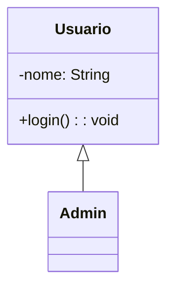
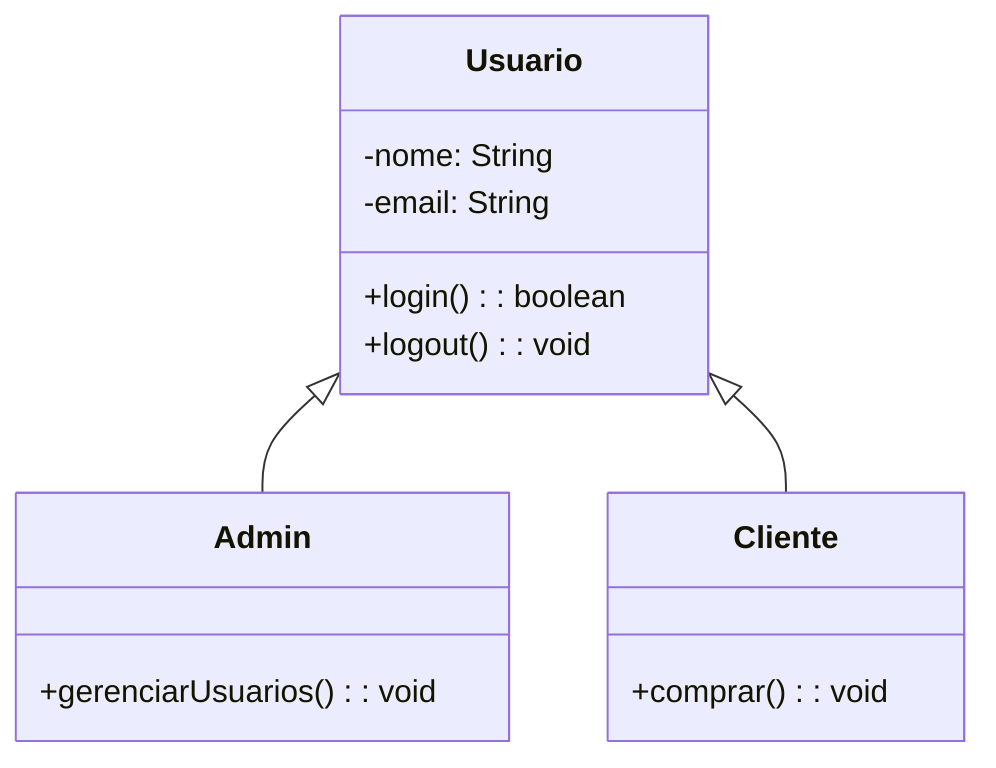
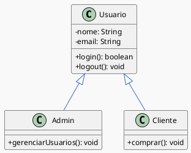
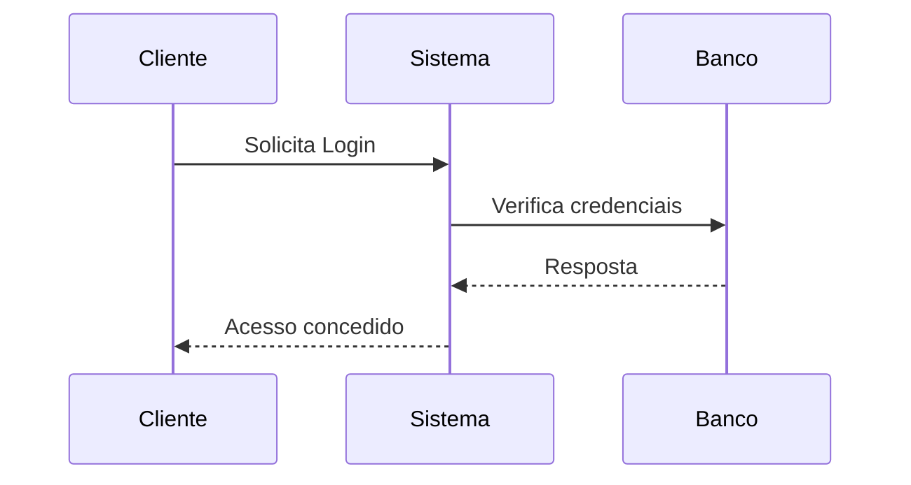
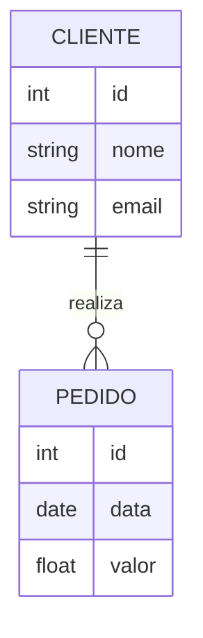
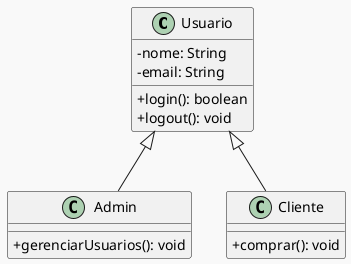
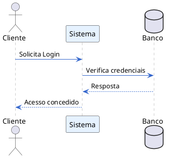
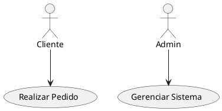
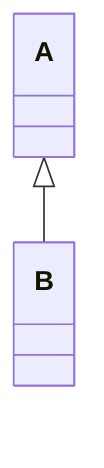
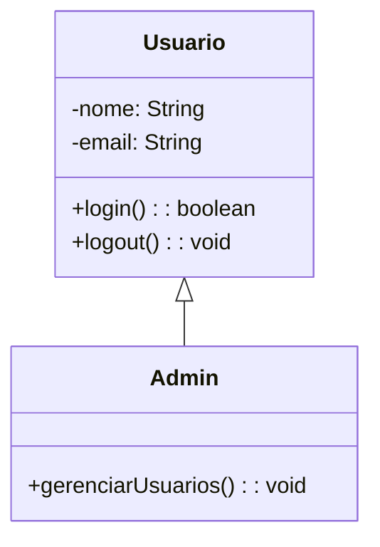

## **1. Comparativo de Plugins**

Comparação direta dos principais formatos e plugins para criar diagramas UML e outros diagramas **direto em Markdown**, levando em conta **suporte no GitHub**, **facilidade de edição** e **capacidade de gerar diagramas como código**.

---


| Ferramenta                  | Tipo                                   | Suporte direto no GitHub Markdown                                          | Sintaxe/Modo de edição                          | Prós                                                                                                               | Contras                                                                                   |
| --------------------------- | -------------------------------------- | -------------------------------------------------------------------------- | ----------------------------------------------- | ------------------------------------------------------------------------------------------------------------------ | ----------------------------------------------------------------------------------------- |
| **Mermaid**                 | Diagrama como código                   | **Sim** (renderiza direto no GitHub)                                       | Texto (blocos \`\`\`mermaid)                    | ✅ Renderiza no GitHub sem extensões<br>✅ Fácil versionamento<br>✅ Ideal para UML simples (classes, seq., ER, etc.) | ❌ Menos opções visuais que Draw\.io/Excalidraw<br>❌ Layout automático nem sempre perfeito |
| **PlantUML**                | Diagrama como código                   | **Não nativo** (precisa converter para PNG/SVG antes ou usar GitHub Pages) | Texto (blocos \`\`\`plantuml)                   | ✅ Extremamente poderoso (todos os tipos UML, temas, integração com código)<br>✅ Suporte avançado a estilos         | ❌ Não renderiza direto no GitHub<br>❌ Requer Java ou servidor PlantUML                    |
| **Draw\.io (diagrams.net)** | Editor visual                          | **Não direto** (precisa exportar para imagem/SVG e inserir no README)      | Arrastar e soltar                               | ✅ Interface visual completa<br>✅ Extensa biblioteca de formas<br>✅ Integração com VS Code/Obsidian                 | ❌ Não é “diagram-as-code” (difícil versionar)<br>❌ Dependência de exportar arquivo        |
| **Excalidraw**              | Editor visual estilo "whiteboard"      | **Não direto** (mesmo caso do Draw\.io)                                    | Arrastar e soltar (foco em estilo à mão livre)  | ✅ Visual bonito, mais “orgânico”<br>✅ Bom para brainstorms e apresentações                                         | ❌ Não é código, exige exportar<br>❌ Layout menos preciso para UML formal                  |
| **Graphviz / DOT**          | Diagrama como código                   | **Não direto** (precisa exportar)                                          | Texto (blocos \`\`\`dot)                        | ✅ Excelente para grafos complexos<br>✅ Integração com CI/CD                                                        | ❌ Sintaxe pouco intuitiva<br>❌ Não renderiza no GitHub sem conversão                      |
| **Kroki.io**                | Serviço web para diagramas como código | **Parcial** (via imagens SVG linkadas)                                     | Suporta Mermaid, PlantUML, Graphviz, BPMN, etc. | ✅ Suporta vários formatos num só lugar<br>✅ Não precisa instalar nada localmente                                   | ❌ Depende de servidor externo                                                             |
| **Markmap**                 | Mapas mentais como código              | **Não nativo** (precisa GitHub Pages ou plugin)                            | Markdown estruturado                            | ✅ Transformar Markdown em mapa mental direto                                                                       | ❌ Pouco suporte no GitHub direto                                                          |

---

## **2. Foco no GitHub Markdown**

No **GitHub** especificamente:

* **✅ Melhor suporte nativo:** **Mermaid** → basta criar um bloco de código:

#````

#````

* **❌ PlantUML** → só funciona direto se você converter para imagem (PNG/SVG) antes de subir, ou usar GitHub Pages + pipeline para renderizar.

---

## **3. Sugestões de uso prático**

| Cenário                                                       | Melhor Ferramenta |
| ------------------------------------------------------------- | ----------------- |
| UML em Markdown no GitHub com visualização imediata           | **Mermaid**       |
| UML completo com todos recursos gráficos, mas render offline  | **PlantUML**      |
| Diagrama visual editável e colaborativo                       | **Draw\.io**      |
| Diagrama com estilo descontraído ou brainstorming             | **Excalidraw**    |
| Vários formatos de diagrama com código e centralização online | **Kroki.io**      |
| Mapas mentais rápidos no Markdown                             | **Markmap**       |

---

## **4. Minha recomendação para Markdown + GitHub**

* Para **documentação técnica diretamente no repositório** → **Mermaid** (suporte nativo + versionamento fácil).
* Para **modelos UML avançados** → **PlantUML** + export para SVG (inserir no Markdown).
* Para **diagrama visual mais polido** → **Draw\.io** (integrado ao VS Code ou Obsidian).
* Para **brainstorms ou fluxos não formais** → **Excalidraw**.

---

Montar **um exemplo do mesmo diagrama UML de classes** escrito **em Mermaid e em PlantUML**, para você ver **lado a lado** como ficaria no GitHub. Isso ajudaria a decidir qual usar no seu fluxo.


 👍
Montar o **mesmo diagrama UML de classes** em **Mermaid** (renderiza direto no GitHub) e **PlantUML** (mais avançado, mas precisa exportar para imagem antes).

O diagrama será este:

* Classe **Usuario** (atributos: nome, email; métodos: login(), logout())
* Classe **Admin** (herda de Usuario; método: gerenciarUsuarios())
* Classe **Cliente** (herda de Usuario; método: comprar())

---

## **1️⃣ Mermaid (suporte nativo no GitHub)**

> Basta colar no seu `README.md`.

#````markdown

#````

---

## **2️⃣ PlantUML (mais completo, mas não renderiza direto no GitHub)**

> Para usar no GitHub, exporte para **PNG/SVG** antes, ou use **Kroki.io** ou **GitHub Pages** para renderizar.

#````markdown



#````

---

## **Comparação rápida**

| Critério                       | Mermaid                                        | PlantUML                                                                      |
| ------------------------------ | ---------------------------------------------- | ----------------------------------------------------------------------------- |
| **Renderiza direto no GitHub** | ✅ Sim                                          | ❌ Não (precisa exportar)                                                      |
| **Sintaxe**                    | Mais simples                                   | Mais detalhada e poderosa                                                     |
| **Customização visual**        | Limitada                                       | Avançada (cores, estilos, temas)                                              |
| **Tipos UML suportados**       | Básicos (classe, sequência, ERD, estado, etc.) | Quase todos (incluindo diagramas de componentes, atividades, pacotes, deploy) |
| **Integração com código**      | Média                                          | Alta (pode gerar diagramas a partir de código-fonte e anotações)              |

---


Vamos separar em dois blocos:

1. **Mermaid** → todos exemplos com **suporte direto no GitHub Markdown**, basta colar no README.
2. **PlantUML** → exemplos mais completos, mas **precisam ser exportados para imagem** antes de inserir no GitHub (ou via GitHub Pages).

---

## **1️⃣ Mermaid – exemplos com suporte direto no GitHub**

> Basta usar blocos \`\`\`mermaid no Markdown e o GitHub renderiza automaticamente.

### **UML de Classes**

#````markdown

#````

---

### **Diagrama de Sequência**

#````markdown

#````

---

### **Diagrama Entidade-Relacionamento (ERD)**

#````markdown

#````

---

## **2️⃣ PlantUML – exemplos mais completos (não renderiza direto no GitHub)**

> Você precisa exportar para **.png** ou **.svg** e inserir no Markdown.
> Ferramentas para converter: [PlantUML Server](https://plantuml.com/), [Kroki.io](https://kroki.io), VS Code plugin.

---

### **UML de Classes com Tema**

#````markdown

#````

---

### **Diagrama de Sequência com Estilo**

#````markdown

#````

---

### **Diagrama de Casos de Uso**

#````markdown

#````

---

📌 **Resumo**

* **Mermaid** → perfeito para diagramas rápidos **direto no GitHub**.
* **PlantUML** → ideal para diagramas UML **complexos e customizados**, mas precisa converter antes.


O erro de "Parse error" acontece porque o Mermaid usa caracteres como parênteses `( )`, pontos `.` e vírgulas `,` para definir a sua própria sintaxe. Quando você os usa diretamente no texto de um nó, ele não consegue interpretar o código corretamente.

Para resolver isso, basta colocar o texto que contém esses caracteres especiais entre **aspas duplas** (`"`).

-----

Objeto Aluno


```mermaid

flowchart TD

A["Start] --> B[""""Criar objeto Aluno"""""]

B --> C[Capturar nome, idade, matrícula]

C --> D["Chamar aluno.cadastrarDados()"]

D --> E[Capturar média]

E --> F["Chamar aluno.cadastrarMediaNotas()"]

F --> G["Chamar aluno.exibirInformacoes()"]

G --> H[End]

```


### Código Corrigido

Aqui estão os dois exemplos de fluxograma com a sintaxe corrigida.

#### Correção 1: Passando Dados como Argumentos

```mermaid
flowchart TD
    A["Início] --> B[""""Capturar nome, idade, matrícula"""""]
    B --> C[Criar objeto Aluno]
    C --> D["Chamar aluno.cadastrarDados(nome, idade, matrícula)"]
    D --> E[Capturar média]
    E --> F["Chamar aluno.cadastrarMediaNotas(media)"]
    F --> G["Chamar aluno.exibirInformacoes()"]
    G --> H[Fim]
```

-----

#### Correção 2: Usando um Construtor

```mermaid
flowchart TD
    A["Início] --> B[""""Capturar nome, idade, matrícula"""""]
    B --> C["Criar objeto Aluno(nome, idade, matrícula)"]
    C --> D[Capturar média]
    D --> E["Chamar aluno.cadastrarMediaNotas(media)"]
    E --> F["Chamar aluno.exibirInformacoes()"]
    F --> G[Fim]
```

A simples adição de aspas duplas nos nós que continham `()` e `.` resolve o problema de interpretação do código. 


---
**Quais dessas ferramentas para diagramas (Mermaid, PlantUML, etc.) funcionam diretamente no GitHub Pages com HTML gerado pelo Jekyll**, e quais precisam de conversão prévia.

O funcionamento muda porque o **GitHub Pages com Jekyll** não processa todos os tipos de código da mesma forma que o **renderizador nativo do README**.

---

## **1️⃣ Suporte no README do GitHub x GitHub Pages (Jekyll)**

| Ferramenta         | Suporte direto no README do repositório | Suporte direto no **GitHub Pages / Jekyll**             | Observações                                                                                                                  |
| ------------------ | --------------------------------------- | ------------------------------------------------------- | ---------------------------------------------------------------------------------------------------------------------------- |
| **Mermaid**        | ✅ Sim (renderização nativa desde 2022)  | ❌ Não direto (o Jekyll padrão não renderiza Mermaid)    | Precisa incluir JS do Mermaid no layout HTML (`mermaid.min.js`) e inicializar com `<script>mermaid.initialize(...)</script>` |
| **PlantUML**       | ❌ Não nativo                            | ❌ Não direto                                            | Precisa gerar PNG/SVG antes **ou** usar [Kroki.io](https://kroki.io) / servidor PlantUML e embutir imagem                    |
| **Draw\.io**       | ❌ Não nativo                            | ❌ Não direto                                            | Sempre precisa exportar para imagem/SVG                                                                                      |
| **Excalidraw**     | ❌ Não nativo                            | ❌ Não direto                                            | Mesmo caso do Draw\.io                                                                                                       |
| **Graphviz / DOT** | ❌ Não nativo                            | ❌ Não direto                                            | Precisa gerar imagem antes ou usar Kroki                                                                                     |
| **Kroki.io**       | ❌ Não nativo                            | ✅ Sim (com HTML `` apontando para URL Kroki)       | Funciona sem build local, gera diagrama dinamicamente                                                                        |
| **Markmap**        | ❌ Não nativo                            | ✅ Sim (precisa incluir `markmap.min.js` no tema Jekyll) | Permite mapas mentais no browser                                                                                             |

---

## **2️⃣ Como usar no GitHub Pages / Jekyll**

### **Mermaid no Jekyll**

Você precisa **injetar o script JS** no seu tema `_layouts/default.html` ou equivalente:

```html
<script src="https://cdn.jsdelivr.net/npm/mermaid/dist/mermaid.min.js"></script>
<script>
  mermaid.initialize({ startOnLoad: true });
</script>
```

E no Markdown/HTML do Jekyll:

````markdown

````

---

### **PlantUML no Jekyll**

Opções:

1. **Pré-renderizar** com `plantuml.jar` → exporta PNG/SVG para a pasta do site.
2. Usar **Kroki.io**:

```markdown

```

---

### **Kroki.io no Jekyll**

Permite incluir **Mermaid, PlantUML, Graphviz, BPMN** e outros via URL de imagem.
Exemplo:

```markdown

```

---

## **3️⃣ Resumo prático**

* **Se quer usar GitHub Pages sem conversão manual** → **Kroki.io** é a opção mais universal (funciona para Mermaid, PlantUML, Graphviz, etc.).
* **Se quer manter tudo local no HTML do Jekyll** → usar **Mermaid** com script JS.
* **PlantUML direto** só se usar Kroki ou pré-gerar as imagens.

---

Montar um **template Jekyll pronto** para **GitHub Pages** que suporta:

* **Mermaid.js** → renderização de diagramas direto no navegador.
* **Kroki.io** → renderização de **PlantUML, Graphviz, ERD** e vários outros sem precisar instalar nada localmente.

---

## **📂 Estrutura do Template**

```
📦 meu-site-jekyll
 ┣ 📂 _layouts
 ┃ ┗ 📜 default.html
 ┣ 📂 assets
 ┃ ┗ 📜 style.css
 ┣ 📜 _config.yml
 ┣ 📜 index.md
 ┗ 📜 README.md
```

---

## **1️⃣ Arquivo `_layouts/default.html`**

```html
<!DOCTYPE html>
<html lang="pt-BR">
<head>
  <meta charset="UTF-8">
  <title>{{ page.title }}</title>
  <link rel="stylesheet" href="{{ '/assets/style.css' | relative_url }}">
</head>
<body>
  <main>
    {{ content }}
  </main>

  <!-- Mermaid.js -->
  <script src="https://cdn.jsdelivr.net/npm/mermaid/dist/mermaid.min.js"></script>
  <script>
    mermaid.initialize({
      startOnLoad: true,
      theme: "default",
      securityLevel: 'loose'
    });
  </script>
</body>
</html>
```

---

## **2️⃣ Arquivo `_config.yml`**

```yaml
title: "Meu Site com Mermaid e Kroki"
description: "Exemplo de integração de diagramas no GitHub Pages"
theme: minima
markdown: kramdown
plugins:
  - jekyll-feed
```

---

## **3️⃣ Arquivo `index.md`**

````markdown
---
layout: default
title: "Exemplo de Diagramas"
---

# 🖼 Exemplos

## 1. Mermaid - Diagrama de Classes


---

## 2. Kroki + PlantUML (embed via imagem SVG)


> O link acima foi gerado com um diagrama simples no [Kroki.io](https://kroki.io)
````

---

## **4️⃣ Arquivo `assets/style.css`**

```css
body {
    font-family: Arial, sans-serif;
    margin: 2rem;
    background-color: #f9f9f9;
}

main {
    background: #fff;
    padding: 2rem;
    border-radius: 8px;
    box-shadow: 0 2px 5px rgba(0,0,0,0.1);
}
```

---

## **5️⃣ Como configurar no GitHub Pages**

1. Crie um novo repositório no GitHub: **`meu-site-jekyll`**.
2. Clone para sua máquina e copie os arquivos acima.
3. Faça commit e push para o branch `main`.
4. No GitHub, vá em **Settings → Pages**.
5. Em **Source**, escolha:

   * **Deploy from a branch**
   * Branch: `main`
   * Pasta: `/ (root)`
6. Salve.
7. Aguarde o GitHub Pages publicar (leva 1-2 minutos).
8. Acesse seu site: `https://seuusuario.github.io/meu-site-jekyll/`.

---

## **6️⃣ Como gerar links Kroki para PlantUML**

1. Vá até [https://kroki.io](https://kroki.io).
2. Escolha **PlantUML** no menu.
3. Cole seu diagrama, por exemplo:

   ```
   @startuml
   Alice -> Bob: Olá!
   @enduml
   ```
4. Clique em **GET URL** → copie o link gerado (formato PNG ou SVG).
5. No Markdown, insira como:

   ```markdown
   
   ```

---

### 👍 [ricardotecpro.github.io](https://ricardotecpro.github.io/)

