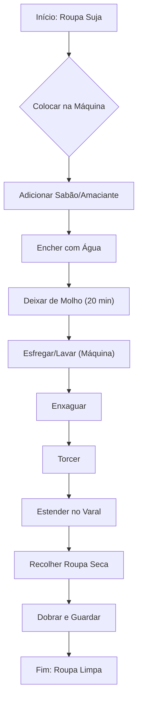

# 🎓 Introdução à Programação

Este guia aborda os conceitos fundamentais da programação, desde a definição de um algoritmo até as ferramentas necessárias para criar seu primeiro programa.

## 🤖 Algoritmo, Automação e Programas

### O que é um Algoritmo? 🤔

Um **algoritmo** é uma **sequência finita e lógica de instruções** para resolver um problema específico. Embora o termo seja muito comum em computação, ele se aplica a diversas outras áreas do conhecimento.

Pense em uma receita de bolo 🎂: ela é um algoritmo. Você segue passos definidos (`misturar ingredientes`, `assar por 30 minutos`) para chegar a um resultado esperado.

**Exemplo prático: Lavar roupa 🧺**

Para o problema "lavar roupa suja", um algoritmo simples seria:

1.  Colocar a roupa em um recipiente (como uma máquina de lavar).
2.  Adicionar sabão e amaciante.
3.  Encher com água.
4.  Deixar de molho por 20 minutos.
5.  Esfregar a roupa (ou deixar a máquina fazer isso).
6.  Enxaguar para remover o sabão.
7.  Torcer para retirar o excesso de água.




### O que é Automação? ⚙️

**Automação** é o processo de usar máquinas para executar as tarefas de um algoritmo de forma automática ou semiautomática. Usar uma máquina de lavar, por exemplo, automatiza quase todo o algoritmo de lavar roupas.

### A Relação com Computadores 💻

O computador é a principal ferramenta de automação para o processamento de informações. Ele é composto por duas partes:

  * **Hardware**: A parte física, ou seja, a máquina em si (processador, memória, tela, teclado).
  * **Software**: A parte lógica, que são os programas e dados, incluindo o Sistema Operacional e os aplicativos.

> **Um programa de computador é um algoritmo escrito de forma que o computador consiga entender e executar, automatizando a solução de um problema.**

Contudo, computadores são especializados em **algoritmos computacionais**, que envolvem principalmente o **processamento de dados** e **cálculos matemáticos**.

## 🛠️ Ferramentas Essenciais para Programar

Para criar um programa de computador, você precisará de algumas ferramentas básicas:

1.  **Linguagem de Programação**: Um conjunto de regras para escrever as instruções que o computador seguirá.
2.  **IDE (Ambiente de Desenvolvimento Integrado)**: Um software que facilita a escrita, o teste e a depuração do código.
3.  **Compilador ou Interpretador**: Um programa que "traduz" seu código para a linguagem que a máquina entende.

-----

## 📜 Linguagens de Programação

Uma linguagem de programação possui regras **léxicas** (ortografia das palavras) e **sintáticas** (gramática das frases).

  * **Léxica**: Refere-se à grafia correta das palavras. Exemplo: `main` está correto, `maim` está incorreto.
  * **Sintática**: Refere-se à organização correta das palavras. Exemplo: `x = 10 + y;` está correto, `x = + 10 y;` está incorreto.

Existem muitas linguagens populares, como: **C, C++, Java, C\#, Python, Ruby, PHP e JavaScript**.

### 📝 Exemplo 1: Média de Notas

Este programa solicita o nome e duas notas de um aluno e, em seguida, calcula e exibe a média.

#### Solução em Linguagem C

```c
#include <stdio.h>

int main() {
    char nome[50];
    double nota1, nota2, media;

    printf("Digite o nome do aluno: ");
    scanf("%s", nome);

    printf("Digite a primeira nota: ");
    scanf("%lf", &nota1);

    printf("Digite a segunda nota: ");
    scanf("%lf", &nota2);

    media = (nota1 + nota2) / 2.0;

    printf("A média do(a) aluno(a) %s é: %.2f
", nome, media);

    return 0;
}
```

#### Solução em Linguagem Java ☕

```java
import java.util.Locale;
import java.util.Scanner;

public class Programa {
    public static void main(String[] args) {
        Locale.setDefault(Locale.US);
        Scanner sc = new Scanner(System.in);

        String nome;
        double nota1, nota2, media;

        System.out.print("Digite o nome do aluno: ");
        nome = sc.nextLine();

        System.out.print("Digite a primeira nota: ");
        nota1 = sc.nextDouble();

        System.out.print("Digite a segunda nota: ");
        nota2 = sc.nextDouble();

        media = (nota1 + nota2) / 2.0;

        System.out.printf("A média do(a) aluno(a) %s é: %.2f
", nome, media);

        sc.close();
    }
}
```

### 📝 Exemplo 2: Área de um Retângulo

Este programa calcula a área de um retângulo com base nos valores de base e altura fornecidos.

#### Solução em Linguagem C++

```cpp
#include <iostream>
#include <iomanip>

int main() {
    double base, altura, area;

    std::cout << "Digite o valor da base: ";
    std::cin >> base;

    std::cout << "Digite o valor da altura: ";
    std::cin >> altura;

    area = base * altura;

    std::cout << "A área do retângulo é: " << std::fixed << std::setprecision(2) << area << std::endl;

    return 0;
}
```

**Saída Esperada:**

```
Digite o valor da base: 10.0
Digite o valor da altura: 5.0
A área do retângulo é: 50.00
```

#### Solução em Linguagem C\# 💎

```csharp
using System;
using System.Globalization;

namespace Curso {
    class Programa {
        static void Main(string[] args) {
            double baseRet, altura, area;

            Console.Write("Digite o valor da base: ");
            baseRet = double.Parse(Console.ReadLine(), CultureInfo.InvariantCulture);

            Console.Write("Digite o valor da altura: ");
            altura = double.Parse(Console.ReadLine(), CultureInfo.InvariantCulture);

            area = baseRet * altura;

            Console.WriteLine("A área do retângulo é: " + area.ToString("F2", CultureInfo.InvariantCulture));
        }
    }
}
```

**Saída Esperada:**

```
Digite o valor da base: 10.0
Digite o valor da altura: 5.0
A área do retângulo é: 50.00
```

## 💻 IDEs (Ambientes de Desenvolvimento Integrado)

Uma **IDE** é um programa que reúne diversas ferramentas para facilitar a vida do desenvolvedor. Funcionalidades comuns incluem edição de código avançada, depuração (`debugging`) e automação de compilação.

**IDEs Populares por Linguagem:**

  * **Java**: **IntelliJ IDEA** e **VS Code** (com o *Extension Pack for Java*).
  * **C\#**: **Microsoft Visual Studio** e **VS Code** (com a extensão C\#).
  * **C/C++**: **VS Code** (com extensões C/C++) e **CLion**.

## ⚙️ Compilação vs. Interpretação

Para que um computador execute um programa, o **código-fonte** (o que você escreve) precisa ser traduzido. Existem três abordagens principais:

### 1\. Compilação

Um **Compilador** traduz todo o código-fonte de uma vez, gerando um **código executável**.

  * **Vantagens**: Execução muito rápida 🚀.
  * **Linguagens Típicas**: **C**, **C++**.

### 2\. Interpretação

Um **Interpretador** lê e executa o código-fonte linha por linha.

  * **Vantagens**: Mais flexível, o mesmo código roda em qualquer plataforma 🌐.
  * **Linguagens Típicas**: **PHP**, **JavaScript**, **Python**, **Ruby**.

### 3\. Abordagem Híbrida

O código-fonte é pré-compilado para um código intermediário chamado **Bytecode**, que é então interpretado por uma **Máquina Virtual (VM)**.

  * **Vantagens**: Portabilidade e bom desempenho.
  * **Linguagens Típicas**: **Java** (com a JVM), **C\#** (com o .NET).

## Portugol e Ferramentas de Aprendizagem

Para focar no aprendizado da **lógica do algoritmo** sem a complexidade de uma linguagem real, utiliza-se o **Portugol**. É uma pseudo-linguagem didática com sintaxe simplificada e em português.

**Atenção**: Portugol é uma linguagem para aprender, não para criar programas comerciais.

Existem IDEs simples para escrever e testar algoritmos em Portugol:

  * **VisualG**: Uma ferramenta clássica e leve.
  * **Portugol Studio**: Uma alternativa mais moderna e com mais recursos. Você pode encontrá-lo em `portugol.dev`.

### Exemplo em VisualG

```visualg
algoritmo "CalculoMedia"

// Área de declaração de variáveis
var
   nome: caractere
   nota1, nota2, media: real

// Corpo do algoritmo
inicio
   escreval("Digite o nome do aluno: ")
   leia(nome)
   
   escreval("Digite a primeira nota: ")
   leia(nota1)
   
   escreval("Digite a segunda nota: ")
   leia(nota2)
   
   media <- (nota1 + nota2) / 2
   
   escreval("A média do(a) aluno(a) ", nome, " é: ", media)

fimalgoritmo
```

As principais diferenças são a estrutura do programa (`programa { ... }`), a declaração de variáveis dentro da função e o operador de atribuição (`=` em vez de `<-`).

### Exemplo em Portugol Studio

```portugol
programa
{
	// A função 'inicio' é o ponto de entrada do programa.
	funcao inicio()
	{
		// Área de declaração de variáveis
		cadeia nome
		real nota1, nota2, media

		// Corpo do algoritmo (Entrada, Processamento e Saída de Dados)
		escreva("Digite o nome do aluno(a): ")
		leia(nome)
		
		escreva("Digite a primeira nota: ")
		leia(nota1)
		
		escreva("Digite a segunda nota: ")
		leia(nota2)
		
		// Processamento: calcula a média
		media = (nota1 + nota2) / 2
		
		// Saída: exibe o resultado formatado
		escreva("
A média do(a) aluno(a) ", nome, " é: ", media)
	}
}
```

**Principais Mudanças e Explicações:**

1.  **Estrutura:** O Portugol Studio usa uma estrutura de blocos com chaves `{}`. O programa inteiro é envolvido por `programa { ... }`.
2.  **Função Principal:** Todo o código executável deve estar dentro da função `funcao inicio() { ... }`.
3.  **Declaração de Variáveis:** As variáveis são declaradas no início da função onde serão usadas, não em um bloco `var` separado.
4.  **Tipos de Dados:** O tipo `caractere` do VisualG corresponde ao tipo `cadeia` no Portugol Studio. O tipo `real` é o mesmo.
5.  **Atribuição:** O operador para atribuir um valor a uma variável é o sinal de igual (`=`), e não a seta (`<-`).
6.  **Comandos de Escrita:** O comando `escreval` do VisualG é equivalente ao `escreva` do Portugol Studio. Ambos pulam uma linha ao final da escrita. O `
` foi adicionado na última linha para dar um espaçamento extra antes da mensagem final, tornando a saída mais legível.

---

### 🚀 [ricardotecpro.github.io](https://ricardotecpro.github.io/)

