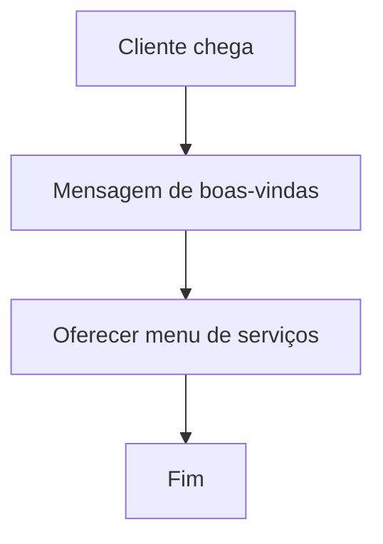
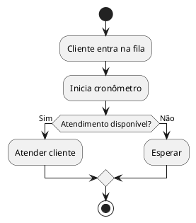
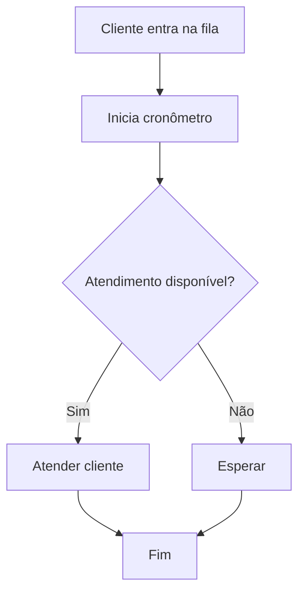

# **📚 Curso de Scratch para Logística/Administração**:

* 📌 **Emojis** para facilitar leitura e deixar mais leve.
* 💡 **Exemplos práticos** usando **extensões do Scratch** (sensores, tradutor, texto-para-fala, etc.).
* 📊 **Diagramas** em formatos compatíveis com JetBrains (Mermaid, PlantUML, Draw\.io, Excalidraw).
* 🔗 Links e ideias de integração para os alunos criarem fluxos antes de programar.

---

# **📚 Curso: Programando com Scratch para Logística e Administração**

**⏳ Carga horária sugerida:** 20h (5 encontros de 4h ou 10 encontros de 2h)
**🎯 Objetivo:** Ensinar programação e pensamento computacional com **Scratch**, aplicando em **processos logísticos** e **gestão administrativa**.

---

## **🧩 Módulo 1 – Introdução ao Scratch e à Lógica de Programação** (2h)

**Objetivos:**

* Apresentar o Scratch e conceitos básicos de programação.
* Mostrar a relação entre **automação** e **gestão de processos**.

**Conteúdo:**

* O que é Scratch e como acessar (online/offline).
* Interface e blocos básicos.
* Pensamento computacional na logística/administração.

**Extensões usadas:**

* 🎤 Texto para fala (Text-to-Speech) para criar mensagens automáticas.

**Atividade prática:**

* Criar um **atendente virtual** que dá boas-vindas ao cliente.

**Diagrama de exemplo (Mermaid)**

---

## **⚙ Módulo 2 – Sequências, Eventos e Controle** (4h)

**Objetivos:**

* Criar sequências de ações e reações a eventos.
* Usar estruturas de controle.

**Conteúdo:**

* Blocos de eventos ("quando clicar", "quando tecla pressionada").
* Controle: **esperar**, **repetir**, **se...então**.

**Extensões usadas:**

* ⏱ Cronômetro para medir tempo de atendimento.

**Atividade prática:**

* **Projeto:** Simulador de atendimento em fila, calculando tempo de espera.

**Diagrama de exemplo (PlantUML)**

**Diagrama de exemplo (Mermaid)**

---

## **📊 Módulo 3 – Variáveis, Operadores e Entrada de Dados** (4h)

**Objetivos:**

* Trabalhar com variáveis e operadores matemáticos/lógicos.

**Conteúdo:**

* Criando variáveis para armazenar valores.
* Operadores para cálculos de custo e prazos.

**Extensões usadas:**

* 📦 Tradutor para oferecer atendimento em múltiplos idiomas.

**Atividade prática:**

* **Projeto:** Calculadora de frete (peso × distância).

**Fluxo em Draw\.io (pseudocódigo gráfico)**
*(O professor pode abrir no JetBrains usando plugin Draw\.io Integration)*

---

## **📋 Módulo 4 – Listas e Tomada de Decisão** (4h)

**Objetivos:**

* Criar e manipular listas.
* Tomar decisões com base em dados armazenados.

**Conteúdo:**

* Adicionar, remover, buscar itens em listas.
* Filtrar informações.

**Extensões usadas:**

* 📡 Sensor de vídeo (simular scanner de código de barras).

**Atividade prática:**

* **Projeto:** Controle de estoque com consulta de produtos.

**Exemplo em Excalidraw:**

* Fluxo de cadastro/consulta/remoção de item.

---

## **🚚 Módulo 5 – Funções, Modularização e Projeto Final** (6h)

**Objetivos:**

* Criar blocos personalizados para modular o código.
* Desenvolver um sistema mais completo.

**Conteúdo:**

* Funções (blocos definidos pelo usuário).
* Reuso de código e integração de recursos.

**Extensões usadas:**

* 🗓 Data e hora para agendamento de entregas.

**Atividade prática:**

* **Projeto final:** Sistema de agendamento de entregas.

**Fluxo em Mermaid (entrega de pedidos)**

---

## **📌 Estratégias e melhorias**

1. **Usar sempre exemplos do mundo real** da logística/administração.
2. **Diagramar antes de programar** usando **Mermaid, PlantUML, Draw\.io e Excalidraw** para visualizar fluxos.
3. **Aplicar extensões do Scratch** para simular funções reais (tradutor, sensores, voz).
4. **Projetos progressivos**: cada módulo aproveita o anterior.

---

Se quiser, posso já criar **os arquivos `.sb3` do Scratch** com todos esses projetos, **mais** os diagramas prontos em **.puml, .drawio, .excalidraw** para você abrir direto no JetBrains.

Quer que eu já gere esse pacote completo?

---

### [ricardotecpro.github.io](https://ricardotecpro.github.io/)
