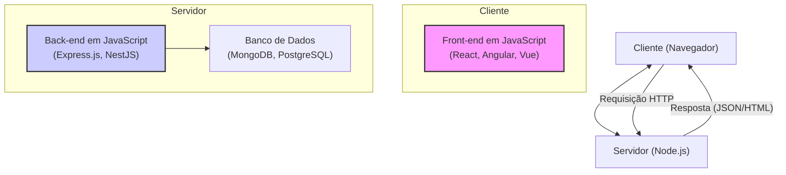

# ⚡ JavaScript: A Linguagem da Web

JavaScript (frequentemente abreviado como JS) é uma linguagem de programação de alto nível, interpretada (ou compilada em tempo real, *just-in-time*), e multi-paradigma. É mais conhecida como a linguagem de script para páginas web, mas também é amplamente utilizada em muitos ambientes fora dos navegadores, como servidores (Node.js) e aplicações mobile.

Junto com HTML e CSS, JavaScript é uma das três principais tecnologias da World Wide Web. Enquanto o **HTML** fornece a estrutura das páginas e o **CSS** o estilo visual, o **JavaScript** adiciona comportamento e interatividade, transformando documentos estáticos em aplicações dinâmicas e ricas.

A linguagem é padronizada pela especificação **ECMAScript**. O que chamamos de JavaScript é, na verdade, uma implementação desse padrão, com recursos extras para interagir com o ambiente em que é executado (como o navegador ou um servidor).

-----

## 🖥️ O Coração da Web Interativa

No navegador, o JavaScript tem superpoderes para manipular dinamicamente o conteúdo da página.

### Manipulação do DOM (Document Object Model)

O DOM é uma representação em árvore de um documento HTML. O JavaScript pode acessar, modificar, adicionar e remover elementos e atributos dessa árvore, alterando o que o usuário vê na tela em tempo real, sem a necessidade de recarregar a página.

```javascript
// Encontra um elemento pelo seu ID
const titulo = document.getElementById('titulo-principal');

// Altera o conteúdo de texto do elemento
titulo.textContent = 'Olá, Mundo Dinâmico!';

// Altera o estilo do elemento
titulo.style.color = 'blue';
```

### Programação Orientada a Eventos (Event-Driven)

JavaScript opera em um modelo orientado a eventos. Ele "escuta" por ações do usuário, como cliques, movimentos do mouse, digitação no teclado, e executa funções específicas em resposta a esses eventos.

```javascript
const botao = document.getElementById('meu-botao');

// Adiciona um "ouvinte" de evento de clique ao botão
botao.addEventListener('click', () => {
  alert('Botão foi clicado!');
});
```

### Assincronicidade: Promises e `async/await`

Por ser *single-threaded* (executa uma coisa de cada vez), o JavaScript depende fortemente de operações assíncronas para tarefas demoradas, como fazer uma requisição a uma API, para não travar a interface do usuário.

  - **Promises**: São objetos que representam a eventual conclusão (ou falha) de uma operação assíncrona.
  - **`async/await`**: É uma sintaxe moderna e mais legível para trabalhar com Promises, fazendo com que o código assíncrono se pareça com código síncrono.

<!-- end list -->

```javascript
async function buscarDadosUsuario() {
  try {
    // 'await' pausa a função até que a Promise seja resolvida
    const response = await fetch('https://api.github.com/users/google');
    const data = await response.json();
    console.log(data);
  } catch (error) {
    console.error('Falha ao buscar dados:', error);
  }
}
```

-----

## ✨ A Evolução: ES6 e o JavaScript Moderno

A versão **ECMAScript 2015 (ES6)** foi uma atualização monumental que modernizou a linguagem. Desde então, novas versões são lançadas anualmente, adicionando recursos que tornam o código mais limpo, seguro e poderoso.

Principais recursos do JavaScript Moderno:

  - **`let` e `const`**: Para declaração de variáveis com escopo de bloco, substituindo o antigo `var`.
  - **Arrow Functions `=>`**: Uma sintaxe mais concisa para escrever funções.
  - **Classes**: Uma sintaxe de "açúcar sintático" sobre o sistema de protótipos do JavaScript para criar objetos e lidar com herança.
  - **Template Literals**: Strings que permitem interpolação de variáveis e múltiplas linhas usando crases (`` ` ``).
  - **Desestruturação (Destructuring)**: Uma forma fácil de extrair valores de arrays ou propriedades de objetos.
  - **Módulos (`import`/`export`)**: Um sistema nativo para organizar o código em múltiplos arquivos.

-----

## 🚀 JavaScript no Servidor: Node.js

**Node.js** é um ambiente de execução que permite que o JavaScript seja executado fora do navegador, no lado do servidor. Ele utiliza o mesmo motor V8 do Google Chrome e é construído em torno de um modelo de I/O (entrada/saída) não-bloqueante e orientado a eventos, o que o torna extremamente eficiente para construir APIs, microserviços e outras aplicações de rede escaláveis.

Com o Node.js, nasceu o paradigma **"JavaScript Everywhere"**, permitindo que a mesma linguagem seja usada tanto no front-end quanto no back-end.

O **npm (Node Package Manager)** é o gerenciador de pacotes do Node.js e o maior ecossistema de bibliotecas de código aberto do mundo, contendo milhões de pacotes prontos para serem usados.



-----

## 🌐 O Ecossistema de Frameworks e Bibliotecas

O ecossistema JavaScript é vasto e dinâmico. Para construir interfaces de usuário complexas (*Single-Page Applications* - SPAs), os desenvolvedores geralmente utilizam frameworks e bibliotecas populares, como:

  - **React**: Uma biblioteca do Meta para construir interfaces de usuário, focada em uma arquitetura de componentes.
  - **Angular**: Um framework completo do Google, baseado em TypeScript, que fornece uma estrutura robusta para aplicações empresariais.
  - **Vue.js**: Um framework progressivo conhecido por sua curva de aprendizado suave e excelente documentação.

-----

## 🚀 Começando com JavaScript

A maneira mais fácil de começar é diretamente no seu navegador.

1.  Abra qualquer página web.
2.  Pressione `F12` para abrir as Ferramentas de Desenvolvedor.
3.  Clique na aba **Console**.
4.  Digite seu código JavaScript e pressione `Enter`.

Para um exemplo mais prático de interação com HTML:

**`index.html`**

```html
<!DOCTYPE html>
<html lang="pt-br">
<head>
    <title>Contador JS</title>
</head>
<body>
    <h1>Contador</h1>
    <p>Cliques: <span id="valor-contador">0</span></p>
    <button id="btn-incrementar">Incrementar</button>

    <script src="script.js"></script>
</body>
</html>
```

**`script.js`**

```javascript
// Seleciona os elementos do DOM
const valorContador = document.getElementById('valor-contador');
const btnIncrementar = document.getElementById('btn-incrementar');

// Inicializa a variável do contador
let contador = 0;

// Adiciona um evento de clique ao botão
btnIncrementar.addEventListener('click', () => {
  // Incrementa o contador
  contador++;
  
  // Atualiza o texto na tela com o novo valor
  valorContador.textContent = contador;
});
```

---


