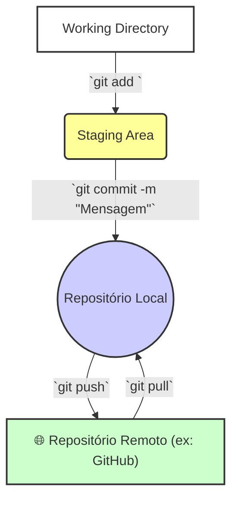
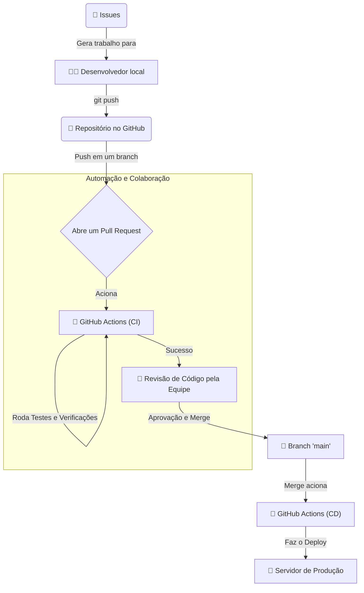
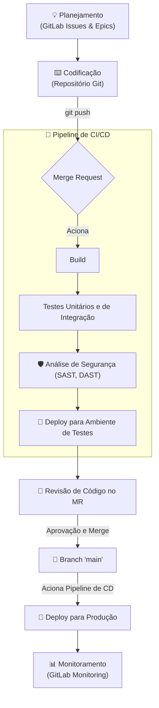

# 🗂️ Git: O Sistema de Controle de Versão Distribuído

Git é um sistema de controle de versão distribuído, gratuito e de código aberto, criado por Linus Torvalds em 2005 (o mesmo criador do kernel do Linux). Ele foi projetado para ser rápido, eficiente e para lidar com tudo, desde projetos pequenos até os muito grandes.

Sua principal função é rastrear mudanças no código-fonte ao longo do tempo. Ele permite que múltiplos desenvolvedores trabalhem juntos no mesmo projeto de forma assíncrona, sem sobrescrever o trabalho um do outro, mantendo um histórico detalhado de todas as alterações. Hoje, é a ferramenta padrão para controle de versão no mundo do desenvolvimento de software.

---

## 🔗 Tópicos

* **[Tópicos](/topicos.md)**: Trilhas de Aprendizagem.

-----

## 🤔 Por que Usar um Controle de Versão?

Antes de ferramentas como o Git, o "controle de versão" era muitas vezes feito manualmente, com cópias de arquivos como `projeto_v1.zip`, `projeto_v2.zip`, `projeto_final_agora_vai.js`. Isso era caótico e propenso a erros. Um Sistema de Controle de Versão (VCS) como o Git resolve esses problemas:

  - **Histórico Completo**: Git registra cada mudança feita no projeto em um histórico. Você pode ver quem mudou o quê, quando e por quê.
  - **Reversão de Erros (Salvando Vidas)**: Se uma nova funcionalidade quebrou o projeto, você pode facilmente reverter para uma versão anterior que estava funcionando.
  - **Trabalho em Equipe Organizado**: Permite que desenvolvedores trabalhem em paralelo em diferentes funcionalidades (em "branches") e depois juntem (*merge*) suas contribuições de forma organizada.
  - **Experimentação Segura**: Você pode criar um "ramo" (*branch*) para experimentar uma nova ideia radical, sem medo de estragar o código principal. Se não der certo, basta descartar o ramo.

-----

## 🌐 O Modelo Distribuído

Diferente de sistemas de controle de versão centralizados mais antigos (como o SVN), onde o histórico completo do projeto reside em um único servidor central, o Git é **distribuído**.

Isso significa que cada desenvolvedor que "clona" um projeto tem em sua máquina local uma **cópia completa de todo o histórico do repositório**.

**Vantagens:**

  - **Velocidade**: A maioria das operações (como ver o histórico ou criar um *commit*) são executadas localmente e são quase instantâneas.
  - **Trabalho Offline**: Você pode trabalhar, criar *commits* e ver o histórico completo sem precisar de conexão com a internet.
  - **Redundância e Segurança**: Como cada colaborador tem uma cópia completa, é muito difícil perder o histórico do projeto. Não há um único ponto de falha.

-----

## 🧠 Conceitos Fundamentais do Git

  - **Repositório (Repository ou "Repo")**: É o banco de dados que armazena todo o histórico de alterações e os arquivos do projeto. Geralmente existe um repositório **local** (na sua máquina) e um **remoto** (em um servidor como o GitHub).
  - **Os Três Estágios**: Para entender o Git, é crucial pensar em três "áreas":
    1.  **Working Directory**: A pasta de arquivos do seu projeto, onde você efetivamente edita o código.
    2.  **Staging Area (ou Index)**: Uma área intermediária. Depois de modificar um arquivo, você o adiciona (`git add`) à Staging Area para marcar que aquela versão específica do arquivo fará parte do próximo "pacote" de alterações.
    3.  **Repositório (.git)**: Onde o Git armazena permanentemente as alterações. Quando você faz um `git commit`, ele pega tudo o que está na Staging Area e cria um "snapshot" permanente no histórico do seu repositório local.
  - **Commit**: Um *commit* é um "ponto de salvamento" ou um "snapshot" do seu projeto em um determinado momento. Cada *commit* tem um identificador único (um hash SHA-1) e uma mensagem descritiva.
  - **Branch**: Um *branch* (ramo) é uma linha de desenvolvimento independente. O ramo principal é geralmente chamado de `main` (ou `master`). Os desenvolvedores criam novos *branches* para trabalhar em novas funcionalidades ou corrigir bugs de forma isolada, sem afetar a linha de desenvolvimento principal.
  - **Merge**: É o ato de juntar as alterações de um *branch* em outro. Por exemplo, depois de terminar uma nova funcionalidade no seu *branch*, você faz o *merge* dela de volta para o *branch* `main`.

-----

## workflow O Fluxo de Trabalho Básico

O ciclo de comandos mais comum para salvar seu trabalho e sincronizá-lo com um repositório remoto é ilustrado abaixo.



-----

## 💻 Git na Prática: Comandos e Plataformas

### Comandos Essenciais

  - `git init`: Inicia um novo repositório na pasta atual.
  - `git clone [url]`: Clona (baixa) um repositório remoto para sua máquina.
  - `git status`: Mostra o estado atual do seu Working Directory e Staging Area.
  - `git add [arquivo]`: Adiciona um arquivo à Staging Area.
  - `git commit -m "Sua mensagem descritiva"`: Cria um novo commit com as alterações da Staging Area.
  - `git log`: Mostra o histórico de commits.
  - `git branch [nome-do-branch]`: Cria um novo branch.
  - `git checkout [nome-do-branch]` ou `git switch [nome-do-branch]`: Muda para o branch especificado.
  - `git merge [nome-do-branch]`: Junta as alterações do branch especificado no seu branch atual.
  - `git pull`: Baixa as últimas alterações do repositório remoto e faz o merge no seu branch local.
  - `git push`: Envia seus commits locais para o repositório remoto.


O nome padrão da branch inicial pode ser configurado globalmente.
Basta rodar este comando **uma vez** no terminal (Prompt,  ou ):

```bash
git config --global init.defaultBranch main
```

---

### 📝 O que isso faz

* Define que, quando você executar `git init` em qualquer novo repositório, a branch inicial criada será chamada `main` em vez de `master`.

---

### ⚙️ Verificar se funcionou

Depois, confirme com:

```bash
git config --global init.defaultBranch
```

Se aparecer `main`, está tudo certo.

### GitHub, GitLab e Bitbucket

É importante não confundir **Git** com **GitHub**.

  - **Git** é a ferramenta de linha de comando que faz o controle de versão.
  - **GitHub, GitLab e Bitbucket** são **plataformas de hospedagem** para repositórios Git. Eles fornecem um servidor para seu repositório remoto e adicionam uma interface web e funcionalidades colaborativas em cima do Git, como *Issue Tracking* e, mais importante, **Pull Requests** (ou Merge Requests), que são uma forma de propor e revisar alterações antes de integrá-las ao branch principal.

-----

## 🚀 Começando com Git

1.  **Instale o Git**: Baixe o instalador para o seu sistema operacional no [site oficial do Git](https://git-scm.com/downloads).

2.  **Configure seu nome e e-mail**: Após a instalação, abra o terminal e configure suas informações. Isso é importante porque todo commit que você fizer usará esses dados.

    ```sh
    git config --global user.name "Seu Nome Completo"
    git config --global user.email "seu.email@exemplo.com"
    ```

3.  **Pronto\!** Agora você pode usar `git init` para criar um novo repositório ou `git clone` para começar a trabalhar em um projeto existente.

---

# 🐙 GitHub: A Plataforma Colaborativa para o Desenvolvimento de Software

GitHub é uma plataforma de hospedagem de código-fonte e colaboração baseada na web, construída em torno do sistema de controle de versão **Git**. Lançado em 2008 e adquirido pela Microsoft em 2018, o GitHub se tornou o maior e mais popular host de código do mundo, sendo o lar da grande maioria dos projetos de software de código aberto (open source) e uma ferramenta essencial para equipes de desenvolvimento em empresas de todos os tamanhos.

### Git vs. GitHub: A Ferramenta e a Plataforma

É crucial entender a diferença fundamental entre Git e GitHub:

  - **Git**: É a **ferramenta** de controle de versão. Um software de linha de comando que você instala e executa na sua máquina local para rastrear as alterações no seu código. Git é o motor.
  - **GitHub**: É a **plataforma** ou o **serviço**. Um site que hospeda seus repositórios Git na nuvem, adicionando uma interface gráfica e um poderoso conjunto de funcionalidades de colaboração e gerenciamento de projetos em cima do Git. GitHub é o carro completo, com painel, GPS e assentos para a equipe, construído em torno do motor Git.

Você pode usar o Git perfeitamente sem nunca tocar no GitHub, mas o GitHub não existiria sem o Git.

-----

## ✨ Funcionalidades Essenciais para Colaboração

O que torna o GitHub tão poderoso não é apenas o fato de ele guardar seu código na nuvem, mas como ele facilita o trabalho em equipe.

### Repositórios Remotos (Remote Repositories)

A função mais básica do GitHub é servir como um "repositório remoto", um local centralizado onde todos os membros da equipe podem enviar (`push`) suas alterações e baixar (`pull`) as atualizações dos outros, mantendo todos sincronizados.

### Pull Requests (PRs)

Este é o coração do fluxo de trabalho colaborativo do GitHub. Um Pull Request é uma solicitação formal para mesclar (*merge*) as alterações de um *branch* para outro (geralmente, de um *branch* de funcionalidade para o *branch* principal, `main`).

O fluxo de trabalho é o seguinte:

1.  Um desenvolvedor cria um novo *branch* para trabalhar em uma tarefa.
2.  Ele faz seus *commits* nesse *branch*.
3.  Ele envia (`push`) o *branch* para o GitHub.
4.  No GitHub, ele abre um **Pull Request**, descrevendo as alterações.
5.  A equipe pode então **revisar o código** linha por linha, deixar comentários, solicitar modificações e discutir a implementação.
6.  Sistemas de automação podem rodar testes para garantir que as mudanças não quebraram nada.
7.  Após a aprovação, o PR é "merged", integrando o novo código ao *branch* principal.

### Forks e Contribuições Open Source

Um **Fork** é uma cópia pessoal de um repositório de outro usuário. Este mecanismo é a base do desenvolvimento de software de código aberto no GitHub. Para contribuir com um projeto, o fluxo típico é:

1.  Fazer um *fork* do repositório original para sua própria conta.
2.  Clonar o seu *fork* para sua máquina local.
3.  Fazer as alterações desejadas e enviá-las para o seu *fork*.
4.  Abrir um Pull Request do seu *fork* de volta para o repositório original, propondo suas contribuições.

### Issues (Rastreamento de Tarefas)

Cada repositório no GitHub vem com um sistema de rastreamento de "Issues". Elas são usadas para registrar e discutir bugs, solicitar novas funcionalidades, fazer perguntas e gerenciar o trabalho a ser feito. As Issues funcionam como o "quadro de tarefas" e o fórum de discussão do projeto.

-----

## 🚀 O Ecossistema Moderno do GitHub

O GitHub evoluiu de um simples host de código para uma plataforma de desenvolvimento completa.

  - **GitHub Actions**: Uma ferramenta de automação e CI/CD (Integração Contínua e Entrega/Implantação Contínua) extremamente poderosa. Permite criar fluxos de trabalho (`workflows`) personalizados que são acionados por eventos no repositório (como um `push` ou a abertura de um PR). Usos comuns incluem rodar testes automaticamente, verificar a qualidade do código, construir o projeto e fazer o deploy para um servidor.
  - **GitHub Pages**: Um serviço de hospedagem de sites estáticos. Permite que você publique um site (como uma página de projeto, um blog ou um portfólio) diretamente de um repositório.
  - **GitHub Copilot**: Um "programador em par" baseado em inteligência artificial que se integra ao editor de código (como o VS Code) e sugere código, funções inteiras e até mesmo documentação em tempo real.
  - **Codespaces**: Um ambiente de desenvolvimento completo e configurado que roda na nuvem, acessível diretamente pelo navegador. Permite que um desenvolvedor comece a codificar em um projeto instantaneamente, sem precisar configurar o ambiente em sua máquina local.

### O Fluxo de Trabalho Moderno com GitHub



*Este diagrama mostra um fluxo de CI/CD moderno, onde um Pull Request dispara testes automáticos, passa por revisão humana e, após o merge, é implantado automaticamente em produção.*

-----

## 🎯 Por Que o GitHub é Tão Importante?

  - **O Coração do Open Source**: É a plataforma onde a vasta maioria dos projetos de software de código aberto do mundo vive e colabora.
  - **Portfólio do Desenvolvedor**: Um perfil ativo no GitHub se tornou o "currículo" moderno para desenvolvedores, mostrando seus projetos pessoais, suas contribuições para outros projetos e suas áreas de interesse.
  - **Padrão da Indústria**: O fluxo de trabalho baseado em Pull Requests e revisão de código que o GitHub popularizou se tornou o padrão para equipes de software eficientes em todo o mundo.
  - **Ecossistema e Integrações**: Integra-se a milhares de ferramentas de terceiros, desde gerenciadores de projeto (Jira, Trello) até serviços de análise de código e plataformas de nuvem, centralizando o ciclo de vida do desenvolvimento.

---

# 🦊 GitLab: A Plataforma DevOps Unificada

GitLab é uma plataforma web completa para o ciclo de vida de desenvolvimento de software (DevOps), construída em torno do sistema de controle de versão **Git**. Assim como o GitHub, sua função principal é hospedar repositórios Git, mas sua filosofia é ir além, oferecendo um conjunto de ferramentas unificado para planejar, codificar, construir, testar, proteger, implantar e monitorar software a partir de uma única aplicação.

Lançado em 2011, o GitLab se destaca por sua abordagem "tudo em um", seu poderoso sistema de CI/CD integrado e por oferecer uma versão *open source* robusta que pode ser auto-hospedada (*self-hosted*), dando às equipes total controle sobre seu ambiente de desenvolvimento.

### GitLab vs. GitHub: A Plataforma Única vs. o Ecossistema

A principal diferença entre eles é filosófica:

  - **GitHub**: Foca em ser a melhor plataforma de colaboração de código do mundo, com um vasto ecossistema de integrações (o "Marketplace") para adicionar funcionalidades de CI/CD, segurança e gerenciamento de projetos.
  - **GitLab**: Foca em ser uma **plataforma DevOps completa e integrada**. A maioria das ferramentas (CI/CD, scanners de segurança, registro de pacotes, monitoramento) já vêm embutidas na própria ferramenta, sem a necessidade de integrações externas.

| Característica | GitHub | GitLab |
| :--- | :--- | :--- |
| **CI/CD** | **GitHub Actions** (altamente extensível e popular) | **GitLab CI/CD** (integrado, poderoso e maduro) |
| **Modelo de Fonte** | Código fechado | **Open Core** (uma edição Community gratuita e open source) |
| **Auto-hospedagem**| Oferecido (GitHub Enterprise) | Ponto forte, muito popular na versão Community |
| **Abordagem** | Ecossistema e integrações | **Tudo em uma única aplicação** |

-----

## ✨ A Proposta de Valor: Uma Única Plataforma DevOps

O GitLab organiza suas funcionalidades ao longo de todo o ciclo de vida do desenvolvimento de software.

### Gerenciamento de Código-Fonte (Source Code Management)

No seu núcleo, o GitLab oferece um robusto gerenciamento de repositórios Git, com todas as funcionalidades esperadas: *branches*, *commits*, e um sistema de revisão de código através de **Merge Requests (MRs)**, que são o equivalente aos Pull Requests do GitHub.

### CI/CD Integrado (Integração e Implantação Contínua)

Esta é, sem dúvida, a funcionalidade mais famosa e poderosa do GitLab. Cada projeto pode ter um arquivo chamado `.gitlab-ci.yml` em sua raiz, que define um *pipeline* de CI/CD.

  - **Pipelines**: São compostos por *stages* (estágios, ex: `build`, `test`, `deploy`) e *jobs* (trabalhos).
  - **GitLab Runner**: É o agente que executa os *jobs* definidos no pipeline. Ele pode ser instalado em qualquer máquina (na nuvem ou localmente).
  - **Auto DevOps**: Uma funcionalidade que tenta configurar automaticamente um pipeline completo (build, teste, análise de código, deploy, etc.) para projetos com base em boas práticas, sem a necessidade de um arquivo `.gitlab-ci.yml` inicial.

**Exemplo de um `.gitlab-ci.yml` simples:**

```yaml
# Define os estágios do pipeline
stages:
  - build
  - test
  - deploy

# Job do estágio de build
build_job:
  stage: build
  script:
    - echo "Compilando o código..."
    - ./compile_script.sh
    - echo "Compilação concluída."

# Job do estágio de test
test_job:
  stage: test
  script:
    - echo "Executando testes..."
    - ./run_tests.sh
    - echo "Testes finalizados."

# Job do estágio de deploy
deploy_job:
  stage: deploy
  script:
    - echo "Fazendo o deploy para produção..."
    - ./deploy_to_prod.sh
    - echo "Deploy concluído."
  only:
    - main # Este job só executa no branch 'main'
```

### DevSecOps: Segurança Integrada

O GitLab incorpora a segurança diretamente no pipeline de desenvolvimento (*Shift Left Security*). Nas suas versões pagas (e em parte na gratuita), ele oferece:

  - **SAST (Static Application Security Testing)**: Analisa o código-fonte em busca de vulnerabilidades conhecidas.
  - **DAST (Dynamic Application Security Testing)**: Analisa a aplicação em execução para encontrar falhas de segurança.
  - **Scanner de Dependências**: Verifica as bibliotecas de terceiros do projeto em busca de vulnerabilidades.
  - **Scanner de Segredos**: Procura por chaves de API, senhas e outros segredos expostos acidentalmente no código.

-----

## 🗺️ O Fluxo de Trabalho Unificado no GitLab

O GitLab foi projetado para que todo o ciclo, desde a ideia até a produção, aconteça em um só lugar.



*Este diagrama mostra como uma tarefa (Issue) passa por codificação, automação de CI/CD, segurança e revisão dentro da mesma plataforma, culminando no deploy e monitoramento.*

-----

## 🎯 Por Que Escolher o GitLab?

Equipes e empresas optam pelo GitLab por várias razões estratégicas:

  - **Plataforma Única e Simplificada**: Reduz a "fadiga de ferramentas" ao oferecer uma solução integrada para quase todas as necessidades de DevOps. Isso simplifica o gerenciamento e reduz os custos com múltiplas licenças de software.
  - **Controle e Auto-hospedagem**: A capacidade de hospedar sua própria instância do GitLab (seja em servidores locais ou na nuvem privada) é um grande atrativo para empresas com requisitos rigorosos de segurança, privacidade e governança de dados.
  - **CI/CD Poderoso e Maduro**: O GitLab CI/CD é considerado um dos melhores e mais flexíveis do mercado, sendo uma razão principal para a adoção da plataforma, mesmo por equipes que mantêm seu código em outros lugares (como o GitHub).
  - **Transparência e Open Source**: A edição Community do GitLab é de código aberto, o que permite auditoria, customização e contribuições da comunidade. A empresa também é conhecida por sua transparência, com um manual público que detalha todos os seus processos internos.

Em resumo, enquanto o GitHub brilha como um ecossistema social e colaborativo, o GitLab se destaca como uma robusta e completa "fábrica de software" unificada.

---

### 🔗 [ricardotecpro.github.io](https://ricardotecpro.github.io/)
