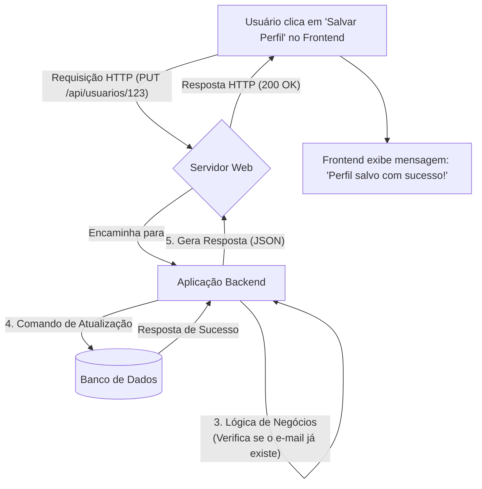

# ⚙️ O Mundo do Backend: A Espinha Dorsal da Tecnologia

O termo **Backend** (ou *server-side*) se refere a tudo o que acontece "nos bastidores" de uma aplicação de software. É a parte do sistema que o usuário final não vê e com a qual não interage diretamente, mas que é responsável por fazer tudo funcionar.

Para entender o backend, é útil contrastá-lo com o **frontend**:

  - **Frontend (Client-Side)**: É a camada de apresentação, tudo o que o usuário vê e interage em seu dispositivo. Isso inclui sites em um navegador (HTML, CSS, JavaScript) e aplicativos em um celular. É o "palco" do show.
  - **Backend (Server-Side)**: É a camada de acesso a dados e lógica de negócios. Consiste no servidor, na aplicação que roda nele e no banco de dados. É o "backstage", com toda a maquinaria que faz o show acontecer.

Se o frontend é a carroceria, o design e o painel de um carro, o backend é o motor, a transmissão, o sistema de injeção de combustível e a eletrônica que o fazem andar.

-----

## 📜 Principais Responsabilidades

As responsabilidades do backend são a base para o funcionamento de qualquer aplicação complexa.

  - **Lógica de Negócios (Business Logic)**: Executa as regras e os processos centrais da aplicação. Por exemplo, em um e-commerce, a lógica para calcular o frete, aplicar um cupom de desconto e verificar o estoque de um produto reside no backend.
  - **Gerenciamento de Banco de Dados**: É responsável por todas as operações de **CRUD** (Create, Read, Update, Delete) no banco de dados. Ele armazena, recupera, atualiza e remove dados de forma segura e consistente.
  - **Autenticação e Autorização**:
      - **Autenticação**: Verifica a identidade do usuário (login e senha, tokens, etc.).
      - **Autorização**: Determina quais ações e dados um usuário autenticado tem permissão para acessar.
  - **APIs (Application Programming Interfaces)**: Fornece uma "interface de comunicação" para que o frontend (e outros sistemas) possa solicitar dados e executar ações. A API é o contrato que define como as diferentes partes do software conversam.
  - **Integrações com Serviços de Terceiros**: Comunica-se com outros serviços externos, como gateways de pagamento (Stripe, PagSeguro), serviços de envio de e-mail (SendGrid), plataformas de mapas (Google Maps), etc.
  - **Processamento em Segundo Plano**: Executa tarefas pesadas ou demoradas (como processar um vídeo, gerar um relatório complexo ou enviar milhares de notificações) sem travar a experiência do usuário.

-----

## 🏗️ Os Componentes da Arquitetura Backend

Um sistema backend é tipicamente composto por quatro componentes principais que trabalham juntos.

### 1\. O Servidor (Server)

É o computador (físico ou virtual, na nuvem) que está sempre online, aguardando por requisições da internet. Ele fornece os recursos (CPU, memória, armazenamento) para rodar a aplicação. Web servers como **Nginx** ou **Apache** são frequentemente usados para receber e direcionar essas requisições.

### 2\. A Aplicação (Application)

Este é o cérebro do backend. É o código escrito em uma linguagem de programação (como Python, Node.js, Go, Rust, PHP, Java) que contém toda a lógica de negócios.

### 3\. O Banco de Dados (Database)

É onde todos os dados persistentes da aplicação são armazenados de forma organizada. Existem dois tipos principais:

  - **SQL (Relacionais)**: Armazenam dados em tabelas com um esquema rígido. Ótimos para dados estruturados. Exemplos: **PostgreSQL, MySQL, SQL Server**.
  - **NoSQL (Não-Relacionais)**: Armazenam dados em formatos flexíveis como documentos (JSON), chave-valor, grafos, etc. Ótimos para dados não estruturados ou em grande escala. Exemplos: **MongoDB, Redis, Cassandra**.

### 4\. A API (Application Programming Interface)

A API é o "garçom" do sistema. O frontend (cliente) faz um "pedido" (requisição) através da API, e o backend processa esse pedido e devolve uma "resposta".

  - **REST (Representational State Transfer)**: O estilo de arquitetura de API mais comum, que usa os métodos HTTP (`GET`, `POST`, `PUT`, `DELETE`) para operações. Geralmente retorna dados em formato **JSON**.
  - **GraphQL**: Uma linguagem de consulta para APIs que permite ao cliente solicitar exatamente os dados de que precisa, nada mais, nada menos.

**Exemplo de resposta JSON de uma API REST:**

```json
{
  "id": 123,
  "nomeUsuario": "ana_silva",
  "email": "ana.silva@example.com",
  "dataCadastro": "2025-08-20T12:00:00Z",
  "pedidosAtivos": 3
}
```

-----

## flowchart O Fluxo de uma Requisição

Este diagrama ilustra o que acontece no backend quando um usuário realiza uma ação simples no frontend.



-----

## 💻 Tecnologias e Linguagens Comuns

A escolha da tecnologia de backend depende dos requisitos do projeto, da escalabilidade desejada e da experiência da equipe.

  - **JavaScript (Node.js)**: Frameworks: **Express.js**, **NestJS**. Ótimo para aplicações em tempo real e APIs rápidas.
  - **Python**: Frameworks: **Django**, **Flask**. Popular em ciência de dados, machine learning e desenvolvimento web rápido.
  - **PHP**: Frameworks: **Laravel**, **Symfony**. Uma base sólida e madura para a web, potencializando grande parte da internet.
  - **Java**: Frameworks: **Spring**, **Quarkus**. Forte em aplicações corporativas, robustas e de grande escala.
  - **Go**: Frameworks: **Gin**, **Echo**. Conhecido por sua alta performance e concorrência, ideal para microserviços.
  - **Rust**: Frameworks: **Actix-web**, **Rocket**. Focado em segurança e performance máxima, para sistemas críticos.
  - **C\# (.NET)**: Frameworks: **ASP.NET Core**. Plataforma robusta da Microsoft para aplicações web e de nuvem.

-----

## 🚀 A Trilha de um Desenvolvedor Backend

Para se tornar um desenvolvedor backend, o caminho geralmente envolve aprender:

  - Uma linguagem de programação e um framework principal.
  - Como modelar e interagir com bancos de dados (SQL é fundamental).
  - Como projetar, construir e consumir APIs (REST é o ponto de partida).
  - Conceitos de autenticação e segurança.
  - Fundamentos de infraestrutura, como a linha de comando do Linux, contêineres (Docker) e o básico de provedores de nuvem (AWS, Azure, GCP).