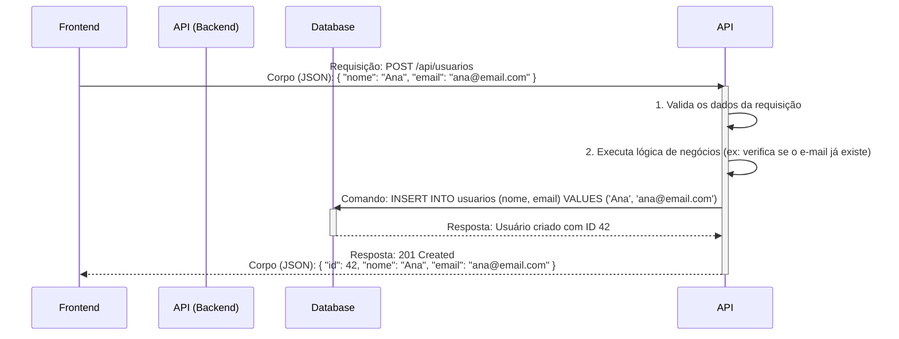

# 📡 Backend e APIs: A Comunicação no Coração do Software

O **Backend** é a parte de uma aplicação que roda no servidor, invisível ao usuário, responsável pela lógica de negócios, acesso a dados e toda a "mágica" que faz um software funcionar. Mas como o **Frontend** (a interface com a qual o usuário interage) conversa com essa poderosa maquinaria? A resposta é através de uma **API (Application Programming Interface)**.

### A Relação Fundamental: O Motor e o Painel de Controle

Pense na relação da seguinte forma:

  - **Backend**: É o **motor** de um carro. Ele tem toda a potência, a lógica complexa e os componentes que fazem o veículo se mover. No entanto, o motorista não interage diretamente com as válvulas e pistões.
  - **API**: É o **painel de controle** do carro (volante, pedais, painel de instrumentos). É uma interface projetada para que o motorista (o frontend) possa enviar comandos claros e receber feedback do motor (o backend) de uma forma segura e padronizada.

A API é o contrato, o "cardápio" que o backend oferece ao mundo exterior, expondo funcionalidades específicas sem revelar a complexidade de sua implementação.

-----

## 📜 O Que Exatamente é uma API?

Uma API é um conjunto de regras, definições e protocolos que permitem que diferentes sistemas de software se comuniquem entre si. No contexto do desenvolvimento web, a API do backend é a ponte que conecta o cliente (frontend) ao servidor.

A melhor analogia é a de um **restaurante**:

1.  **O Cliente (Frontend)**: Você, sentado à mesa, com fome. Você não pode entrar na cozinha para preparar sua comida.
2.  **O Cardápio**: A documentação da API, que lista os pratos (dados/funcionalidades) disponíveis e como pedi-los.
3.  **O Garçom (A API)**: Ele pega seu pedido (a **requisição**) de forma padronizada, leva para a cozinha e garante que você não peça nada que não esteja no cardápio.
4.  **A Cozinha (O Backend)**: Onde a mágica acontece. A cozinha prepara seu prato (processa a requisição, acessa o banco de dados, executa a lógica).
5.  **A Entrega**: O garçom (API) traz o prato pronto (a **resposta**) de volta para você.

<!-- end list -->

  - **Endpoint**: É um "prato" específico do cardápio. É uma URL que aponta para uma funcionalidade ou recurso específico. Ex: `/usuarios`, `/produtos/42`.
  - **Requisição (Request)**: O "pedido" feito pelo cliente. Contém o endpoint, o método (o que fazer) e, opcionalmente, dados.
  - **Resposta (Response)**: O "prato" entregue pelo servidor. Contém os dados solicitados e um código de status (informando se o pedido foi bem-sucedido).

-----

## 🏛️ O Padrão Dominante: APIs RESTful

**REST (Representational State Transfer)** não é uma tecnologia, mas sim um **estilo de arquitetura** para projetar APIs de rede. É o padrão mais popular para a web devido à sua simplicidade e por utilizar as tecnologias da própria internet.

Uma API que segue os princípios REST é chamada de **RESTful**. Seus conceitos principais são:

  - **Tudo é um Recurso**: Um usuário, um produto, um pedido — tudo é um "recurso" identificado por uma URL única (o endpoint).
  - **Uso de Verbos HTTP**: As operações sobre os recursos são realizadas usando os métodos padrão do protocolo HTTP.

| Verbo HTTP | Operação CRUD | Exemplo de Uso |
| :--- | :--- | :--- |
| **`GET`** | **Read** (Ler) | `GET /usuarios` (listar todos os usuários)\<br\>`GET /usuarios/123` (obter o usuário com ID 123) |
| **`POST`** | **Create** (Criar) | `POST /usuarios` (criar um novo usuário com os dados enviados no corpo da requisição) |
| **`PUT`** | **Update** (Atualizar) | `PUT /usuarios/123` (substituir completamente os dados do usuário com ID 123) |
| **`DELETE`** | **Delete** (Deletar) | `DELETE /usuarios/123` (remover o usuário com ID 123) |

  - **Comunicação sem Estado (Stateless)**: Cada requisição do cliente para o servidor deve conter toda a informação necessária para ser entendida, sem que o servidor precise guardar o "estado" do cliente entre as requisições.
  - **Uso de JSON**: O formato **JSON (JavaScript Object Notation)** se tornou o padrão de fato para enviar e receber dados em APIs REST devido à sua simplicidade e legibilidade tanto para humanos quanto para máquinas.

-----

## flowchart Anatomia de uma Chamada de API REST

Este diagrama de sequência mostra o fluxo completo de uma requisição para criar um novo usuário.



-----

## ⌨️ Exemplo Prático: Criando um Usuário

**Requisição** que o Frontend envia:

```http
POST /api/usuarios HTTP/1.1
Host: api.meusite.com
Content-Type: application/json

{
  "nome": "Carlos Silva",
  "email": "carlos.silva@example.com",
  "senha": "uma_senha_muito_forte_123"
}
```

**Resposta** que o Backend retorna após criar o usuário no banco de dados:

```http
HTTP/1.1 201 Created
Content-Type: application/json

{
  "id": 124,
  "nome": "Carlos Silva",
  "email": "carlos.silva@example.com",
  "data_criacao": "2025-08-21T15:10:00Z"
}
```

*Note que a senha nunca é retornada na resposta por razões de segurança.*

-----

## 🚀 APIs como a Cola da Internet Moderna

As APIs são a espinha dorsal da tecnologia digital moderna, indo muito além da comunicação entre frontend e backend de uma mesma aplicação.

  - **Arquitetura de Microserviços**: Em sistemas complexos, diferentes partes da aplicação (serviço de pagamento, serviço de notificação, etc.) são sistemas independentes que se comunicam uns com os outros através de APIs internas.
  - **Integrações de Terceiros**: Quando sua aplicação usa o mapa do Google, um sistema de pagamento como Stripe ou permite "Login com o Facebook", ela está consumindo as APIs que essas empresas fornecem.
  - **Economia de APIs**: Empresas inteiras são construídas em torno de fornecer uma API poderosa como seu produto principal (ex: Twilio para comunicação, Plaid para dados financeiros).

O backend projeta e constrói a "cozinha", mas é a API que atua como o "garçom", permitindo que o mundo inteiro (ou apenas o seu frontend) possa "fazer pedidos" de forma segura e eficiente.

---

### 🔗 [ricardotecpro.github.io](https://ricardotecpro.github.io/)
