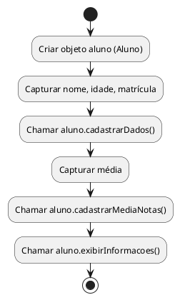

# **Sistema de Cadastro de Alunos em JavaScript (POO)**

Sistema de cadastro de alunos** usando **JavaScript** com orientação a objetos. Essa versão pode ser executada diretamente no navegador ou no Node.js.

---

## 🟨 Sistema de Cadastro de Alunos em JavaScript (POO)

---

### 🎯 **Objetivo**

Criar uma aplicação simples em JavaScript que permita:

- Cadastrar os dados de um aluno
    
- Cadastrar a média de notas
    
- Exibir todas as informações no console
    

---

## 📦 Etapa 1: Criando a classe `Aluno`

```javascript
class Aluno {
  constructor() {
    this.nome = "";
    this.idade = 0;
    this.matricula = 0;
    this.media = 0.0;
  }

  cadastrarDados(nome, idade, matricula) {
    this.nome = nome;
    this.idade = idade;
    this.matricula = matricula;
  }

  cadastrarMediaNotas(media) {
    this.media = media;
  }

  exibirInformacoes() {
    console.log("=== DADOS DO ALUNO ===");
    console.log("Nome:", this.nome);
    console.log("Idade:", this.idade);
    console.log("Matrícula:", this.matricula);
    console.log("Média de notas:", this.media);
  }
}
```

---

## 📦 Etapa 2: Criando o script principal

### 👉 Em um ambiente **Node.js** (linha de comando)

```javascript
const readline = require("readline").createInterface({
  input: process.stdin,
  output: process.stdout,
});

const aluno = new Aluno();

readline.question("Digite o nome do aluno: ", (nome) => {
  readline.question("Digite a idade do aluno: ", (idade) => {
    readline.question("Digite a matrícula do aluno: ", (matricula) => {
      aluno.cadastrarDados(nome, parseInt(idade), parseInt(matricula));

      readline.question("Digite a média de notas: ", (media) => {
        aluno.cadastrarMediaNotas(parseFloat(media));

        aluno.exibirInformacoes();
        readline.close();
      });
    });
  });
});
```

---

### 👉 Em um ambiente **navegador (HTML + JS)**

```html
<!DOCTYPE html>
<html lang="pt-BR">
<head>
  <meta charset="UTF-8" />
  <title>Cadastro de Aluno</title>
</head>
<body>
  <h2>Abra o console para ver o resultado (F12)</h2>
  <script>
    class Aluno {
      constructor() {
        this.nome = "";
        this.idade = 0;
        this.matricula = 0;
        this.media = 0.0;
      }

      cadastrarDados(nome, idade, matricula) {
        this.nome = nome;
        this.idade = idade;
        this.matricula = matricula;
      }

      cadastrarMediaNotas(media) {
        this.media = media;
      }

      exibirInformacoes() {
        console.log("=== DADOS DO ALUNO ===");
        console.log("Nome:", this.nome);
        console.log("Idade:", this.idade);
        console.log("Matrícula:", this.matricula);
        console.log("Média de notas:", this.media);
      }
    }

    const aluno = new Aluno();

    const nome = prompt("Digite o nome do aluno:");
    const idade = parseInt(prompt("Digite a idade do aluno:"));
    const matricula = parseInt(prompt("Digite o número de matrícula:"));
    const media = parseFloat(prompt("Digite a média de notas:"));

    aluno.cadastrarDados(nome, idade, matricula);
    aluno.cadastrarMediaNotas(media);
    aluno.exibirInformacoes();
  </script>
</body>
</html>
```

---

## 🧠 O que os alunos aprendem com esse exemplo?

|Conceito|Aplicação|
|---|---|
|Classes e objetos|`class`, `constructor()`, `new Aluno()`|
|Métodos de instância|`cadastrarDados()`, `exibirInformacoes()`|
|Tipagem dinâmica|Conversão com `parseInt`, `parseFloat`|
|Entrada interativa|`prompt()` no navegador, `readline` no Node.js|
|Console para debug|`console.log()`|

---

## 📊 Fluxograma (igual para todas as linguagens)



---


NODEJS

Projeto de **cadastro de aluno em Node.js (linha de comando)** com estrutura profissional e simples para uso em sala de aula. A ideia é separar a lógica da aplicação em arquivos modulares, algo próximo ao que se faz em projetos maiores.

---

## 📁 Estrutura de Arquivos

```plaintext
cadastro-aluno-node/
├── package.json
├── index.js            # ponto de entrada do app
└── src/
    ├── aluno.js        # classe Aluno (POO)
    └── utils.js        # funções auxiliares (opcional)
```

---

## 📦 Etapa 1: Criar o projeto com Node.js

No terminal, execute:

```bash
mkdir cadastro-aluno-node
cd cadastro-aluno-node
npm init -y
```

---

## 📦 Etapa 2: Criar os arquivos

### `src/aluno.js` – Classe Aluno

```javascript
class Aluno {
  constructor() {
    this.nome = "";
    this.idade = 0;
    this.matricula = 0;
    this.media = 0.0;
  }

  cadastrarDados(nome, idade, matricula) {
    this.nome = nome;
    this.idade = idade;
    this.matricula = matricula;
  }

  cadastrarMediaNotas(media) {
    this.media = media;
  }

  exibirInformacoes() {
    console.log("\n=== DADOS DO ALUNO ===");
    console.log("Nome:", this.nome);
    console.log("Idade:", this.idade);
    console.log("Matrícula:", this.matricula);
    console.log("Média de notas:", this.media);
  }
}

module.exports = Aluno;
```

---

### `index.js` – Ponto de entrada

```javascript
const readline = require("readline");
const Aluno = require("./src/aluno");

const rl = readline.createInterface({
  input: process.stdin,
  output: process.stdout,
});

const aluno = new Aluno();

rl.question("Digite o nome do aluno: ", (nome) => {
  rl.question("Digite a idade do aluno: ", (idade) => {
    rl.question("Digite a matrícula do aluno: ", (matricula) => {
      aluno.cadastrarDados(nome, parseInt(idade), parseInt(matricula));

      rl.question("Digite a média de notas: ", (media) => {
        aluno.cadastrarMediaNotas(parseFloat(media));
        aluno.exibirInformacoes();

        rl.close();
      });
    });
  });
});
```

---

### (Opcional) `src/utils.js` – Funções auxiliares

Se quiser deixar o projeto mais modular, pode mover validações ou formatações para esse arquivo.

---

## ▶️ Executar o Projeto

No terminal, rode:

```bash
node index.js
```

---

## 📌 O que os alunos aprendem com isso?

|Conceito|Aplicação prática|
|---|---|
|Módulos Node.js|`require`, `module.exports`|
|Orientação a Objetos|Classe Aluno|
|Entrada de dados|`readline`|
|Tipagem e parseamento|`parseInt`, `parseFloat`|
|Organização em arquivos|Separação em `src/`|

---
