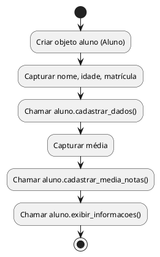

# # Slide 27: Cadastro de Alunos em Python (POO)

Sistema de **cadastro de alunos** para **Python**, mantendo os princípios de **Programação Orientada a Objetos (POO)**.

---

## 🐍 Sistema de Cadastro de Alunos em Python (POO)

---

### 🎯 **Objetivo**

Desenvolver um programa em **Python** que permita:

- Cadastrar dados de um aluno
    
- Cadastrar a média de notas
    
- Exibir todas as informações do aluno
    

---

## 🧱 Etapa 1: Criando a classe `Aluno`

```python
class Aluno:
    def __init__(self):
        self.__nome = ""
        self.__idade = 0
        self.__matricula = 0
        self.__media = 0.0

    def cadastrar_dados(self, nome, idade, matricula):
        self.__nome = nome
        self.__idade = idade
        self.__matricula = matricula

    def cadastrar_media_notas(self, media):
        self.__media = media

    def exibir_informacoes(self):
        print("=== DADOS DO ALUNO ===")
        print(f"Nome: {self.__nome}")
        print(f"Idade: {self.__idade}")
        print(f"Matrícula: {self.__matricula}")
        print(f"Média de notas: {self.__media}")
```

---

## 🧱 Etapa 2: Criando a função principal (`main`)

```python
from Aluno import Aluno
def main():
    aluno = Aluno()

    nome = input("Digite o nome do aluno: ")
    idade = int(input("Digite a idade do aluno: "))
    matricula = int(input("Digite o número de matrícula: "))

    aluno.cadastrar_dados(nome, idade, matricula)

    media = float(input("Digite a média de notas: "))
    aluno.cadastrar_media_notas(media)

    aluno.exibir_informacoes()

if __name__ == "__main__":
    main()
```

---

## 📄 Estrutura do Projeto

```
cadastro_aluno/
 ├── aluno.py         # contém a classe Aluno
 └── main.py          # contém a lógica de execução
```

---

## 📊 Fluxograma PlantUML (mesmo da versão Java/C++)



---

## 📌 O que os alunos aprendem com este exemplo?

|Conceito|Aplicação|
|---|---|
|Encapsulamento|Atributos privados (`__atributo`)|
|Métodos de instância|`self` como referência ao objeto|
|Entrada e saída|`input()` e `print()`|
|Modularização|Separação de classe e execução|

---

## 💡 Sugestão para próximo passo

- Criar uma lista de alunos
    
- Adicionar menu interativo
    
- Salvar e carregar os dados com arquivos `.txt` ou `.json`
    

---

