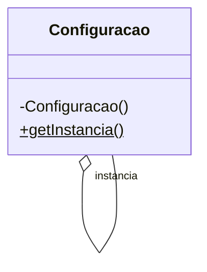
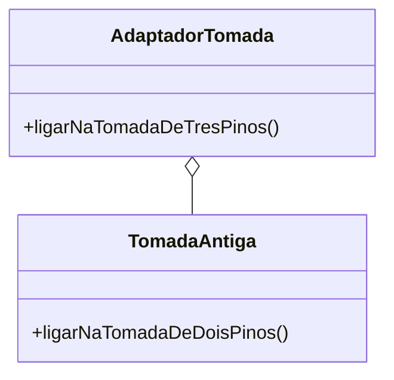

# 📚 Padrões de Projeto, Arquiteturas e Boas Práticas

## 🛠️ Padrões de Projeto

Padrões de projeto são soluções reutilizáveis para problemas comuns no desenvolvimento de software. Eles ajudam a criar um código mais estruturado, de fácil manutenção e escalável.

### 1. Factory Method

Define uma interface para a criação de objetos, mas permite que as subclasses decidam qual classe instanciar. É útil para desacoplar o código cliente das classes concretas.

```java
// Interface do Produto
interface Produto {
    void criar();
}

// Implementação Concreta do Produto
class ProdutoA implements Produto {
    public void criar() {
        System.out.println("Produto A criado");
    }
}

// Fábrica que cria o produto
class FabricaDeProdutos {
    public static Produto criarProduto(String tipo) {
        if (tipo.equals("A")) {
            return new ProdutoA();
        }
        throw new IllegalArgumentException("Tipo de produto desconhecido");
    }
}

```

```mermaid
classDiagram
    class "Produto" <<interface>> {
        +criar()
    }
    class "ProdutoA" {
        +criar()
    }
    class "FabricaDeProdutos" {
        +criarProduto("tipo")
    }

    "ProdutoA" ..|> "Produto"
    "FabricaDeProdutos" ..> "Produto" : cria
    
````


### 2. Singleton

Garante que uma classe tenha apenas uma instância e fornece um ponto de acesso global a ela. Ideal para gerenciar recursos compartilhados, como configurações ou conexões de banco de dados.

```java
public class Configuracao {
    private static Configuracao instancia;

    private Configuracao() {
        // Construtor privado para evitar instanciação externa
    }
    
    public static Configuracao getInstancia() {
        if (instancia == null) {
            instancia = new Configuracao();
        }
        return instancia;
    }
}
```



### 3. Observer

Define uma dependência um-para-muitos entre objetos. Quando o estado de um objeto (o "sujeito") muda, todos os seus dependentes (os "observadores") são notificados e atualizados automaticamente.

```java
// Interface do Observador
interface Observador {
    void atualizar(String mensagem);
}

// Observador Concreto
class Usuario implements Observador {
    private String nome;
    public Usuario(String nome) { this.nome = nome; }
    public void atualizar(String mensagem) {
        System.out.println(nome + " recebeu a notificação: " + mensagem);
    }
}

// Sujeito (ou Notificador)
class Notificador {
    private List<Observador> observadores = new ArrayList<>();
    
    public void adicionar(Observador o) { 
        observadores.add(o); 
    }
    
    public void notificarTodos(String mensagem) {
        for (Observador o : observadores) {
            o.atualizar(mensagem);
        }
    }
}
```

```mermaid
classDiagram
    <<interface>> Observador
    Observador : +atualizar(String mensagem)
    Usuario ..|> Observador
    Notificador o-- "observadores" Observador
    Notificador : +adicionar(Observador o)
    Notificador : +notificarTodos(String mensagem)
```

### 4. Decorator

Permite adicionar novas funcionalidades a um objeto dinamicamente, envolvendo-o em um objeto "decorador". É uma alternativa flexível à herança.

```java
// Componente
interface Cafe {
    String getDescricao();
}

// Componente Concreto
class CafeSimples implements Cafe {
    public String getDescricao() { 
        return "Café Simples"; 
    }
}

// Decorator
class LeiteDecorator implements Cafe {
    private Cafe cafe;
    public LeiteDecorator(Cafe cafe) { 
        this.cafe = cafe; 
    }
    public String getDescricao() { 
        return cafe.getDescricao() + ", com leite"; 
    }
}
```

```mermaid
classDiagram
    <<interface>> Cafe
    Cafe : +getDescricao()
    CafeSimples ..|> Cafe
    LeiteDecorator ..|> Cafe
    LeiteDecorator o-- Cafe
```

### 5. Adapter

Converte a interface de uma classe em outra que o cliente espera, permitindo que classes com interfaces incompatíveis trabalhem juntas.

```java
// Classe existente com interface incompatível
class TomadaAntiga {
    public void ligarNaTomadaDeDoisPinos() {
        System.out.println("Ligado na tomada de dois pinos.");
    }
}

// Adaptador
class AdaptadorTomada {
    private TomadaAntiga tomada;
    public AdaptadorTomada(TomadaAntiga tomada) { 
        this.tomada = tomada; 
    }
    public void ligarNaTomadaDeTresPinos() {
        tomada.ligarNaTomadaDeDoisPinos(); // Adapta a chamada
    }
}
```



---

## 🏗️ Arquiteturas

A arquitetura define a estrutura de um sistema, organizando seus componentes de forma escalável e manutenível.

### 1. Monolito vs. Microservices

*   **Monolito**: Aplicação construída como uma única unidade. Simples de desenvolver e implantar no início, mas pode se tornar complexo e difícil de escalar.
*   **Microservices**: Aplicação dividida em pequenos serviços independentes que se comunicam entre si. Facilita a escalabilidade, a manutenção e a implantação de partes do sistema de forma isolada.

### 2. DDD (Domain-Driven Design)

Abordagem que foca em modelar o software para corresponder ao domínio de negócio. Utiliza uma linguagem ubíqua e conceitos como **Entidades**, **Agregados** e **Repositórios** para criar um modelo rico e expressivo.

### 3. Arquitetura Hexagonal (Portas e Adaptadores)

Separa a lógica de negócios (o "hexágono") da infraestrutura (banco de dados, UI, APIs externas). A comunicação ocorre por meio de **Portas** (interfaces) e **Adaptadores** (implementações), o que torna o sistema desacoplado e mais fácil de testar.

---

## ✔️ Testes e Qualidade

Testes automatizados são fundamentais para garantir a confiabilidade e a robustez do código.

### 1. JUnit

Principal framework para testes unitários em Java. Permite verificar se cada unidade de código (método ou classe) funciona como esperado.

```java
import org.junit.jupiter.api.Test;
import static org.junit.jupiter.api.Assertions.assertEquals;

class CalculadoraTest {
    @Test
    void testSoma() {
        assertEquals(4, Calculadora.somar(2, 2));
    }
}
```

### 2. Mockito

Framework para criar "mocks" (objetos simulados) que imitam o comportamento de dependências reais, permitindo testar uma unidade de forma isolada.

```java
import static org.mockito.Mockito.when;

// Exemplo de uso
when(repositorio.buscarPorId(1L)).thenReturn(new Cliente("João"));
```

### 3. Testes de Integração

Verificam a interação entre diferentes componentes do sistema, como a integração da lógica de negócios com o banco de dados. No Spring, `@SpringBootTest` é usado para carregar o contexto da aplicação.

---

## 🗄️ Banco de Dados

Sistemas de gerenciamento de banco de dados (SGBDs) são usados para armazenar e recuperar os dados da aplicação.

*   **JDBC**: API padrão do Java para conectar e executar comandos em bancos de dados SQL.
*   **JPA/Hibernate**: JPA é uma especificação para mapeamento objeto-relacional (ORM), enquanto o Hibernate é sua implementação mais popular. Facilita a persistência de dados.
*   **NoSQL**: Bancos de dados não relacionais (como MongoDB e Redis) que oferecem alta escalabilidade e flexibilidade no esquema de dados.

---

## ✨ Boas Práticas

Princípios que guiam o desenvolvimento de um código limpo, eficiente e de fácil manutenção.

*   **Clean Code**: Escrever código que seja legível e fácil de entender por outros desenvolvedores.
*   **DRY (Don't Repeat Yourself)**: Evitar a duplicação de código para centralizar a lógica e facilitar a manutenção.
*   **KISS (Keep It Simple, Stupid)**: Manter as soluções as mais simples possíveis.
*   **YAGNI (You Ain't Gonna Need It)**: Não implementar funcionalidades que não são estritamente necessárias no momento.

---

## 🏁 Conclusão

Este guia apresentou conceitos essenciais de padrões de projeto, arquiteturas, testes e boas práticas. Dominar esses tópicos é fundamental para construir software de alta qualidade, robusto e escalável.

---

### 🚀 [ricardotecpro.github.io](https://ricardotecpro.github.io/)
