# 🔐 Desenvolvimento Seguro (DevSecOps): Construindo a Segurança desde o Início

O **Desenvolvimento Seguro de Software** é uma abordagem que integra práticas de segurança em **todas as fases** do ciclo de vida de desenvolvimento de software (SDLC - Software Development Lifecycle). O objetivo é abandonar o modelo tradicional onde a segurança era uma preocupação tardia e tratá-la como uma responsabilidade compartilhada e contínua.

Este movimento é frequentemente chamado de **DevSecOps**, enfatizando a integração da Segurança (Sec) entre o Desenvolvimento (Dev) e as Operações (Ops).

### O Modelo Tradicional vs. O Modelo Moderno

  - **Modelo Tradicional (Segurança no Final)**: A segurança era responsabilidade de uma equipe separada, que realizava testes de invasão (*pentests*) apenas no final do ciclo, pouco antes do lançamento. As vulnerabilidades descobertas nessa fase eram extremamente caras e demoradas para corrigir, causando atrasos significativos. Era como construir uma casa inteira e só depois verificar se a fundação era sólida.
  - **Modelo Moderno (DevSecOps)**: A segurança é uma responsabilidade de todos e é automatizada e integrada desde a fase de planejamento. As vulnerabilidades são encontradas e corrigidas no início do processo, quando o custo e o esforço são mínimos. É como o arquiteto e o engenheiro trabalhando juntos na planta para garantir uma fundação segura desde o projeto.

-----

## ⬅️ A Filosofia "Shift Left": Trazendo a Segurança para a Esquerda

O conceito central do Desenvolvimento Seguro é o **"Shift Left"**. Se imaginarmos o ciclo de desenvolvimento como uma linha do tempo da esquerda (planejamento) para a direita (produção), "deslocar para a esquerda" significa mover as atividades de segurança o mais cedo possível no processo.

**A regra de ouro**: Quanto mais cedo uma vulnerabilidade é detectada, mais barata, rápida e fácil ela é de ser corrigida. Corrigir um bug na fase de codificação pode custar 100 vezes menos do que corrigi-lo depois que o software já está em produção.

-----

## 🔄 Segurança em Cada Fase do Ciclo de Vida (SDLC)

A abordagem DevSecOps integra ferramentas e processos de segurança em todo o pipeline de desenvolvimento.

```mermaid
graph LR;
    A(1. Planejamento) -- Modelagem de Ameaças --> B(2. Codificação);
    B -- SAST & SCA --> C(3. Build & CI);
    C --> D(4. Testes);
    D -- DAST & IAST --> E(5. Deploy & CD);
    E -- Análise de Configuração --> F(6. Operação & Monitoramento);
    F -- Monitoramento Contínuo --> F;

    style A fill:#ccf,stroke:#333
    style B fill:#ccf,stroke:#333
    style C fill:#ccf,stroke:#333
    style D fill:#ccf,stroke:#333
    style E fill:#ccf,stroke:#333
    style F fill:#ccf,stroke:#333
```

### 1\. Planejamento e Requisitos

  - **Modelagem de Ameaças (Threat Modeling)**: Antes de escrever qualquer código, a equipe se reúne para pensar como um atacante. Eles identificam potenciais ameaças, vulnerabilidades e definem contramedidas no próprio design da aplicação.

### 2\. Codificação

  - **Práticas de Codificação Segura**: Os desenvolvedores são treinados para evitar padrões de código inseguros (ex: SQL Injection, Cross-Site Scripting).
  - **Revisão de Código (Code Review)**: Pares revisam o código uns dos outros, não apenas em busca de bugs de lógica, mas também de falhas de segurança.
  - **Linters de Segurança**: Ferramentas integradas ao editor de código (IDE) que apontam problemas de segurança em tempo real.

### 3\. Build e Testes (CI - Integração Contínua)

Esta fase é onde a automação se torna crítica. Cada vez que um desenvolvedor envia código novo, um pipeline automatizado executa várias verificações de segurança:

  - **SAST (Static Application Security Testing)**: Ferramentas que analisam o código-fonte em busca de padrões de vulnerabilidades conhecidas, sem executar o programa.
  - **SCA (Software Composition Analysis)**: Ferramentas que escaneiam as dependências e bibliotecas de terceiros do projeto para encontrar vulnerabilidades já conhecidas nelas.
  - **DAST (Dynamic Application Security Testing)**: Ferramentas que testam a aplicação *em execução* (geralmente em um ambiente de testes) para encontrar vulnerabilidades, simulando ataques externos.

### 4\. Implantação (CD - Entrega Contínua)

  - **Scanner de Imagens de Contêineres**: Verifica imagens Docker em busca de vulnerabilidades conhecidas no sistema operacional ou nas bibliotecas base.
  - **Análise de Configuração da Infraestrutura**: Garante que a infraestrutura como código (IaC) e as configurações da nuvem sigam as melhores práticas de segurança.

### 5\. Operação e Monitoramento

  - **Monitoramento Contínuo**: Observar a aplicação em produção em busca de atividades suspeitas.
  - **WAF (Web Application Firewall)**: Um firewall que protege a aplicação web contra ataques comuns.
  - **Testes de Invasão (Penetration Testing)**: Contratação de especialistas (ethical hackers) para tentar ativamente invadir o sistema e encontrar falhas que as ferramentas automatizadas podem ter perdido.

-----

## 🛠️ Ferramentas e Conceitos Essenciais

  - **OWASP Top 10**: Um documento de conscientização, atualizado periodicamente pela Open Web Application Security Project (OWASP), que lista os 10 riscos de segurança mais críticos para aplicações web. É um guia essencial para qualquer desenvolvedor web.
  - **Automação no Pipeline de CI/CD**: A automação é a chave para o sucesso do DevSecOps. Integrar as ferramentas SAST, DAST e SCA no pipeline (usando GitHub Actions, GitLab CI/CD, etc.) garante que as verificações de segurança sejam executadas de forma consistente e automática.
  - **Segurança da Cadeia de Suprimentos (Software Supply Chain Security)**: A consciência de que uma aplicação é tão segura quanto suas dependências. Um foco crescente em garantir que as bibliotecas de terceiros que você usa sejam seguras e venham de fontes confiáveis.

-----

## 👥 A Mudança Cultural: Segurança é Responsabilidade de Todos

Mais importante do que qualquer ferramenta, o Desenvolvimento Seguro é uma **mudança cultural**.

  - **Segurança Deixa de Ser um "Portão"**: Em vez de a equipe de segurança ser um gargalo que aprova ou reprova no final, ela se torna uma equipe de "facilitadores", que fornecem as ferramentas, o conhecimento e a automação para que os próprios desenvolvedores possam construir software seguro.
  - **Responsabilidade Compartilhada**: A segurança do produto final é responsabilidade de todos: do gerente de produto que define os requisitos, do desenvolvedor que escreve o código, do engenheiro de DevOps que configura a infraestrutura e do analista de segurança que monitora o ambiente.
  - **Empoderamento do Desenvolvedor**: O objetivo é capacitar os desenvolvedores, dando-lhes o conhecimento e as ferramentas para tomarem decisões seguras desde o início e serem a primeira linha de defesa da aplicação.

---

## 📚 Conteúdo Detalhado

* **[Explorar Tópicos](topicos/)**: Lista completa de lições e materiais.

---

