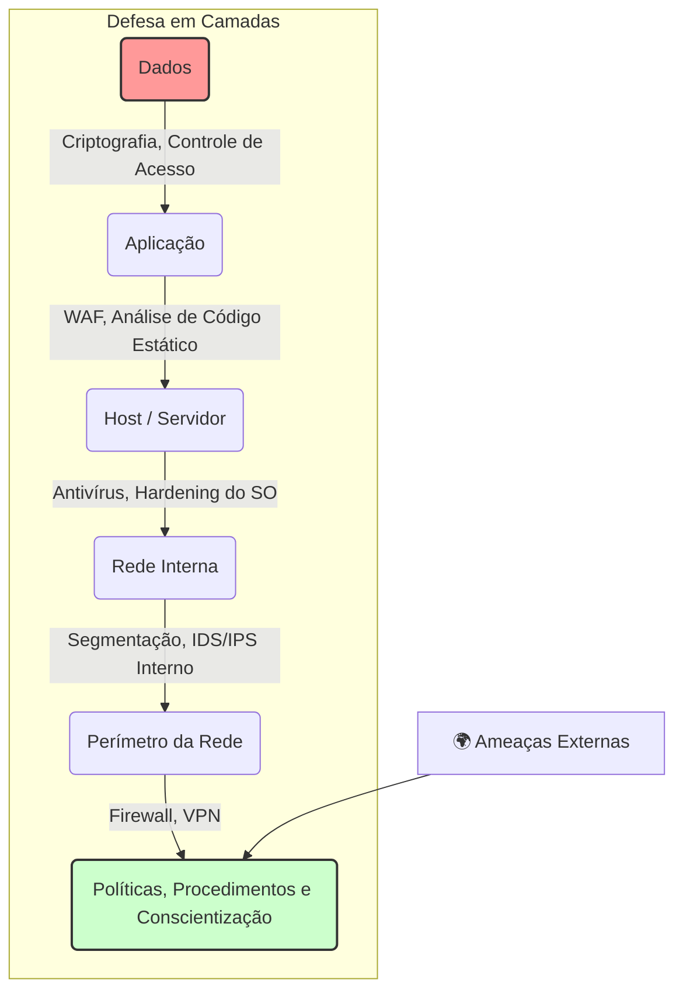

# 🛡️ Segurança da Informação: Protegendo o Mundo Digital

**Segurança da Informação** (InfoSec) é o conjunto de práticas, políticas, tecnologias e processos projetados para proteger informações digitais e não-digitais contra acesso, uso, divulgação, alteração, interrupção ou destruição não autorizados.

É um campo multidisciplinar que vai muito além da tecnologia. Envolve a proteção de ativos de informação críticos para um indivíduo ou organização, considerando três elementos principais: **Pessoas**, **Processos** e **Tecnologia**. Uma falha em qualquer um desses elos pode comprometer todo o sistema.

O objetivo não é eliminar 100% do risco — o que é impossível —, mas sim gerenciar o risco a um nível aceitável.

-----

## ⚖️ Os Pilares da Segurança: A Tríade CID

A base teórica da Segurança da Informação é sustentada por três princípios fundamentais, conhecidos como a **Tríade CID**. Um sistema é considerado seguro quando equilibra estes três pilares.

### Confidencialidade (Confidentiality)

Garante que a informação seja acessível apenas por pessoas autorizadas. É o princípio da privacidade e do sigilo. Violar a confidencialidade é como permitir que alguém leia uma carta que não lhe foi endereçada.

  - **Como é alcançada**: Criptografia, controle de acesso (senhas, biometria), permissões de arquivos.

### Integridade (Integrity)

Garante que a informação seja precisa, completa e não tenha sido alterada de forma não autorizada durante o armazenamento ou a transmissão. Violar a integridade é como alterar o conteúdo de um documento assinado.

  - **Como é alcançada**: Funções de Hash (como SHA-256), assinaturas digitais, controle de versões.

### Disponibilidade (Availability)

Garante que a informação e os sistemas estejam disponíveis e acessíveis para usuários autorizados sempre que necessário. Violar a disponibilidade é como fechar as portas de um serviço essencial, impedindo o acesso.

  - **Como é alcançada**: Redundância de sistemas (backups), proteção contra ataques de negação de serviço (DDoS), planos de recuperação de desastres.

-----

## 👾 Ameaças Comuns no Cenário Digital

As ameaças à segurança da informação são variadas e estão em constante evolução.

  - **Engenharia Social**: A arte de manipular psicologicamente as pessoas para que elas realizem ações ou divulguem informações confidenciais.
      - **Phishing**: A forma mais comum. E-mails, mensagens ou sites fraudulentos que se passam por entidades legítimas para roubar credenciais, dados de cartão de crédito e outras informações sensíveis.
  - **Malware (Software Malicioso)**: Qualquer software projetado para causar danos, interromper operações ou obter acesso não autorizado a um sistema.
      - **Vírus**: Anexa-se a um programa limpo e se espalha quando o programa é executado.
      - **Worm**: Propaga-se por redes de computadores de forma autônoma, sem precisar de um arquivo hospedeiro.
      - **Ransomware**: Criptografa os arquivos da vítima e exige o pagamento de um resgate para restaurar o acesso.
      - **Spyware**: Coleta secretamente informações sobre o usuário e suas atividades.
  - **Ataques de Rede**:
      - **Negação de Serviço (DoS/DDoS)**: Inunda um servidor, site ou rede com uma quantidade massiva de tráfego ou requisições para sobrecarregá-lo e torná-lo indisponível para usuários legítimos.
      - **Man-in-the-Middle (MitM)**: O atacante se posiciona secretamente entre duas partes que se comunicam, interceptando, lendo e, possivelmente, alterando a comunicação sem que elas saibam.

-----

## 🏰 Mecanismos de Defesa e Melhores Práticas

A segurança eficaz raramente depende de uma única solução. A estratégia mais robusta é a **Defesa em Camadas (Defense in Depth)**, onde múltiplos controles de segurança são implementados para que, se uma camada falhar, outra possa conter a ameaça.

### Controles Essenciais

  - **Controle de Acesso Forte**: Implementar o **Princípio do Menor Privilégio**, onde cada usuário tem acesso apenas às informações e sistemas estritamente necessários para realizar seu trabalho.
  - **Autenticação Multifator (MFA)**: Exigir mais de uma forma de verificação (algo que você sabe, algo que você tem, algo que você é) para provar a identidade do usuário.
  - **Criptografia**: Proteger os dados "em trânsito" (usando HTTPS, VPNs) e "em repouso" (criptografando discos rígidos e bancos de dados).
  - **Gerenciamento de Patches e Atualizações**: Manter sistemas operacionais, softwares e aplicações sempre atualizados para corrigir vulnerabilidades conhecidas.
  - **Firewalls e Soluções de Antimalware**: Filtrar o tráfego de rede e proteger os sistemas contra softwares maliciosos.
  - **Backups Regulares e Testados**: Criar cópias de segurança dos dados importantes e garantir que seja possível restaurá-los em caso de um incidente.

-----

## 👤 O Fator Humano: O Elo Mais Forte e Mais Fraco

A tecnologia sozinha não é suficiente. Os seres humanos são frequentemente o alvo principal dos atacantes (via phishing) e, ao mesmo tempo, a primeira e mais importante linha de defesa.

  - **Conscientização e Treinamento**: Educar os colaboradores sobre as ameaças e as políticas de segurança é um dos investimentos mais eficazes. Um usuário treinado pode identificar e relatar um e-mail de phishing antes que ele cause danos.
  - **Cultura de Segurança**: A segurança deve ser uma responsabilidade compartilhada por todos na organização, não apenas um problema do departamento de TI.

-----

## 🚀 Carreira em Segurança da Informação

É um campo vasto e em rápida expansão, com diversas especializações:

  - **Analista de Segurança (SOC Analyst)**: Monitora os sistemas em busca de atividades suspeitas e responde a incidentes.
  - **Engenheiro de Segurança**: Projeta, implementa e mantém a infraestrutura de segurança.
  - **Pentester (Ethical Hacker)**: Realiza testes de invasão controlados para encontrar e corrigir vulnerabilidades antes que os atacantes as encontrem.
  - **Arquiteto de Segurança**: Projeta a estratégia de segurança de alto nível para a organização.
  - **Especialista em GRC (Governança, Risco e Conformidade)**: Garante que a organização esteja em conformidade com as leis e regulamentações (como LGPD, GDPR).