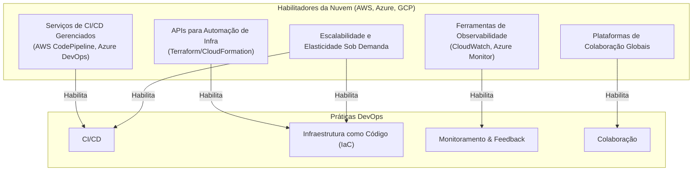

## 📜 A Filosofia DevOps: Mais do que Ferramentas

A cultura DevOps é frequentemente resumida pelo acrônimo **CALMS**:

  - **C**ultura (Culture): Promover a colaboração, a responsabilidade compartilhada e a empatia entre as equipes. O sucesso ou a falha do produto é de todos.
  - **A**utomação (Automation): Automatizar tudo o que for repetitivo e propenso a erro, desde os testes até a implantação da infraestrutura.
  - **L**ean: Aplicar princípios de manufatura enxuta para eliminar o desperdício, focar na entrega de valor e otimizar o fluxo de trabalho.
  - **M**ensuração (Measurement): Coletar dados de todas as fases do ciclo de vida para tomar decisões informadas e identificar gargalos.
  - **S**haring (Compartilhamento): Compartilhar conhecimento, ferramentas e feedback de forma contínua entre todas as equipes.

-----

## 🛠️ Práticas Essenciais do DevOps

A filosofia DevOps se materializa em um conjunto de práticas técnicas fundamentais.

### Integração Contínua (Continuous Integration - CI)

É a prática de automatizar a integração de código de múltiplos desenvolvedores em um repositório central. Cada vez que um desenvolvedor envia (`push`) seu código, um processo automatizado é acionado para construir a aplicação e executar testes unitários e de integração.

  - **Objetivo**: Detectar problemas de integração o mais cedo possível, garantindo que a base de código principal esteja sempre estável.

### Entrega/Implantação Contínua (Continuous Delivery/Deployment - CD)

É a continuação lógica da CI.

  - **Entrega Contínua (Delivery)**: Garante que, após passar nos testes automatizados, o código está sempre em um estado "pronto para ser implantado" em produção com o clique de um botão.
  - **Implantação Contínua (Deployment)**: Vai um passo além e implanta automaticamente em produção toda alteração que passa com sucesso por todo o pipeline de testes.

### Infraestrutura como Código (Infrastructure as Code - IaC)

É a prática de gerenciar e provisionar a infraestrutura (servidores, bancos de dados, redes) através de arquivos de definição legíveis por máquina (código), em vez de configuração manual.

  - **Ferramentas**: Terraform, AWS CloudFormation, Ansible.
  - **Benefícios**: A infraestrutura se torna versionável (controlada com Git), reprodutível e escalável, eliminando inconsistências entre ambientes.

### Monitoramento e Observabilidade

É a prática de coletar e analisar dados (logs, métricas e traces) da aplicação e da infraestrutura em produção para entender seu comportamento, identificar problemas proativamente e fornecer feedback rápido para as equipes de desenvolvimento.

-----

## ☁️ Como a Nuvem Habilita o DevOps

A nuvem e o DevOps são uma combinação perfeita. A nuvem fornece o ambiente ideal para a implementação das práticas DevOps.

  - **Automação via APIs**: Os provedores de nuvem (AWS, Azure, GCP) expõem praticamente todos os seus recursos através de APIs. Isso permite que as ferramentas de IaC e os pipelines de CI/CD provisionem, configurem e gerenciem a infraestrutura de forma totalmente automatizada.
  - **Escalabilidade Sob Demanda**: Um pipeline de CI/CD pode precisar de dezenas de servidores para rodar testes em paralelo por alguns minutos. Na nuvem, esses recursos podem ser provisionados instantaneamente e desativados logo em seguida, pagando-se apenas pelo tempo de uso. Isso seria logisticamente impossível e financeiramente inviável em um data center tradicional.
  - **Serviços Gerenciados**: A nuvem oferece serviços gerenciados para bancos de dados, filas de mensagens, balanceadores de carga, etc. Isso libera as equipes de operações do fardo de instalar, configurar e manter esses sistemas complexos, permitindo que foquem em otimizar o fluxo de entrega de valor.
  - **Confiabilidade e Resiliência**: Os provedores de nuvem oferecem uma infraestrutura globalmente distribuída e resiliente, facilitando a criação de sistemas altamente disponíveis, um dos principais objetivos do DevOps.

-----

## 🚀 O Pipeline de DevOps na Nuvem

O resultado da união entre DevOps e Cloud é o **pipeline de CI/CD**, um fluxo de trabalho automatizado que transforma o código-fonte em uma aplicação em produção.

**Fases Típicas do Pipeline:**

1.  **Commit**: O desenvolvedor envia o código para um repositório Git (ex: GitHub, GitLab).
2.  **Build**: Um serviço de CI (ex: AWS CodeBuild, GitLab CI) é acionado. Ele compila o código e cria um artefato (ex: uma imagem Docker).
3.  **Test**: O pipeline executa automaticamente testes unitários, de integração e de segurança (SAST/DAST).
4.  **Deploy em Staging**: Se os testes passarem, o artefato é implantado em um ambiente de homologação (staging), que é uma réplica do ambiente de produção, criado sob demanda pela nuvem.
5.  **Testes de Aceitação**: Testes automatizados de ponta a ponta (E2E) são executados no ambiente de staging.
6.  **Deploy em Produção**: Após a aprovação (manual ou automática), o mesmo artefato é implantado no ambiente de produção, muitas vezes usando estratégias como Blue-Green ou Canary para minimizar o risco.
7.  **Monitoramento**: A aplicação em produção é continuamente monitorada, e os dados coletados geram alertas e insights que retroalimentam o ciclo de desenvolvimento.

Em resumo, o DevOps fornece a **cultura e os processos** para a entrega rápida e de alta qualidade de software, enquanto a **nuvem fornece a plataforma elástica e automatizável** que torna essa visão uma realidade prática e escalável.

---

