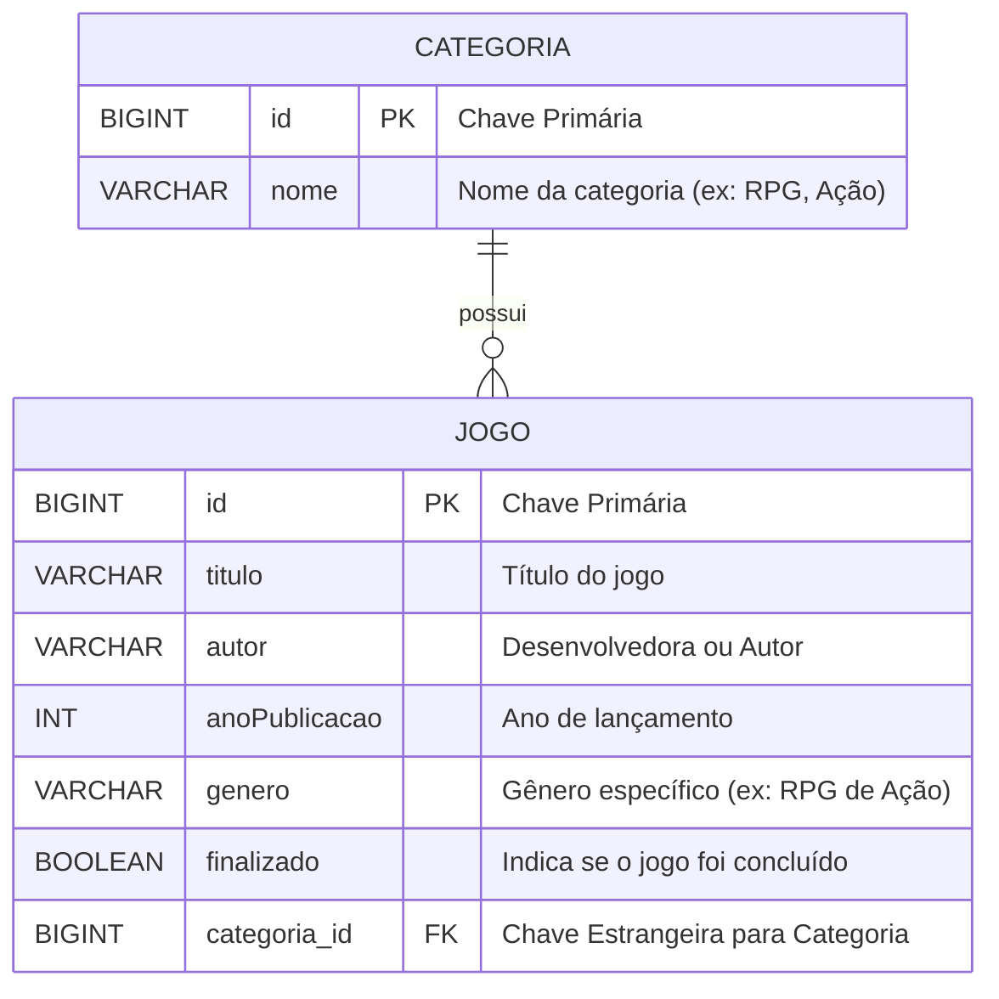
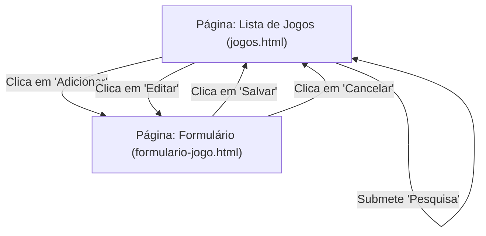
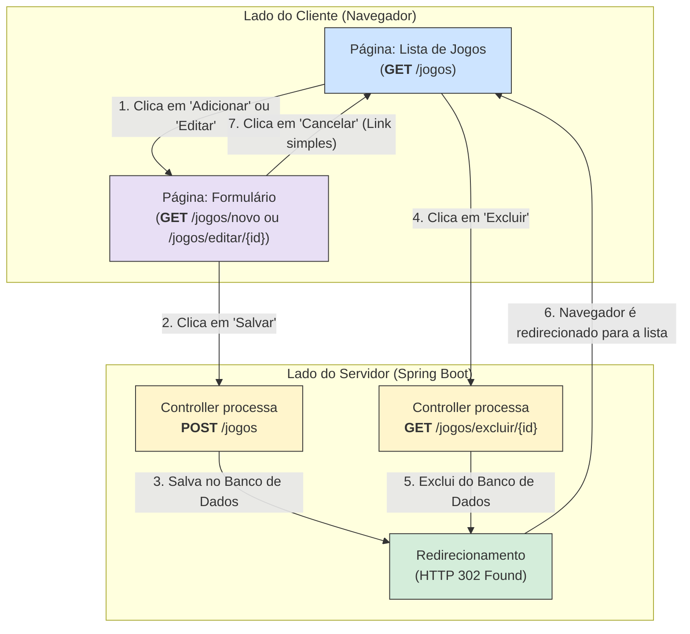
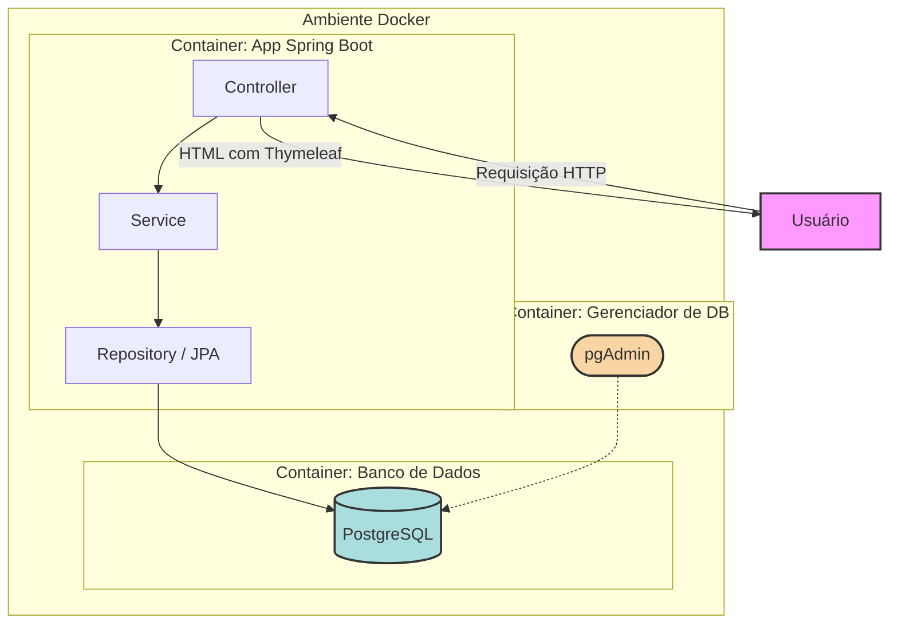

# 🚀 Biblioteca de Jogos

v1.1

## Guia Completo: Desenvolvendo e Implantando uma Biblioteca de Jogos com Spring Boot e Thymeleaf

**Nível:** Intermediário

Este guia completo foi elaborado para desenvolvedores Java com alguma experiência em Spring Boot que desejam aprofundar seus conhecimentos na criação de aplicações web robustas. Ao final deste tutorial, você terá construído uma aplicação completa de CRUD (Create, Read, Update, Delete) para gerenciar uma biblioteca de jogos, utilizando tecnologias modernas e as melhores práticas do mercado.

### 1\. Visão Geral da Arquitetura e Tecnologias

Nossa aplicação seguirá uma arquitetura em camadas, padrão em projetos Spring Boot, para garantir a separação de responsabilidades e a manutenibilidade do código:

- **Camada de Apresentação (View):** Utilizaremos o **Thymeleaf** como nosso motor de templates. Ele se integra perfeitamente com o Spring e nos permite criar páginas HTML dinâmicas com uma sintaxe elegante e natural.
- **Camada de Controle (Controller):** Os `Controllers` serão responsáveis por receber as requisições HTTP, processar as entradas do usuário e retornar as respostas adequadas, interagindo com a camada de serviço.
- **Camada de Serviço (Service):** A lógica de negócio da nossa aplicação residirá aqui. Os `Services` orquestrarão as operações, como salvar, atualizar e buscar jogos, garantindo a integridade dos dados.
- **Camada de Acesso a Dados (Repository):** Utilizaremos o **Spring Data JPA** para simplificar a interação com o banco de dados. Com ele, conseguimos realizar operações de persistência de forma declarativa, sem a necessidade de escrever queries SQL complexas.
- **Banco de Dados:** Para o ambiente de desenvolvimento, utilizaremos o **H2**, um banco de dados em memória que facilita a prototipação e os testes. Para o ambiente de produção, configuraremos o **PostgreSQL**, um banco de dados relacional robusto e escalável.
- **Linguagem e Framework:** Todo o backend será construído com **Java 21** e **Spring Boot 3**, aproveitando os recursos mais recentes e a produtividade que o ecossistema Spring oferece.

### 2\. Configurando o Ambiente de Desenvolvimento

Antes de começarmos a codificar, vamos preparar nosso ambiente:

1.  **Java Development Kit (JDK) 21:** Certifique-se de ter o JDK 21 instalado e configurado em sua máquina.
2.  **Maven ou Gradle:** Utilize sua ferramenta de build de preferência. Este guia utilizará a sintaxe do Maven.
3.  **IDE (Ambiente de Desenvolvimento Integrado):** Recomendamos o uso do IntelliJ IDEA, Eclipse ou Visual Studio Code com as extensões Java e Spring Boot.
4.  **Spring Initializr:** A maneira mais fácil de iniciar um projeto Spring Boot é através do [Spring Initializr](https://start.spring.io/).

**Configuração no Spring Initializr:**

- **Project:** Maven Project
- **Language:** Java
- **Spring Boot:** A versão mais recente (ex: 3.3.x)
- **Group:** (defina o nome do seu grupo, ex: `br.com.bibliotecajogos`)
- **Artifact:** (defina o nome do seu artefato, ex: `bibliotecajogos`)
- **Packaging:** Jar
- **Java:** 21
- **Dependencies:**
  - Spring Web
  - Thymeleaf
  - Spring Data JPA
  - H2 Database
  - PostgreSQL Driver

Após preencher as informações, clique em "Generate" para baixar o projeto base.

---

### 3\. Estrutura do Projeto

Após importar o projeto para sua IDE, teremos a seguinte estrutura de pacotes:

```
src
└── main
    ├── java
    │   └── br
    │       └── com
    │           └── bibliotecajogos
    │               ├── BibliotecaJogosApplication.java
    │               ├── config    
    │               ├── controller
    │               ├── entity
    │               ├── repository
    │               └── service
    └── resources
        ├── static
        ├── templates
        └── application.properties
        └── application-dev.properties
        └── application-prod.properties                        
```

---

Abaixo está o modelo de banco de dados e o relacionamento entre as entidades `Categoria` e `Jogo`, representados em um Diagrama de Entidade-Relacionamento (ERD).

Este diagrama reflete exatamente a estrutura que definimos em nossas classes `Entity` com JPA.

---


### Diagrama de Entidade-Relacionamento (ERD)



---

Abaixo está um diagrama Mermaid que ilustra o fluxo de navegação e a relação entre as páginas HTML da aplicação "Biblioteca de Jogos".

### Diagrama de Fluxo das Páginas (Views)

Este diagrama mostra como o usuário navega entre a tela de listagem e a tela de formulário, e quais ações disparam cada transição.



### Explicação do Diagrama

1.  **Template Base (`layout.html`)**: O diagrama mostra que tanto a "Lista de Jogos" (`jogos.html`) quanto o "Formulário de Jogo" (`formulario-jogo.html`) são envolvidos pelo `layout.html`, que fornece a estrutura visual comum (menu de navegação, rodapé, etc.).

2.  **Página: Lista de Jogos (`jogos.html`)**:

      * É a tela principal e o ponto de partida (`/jogos`).
      * A partir dela, o usuário pode iniciar três fluxos principais:
          * **Adicionar**: Leva para a página de formulário.
          * **Editar**: Também leva para a mesma página de formulário, mas com os dados do jogo pré-carregados.
          * **Excluir e Pesquisar**: São ações que executam uma lógica no backend e, em seguida, recarregam a própria página de lista, seja para remover um item ou para exibir um resultado filtrado. Por isso, as setas apontam de volta para a própria página.

3.  **Página: Formulário de Jogo (`formulario-jogo.html`)**:

      * É a tela usada tanto para **criação** quanto para **edição**.
      * Possui duas saídas principais:
          * **Salvar**: Envia os dados do formulário para o servidor (`POST /jogos`) e, após o processamento, redireciona o usuário de volta para a lista de jogos atualizada.
          * **Cancelar**: Simplesmente retorna o usuário para a lista de jogos, descartando quaisquer alterações.

---

Uma versão mais detalhada e didática do diagrama é uma ótima maneira de solidificar o conhecimento para estudantes.

A versão anterior era funcional, mas esta nova versão focará em explicar o **"porquê"** das coisas acontecerem, incluindo os **métodos HTTP** e o fluxo de **requisição e resposta** entre o navegador e o servidor.

### Diagrama de Fluxo Acadêmico (Navegador ↔ Servidor)

Este diagrama separa visualmente o que acontece no navegador do usuário (Client-Side) e o que acontece no servidor (Server-Side), detalhando as requisições HTTP que conectam os dois.



### Explicação Didática do Diagrama

Este modelo vai além de simplesmente mostrar a navegação, ele ensina conceitos fundamentais de desenvolvimento web:

1.  **Separação Cliente-Servidor**: O diagrama mostra claramente que existem dois "mundos": o que o usuário vê e interage no **Navegador** e o que a aplicação **Spring Boot** processa no Servidor.

2.  **Métodos HTTP e URLs**:

      * Para **visualizar** páginas, o navegador sempre faz uma requisição `GET` para uma URL específica (ex: `GET /jogos`).
      * Para **enviar dados** (criar ou atualizar um jogo), o formulário faz uma requisição `POST` para `/jogos`. O método `POST` é usado para alterar dados no servidor.

3.  **O Padrão Post-Redirect-Get (PRG)**: Este é um dos conceitos mais importantes ilustrados aqui.

      * Observe o fluxo ao "Salvar" (`2 → 3 → 6`):
        1.  O navegador envia os dados (`POST`).
        2.  O **Servidor** recebe, processa e salva no banco (`Controller processa POST /jogos`).
        3.  **Crucial**: Em vez de devolver uma página HTML diretamente, o servidor responde com um **Redirecionamento** (`HTTP 302`).
        4.  O Navegador recebe essa resposta e "obedece", fazendo uma nova requisição `GET` para a página de listagem (`/jogos`), que agora mostrará os dados atualizados.
      * **Por que isso é importante?** Isso evita o reenvio acidental de formulários. Se o usuário atualizasse a página após salvar, ele estaria atualizando a página de listagem (`GET`), e não reenviando os dados do formulário (`POST`). O mesmo padrão se aplica à exclusão.

4.  **Ações de Estado vs. Ações de Navegação**:

      * "Salvar" e "Excluir" são **ações que mudam o estado** dos dados no servidor. Por isso, elas passam por um processamento no backend antes de redirecionar.
      * "Cancelar" é uma simples **ação de navegação**. É apenas um link (`<a>`) que leva o usuário de volta para a página de lista, sem a necessidade de processamento no servidor.

Este diagrama oferece uma visão muito mais completa e alinhada com os conceitos que um estudante de engenharia de software precisa entender sobre o funcionamento de uma aplicação web moderna.

---


### Explicação do Modelo

#### 1\. Entidades (Tabelas)

  * **`CATEGORIA`**: Esta tabela armazena as categorias gerais dos jogos.

      * `id (BIGINT, PK)`: É a chave primária da tabela, um número único que identifica cada categoria.
      * `nome (VARCHAR)`: Armazena o nome da categoria, como "RPG", "Ação", "Estratégia", etc.

  * **`JOGO`**: Esta tabela armazena as informações de cada jogo cadastrado na biblioteca.

      * `id (BIGINT, PK)`: A chave primária que identifica unicamente cada jogo.
      * `titulo`, `autor`, `anoPublicacao`, `genero`: Atributos com as informações básicas do jogo.
      * `finalizado (BOOLEAN)`: Um campo booleano (`true` ou `false`) para atender ao requisito extra de marcar jogos como finalizados.
      * `categoria_id (BIGINT, FK)`: Esta é a **chave estrangeira** (`Foreign Key`). Ela armazena o `id` da categoria à qual o jogo pertence, criando a ligação entre as duas tabelas.

#### 2\. Relacionamento

  * **`CATEGORIA ||--o{ JOGO : "possui"`**: Esta linha define o relacionamento entre as tabelas.
      * **`||--o{`**: É a notação que representa uma relação de **Um-para-Muitos** (`One-to-Many`).
      * **Tradução**: "Uma `CATEGORIA` pode possuir **muitos** `JOGO`s". Por outro lado, um `JOGO` pertence a apenas **uma** `CATEGORIA`.

Este modelo simples, porém robusto, é a base da nossa aplicação, permitindo organizar os jogos de forma eficiente e realizar consultas e ordenações baseadas em suas categorias.

---

### 4\. Modelando os Dados: Entidades

Vamos começar definindo as entidades que representarão nossos dados. Teremos duas entidades principais: `Jogo` e `Categoria`.

**`Categoria.java`**

```java
package br.com.bibliotecajogos.entity;

import jakarta.persistence.Entity;
import jakarta.persistence.GeneratedValue;
import jakarta.persistence.GenerationType;
import jakarta.persistence.Id;
import jakarta.persistence.OneToMany;
import java.util.List;

@Entity
public class Categoria {

    @Id
    @GeneratedValue(strategy = GenerationType.IDENTITY)
    private Long id;

    private String nome;

    @OneToMany(mappedBy = "categoria")
    private List<Jogo> jogos;

    public Long getId() {
        return id;
    }

    public void setId(Long id) {
        this.id = id;
    }

    public String getNome() {
        return nome;
    }

    public void setNome(String nome) {
        this.nome = nome;
    }

    public List<Jogo> getJogos() {
        return jogos;
    }

    public void setJogos(List<Jogo> jogos) {
        this.jogos = jogos;
    }
}
```

**`Jogo.java`**

```java
package br.com.bibliotecajogos.entity;

import jakarta.persistence.Entity;
import jakarta.persistence.GeneratedValue;
import jakarta.persistence.GenerationType;
import jakarta.persistence.Id;
import jakarta.persistence.JoinColumn;
import jakarta.persistence.ManyToOne;

@Entity
public class Jogo {

    @Id
    @GeneratedValue(strategy = GenerationType.IDENTITY)
    private Long id;

    private String titulo;
    private String autor;
    private Integer anoPublicacao;
    private String genero;
    private String urlCapa; // Novo campo

    private boolean finalizado = false;

    @ManyToOne
    @JoinColumn(name = "categoria_id")
    private Categoria categoria;

    public Long getId() {
        return id;
    }

    public void setId(Long id) {
        this.id = id;
    }

    public String getTitulo() {
        return titulo;
    }

    public void setTitulo(String titulo) {
        this.titulo = titulo;
    }

    public String getAutor() {
        return autor;
    }

    public void setAutor(String autor) {
        this.autor = autor;
    }

    public Integer getAnoPublicacao() {
        return anoPublicacao;
    }

    public void setAnoPublicacao(Integer anoPublicacao) {
        this.anoPublicacao = anoPublicacao;
    }

    public String getGenero() {
        return genero;
    }

    public void setGenero(String genero) {
        this.genero = genero;
    }

    public String getUrlCapa() {
        return urlCapa;
    }

    public void setUrlCapa(String urlCapa) {
        this.urlCapa = urlCapa;
    }

    public boolean isFinalizado() {
        return finalizado;
    }

    public void setFinalizado(boolean finalizado) {
        this.finalizado = finalizado;
    }

    public Categoria getCategoria() {
        return categoria;
    }

    public void setCategoria(Categoria categoria) {
        this.categoria = categoria;
    }
}
```

**Pontos importantes:**

- `@Entity`: Anotação que indica que a classe é uma entidade JPA.
- `@Id` e `@GeneratedValue`: Definem a chave primária e a estratégia de geração de seu valor.
- `@OneToMany` e `@ManyToOne`: Estabelecem o relacionamento entre `Categoria` e `Jogo`. Uma categoria pode ter vários jogos, e um jogo pertence a uma categoria.
- `@JoinColumn`: Especifica a coluna na tabela de jogos que fará a junção com a tabela de categorias.

### 5\. Camada de Acesso a Dados: Repositórios

Com as entidades definidas, vamos criar os repositórios para interagir com o banco de dados. O Spring Data JPA nos permite criar interfaces que, em tempo de execução, terão suas implementações geradas automaticamente.

**`CategoriaRepository.java`**

```java
package br.com.bibliotecajogos.repository;

import br.com.bibliotecajogos.entity.Categoria;
import org.springframework.data.jpa.repository.JpaRepository;

public interface CategoriaRepository extends JpaRepository<Categoria, Long> {
}
```

**`JogoRepository.java`**

```java
package br.com.bibliotecajogos.repository;

import br.com.bibliotecajogos.entity.Jogo;
import org.springframework.data.jpa.repository.JpaRepository;
import java.util.List;

public interface JogoRepository extends JpaRepository<Jogo, Long> {

    List<Jogo> findByTituloContainingIgnoreCase(String titulo);

    List<Jogo> findByAutorContainingIgnoreCase(String autor);

    List<Jogo> findByGeneroContainingIgnoreCase(String genero);
}
```

**Entendendo o `JogoRepository`:**

- Ao estender `JpaRepository`, já temos acesso a métodos de CRUD básicos como `save()`, `findById()`, `findAll()` e `deleteById()`.
- Declaramos métodos de busca personalizados que o Spring Data JPA interpretará e implementará automaticamente com base em seus nomes. Por exemplo, `findByTituloContainingIgnoreCase` buscará jogos cujo título contenha a string fornecida, ignorando maiúsculas e minúsculas.

### 6\. Lógica de Negócio: Camada de Serviço

A camada de serviço conterá a lógica de negócio da nossa aplicação.

**`JogoService.java`**

```java
package br.com.bibliotecajogos.service;

import br.com.bibliotecajogos.entity.Jogo;
import br.com.bibliotecajogos.repository.JogoRepository;
import org.springframework.beans.factory.annotation.Autowired;
import org.springframework.data.domain.Sort;
import org.springframework.stereotype.Service;

import java.util.List;

@Service
public class JogoService {

    @Autowired
    private JogoRepository jogoRepository;

    public List<Jogo> listarTodos(String sortBy) {
        return jogoRepository.findAll(Sort.by(sortBy));
    }

    public Jogo salvar(Jogo jogo) {
        return jogoRepository.save(jogo);
    }

    public Jogo buscarPorId(Long id) {
        return jogoRepository.findById(id).orElse(null);
    }

    public void excluir(Long id) {
        jogoRepository.deleteById(id);
    }

    public List<Jogo> pesquisar(String termo, String tipoPesquisa) {
        switch (tipoPesquisa) {
            case "titulo":
                return jogoRepository.findByTituloContainingIgnoreCase(termo);
            case "autor":
                return jogoRepository.findByAutorContainingIgnoreCase(termo);
            case "genero":
                return jogoRepository.findByGeneroContainingIgnoreCase(termo);
            default:
                return List.of();
        }
    }
}
```

**Principais pontos:**

- `@Service`: Indica ao Spring que esta é uma classe de serviço.
- `@Autowired`: Realiza a injeção de dependência do `JogoRepository`.
- O método `listarTodos` agora aceita um parâmetro `sortBy` para ordenação dinâmica.
- O método `pesquisar` implementa a lógica para buscar por título, autor ou gênero.

### 7\. Camada de Controle: Controllers

Os controllers são a porta de entrada da nossa aplicação. Eles recebem as requisições HTTP e as direcionam para a camada de serviço.

**`JogoController.java`**

```java
package br.com.bibliotecajogos.controller;

import br.com.bibliotecajogos.entity.Jogo;
import br.com.bibliotecajogos.service.JogoService;
import org.springframework.beans.factory.annotation.Autowired;
import org.springframework.stereotype.Controller;
import org.springframework.ui.Model;
import org.springframework.web.bind.annotation.GetMapping;
import org.springframework.web.bind.annotation.ModelAttribute;
import org.springframework.web.bind.annotation.PathVariable;
import org.springframework.web.bind.annotation.PostMapping;
import org.springframework.web.bind.annotation.RequestParam;

@Controller
public class JogoController {

    @Autowired
    private JogoService jogoService;

    @GetMapping("/jogos")
    public String listarJogos(Model model, @RequestParam(defaultValue = "titulo") String sortBy) {
        model.addAttribute("jogos", jogoService.listarTodos(sortBy));
        return "jogos";
    }

    @GetMapping("/jogos/novo")
    public String novoJogoForm(Model model) {
        model.addAttribute("jogo", new Jogo());
        return "formulario-jogo";
    }

    @PostMapping("/jogos")
    public String salvarJogo(@ModelAttribute("jogo") Jogo jogo) {
        jogoService.salvar(jogo);
        return "redirect:/jogos";
    }

    @GetMapping("/jogos/editar/{id}")
    public String editarJogoForm(@PathVariable Long id, Model model) {
        model.addAttribute("jogo", jogoService.buscarPorId(id));
        return "formulario-jogo";
    }

    @GetMapping("/jogos/excluir/{id}")
    public String excluirJogo(@PathVariable Long id) {
        jogoService.excluir(id);
        return "redirect:/jogos";
    }

    @GetMapping("/jogos/pesquisar")
    public String pesquisarJogos(@RequestParam String termo, @RequestParam String tipo, Model model) {
        model.addAttribute("jogos", jogoService.pesquisar(termo, tipo));
        return "jogos";
    }
}
```

**Anotações importantes:**

- `@Controller`: Marca a classe como um controller do Spring MVC.
- `@GetMapping`, `@PostMapping`: Mapeiam as requisições HTTP GET e POST para os métodos correspondentes.
- `@PathVariable`: Extrai valores da URL.
- `@RequestParam`: Extrai parâmetros da requisição.
- `@ModelAttribute`: Vincula um objeto do modelo a um parâmetro do método.
- `Model`: Um objeto que permite passar dados do controller para a view.

----

**`BibliotecajogosApplication.java`**

```java
package br.com.bibliotecajogos;

import org.springframework.boot.SpringApplication;
import org.springframework.boot.autoconfigure.SpringBootApplication;
import org.springframework.boot.autoconfigure.domain.EntityScan;
import org.springframework.data.jpa.repository.config.EnableJpaRepositories;

@SpringBootApplication
@EntityScan("br.com.bibliotecajogos.entity")
@EnableJpaRepositories("br.com.bibliotecajogos.repository")
public class BibliotecajogosApplication {

	public static void main(String[] args) {
		SpringApplication.run(BibliotecajogosApplication.class, args);
	}

}

```

----


### 8\. Camada de Apresentação: Views com Thymeleaf

Agora, vamos criar as páginas HTML que serão exibidas para o usuário.

**`src/main/resources/templates/jogos.html`**

```html
<!DOCTYPE html>
<html xmlns:th="http://www.thymeleaf.org">
<head>
    <title>Biblioteca de Jogos</title>
</head>
<body>
    <h1>Biblioteca de Jogos</h1>

    <form th:action="@{/jogos/pesquisar}" method="get">
        <input type="text" name="termo" placeholder="Pesquisar...">
        <select name="tipo">
            <option value="titulo">Título</option>
            <option value="autor">Autor</option>
            <option value="genero">Gênero</option>
        </select>
        <button type="submit">Pesquisar</button>
    </form>

    <br>

    <a th:href="@{/jogos/novo}">Adicionar Novo Jogo</a>

    <br><br>

    <table>
        <thead>
            <tr>
                <th><a th:href="@{/jogos(sortBy='titulo')}">Título</a></th>
                <th><a th:href="@{/jogos(sortBy='autor')}">Autor</a></th>
                <th><a th:href="@{/jogos(sortBy='anoPublicacao')}">Ano</a></th>
                <th>Gênero</th>
                <th>Finalizado</th>
                <th>Ações</th>
            </tr>
        </thead>
        <tbody>
            <tr th:each="jogo : ${jogos}">
                <td th:text="${jogo.titulo}"></td>
                <td th:text="${jogo.autor}"></td>
                <td th:text="${jogo.anoPublicacao}"></td>
                <td th:text="${jogo.genero}"></td>
                <td th:text="${jogo.finalizado ? 'Sim' : 'Não'}"></td>
                <td>
                    <a th:href="@{/jogos/editar/{id}(id=${jogo.id})}">Editar</a>
                    <a th:href="@{/jogos/excluir/{id}(id=${jogo.id})}">Excluir</a>
                </td>
            </tr>
        </tbody>
    </table>
</body>
</html>

```

**`src/main/resources/templates/formulario-jogo.html`**

```html
<!DOCTYPE html>
<html xmlns:th="http://www.thymeleaf.org">
<head>
    <title>Formulário de Jogo</title>
</head>
<body>
    <h1>Formulário de Jogo</h1>

    <form th:action="@{/jogos}" th:object="${jogo}" method="post">
        <input type="hidden" th:field="*{id}" />
        <div>
            <label>Título:</label>
            <input type="text" th:field="*{titulo}" />
        </div>
        <div>
            <label>Autor:</label>
            <input type="text" th:field="*{autor}" />
        </div>
        <div>
            <label>Ano de Publicação:</label>
            <input type="number" th:field="*{anoPublicacao}" />
        </div>
        <div>
            <label>Gênero:</label>
            <input type="text" th:field="*{genero}" />
        </div>
        <div>
            <label>Finalizado:</label>
            <input type="checkbox" th:field="*{finalizado}" />
        </div>
        <div>
            <button type="submit">Salvar</button>
        </div>
    </form>
</body>
</html>
```

**Sintaxe do Thymeleaf:**

- `th:action`, `th:href`: Geram URLs dinamicamente.
- `th:each`: Itera sobre uma coleção de objetos.
- `th:text`: Exibe o valor de uma expressão.
- `th:object`, `th:field`: Facilitam o data binding em formulários.

### 9\. Configuração do Banco de Dados

Agora, vamos configurar os bancos de dados para os ambientes de desenvolvimento e produção.

**`src/main/resources/application.properties`**

```properties
spring.application.name=bibliotecajogos
# --- H2 (Desenvolvimento) ---
spring.h2.console.enabled=true
spring.h2.console.path=/h2-console
# Forca a recriacao do banco de dados a cada inicializacao para garantir que os dados de teste sejam sempre atualizados
spring.jpa.hibernate.ddl-auto=create

# --- PostgreSQL (Producao) ---
#spring.datasource.url=jdbc:postgresql://localhost:5432/bibliotecajogos
#spring.datasource.username=seu_usuario
#spring.datasource.password=sua_senha
#spring.jpa.hibernate.ddl-auto=update
#spring.jpa.properties.hibernate.dialect=org.hibernate.dialect.PostgreSQLDialect

# --- Configuracao Ativa (Desenvolvimento) ---
spring.profiles.active=dev
```

**`src/main/resources/application-dev.properties`**

```properties
spring.datasource.url=jdbc:h2:mem:testdb
spring.datasource.driverClassName=org.h2.Driver
spring.datasource.username=sa
spring.datasource.password=
spring.jpa.database-platform=org.hibernate.dialect.H2Dialect
spring.jpa.hibernate.ddl-auto=update
```

**`src/main/resources/application-prod.properties`**

```properties
spring.datasource.url=jdbc:postgresql://localhost:5432/bibliotecajogos
spring.datasource.username=seu_usuario
spring.datasource.password=sua_senha
spring.jpa.hibernate.ddl-auto=update
spring.jpa.properties.hibernate.dialect=org.hibernate.dialect.PostgreSQLDialect
```

**Explicação:**

- **`application.properties`**: Define o perfil ativo. Por padrão, está como `dev`.
- **`application-dev.properties`**: Contém as configurações para o ambiente de desenvolvimento (H2).
- **`application-prod.properties`**: Contém as configurações para o ambiente de produção (PostgreSQL).
- Para rodar em produção, altere `spring.profiles.active` para `prod` ou defina a variável de ambiente `SPRING_PROFILES_ACTIVE=prod`.


---


**`pom.xml`**

```xml
<?xml version="1.0" encoding="UTF-8"?>
<project xmlns="http://maven.apache.org/POM/4.0.0" xmlns:xsi="http://www.w3.org/2001/XMLSchema-instance"
	xsi:schemaLocation="http://maven.apache.org/POM/4.0.0 https://maven.apache.org/xsd/maven-4.0.0.xsd">
	<modelVersion>4.0.0</modelVersion>
	<parent>
		<groupId>org.springframework.boot</groupId>
		<artifactId>spring-boot-starter-parent</artifactId>
		<version>3.5.5</version>
		<relativePath/> <!-- lookup parent from repository -->
	</parent>
	<groupId>br.com.bibliotecajogos</groupId>
	<artifactId>bibliotecajogos</artifactId>
	<version>0.0.1-SNAPSHOT</version>
	<name>bibliotecajogos</name>
	<description>Demo project for Spring Boot</description>
	<url/>
	<licenses>
		<license/>
	</licenses>
	<developers>
		<developer/>
	</developers>
	<scm>
		<connection/>
		<developerConnection/>
		<tag/>
		<url/>
	</scm>
	<properties>
		<java.version>21</java.version>
		<project.build.sourceEncoding>UTF-8</project.build.sourceEncoding>

	</properties>
	<dependencies>
		<dependency>
			<groupId>org.springframework.boot</groupId>
			<artifactId>spring-boot-starter-data-jpa</artifactId>
		</dependency>
		<dependency>
			<groupId>org.springframework.boot</groupId>
			<artifactId>spring-boot-starter-thymeleaf</artifactId>
		</dependency>
		<dependency>
			<groupId>org.springframework.boot</groupId>
			<artifactId>spring-boot-starter-web</artifactId>
		</dependency>

		<dependency>
			<groupId>org.springframework.boot</groupId>
			<artifactId>spring-boot-devtools</artifactId>
			<scope>runtime</scope>
			<optional>true</optional>
		</dependency>
		<dependency>
			<groupId>com.h2database</groupId>
			<artifactId>h2</artifactId>
			<scope>runtime</scope>
		</dependency>
		<dependency>
			<groupId>org.postgresql</groupId>
			<artifactId>postgresql</artifactId>
			<scope>runtime</scope>
		</dependency>
		<dependency>
			<groupId>org.springframework.boot</groupId>
			<artifactId>spring-boot-starter-test</artifactId>
			<scope>test</scope>
		</dependency>
	</dependencies>

	<build>
		<plugins>
			<plugin>
				<groupId>org.springframework.boot</groupId>
				<artifactId>spring-boot-maven-plugin</artifactId>
			</plugin>
		</plugins>
	</build>

</project>

```
---

### Estrutura do Projeto (Atulizado)

Após importar o projeto para sua IDE, teremos a seguinte estrutura de pacotes:

```
src
└── main
    ├── java
    │   └── br
    │       └── com
    │           └── bibliotecajogos
    │               ├── BibliotecajogosApplication.java
    │               ├── config
    │               │   └── DataInitializer.java
    │               ├── controller
    │               │   └── JogoController.java
    │               ├── entity
    │               │   ├── Categoria.java
    │               │   └── Jogo.java
    │               ├── repository
    │               │   ├── CategoriaRepository.java
    │               │   └── JogoRepository.java
    │               └── service
    │                   └── JogoService.java
    │               ├── BibliotecaJogosApplication.java    
    └── resources
        ├── static/
        ├── templates
        │   ├── formulario-jogo.html
        │   ├── jogos.html
        │   └── layout.html
        ├── application.properties
        ├── application-dev.properties
        └── application-prod.properties
```

### 10\. Executando e Testando a Aplicação

1.  **Execute a aplicação:** Rode a classe `BibliotecaJogosApplication.java` a partir da sua IDE.
2.  **Acesse a aplicação:** Abra seu navegador e acesse `http://localhost:8080/jogos`.
3.  **Teste as funcionalidades:**
    - Adicione novos jogos.
    - Edite jogos existentes.
    - Exclua jogos.
    - Teste a ordenação clicando nos cabeçalhos da tabela.
    - Utilize a barra de pesquisa para encontrar jogos por título, autor ou gênero.
    - Marque jogos como finalizados.

### 11\. Próximos Passos e Melhorias

Com a base da aplicação construída, você pode explorar diversas melhorias:

- **Validação de Dados:** Implemente validações nos campos do formulário para garantir que os dados inseridos sejam válidos.
- **Paginação:** Adicione paginação à lista de jogos para lidar com grandes volumes de dados.
- **Autenticação e Autorização:** Utilize o Spring Security para proteger a aplicação e definir diferentes níveis de acesso para os usuários.
- **Testes Unitários e de Integração:** Escreva testes para garantir a qualidade e a robustez do seu código.
- **Melhorias na Interface do Usuário:** Utilize um framework CSS como o Bootstrap para criar uma interface mais amigável e responsiva.
- **Containerização com Docker:** Crie uma imagem Docker da sua aplicação para facilitar o deploy em diferentes ambientes.

---

Vamos adicionar as seções de "Melhorias na Interface do Usuário com Bootstrap" e "Containerização com Docker" ao guia, detalhando o passo a passo para cada uma.

### 12\. Melhorias na Interface do Usuário com Bootstrap

Para deixar nossa aplicação com uma aparência mais profissional e responsiva sem muito esforço, vamos integrar o Bootstrap, um dos frameworks CSS mais populares do mundo.


#### Passo 1: Adicionar o Bootstrap ao Projeto

A forma mais simples de incluir o Bootstrap é utilizando um CDN (Content Delivery Network). Isso evita a necessidade de gerenciar os arquivos CSS e JavaScript localmente. Vamos criar um template base para centralizar a inclusão do Bootstrap e a estrutura principal da página.

**Crie um novo arquivo: `src/main/resources/templates/layout.html`**

```html
<!DOCTYPE html>
<html xmlns:th="http://www.thymeleaf.org" lang="pt-br" th:fragment="layout(title, content)">
  <head>
    <meta charset="UTF-8" />
    <meta name="viewport" content="width=device-width, initial-scale=1.0" />
    <title th:replace="${title}">Biblioteca de Jogos</title>
    <link
      href="https://cdn.jsdelivr.net/npm/bootstrap@5.3.3/dist/css/bootstrap.min.css"
      rel="stylesheet"
      integrity="sha384-QWTKZyjpPEjISv5WaRU9OFeRpok6YctnYmDr5pNlyT2bRjXh0JMhjY6hW+ALEwIH"
      crossorigin="anonymous"
    />
  </head>
  <body>
    <nav class="navbar navbar-expand-lg navbar-dark bg-dark mb-4">
      <div class="container-fluid">
        <a class="navbar-brand" th:href="@{/jogos}">Biblioteca de Jogos</a>
      </div>
    </nav>

    <main class="container">
      <div th:replace="${content}"></div>
    </main>

    <footer class="container text-center mt-5">
      <p>&copy;  Biblioteca de Jogos 2025</p>
    </footer>

    <script
      src="https://cdn.jsdelivr.net/npm/bootstrap@5.3.3/dist/js/bootstrap.bundle.min.js"
      integrity="sha384-YvpcrYf0tY3lHB60NNkmXc5s9fDVZLESaAA55NDzOxhy9GkcIdslK1eN7N6jIeHz"
      crossorigin="anonymous"
    ></script>
  </body>
</html>
```

#### Passo 2: Atualizar as Views para Usar o Layout e as Classes do Bootstrap

Agora, vamos refatorar nossas páginas `jogos.html` e `formulario-jogo.html` para utilizar o novo layout e as classes de estilo do Bootstrap.

**`src/main/resources/templates/jogos.html` (Atualizado)**

```html
<!DOCTYPE html>
<html
  xmlns:th="http://www.thymeleaf.org"
  th:replace="~{layout :: layout (title=~{::title}, content=~{::section})}"
>
  <head>
    <title>Biblioteca de Jogos</title>
  </head>
  <body>
    <section>
      <div class="d-flex justify-content-between align-items-center mb-4">
        <h1 class="mb-0">Listagem de Jogos</h1>
        <a th:href="@{/jogos/novo}" class="btn btn-primary"
          >Adicionar Novo Jogo</a
        >
      </div>

      <form th:action="@{/jogos/pesquisar}" method="get" class="mb-4">
        <div class="input-group">
          <input
            type="text"
            name="termo"
            class="form-control"
            placeholder="Pesquisar..."
          />
          <select name="tipo" class="form-select">
            <option value="titulo">Título</option>
            <option value="autor">Autor</option>
            <option value="genero">Gênero</option>
          </select>
          <button type="submit" class="btn btn-outline-secondary">
            Pesquisar
          </button>
        </div>
      </form>

      <table class="table table-striped table-hover">
        <thead class="table-dark">
          <tr>
            <th>Capa</th>
            <th>
              <a
                class="text-white text-decoration-none"
                th:href="@{/jogos(sortBy='titulo')}"
                >Título</a
              >
            </th>
            <th>
              <a
                class="text-white text-decoration-none"
                th:href="@{/jogos(sortBy='autor')}"
                >Autor</a
              >
            </th>
            <th>
              <a
                class="text-white text-decoration-none"
                th:href="@{/jogos(sortBy='anoPublicacao')}"
                >Ano</a
              >
            </th>
            <th>Gênero</th>
            <th>Finalizado</th>
            <th>Ações</th>
          </tr>
        </thead>
        <tbody>
          <tr th:each="jogo : ${jogos}">
            <td>
              
              <span th:if="${jogo.urlCapa == null or jogo.urlCapa.isEmpty()}"
                >Sem capa</span
              >
            </td>
            <td th:text="${jogo.titulo}"></td>
            <td th:text="${jogo.autor}"></td>
            <td th:text="${jogo.anoPublicacao}"></td>
            <td th:text="${jogo.genero}"></td>
            <td>
              <span th:if="${jogo.finalizado}" class="badge bg-success"
                >Sim</span
              >
              <span
                th:unless="${jogo.finalizado}"
                class="badge bg-warning text-dark"
                >Não</span
              >
            </td>
            <td>
              <a
                th:href="@{/jogos/editar/{id}(id=${jogo.id})}"
                class="btn btn-sm btn-info"
                >Editar</a
              >
              <a
                th:href="@{/jogos/excluir/{id}(id=${jogo.id})}"
                class="btn btn-sm btn-danger"
                >Excluir</a
              >
            </td>
          </tr>
        </tbody>
      </table>
    </section>
  </body>
</html>

```

**`src/main/resources/templates/formulario-jogo.html` (Atualizado)**

```html
<!DOCTYPE html>
<html
  xmlns:th="http://www.thymeleaf.org"
  th:replace="~{layout :: layout (title=~{::title}, content=~{::section})}"
>
  <head>
    <title th:text="${jogo.id == null ? 'Novo Jogo' : 'Editar Jogo'}">
      Formulário de Jogo
    </title>
  </head>
  <body>
    <section>
      <h1 th:text="${jogo.id == null ? 'Adicionar Novo Jogo' : 'Editar Jogo'}">
        Formulário
      </h1>

      <div class="card">
        <div class="card-body">
          <form th:action="@{/jogos}" th:object="${jogo}" method="post">
            <input type="hidden" th:field="*{id}" />
            <div class="mb-3">
              <label for="titulo" class="form-label">Título:</label>
              <input
                type="text"
                id="titulo"
                class="form-control"
                th:field="*{titulo}"
              />
            </div>
            <div class="mb-3">
              <label for="autor" class="form-label">Autor:</label>
              <input
                type="text"
                id="autor"
                class="form-control"
                th:field="*{autor}"
              />
            </div>
            <div class="mb-3">
              <label for="anoPublicacao" class="form-label"
                >Ano de Publicação:</label
              >
              <input
                type="number"
                id="anoPublicacao"
                class="form-control"
                th:field="*{anoPublicacao}"
              />
            </div>
            <div class="mb-3">
              <label for="genero" class="form-label">Gênero:</label>
              <input
                type="text"
                id="genero"
                class="form-control"
                th:field="*{genero}"
              />
            </div>
            <div class="mb-3">
              <label for="urlCapa" class="form-label">URL da Capa:</label>
              <input
                type="text"
                id="urlCapa"
                class="form-control"
                th:field="*{urlCapa}"
              />
            </div>
            <div class="form-check mb-3">
              <input
                type="checkbox"
                id="finalizado"
                class="form-check-input"
                th:field="*{finalizado}"
              />
              <label for="finalizado" class="form-check-label"
                >Finalizado</label
              >
            </div>
            <div>
              <button type="submit" class="btn btn-success">Salvar</button>
              <a th:href="@{/jogos}" class="btn btn-secondary">Cancelar</a>
            </div>
          </form>
        </div>
      </div>
    </section>
  </body>
</html>
```

Após aplicar essas mudanças, reinicie a aplicação. Você verá uma interface muito mais moderna e agradável.

---

### 13\. Containerização com Docker

Containerizar nossa aplicação com Docker nos permite empacotar o software com todas as suas dependências em uma unidade padronizada para desenvolvimento, envio e implantação. Isso garante que a aplicação funcione da mesma forma em qualquer ambiente.


Um diagrama é uma excelente forma de visualizar a arquitetura completa do projeto que construímos, incluindo todos os componentes e suas interações.

Aqui está um diagrama Mermaid que representa a estrutura geral do nosso sistema, desde a interação do usuário até a infraestrutura em contêineres com Docker.

### Diagrama de Arquitetura do Projeto



### Explicação do Diagrama

Este diagrama de fluxo ilustra os seguintes pontos-chave da nossa arquitetura:

1.  **Usuário**: Representa o cliente final interagindo com a aplicação através de um navegador web.
2.  **Ambiente Docker**: É o bloco maior, indicando que todos os nossos serviços (aplicação, banco de dados e pgAdmin) estão rodando como contêineres isolados, mas conectados, gerenciados pelo Docker Compose.
3.  **Container: App Spring Boot**:
      * **Controller**: A porta de entrada da aplicação. Recebe as requisições HTTP do usuário.
      * **Service**: Onde a lógica de negócio é processada.
      * **Repository / JPA**: A camada de acesso aos dados, responsável por se comunicar com o banco de dados.
      * O fluxo `Controller -> Service -> Repository` demonstra a arquitetura em camadas da nossa aplicação.
4.  **Container: Banco de Dados**:
      * **PostgreSQL**: Nosso banco de dados relacional que armazena todos os dados da aplicação (jogos, categorias, etc.). A aplicação se comunica com ele através da camada de repositório.
5.  **Container: Gerenciador de DB**:
      * **pgAdmin**: A ferramenta de administração gráfica. A linha pontilhada (`-.->`) indica que ele se conecta ao banco de dados para fins de gerenciamento e visualização, mas não faz parte do fluxo principal da aplicação.

O diagrama mostra claramente como uma requisição do usuário viaja através das camadas da aplicação Spring Boot para ler ou escrever no banco de dados PostgreSQL, e como o pgAdmin oferece uma interface de gerenciamento paralela, tudo orquestrado dentro do ambiente Docker.
#### Passo 1: Criar o Dockerfile

Na raiz do seu projeto, crie um arquivo chamado `Dockerfile` (sem extensão).

**`Dockerfile`**

```dockerfile
# Estágio 1: Build da aplicação com Maven
# Usamos uma imagem que já contém o JDK e o Maven
FROM maven:3.9.6-eclipse-temurin-21 AS build

# Define o diretório de trabalho dentro do container
WORKDIR /app

# Copia os arquivos de configuração do Maven para aproveitar o cache de dependências
COPY pom.xml .
COPY .mvn .mvn

# Baixa as dependências do projeto
RUN mvn dependency:go-offline

# Copia o restante do código fonte
COPY src ./src

# Executa o build do projeto, gerando o arquivo .jar
# -DskipTests para pular a execução dos testes durante o build da imagem
RUN mvn package -DskipTests

# Estágio 2: Criação da imagem final
# Usamos uma imagem mais leve, contendo apenas o JRE, para rodar a aplicação
FROM eclipse-temurin:21-jre-jammy

# Define o diretório de trabalho
WORKDIR /app

# Copia o arquivo .jar gerado no estágio de build para a imagem final
COPY --from=build /app/target/*.jar app.jar

# Expõe a porta que a aplicação Spring Boot usa por padrão
EXPOSE 8080

# Comando para iniciar a aplicação quando o container for executado
ENTRYPOINT ["java", "-jar", "app.jar"]
```

**Explicação do Dockerfile (Multi-stage build):**

- **Estágio `build`**: Usamos uma imagem completa com Maven e JDK para compilar o projeto e gerar o arquivo `.jar`. Isso mantém as ferramentas de build fora da imagem final.
- **Estágio final**: Partimos de uma imagem Java Runtime (JRE) muito mais leve, que é suficiente para rodar a aplicação. Copiamos apenas o `.jar` gerado no estágio anterior. Isso resulta em uma imagem final menor, mais segura e otimizada.

#### Passo 2: Criar o arquivo .dockerignore

Para evitar que arquivos desnecessários sejam copiados para o contexto de build do Docker, crie um arquivo `.dockerignore` na raiz do projeto.

**`.dockerignore`**

```
.git
.idea
target/
```

#### Passo 3: Construir e Rodar a Imagem Docker

Abra um terminal na raiz do projeto e execute os seguintes comandos:

1.  **Construir a imagem Docker:**

    ```bash
    docker build -t bibliotecajogos .
    ```

    - `docker build`: Comando para construir a imagem.
    - `-t bibliotecajogos`: Atribui um nome (tag) à imagem.
    - `.`: Indica que o contexto do build (onde o `Dockerfile` está) é o diretório atual.

2.  **Rodar o container:**

    ```bash
    docker run -p 8080:8080 bibliotecajogos
    ```

    - `docker run`: Comando para criar e iniciar um container a partir de uma imagem.
    - `-p 8080:8080`: Mapeia a porta 8080 do seu computador (host) para a porta 8080 do container.
    - ``: O nome da imagem que você quer rodar.

Agora, você pode acessar a aplicação em `http://localhost:8080/jogos` exatamente como antes, mas desta vez ela está rodando dentro de um container Docker\!

#### Passo 4 (Avançado): Orquestrando com Docker Compose

Para um ambiente de produção, é comum rodar tanto a aplicação quanto o banco de dados em containers separados. O `Docker Compose` é a ferramenta ideal para definir e gerenciar aplicações Docker multi-container.

1.  **Crie o arquivo `docker-compose.yml` na raiz do projeto:**

    ```yaml
    version: "3.8"

    services:
      # Serviço do banco de dados PostgreSQL
      db:
        image: postgres:15
        container_name: postgres-db
        environment:
          POSTGRES_USER: seu_usuario # Mesmo usuário do application-prod.properties
          POSTGRES_PASSWORD: sua_senha # Mesma senha do application-prod.properties
          POSTGRES_DB: bibliotecajogos # Mesmo nome do banco do application-prod.properties
        ports:
          - "5432:5432"
        volumes:
          - postgres_data:/var/lib/postgresql/data

      # Serviço da nossa aplicação
      app:
        build: . # Indica para construir a imagem a partir do Dockerfile no diretório atual
        container_name: bibliotecajogos-app
        depends_on:
          - db # Garante que o serviço 'db' inicie antes do serviço 'app'
        ports:
          - "8080:8080"
        environment:
          # Sobrescreve as configurações para apontar para o container do banco de dados
          - SPRING_DATASOURCE_URL=jdbc:postgresql://db:5432/bibliotecajogos
          - SPRING_DATASOURCE_USERNAME=seu_usuario
          - SPRING_DATASOURCE_PASSWORD=sua_senha
          - SPRING_PROFILES_ACTIVE=prod # Ativa o perfil de produção

    volumes:
      postgres_data:
    ```

2.  **Atualize o `application-prod.properties`:**

    A única mudança necessária é no host do datasource URL, que agora será o nome do serviço do Docker (`db`). No entanto, passamos essa configuração via variáveis de ambiente no `docker-compose.yml`, o que é uma prática melhor.

3.  **Rode com Docker Compose:**

    No terminal, na raiz do projeto, execute:

    ```bash
    docker-compose up --build
    ```

    - `docker-compose up`: Inicia todos os serviços definidos no arquivo `docker-compose.yml`.
    - `--build`: Força a reconstrução da imagem da sua aplicação caso haja alguma alteração no código ou no `Dockerfile`.

Agora você tem sua aplicação e um banco de dados PostgreSQL rodando em containers isolados, mas conectados em rede, simulando um ambiente de produção de forma simples e replicável.

---

### 14\. Populando o Banco de Dados com Dados Iniciais (Database Seeding)

Para facilitar os testes, vamos criar uma classe que insere alguns jogos e categorias no banco de dados assim que a aplicação é iniciada. Faremos isso de uma forma que só aconteça no ambiente de desenvolvimento (`dev`), evitando que esses dados sejam inseridos em produção.

A abordagem que usaremos é a implementação da interface `CommandLineRunner`. O Spring Boot executa automaticamente todos os beans do tipo `CommandLineRunner` uma vez, após o contexto da aplicação ter sido completamente inicializado.

#### Passo 1: Criar a Classe de Seed

Vamos criar uma nova classe para conter nossa lógica de seeding. É uma boa prática colocá-la em um pacote de configuração.

**Crie o arquivo: `src/main/java/br/com/bibliotecajogos/config/DataInitializer.java`**

```java
package br.com.bibliotecajogos.config;

import br.com.bibliotecajogos.entity.Categoria;
import br.com.bibliotecajogos.entity.Jogo;
import br.com.bibliotecajogos.repository.CategoriaRepository;
import br.com.bibliotecajogos.repository.JogoRepository;
import org.springframework.beans.factory.annotation.Autowired;
import org.springframework.boot.CommandLineRunner;
import org.springframework.context.annotation.Profile;
import org.springframework.stereotype.Component;

import java.util.Arrays;

@Component
@Profile("dev") // A anotação @Profile("dev") garante que este bean só será ativado quando o perfil 'dev' estiver ativo
public class DataInitializer implements CommandLineRunner {

    @Autowired
    private JogoRepository jogoRepository;

    @Autowired
    private CategoriaRepository categoriaRepository;

    @Override
    public void run(String... args) throws Exception {
        if (categoriaRepository.count() == 0) {
            System.out.println(">>> Populando banco de dados de desenvolvimento...");

            // Criar Categorias
            Categoria rpg = new Categoria();
            rpg.setNome("RPG");

            Categoria acao = new Categoria();
            acao.setNome("Ação");

            Categoria estrategia = new Categoria();
            estrategia.setNome("Estratégia");

            Categoria aventura = new Categoria();
            aventura.setNome("Aventura");

            categoriaRepository.saveAll(Arrays.asList(rpg, acao, estrategia, aventura));

            // Criar Jogos
            Jogo jogo1 = new Jogo();
            jogo1.setTitulo("The Witcher 3: Wild Hunt");
            jogo1.setAutor("CD Projekt Red");
            jogo1.setAnoPublicacao(2015);
            jogo1.setGenero("RPG de Ação");
            jogo1.setCategoria(rpg);
            jogo1.setFinalizado(true);
            jogo1.setUrlCapa("https://upload.wikimedia.org/wikipedia/pt/thumb/0/06/TW3_Wild_Hunt.png/270px-TW3_Wild_Hunt.png");

            Jogo jogo2 = new Jogo();
            jogo2.setTitulo("Red Dead Redemption 2");
            jogo2.setAutor("Rockstar Games");
            jogo2.setAnoPublicacao(2018);
            jogo2.setGenero("Ação-Aventura");
            jogo2.setCategoria(acao);
            jogo2.setFinalizado(true);
            jogo2.setUrlCapa("https://upload.wikimedia.org/wikipedia/pt/e/e7/Red_Dead_Redemption_2.png");

            Jogo jogo3 = new Jogo();
            jogo3.setTitulo("Age of Empires IV");
            jogo3.setAutor("Relic Entertainment");
            jogo3.setAnoPublicacao(2021);
            jogo3.setGenero("Estratégia em Tempo Real");
            jogo3.setCategoria(estrategia);
            jogo3.setFinalizado(false);
            jogo3.setUrlCapa("https://upload.wikimedia.org/wikipedia/pt/4/43/Capa_do_jogo_Age_of_Empires_IV.jpg");

            Jogo jogo4 = new Jogo();
            jogo4.setTitulo("Baldur's Gate 3");
            jogo4.setAutor("Larian Studios");
            jogo4.setAnoPublicacao(2023);
            jogo4.setGenero("RPG");
            jogo4.setCategoria(rpg);
            jogo4.setFinalizado(false);
            jogo4.setUrlCapa("https://upload.wikimedia.org/wikipedia/pt/1/18/Baldur%27s_Gate_III_Larian_Studios_key_art.png");

            Jogo jogo5 = new Jogo();
            jogo5.setTitulo("God of War Ragnarök");
            jogo5.setAutor("Santa Monica Studio");
            jogo5.setAnoPublicacao(2022);
            jogo5.setGenero("Ação-Aventura");
            jogo5.setCategoria(aventura);
            jogo5.setFinalizado(true);
            jogo5.setUrlCapa("https://upload.wikimedia.org/wikipedia/pt/a/a5/God_of_War_Ragnar%C3%B6k_capa.jpg");

            Jogo jogo6 = new Jogo();
            jogo6.setTitulo("Elden Ring");
            jogo6.setAutor("FromSoftware");
            jogo6.setAnoPublicacao(2022);
            jogo6.setGenero("RPG de Ação");
            jogo6.setCategoria(rpg);
            jogo6.setFinalizado(true);
            jogo6.setUrlCapa("https://upload.wikimedia.org/wikipedia/pt/0/0d/Elden_Ring_capa.jpg");

            Jogo jogo7 = new Jogo();
            jogo7.setTitulo("Cyberpunk 2077");
            jogo7.setAutor("CD Projekt Red");
            jogo7.setAnoPublicacao(2020);
            jogo7.setGenero("RPG de Ação");
            jogo7.setCategoria(rpg);
            jogo7.setFinalizado(true);
            jogo7.setUrlCapa("https://upload.wikimedia.org/wikipedia/pt/thumb/f/f7/Cyberpunk_2077_capa.png/270px-Cyberpunk_2077_capa.png");

            Jogo jogo8 = new Jogo();
            jogo8.setTitulo("StarCraft II: Wings of Liberty");
            jogo8.setAutor("Blizzard Entertainment");
            jogo8.setAnoPublicacao(2010);
            jogo8.setGenero("Estratégia em Tempo Real");
            jogo8.setCategoria(estrategia);
            jogo8.setFinalizado(true);
            jogo8.setUrlCapa("https://upload.wikimedia.org/wikipedia/pt/4/40/StarCraft_II_capa.jpg");

            Jogo jogo9 = new Jogo();
            jogo9.setTitulo("The Legend of Zelda: Tears of the Kingdom");
            jogo9.setAutor("Nintendo");
            jogo9.setAnoPublicacao(2023);
            jogo9.setGenero("Ação-Aventura");
            jogo9.setCategoria(aventura);
            jogo9.setFinalizado(false);
            jogo9.setUrlCapa("https://upload.wikimedia.org/wikipedia/pt/2/25/Zelda_TotK_capa.jpg");

            Jogo jogo10 = new Jogo();
            jogo10.setTitulo("Grand Theft Auto V");
            jogo10.setAutor("Rockstar Games");
            jogo10.setAnoPublicacao(2013);
            jogo10.setGenero("Ação-Aventura");
            jogo10.setCategoria(acao);
            jogo10.setFinalizado(true);
            jogo10.setUrlCapa("https://upload.wikimedia.org/wikipedia/pt/8/80/Grand_Theft_Auto_V_capa.png");

            jogoRepository.saveAll(Arrays.asList(jogo1, jogo2, jogo3, jogo4, jogo5, jogo6, jogo7, jogo8, jogo9, jogo10));

            System.out.println(">>> Banco de dados populado com sucesso!");
        } else {
            System.out.println(">>> O banco de dados já está populado. Nenhuma ação foi tomada.");
        }
    }
}
```

#### Explicação do Código

1.  **`@Component`**: Esta anotação transforma a classe em um bean gerenciado pelo Spring, permitindo que o framework a encontre e execute.
2.  **`@Profile("dev")`**: Esta é a parte mais importante. Ela instrui o Spring a criar e executar este bean **apenas** quando o perfil de execução ativo for `dev`. Como configuramos `spring.profiles.active=dev` no `application.properties`, este código rodará ao iniciar a aplicação no ambiente de desenvolvimento. Ao mudar o perfil para `prod`, este bean será ignorado.
3.  **`implements CommandLineRunner`**: Ao implementar esta interface, somos obrigados a sobrescrever o método `run`. Este método é o ponto de entrada da nossa lógica de seeding.
4.  **`@Autowired`**: Injetamos nossos repositórios (`JogoRepository` e `CategoriaRepository`) para termos acesso aos métodos de persistência no banco de dados.
5.  **`if (categoriaRepository.count() == 0)`**: Adicionamos uma verificação simples para garantir que a lógica de seeding só execute uma vez. Como estamos usando o H2 em memória, a cada reinicialização os dados são perdidos, então a condição será sempre verdadeira. No entanto, se você estivesse usando um banco de dados persistente em desenvolvimento, essa verificação impediria a inserção de dados duplicados a cada reinicialização.
6.  **Criação e Persistência**: Criamos objetos `Categoria` e `Jogo` em Java e usamos o método `saveAll()` dos repositórios para salvá-los no banco de dados de forma eficiente.

#### Passo 2: Testar o Seeding

Agora, basta rodar sua aplicação novamente com o perfil `dev` ativo. Observe o console de logs da sua IDE ou terminal. Você deverá ver as mensagens que adicionamos:

```
>>> Populando banco de dados de desenvolvimento...
>>> Banco de dados populado com sucesso!
```

Ao acessar `http://localhost:8080/jogos` no seu navegador, a lista de jogos já estará preenchida com os dados que cadastramos no `DataInitializer`.

---

Adicionar o pgAdmin ao nosso ambiente Docker é uma maneira excelente de ter uma interface gráfica para visualizar e gerenciar nosso banco de dados PostgreSQL.

Vamos integrar o pgAdmin ao nosso `docker-compose.yml` e detalhar o passo a passo para acessá-lo e conectar ao banco da nossa aplicação.

### 1\. Modificando o arquivo `docker-compose.yml`

Vamos adicionar um novo `service` para o pgAdmin no mesmo arquivo `docker-compose.yml` que criamos anteriormente.

O serviço do pgAdmin precisará de:

  * A imagem oficial (`dpage/pgadmin4`).
  * Variáveis de ambiente para configurar o login inicial.
  * Um mapeamento de porta para que possamos acessá-lo pelo navegador.
  * Um volume para persistir os dados de configuração (como as conexões de servidor que você salvar).
  * Uma dependência do serviço do banco de dados (`db`) para garantir a ordem correta de inicialização.

Abra o arquivo `docker-compose.yml` e adicione o serviço `pgadmin` da seguinte forma:

```yaml
services:
  # Serviço do banco de dados PostgreSQL (já existente)
  db:
    image: postgres:15
    container_name: postgres-db
    environment:
      POSTGRES_USER: seu_usuario
      POSTGRES_PASSWORD: sua_senha
      POSTGRES_DB: bibliotecajogos
    ports:
      - "5432:5432"
    volumes:
      - postgres_data:/var/lib/postgresql/data

  # Serviço da nossa aplicação (já existente)
  app:
    build: .
    container_name: biblioteca-jogos-app
    depends_on:
      - db
    ports:
      - "8080:8080"
    environment:
      - SPRING_DATASOURCE_URL=jdbc:postgresql://db:5432/bibliotecajogos
      - SPRING_DATASOURCE_USERNAME=seu_usuario
      - SPRING_DATASOURCE_PASSWORD=sua_senha
      - SPRING_PROFILES_ACTIVE=prod

  # NOVO SERVIÇO: pgAdmin
  pgadmin:
    image: dpage/pgadmin4
    container_name: pgadmin4-web
    environment:
      PGADMIN_DEFAULT_EMAIL: "admin@admin.com"  # Email para login no pgAdmin
      PGADMIN_DEFAULT_PASSWORD: "admin"         # Senha para login no pgAdmin
    ports:
      - "5050:80"  # Mapeia a porta 5050 do seu PC para a 80 do container
    depends_on:
      - db
    volumes:
      - pgadmin_data:/var/lib/pgadmin

volumes:
  postgres_data:
  pgadmin_data:  # Adiciona o volume para o pgAdmin
```

**O que fizemos de novo?**

1.  **`services.pgadmin`**: Adicionamos a definição de um novo contêiner chamado `pgadmin`.
2.  **`environment`**: Definimos um e-mail (`PGADMIN_DEFAULT_EMAIL`) e uma senha (`PGADMIN_DEFAULT_PASSWORD`) que serão usados como suas credenciais para acessar a interface web do pgAdmin.
3.  **`ports: - "5050:80"`**: Mapeamos a porta `5050` do nosso computador (host) para a porta `80` dentro do contêiner do pgAdmin. Escolhemos `5050` para não conflitar com a nossa aplicação (`8080`) ou com o Postgres (`5432`).
4.  **`volumes: - pgadmin_data:/var/lib/pgadmin`**: Criamos um volume chamado `pgadmin_data`. Isso é **muito importante** para que suas configurações de servidor e outros dados do pgAdmin não sejam perdidos se o contêiner for recriado.
5.  **`volumes: pgadmin_data:`**: Declaramos o volume na seção principal de volumes no final do arquivo.

### 2\. Passo a Passo para Acessar e Configurar o pgAdmin

Com o arquivo `docker-compose.yml` atualizado, siga os passos abaixo:

#### Passo 1: Iniciar os Serviços

No terminal, na raiz do projeto, pare qualquer execução anterior (`Ctrl + C`) e suba os serviços novamente. O Docker Compose irá detectar o novo serviço `pgadmin` e o criará.

```bash
docker-compose up --build
```

Aguarde até que os logs indiquem que os três contêineres (`db`, `app` e `pgadmin`) estão rodando.

#### Passo 2: Acessar a Interface Web do pgAdmin

Abra seu navegador e acesse a URL:

**`http://localhost:5050`**

Você verá a tela de login do pgAdmin.

#### Passo 3: Fazer o Login

Use as credenciais que você definiu no arquivo `docker-compose.yml`:

  * **Email**: `admin@admin.com`
  * **Password**: `admin`

#### Passo 4: Conectar ao Banco de Dados PostgreSQL

Após o login, você verá a tela inicial. Agora, vamos registrar o nosso servidor de banco de dados (`db`).

1.  Clique em **"Add New Server"**.

2.  Na aba **"General"**, dê um nome para a sua conexão. Pode ser qualquer nome, por exemplo: `Biblioteca Jogos Local`.

3.  Vá para a aba **"Connection"** e preencha os dados do seu contêiner do PostgreSQL. **Esta é a parte mais importante\!**

      * **Host name/address**: `db`
          * **Por que `db`?** Porque é o nome do serviço do PostgreSQL definido no nosso `docker-compose.yml`. Dentro da rede do Docker Compose, os contêineres podem se comunicar usando os nomes dos serviços como se fossem nomes de host (DNS). **Não use `localhost` aqui\!**
      * **Port**: `5432` (a porta padrão do Postgres).
      * **Maintenance database**: `bibliotecajogos` (o nome do banco que definimos).
      * **Username**: `seu_usuario` (o usuário que definimos).
      * **Password**: `sua_senha` (a senha que definimos).
      * Marque a opção "Save password?".

    A sua tela deve ficar assim:

4.  Clique em **"Save"**.

### Pronto\!

Se tudo deu certo, o servidor aparecerá na barra lateral esquerda. Agora você pode navegar pelas Databases, Schemas e Tabelas para visualizar os dados que a sua aplicação está inserindo, executar queries SQL diretamente e muito mais.

---
