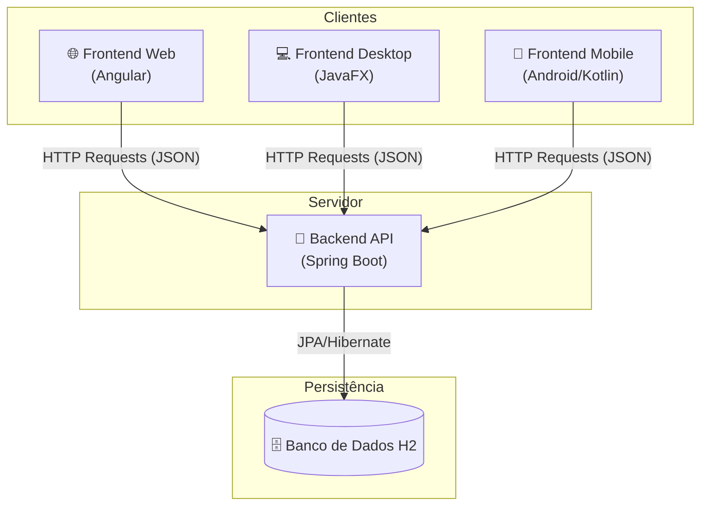
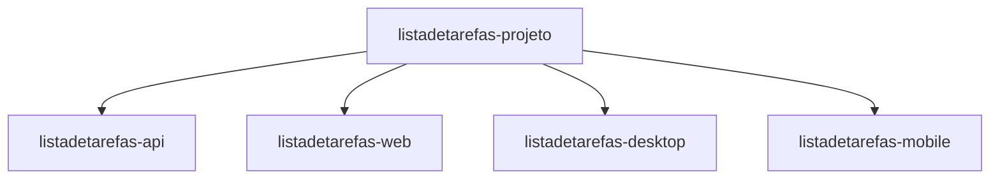
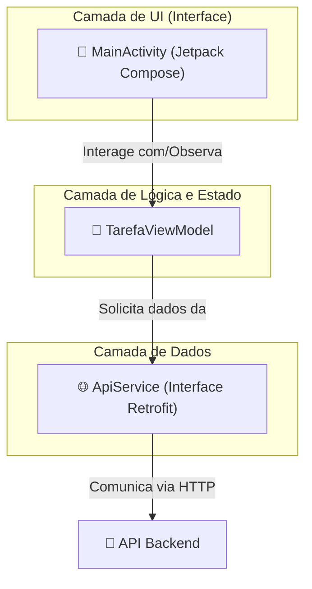

# 🚀 Projeto Lista de Tarefas" (To-Do List)
v4.2

## 🗺️ Visão Geral da Arquitetura

Neste projeto, construiremos um sistema completo de **"Lista de Tarefas" (To-Do List)**, demonstrando como diferentes aplicações cliente podem consumir uma única fonte de dados central (API). A arquitetura final será:

  * **Um Backend (API REST):** O cérebro do sistema, desenvolvido em Java com Spring Boot.
  * **Três Clientes:**
    1.  Uma aplicação **Web** com Angular.
    2.  Uma aplicação **Desktop** nativa com JavaFX.
    3.  Uma aplicação **Mobile** nativa com Android (Kotlin).
  * **Um Painel de Controle:** Um script PowerShell para automação e gerenciamento do ambiente.

**Objetivo do Projeto:** Construir um ecossistema de software completo para uma Lista de Tarefas. Este guia é a versão definitiva do projeto, contendo a arquitetura, estrutura de pastas, descrição de arquivos e o código completo para o backend e todos os frontends, com foco em uma experiência de usuário consistente e com a sincronização de estado corrigida entre as plataformas.

#### **Arquitetura da Aplicação**

O sistema é composto por um Backend (API) que centraliza os dados e a lógica, e três Frontends (Web, Desktop e Android) que consomem esses dados para apresentar a interface ao usuário.



-----

### Parte 0: Configuração Inicial do Projeto

Nesta primeira etapa, vamos criar a estrutura base do **backend** utilizando o **Spring Initializr**. Esse gerador oficial do Spring Boot nos ajuda a configurar dependências essenciais de forma rápida e segura.

#### Estrutura de Pastas do Projeto Completo



Após criar o projeto, sua estrutura de pastas principal será:

```
listadetarefas-projeto/
├── listadetarefas-api/      <-- Backend Spring Boot
├── listadetarefas-web/      <-- Frontend Angular
├── listadetarefas-desktop/  <-- Frontend JavaFX
├── listadetarefas-mobile/  <-- Frontend Mobile Android Kotlin
└── listadetarefas-painel.ps1  <-- Script para executar via terminal
```

**Objetivo:** Criar o serviço central que irá gerenciar os dados das tarefas, servindo como a única fonte de verdade para todos os clientes.

### 🛠️ Ferramentas Necessárias

  * **Java Development Kit (JDK):** Versão LTS 17 ou 21.
  * **Apache Maven:** Ferramenta de automação de build.
  * **IDE (Ambiente de Desenvolvimento):** IntelliJ IDEA ou VS Code.
  * **Cliente REST:** Postman, Insomnia ou uma extensão de navegador para testes.

-----

### **Parte 1: O Backend - A API com Spring Boot (v4.1)**

O cérebro da nossa aplicação, responsável por gerenciar e fornecer os dados das tarefas. Nesta versão, aplicamos uma correção crucial de segurança e robustez utilizando **DTOs (Data Transfer Objects)**.

### Diagnóstico e Solução: Por que usar DTOs?

Na versão anterior, a API aceitava a entidade `Tarefa` completa vinda dos clientes para atualizações. Isso causava um bug de sincronização silencioso, pois os clientes enviavam propriedades que não existiam no banco de dados (como `selecionada`), fazendo com que o JPA/Hibernate falhasse a atualização sem gerar erro.

**A Solução Definitiva (Padrão de Mercado):** A solução é parar de aceitar a entidade completa. Criamos um objeto `TarefaUpdateDTO` que contém *apenas* os campos que o cliente pode alterar (`descricao` e `concluida`). Isso torna a API mais segura, robusta e corrige o bug de sincronização.

#### Passo 1: Configurar o Projeto no Spring Initializr

Acesse o site: 👉 [https://start.spring.io](https://start.spring.io)

  * **Project**: Maven
  * **Language**: Java
  * **Spring Boot**: Versão estável mais recente (ex: `3.x.x`)
  * **Group**: `br.com.curso`
  * **Artifact**: `listadetarefas-api`
  * **Package name**: `br.com.curso.listadetarefas.api`
  * **Packaging**: Jar
  * **Java**: `21` ou `17`
  * **Dependencies**: `Spring Web`, `Spring Data JPA`, `H2 Database`, `Lombok`.

Clique em **GENERATE** e descompacte o arquivo `.zip` para abrir na sua IDE.

#### Passo 2: Modelagem e Camadas de Serviço

Vamos criar as classes que formam a arquitetura da nossa API: `Entity`, `DTO`, `Repository`, `Service` e `Controller`.

#### Estrutura de Pastas (Backend)

```
listadetarefas-api/
└── src/
    └── main/
        ├── java/
        │   └── br/com/curso/listadetarefas/api/
        │       ├── ListadetarefasApiApplication.java
        │       └── tarefa/
        │           ├── Tarefa.java
        │           ├── TarefaUpdateDTO.java  <-- NOVO
        │           ├── TarefaRepository.java
        │           ├── TarefaService.java    <-- MODIFICADO
        │           └── TarefaController.java <-- MODIFICADO
        └── resources/
            └── application.properties
```

#### Descrição dos Arquivos (Backend)

  * `application.properties`: Configurações do Spring Boot, incluindo o acesso ao console do banco de dados H2.
  * `ListadetarefasApiApplication.java`: Ponto de entrada da aplicação Spring Boot.
  * `Tarefa.java`: Entidade JPA que modela uma tarefa no banco de dados.
  * `TarefaUpdateDTO.java`: **(Novo)** Objeto de Transferência de Dados usado para receber atualizações, contendo apenas os campos permitidos.
  * `TarefaRepository.java`: Interface do Spring Data JPA que fornece métodos CRUD (Create, Read, Update, Delete).
  * `TarefaService.java`: **(Modificado)** Camada de serviço com a lógica de negócio, agora utilizando o DTO para atualizações seguras.
  * `TarefaController.java`: **(Modificado)** Camada da API que expõe os endpoints REST, recebendo o DTO no endpoint de atualização.

#### Código Completo (Backend)

**1. `src/main/resources/application.properties`**

```properties
# Habilita o console web do banco de dados H2
spring.h2.console.enabled=true
# Define o caminho para acessar o console (ex: http://localhost:8080/h2-console)
spring.h2.console.path=/h2-console
# Configurações da fonte de dados (DataSource)
spring.datasource.url=jdbc:h2:mem:testdb
spring.datasource.driverClassName=org.h2.Driver
spring.datasource.username=sa
spring.datasource.password=
# Configurações do JPA/Hibernate
spring.jpa.database-platform=org.hibernate.dialect.H2Dialect
spring.jpa.defer-datasource-initialization=true
```

**2. `tarefa/Tarefa.java`** (Entidade - Não muda)

```java
package br.com.curso.listadetarefas.api.tarefa;

import jakarta.persistence.*;
import lombok.Data;

@Data
@Entity
@Table(name = "tb_tarefas")
public class Tarefa {
    @Id
    @GeneratedValue(strategy = GenerationType.IDENTITY)
    private Long id;
    private String descricao;
    private boolean concluida;
}
```

**3. `tarefa/TarefaUpdateDTO.java`** (Novo DTO)

```java
package br.com.curso.listadetarefas.api.tarefa;

import lombok.Data;

@Data
public class TarefaUpdateDTO {
    // Apenas os campos que podem ser atualizados pelo cliente.
    private String descricao;
    private boolean concluida;
}
```

**4. `tarefa/TarefaRepository.java`** (Não muda)

```java
package br.com.curso.listadetarefas.api.tarefa;

import org.springframework.data.jpa.repository.JpaRepository;

public interface TarefaRepository extends JpaRepository<Tarefa, Long> {
}
```

**5. `tarefa/TarefaService.java`** (Modificado para usar DTO)

```java
package br.com.curso.listadetarefas.api.tarefa;

import org.springframework.beans.factory.annotation.Autowired;
import org.springframework.stereotype.Service;
import java.util.List;

@Service
public class TarefaService {
    @Autowired
    private TarefaRepository tarefaRepository;

    public List<Tarefa> listarTodas() { return tarefaRepository.findAll(); }
    public Tarefa criar(Tarefa tarefa) { return tarefaRepository.save(tarefa); }
    public void deletar(Long id) {
        if (!tarefaRepository.existsById(id)) {
            throw new RuntimeException("Tarefa não encontrada com o id: " + id);
        }
        tarefaRepository.deleteById(id);
    }
    
    // --- MODIFICAÇÃO NESTE MÉTODO ---
    public Tarefa atualizar(Long id, TarefaUpdateDTO tarefaDTO) {
        return tarefaRepository.findById(id)
                .map(tarefaExistente -> {
                    // Atualiza a entidade existente APENAS com os dados do DTO
                    tarefaExistente.setDescricao(tarefaDTO.getDescricao());
                    tarefaExistente.setConcluida(tarefaDTO.isConcluida());
                    // Salva a entidade atualizada
                    return tarefaRepository.save(tarefaExistente);
                }).orElseThrow(() -> new RuntimeException("Tarefa não encontrada: " + id));
    }
}
```

**6. `tarefa/TarefaController.java`** (Modificado para usar DTO)

```java
package br.com.curso.listadetarefas.api.tarefa;

import org.springframework.beans.factory.annotation.Autowired;
import org.springframework.http.ResponseEntity;
import org.springframework.web.bind.annotation.*;
import java.util.List;

@RestController
@RequestMapping("/api/tarefas")
@CrossOrigin(origins = "*")
public class TarefaController {
    @Autowired
    private TarefaService tarefaService;

    @GetMapping
    public List<Tarefa> listarTarefas() { return tarefaService.listarTodas(); }

    @PostMapping
    public Tarefa criarTarefa(@RequestBody Tarefa tarefa) { return tarefaService.criar(tarefa); }

    @DeleteMapping("/{id}")
    public ResponseEntity<Void> deletarTarefa(@PathVariable Long id) {
        try {
            tarefaService.deletar(id);
            return ResponseEntity.noContent().build();
        } catch (RuntimeException e) {
            return ResponseEntity.notFound().build();
        }
    }

    // --- MODIFICAÇÃO NESTE ENDPOINT ---
    @PutMapping("/{id}")
    public ResponseEntity<Tarefa> atualizarTarefa(@PathVariable Long id, @RequestBody TarefaUpdateDTO tarefaDTO) {
        try {
            // Agora passamos o DTO para o serviço
            Tarefa atualizada = tarefaService.atualizar(id, tarefaDTO);
            return ResponseEntity.ok(atualizada);
        } catch (RuntimeException e) {
            return ResponseEntity.notFound().build();
        }
    }
}
```

#### Passo 3: Execução e Teste da API

1.  **Execute a Aplicação:** Na sua IDE, execute a classe `ListadetarefasApiApplication.java` ou, via terminal, use `./mvnw spring-boot:run`.
2.  **Teste com Cliente REST:** Use uma ferramenta como Postman para testar os endpoints em `http://localhost:8080/api/tarefas`. Verifique todas as operações de CRUD (GET, POST, PUT, DELETE).
3.  **Acesse o Console H2:** Com a API rodando, acesse `http://localhost:8080/h2-console` no navegador.
      * **JDBC URL:** `jdbc:h2:mem:testdb`
      * **User Name:** `sa`
      * **Password:** (deixe em branco)
      * Execute `SELECT * FROM TB_TAREFAS;` para ver os dados diretamente no banco.

-----

### **Parte 2: O Frontend Web com Angular**

A interface web, com layout de tabela e funcionalidades modernas como atualização e exclusão em massa.

### 🛠️ Ferramentas Necessárias

  * **Node.js LTS 20.x ou 22.x e npm**
  * **Angular CLI:** No terminal, execute: `npm install -g @angular/cli`

### 📂 Passo 1: Criação do Projeto

1.  No terminal, crie o projeto: `ng new listadetarefas-web --standalone --style=css`
2.  Navegue até a pasta: `cd listadetarefas-web`
3.  Gere os arquivos necessários:
    ```bash
    ng generate interface models/tarefa
    ng generate service services/tarefa
    ng generate component components/task-list
    ```

#### Estrutura de Pastas (Web)

```
listadetarefas-web/
└── src/
    └── app/
        ├── components/
        │   └── task-list/
        │       ├── task-list.component.css
        │       ├── task-list.component.html
        │       └── task-list.component.ts
        ├── models/
        │   └── tarefa.ts
        ├── services/
        │   └── tarefa.service.ts
        ├── app.component.ts
        └── app.config.ts
```

#### Descrição dos Arquivos (Web)

  * `app.config.ts`: Arquivo de configuração principal da aplicação, onde o `HttpClient` é injetado.
  * `app.component.ts`: Componente raiz da aplicação que carrega o `TaskListComponent`.
  * `tarefa.ts`: Interface TypeScript que define o tipo de dados de uma tarefa no frontend.
  * `tarefa.service.ts`: Serviço responsável por toda a comunicação com a API backend.
  * `task-list.component.html`: O template HTML da lista de tarefas, com botões de ação (Atualizar, Excluir Selecionadas) e botões de item (Editar, Excluir).
  * `task-list.component.css`: Folha de estilos para o layout do componente.
  * `task-list.component.ts`: Lógica do componente, gerenciando o estado e as interações do usuário.

#### Código Completo (Web)

**1. `services/tarefa.service.ts`**

```typescript
import { Injectable } from '@angular/core';
import { HttpClient } from '@angular/common/http';
import { Observable } from 'rxjs';
import { Tarefa } from '../models/tarefa';

@Injectable({ providedIn: 'root' })
export class TarefaService {
  private apiUrl = 'http://localhost:8080/api/tarefas';

  constructor(private http: HttpClient) { }

  getTarefas(): Observable<Tarefa[]> { return this.http.get<Tarefa[]>(this.apiUrl); }
  addTarefa(tarefa: Tarefa): Observable<Tarefa> { return this.http.post<Tarefa>(this.apiUrl, tarefa); }
  updateTarefa(tarefa: Tarefa): Observable<Tarefa> { return this.http.put<Tarefa>(`${this.apiUrl}/${tarefa.id}`, tarefa); }
  deleteTarefa(id: number): Observable<void> { return this.http.delete<void>(`${this.apiUrl}/${id}`); }
}
```

**2. `models/tarefa.ts`**

```typescript
export interface Tarefa {
  id?: number;
  descricao: string;
  concluida: boolean;
  selecionada?: boolean; // Propriedade apenas do frontend
}
```

**3. `components/task-list/task-list.component.html`**

```html
<div class="container">
  <div class="header">
    <h1>Minha Lista de Tarefas</h1>
    <div class="header-actions">
      <button class="btn-refresh" (click)="carregarTarefas()">🔄 Atualizar</button>
      <button *ngIf="existemTarefasSelecionadas()" class="btn-delete" (click)="deletarTarefasSelecionadas()">
        ❌ Excluir Selecionadas
      </button>
    </div>
  </div>

  <form class="form-add" (ngSubmit)="adicionarTarefa()">
    <input type="text" placeholder="O que precisa ser feito?" [(ngModel)]="novaTarefa.descricao" name="descricao" required>
    <button type="submit" class="btn-create">Adicionar</button>
  </form>

  <div class="task-list-container">
    <div class="task-list-header">
      <div class="col-select">Sel.</div>
      <div class="col-status">Status</div>
      <div class="col-desc">Descrição</div>
      <div class="col-actions">Ações</div>
    </div>
    <div class="task-list-body">
      <div *ngFor="let tarefa of tarefas" class="task-row">
        <div class="col-select">
          <input class="selection-checkbox" type="checkbox" [(ngModel)]="tarefa.selecionada">
        </div>
        <div class="col-status">
          <input class="status-checkbox" type="checkbox" [(ngModel)]="tarefa.concluida" (ngModelChange)="atualizarStatus(tarefa)">
        </div>
        <div class="col-desc">
           <span *ngIf="!tarefaEmEdicao || tarefaEmEdicao.id !== tarefa.id" [ngClass]="{'completed': tarefa.concluida}">{{ tarefa.descricao }}</span>
           <input *ngIf="tarefaEmEdicao && tarefaEmEdicao.id === tarefa.id" type="text" [(ngModel)]="tarefaEmEdicao.descricao" (keyup.enter)="salvarEdicao()" (keyup.escape)="cancelarEdicao()">
        </div>
        <div class="col-actions">
          <div class="actions" *ngIf="!tarefaEmEdicao || tarefaEmEdicao.id !== tarefa.id">
            <button class="btn-update" (click)="iniciarEdicao(tarefa)">✏️</button>
            <button class="btn-delete" (click)="deletarTarefa(tarefa.id)">❌</button>
          </div>
           <div class="actions" *ngIf="tarefaEmEdicao && tarefaEmEdicao.id === tarefa.id">
            <button class="btn-create" (click)="salvarEdicao()">✔️</button>
            <button class="btn-cancel" (click)="cancelarEdicao()">✖️</button>
          </div>
        </div>
      </div>
    </div>
  </div>
</div>
```

**4. `components/task-list/task-list.component.ts`**

```typescript
import { Component, OnInit } from '@angular/core';
import { TarefaService } from '../../services/tarefa.service';
import { Tarefa } from '../../models/tarefa';
import { CommonModule } from '@angular/common';
import { FormsModule } from '@angular/forms';
import { forkJoin } from 'rxjs';

@Component({
  selector: 'app-task-list',
  standalone: true,
  imports: [CommonModule, FormsModule],
  templateUrl: './task-list.component.html',
  styleUrl: './task-list.component.css'
})
export class TaskListComponent implements OnInit {
  tarefas: Tarefa[] = [];
  novaTarefa: Tarefa = { descricao: '', concluida: false };
  tarefaEmEdicao: Tarefa | null = null;

  constructor(private tarefaService: TarefaService) { }

  ngOnInit(): void { this.carregarTarefas(); }

  carregarTarefas(): void {
    this.tarefaService.getTarefas().subscribe(data => {
      this.tarefas = data.map(t => ({ ...t, selecionada: false }));
    });
  }

  adicionarTarefa(): void {
    if (this.novaTarefa.descricao.trim() === '') return;
    this.tarefaService.addTarefa(this.novaTarefa).subscribe(() => {
        this.novaTarefa = { descricao: '', concluida: false };
        this.carregarTarefas();
    });
  }

  iniciarEdicao(tarefa: Tarefa): void {
    this.tarefaEmEdicao = { ...tarefa };
  }

  salvarEdicao(): void {
    if (!this.tarefaEmEdicao) return;
    this.tarefaService.updateTarefa(this.tarefaEmEdicao).subscribe(() => {
      this.tarefaEmEdicao = null;
      this.carregarTarefas();
    });
  }

  cancelarEdicao(): void {
    this.tarefaEmEdicao = null;
  }

  atualizarStatus(tarefa: Tarefa): void {
    this.tarefaService.updateTarefa(tarefa).subscribe();
  }

  deletarTarefa(id: number | undefined): void {
    if (id === undefined) return;
    this.tarefaService.deleteTarefa(id).subscribe(() => this.carregarTarefas());
  }

  existemTarefasSelecionadas(): boolean {
    return this.tarefas.some(t => t.selecionada);
  }

  deletarTarefasSelecionadas(): void {
    const tarefasParaExcluir = this.tarefas.filter(t => t.selecionada && t.id);
    if (tarefasParaExcluir.length === 0) return;

    const chamadasDeExclusao = tarefasParaExcluir.map(tarefa =>
      this.tarefaService.deleteTarefa(tarefa.id!)
    );

    forkJoin(chamadasDeExclusao).subscribe(() => this.carregarTarefas());
  }
}
```

*Obs: Os arquivos `app.config.ts`, `app.component.ts` e `task-list.component.css` permanecem os mesmos do guia original.*

### ✅ Execução e Teste

1.  **Pré-requisito:** A API backend deve estar rodando ✅.
2.  **Execute:** No terminal (na pasta `listadetarefas-web`), rode `ng serve --open`.
3.  **Teste:** Abra as ferramentas de desenvolvedor do navegador (F12) e teste todas as funcionalidades.

-----

### **Parte 3: O Frontend Desktop com JavaFX**

A aplicação nativa para desktop, com layout e funcionalidades consistentes com a versão web.

### 🛠️ Ferramentas Necessárias

  * **Java Development Kit (JDK):** Versão 17 ou superior.
  * **IDE:** IntelliJ IDEA ou VS Code com o "Extension Pack for Java".

#### 📂 Passo 1: Criação e Configuração do Projeto

1.  Crie um novo projeto Maven na sua IDE para `listadetarefas-desktop`.
2.  Substitua o `pom.xml` e crie o `module-info.java` conforme os códigos abaixo.

#### Estrutura de Pastas (Desktop)

```
listadetarefas-desktop/
├── pom.xml
└── src/
    └── main/
        ├── java/
        │   ├── br/com/curso/listadetarefas/desktop/
        │   │   ├── Launcher.java
        │   │   ├── MainApp.java
        │   │   ├── MainViewController.java
        │   │   ├── Tarefa.java
        │   │   └── TarefaApiService.java
        │   └── module-info.java
        └── resources/
            └── br/com/curso/listadetarefas/desktop/
                └── MainView.fxml
```

#### Descrição dos Arquivos (Desktop)

  * `pom.xml`: Arquivo de configuração do Maven, definindo as dependências do JavaFX, Jackson e o plugin para criar o JAR executável.
  * `module-info.java`: Arquivo do Sistema de Módulos do Java, declarando as dependências e expondo os pacotes necessários.
  * `MainView.fxml`: Arquivo XML que define a estrutura visual da interface gráfica.
  * `Launcher.java`: Classe de ponto de entrada usada pelo JAR executável para contornar limitações do JavaFX.
  * `MainApp.java`: Classe principal que inicia a aplicação JavaFX e carrega a view.
  * `Tarefa.java`: Modelo de dados (POJO) que representa uma tarefa no cliente desktop, com propriedades do JavaFX.
  * `TarefaApiService.java`: Serviço que realiza a comunicação com a API backend usando o `HttpClient` do Java.
  * `MainViewController.java`: Controlador que gerencia a lógica da interface, eventos e a comunicação com o `TarefaApiService`.

#### Código Completo (Desktop)

#### Passo 2: Corrija os Arquivos de Configuração Críticos
Com base nos erros mais comuns, o mais provável é que seu pom.xml ou module-info.java estejam incorretos. Substitua o conteúdo dos seus arquivos por estas versões corrigidas e verificadas, que garantem que o build funcione.

1. Arquivo Corrigido: listadetarefas-desktop/pom.xml

Este arquivo é o mais importante. A seção do maven-shade-plugin é crucial, pois ela é responsável por empacotar todas as dependências dentro de um único .jar executável e definir corretamente qual classe deve iniciar o programa (Launcher.java).

**1. `pom.xml`**

```xml
<?xml version="1.0" encoding="UTF-8"?>
<project xmlns="http://maven.apache.org/POM/4.0.0"
         xmlns:xsi="http://www.w3.org/2001/XMLSchema-instance"
         xsi:schemaLocation="http://maven.apache.org/POM/4.0.0 http://maven.apache.org/xsd/maven-4.0.0.xsd">
    <modelVersion>4.0.0</modelVersion>

    <groupId>br.com.curso</groupId>
    <artifactId>listadetarefas-desktop</artifactId>
    <version>1.0-SNAPSHOT</version>

    <properties>
        <project.build.sourceEncoding>UTF-8</project.build.sourceEncoding>
        <maven.compiler.source>17</maven.compiler.source>
        <maven.compiler.target>17</maven.compiler.target>
        <javafx.version>17.0.6</javafx.version>
    </properties>

    <dependencies>
        <!-- Dependências do JavaFX -->
        <dependency>
            <groupId>org.openjfx</groupId>
            <artifactId>javafx-controls</artifactId>
            <version>${javafx.version}</version>
        </dependency>
        <dependency>
            <groupId>org.openjfx</groupId>
            <artifactId>javafx-fxml</artifactId>
            <version>${javafx.version}</version>
        </dependency>

        <!-- Dependência para processar JSON (comunicação com a API) -->
        <dependency>
            <groupId>com.fasterxml.jackson.core</groupId>
            <artifactId>jackson-databind</artifactId>
            <version>2.17.0</version>
        </dependency>
    </dependencies>

    <build>
        <plugins>
            <!-- Plugin de compilação do Maven -->
            <plugin>
                <groupId>org.apache.maven.plugins</groupId>
                <artifactId>maven-compiler-plugin</artifactId>
                <version>3.11.0</version>
                <configuration>
                    <source>17</source>
                    <target>17</target>
                </configuration>
            </plugin>

            <!-- Plugin CRÍTICO para criar o JAR executável ("uber-jar") -->
            <plugin>
                <groupId>org.apache.maven.plugins</groupId>
                <artifactId>maven-shade-plugin</artifactId>
                <version>3.5.1</version>
                <executions>
                    <execution>
                        <phase>package</phase>
                        <goals>
                            <goal>shade</goal>
                        </goals>
                        <configuration>
                            <transformers>
                                <transformer implementation="org.apache.maven.plugins.shade.resource.ManifestResourceTransformer">
                                    <!-- Define a classe que não herda de Application como ponto de entrada -->
                                    <mainClass>br.com.curso.listadetarefas.desktop.Launcher</mainClass>
                                </transformer>
                            </transformers>
                        </configuration>
                    </execution>
                </executions>
            </plugin>
        </plugins>
    </build>
</project>
```
---

2. Arquivo Corrigido: listadetarefas-desktop/src/main/java/module-info.java

Este arquivo precisa declarar explicitamente quais pacotes do seu projeto devem ser "abertos" para que o JavaFX (via FXML) e a biblioteca Jackson (via reflection) possam acessá-los. Sem isso, o build falha.

**2. `module-info.java`**

```java
module br.com.curso.listadetarefas.desktop {
    requires javafx.controls;
    requires javafx.fxml;
    requires com.fasterxml.jackson.databind;
    requires java.net.http;

    opens br.com.curso.listadetarefas.desktop to javafx.fxml, com.fasterxml.jackson.databind;
    exports br.com.curso.listadetarefas.desktop;
}
```

**3. `MainViewController.java`** (Lógica da UI)

```java
package br.com.curso.listadetarefas.desktop;

import javafx.application.Platform;
import javafx.collections.FXCollections;
import javafx.concurrent.Task;
import javafx.fxml.FXML;
import javafx.fxml.Initializable;
import javafx.geometry.Pos;
import javafx.scene.control.*;
import javafx.scene.control.cell.CheckBoxTableCell;
import javafx.scene.control.cell.PropertyValueFactory;
import javafx.scene.layout.HBox;
import java.net.URL;
import java.util.List;
import java.util.ResourceBundle;
import java.util.stream.Collectors;

public class MainViewController implements Initializable {

    @FXML private TableView<Tarefa> tabelaTarefas;
    @FXML private TableColumn<Tarefa, Boolean> colunaSelecao;
    @FXML private TableColumn<Tarefa, Boolean> colunaConcluida;
    @FXML private TableColumn<Tarefa, String> colunaDescricao;
    @FXML private TableColumn<Tarefa, Void> colunaAcoes;
    @FXML private TextField novaTarefaTextField;

    private final TarefaApiService tarefaService = new TarefaApiService();

    @Override
    public void initialize(URL url, ResourceBundle resourceBundle) {
        configurarTabela();
        carregarTarefas();
    }

    private void configurarTabela() {
        colunaSelecao.setCellValueFactory(cellData -> cellData.getValue().selecionadaProperty());
        colunaSelecao.setCellFactory(CheckBoxTableCell.forTableColumn(colunaSelecao));
        colunaSelecao.setEditable(true);

        colunaConcluida.setCellValueFactory(new PropertyValueFactory<>("concluida"));
        colunaConcluida.setCellFactory(CheckBoxTableCell.forTableColumn(colunaConcluida));
        colunaConcluida.setOnEditCommit(event -> {
            Tarefa tarefa = event.getRowValue();
            tarefa.setConcluida(event.getNewValue());
            atualizarTarefa(tarefa);
        });
        
        colunaDescricao.setCellValueFactory(new PropertyValueFactory<>("descricao"));

        colunaAcoes.setCellFactory(param -> new TableCell<>() {
            private final Button btnEditar = new Button("✏️");
            private final Button btnExcluir = new Button("❌");
            private final HBox pane = new HBox(5, btnEditar, btnExcluir);
            {
                pane.setAlignment(Pos.CENTER);
                btnEditar.setStyle("-fx-base: #FFC107;");
                btnExcluir.setStyle("-fx-base: #F44336; -fx-text-fill: white;");
                btnEditar.setOnAction(event -> abrirDialogoEdicao(getTableView().getItems().get(getIndex())));
                btnExcluir.setOnAction(event -> confirmarExclusao(getTableView().getItems().get(getIndex())));
            }
            @Override
            protected void updateItem(Void item, boolean empty) {
                super.updateItem(item, empty);
                setGraphic(empty ? null : pane);
            }
        });

        tabelaTarefas.setEditable(true);
    }

    @FXML
    private void carregarTarefas() {
        Task<List<Tarefa>> task = new Task<>() {
            @Override
            protected List<Tarefa> call() {
                return tarefaService.listarTarefas();
            }
        };
        task.setOnSucceeded(e -> tabelaTarefas.setItems(FXCollections.observableArrayList(task.getValue())));
        task.setOnFailed(e -> exibirAlerta("Erro", "Não foi possível carregar as tarefas."));
        new Thread(task).start();
    }

    @FXML
    private void adicionarTarefa() {
        String descricao = novaTarefaTextField.getText().trim();
        if (descricao.isEmpty()) {
            exibirAlerta("Campo Vazio", "A descrição não pode ser vazia.");
            return;
        }
        Tarefa novaTarefa = new Tarefa();
        novaTarefa.setDescricao(descricao);
        novaTarefa.setConcluida(false);

        Task<Void> task = new Task<>() {
            @Override
            protected Void call() {
                tarefaService.adicionarTarefa(novaTarefa);
                return null;
            }
        };
        task.setOnSucceeded(e -> {
            novaTarefaTextField.clear();
            carregarTarefas();
        });
        task.setOnFailed(e -> exibirAlerta("Erro", "Não foi possível criar a tarefa."));
        new Thread(task).start();
    }

    private void atualizarTarefa(Tarefa tarefa) {
        Task<Void> task = new Task<>() {
            @Override
            protected Void call() {
                tarefaService.atualizarTarefa(tarefa);
                return null;
            }
        };
        task.setOnFailed(e -> {
            exibirAlerta("Erro", "Não foi possível sincronizar a tarefa. Recarregando...");
            carregarTarefas();
        });
        new Thread(task).start();
    }
    
    @FXML
    private void deletarTarefasSelecionadas() {
        List<Tarefa> tarefasParaExcluir = tabelaTarefas.getItems().stream()
                .filter(Tarefa::isSelecionada)
                .collect(Collectors.toList());

        if (tarefasParaExcluir.isEmpty()) {
            exibirAlerta("Nenhuma Seleção", "Nenhuma tarefa foi selecionada.");
            return;
        }

        Alert alert = new Alert(Alert.AlertType.CONFIRMATION);
        alert.setTitle("Confirmar Exclusão em Massa");
        alert.setHeaderText("Excluir " + tarefasParaExcluir.size() + " tarefa(s)");
        alert.setContentText("Você tem certeza?");

        alert.showAndWait().filter(r -> r == ButtonType.OK).ifPresent(r -> {
            Task<Void> task = new Task<>() {
                @Override
                protected Void call() {
                    for (Tarefa tarefa : tarefasParaExcluir) {
                        tarefaService.deletarTarefa(tarefa.getId());
                    }
                    return null;
                }
            };
            task.setOnSucceeded(e -> carregarTarefas());
            task.setOnFailed(e -> exibirAlerta("Erro", "Ocorreu um erro ao excluir as tarefas."));
            new Thread(task).start();
        });
    }

    // Métodos auxiliares de diálogo e exclusão (confirmarExclusao, deletarTarefa, etc.)
    private void abrirDialogoEdicao(Tarefa tarefa) { /* ... */ }
    private void confirmarExclusao(Tarefa tarefa) { /* ... */ }
    private void deletarTarefa(Tarefa tarefa) { /* ... */ }
    private void exibirAlerta(String titulo, String mensagem) { /* ... */ }
}
```

---

### Passo 3: Verifique a Classe de Inicialização (Launcher.java)
O maven-shade-plugin requer uma classe "intermediária" para iniciar a aplicação. Verifique se você tem o arquivo Launcher.java e se ele contém exatamente este código:

Arquivo: listadetarefas-desktop/src/main/java/br/com/curso/listadetarefas/desktop/Launcher.java

```Java

package br.com.curso.listadetarefas.desktop;

/**
 * Esta classe serve como o ponto de entrada principal para o JAR executável.
 * Ela não estende Application, contornando uma limitação do JavaFX ao empacotar.
 */
public class Launcher {
    public static void main(String[] args) {
        MainApp.main(args);
    }
}
```

*Obs: Os demais arquivos (`MainView.fxml`, `Launcher.java`, `MainApp.java`, `Tarefa.java`, `TarefaApiService.java`) permanecem os mesmos do guia original.*

### Passo 4: Limpe e Reconstrua o Projeto
Agora que os arquivos de configuração estão corretos:

Delete a pasta target de dentro do diretório listadetarefas-desktop, se ela existir. Isso garante uma construção limpa.

Volte ao terminal, na pasta listadetarefas-desktop, e execute o comando de build novamente:

```PowerShell
.\mvnw.cmd clean package
```

Desta vez, a saída deve terminar com BUILD SUCCESS.

Após o sucesso, verifique se o arquivo .jar foi criado no caminho: listadetarefas-desktop/target/listadetarefas-desktop-1.0-SNAPSHOT.jar.

### ✅ Construção e Teste

1.  **Pré-requisito:** A API backend deve estar rodando.
2.  **Construa:** No terminal, na raiz do projeto, rode `mvn clean package`.
3.  **Execute:** Rode o JAR gerado: `java -jar target/listadetarefas-desktop-1.0-SNAPSHOT.jar`.
4.  **Teste:** Verifique todas as funcionalidades.

-----

### **Parte 4: O Frontend Mobile com Android (Kotlin) v4.2**

Esta seção detalha a construção da aplicação nativa para Android, agora em sua versão 4.2, que está totalmente alinhada em funcionalidade e design com as plataformas Web e Desktop. A aplicação utiliza as tecnologias mais modernas do ecossistema Android, como Kotlin, Jetpack Compose para a UI, ViewModel para gerenciamento de estado e Retrofit para a comunicação com a API.

#### **Arquitetura da Aplicação Android**

A aplicação segue o padrão de arquitetura recomendado pelo Google, separando as responsabilidades em camadas distintas (UI, ViewModel, e Camada de Dados), o que a torna robusta, escalável e fácil de manter.



#### **Estrutura Final de Pastas e Arquivos**

A organização do projeto segue a convenção padrão para aplicações Android, separando a lógica de dados da interface do usuário.

```
listadetarefas-android/
└── app/
    └── src/main/
        ├── java/br/com/curso/listadetarefas/android/
        │   ├── data/
        │   │   ├── model/
        │   │   │   └── Tarefa.kt
        │   │   └── remote/
        │   │       ├── ApiService.kt
        │   │       └── RetrofitClient.kt
        │   ├── ui/
        │   │   ├── theme/
        │   │   │   ├── Color.kt
        │   │   │   ├── Theme.kt
        │   │   │   └── Type.kt
        │   │   ├── MainActivity.kt
        │   │   └── TarefaViewModel.kt
        └── res/
            └── ... (outros recursos do Android)
```

#### **Descrição dos Arquivos**

  * **`build.gradle.kts`**: Arquivo de configuração do projeto. Define as dependências essenciais como Jetpack Compose (UI), ViewModel (estado), Retrofit (rede) e Coroutines (assincronismo).
  * **`data/model/Tarefa.kt`**: A classe de dados (`data class`) que espelha a estrutura de uma tarefa vinda da API. Inclui o campo `selecionada`, marcado com `@Transient` para ser usado apenas na UI, evitando que seja enviado para o backend.
  * **`data/remote/ApiService.kt`**: Interface da biblioteca Retrofit. Mapeia os endpoints da API (`/api/tarefas`) para métodos Kotlin que podem ser chamados de forma assíncrona.
  * **`data/remote/RetrofitClient.kt`**: Objeto `singleton` que configura e fornece uma instância única do Retrofit para toda a aplicação, definindo a URL base da API (com o endereço `10.0.2.2` para acesso via emulador).
  * **`ui/theme/Color.kt`**: Define a paleta de cores da aplicação, incluindo as cores de ação (verde, azul, amarelo, vermelho, cinza) para garantir consistência visual com os outros frontends.
  * **`ui/theme/Theme.kt` & `Type.kt`**: Arquivos padrão do Jetpack Compose que configuram o tema geral e a tipografia do aplicativo.
  * **`ui/TarefaViewModel.kt`**: O cérebro da UI. Gerencia o estado da tela (lista de tarefas, loading, erros) e contém toda a lógica para carregar, adicionar, atualizar, deletar e gerenciar a seleção de tarefas.
  * **`ui/MainActivity.kt`**: A única tela da aplicação. É responsável por "desenhar" a interface usando Jetpack Compose, observando o estado do `TarefaViewModel` e reagindo a eventos do usuário (cliques em botões, checkboxes, etc.).

-----

### **Código Completo do Projeto Android (v4.2)**

A seguir estão os códigos completos para cada arquivo relevante. Substitua o conteúdo dos seus arquivos por estes para garantir que todas as correções e funcionalidades estejam aplicadas.

**1. `build.gradle.kts` (Arquivo de Dependências)**

```kotlin
plugins {
    id("com.android.application")
    id("org.jetbrains.kotlin.android")
}

android {
    namespace = "br.com.curso.listadetarefas.android"
    compileSdk = 34

    defaultConfig {
        applicationId = "br.com.curso.listadetarefas.android"
        minSdk = 26
        targetSdk = 34
        versionCode = 1
        versionName = "1.0"

        testInstrumentationRunner = "androidx.test.runner.AndroidJUnitRunner"
        vectorDrawables {
            useSupportLibrary = true
        }
    }

    buildTypes {
        release {
            isMinifyEnabled = false
            proguardFiles(
                getDefaultProguardFile("proguard-android-optimize.txt"),
                "proguard-rules.pro"
            )
        }
    }
    compileOptions {
        sourceCompatibility = JavaVersion.VERSION_1_8
        targetCompatibility = JavaVersion.VERSION_1_8
    }
    kotlinOptions {
        jvmTarget = "1.8"
    }
    buildFeatures {
        compose = true
    }
    composeOptions {
        kotlinCompilerExtensionVersion = "1.5.1"
    }
    packaging {
        resources {
            excludes += "/META-INF/{AL2.0,LGPL2.1}"
        }
    }
}

dependencies {
    implementation("androidx.core:core-ktx:1.12.0")
    implementation("androidx.lifecycle:lifecycle-runtime-ktx:2.7.0")
    implementation("androidx.activity:activity-compose:1.8.2")
    implementation(platform("androidx.compose:compose-bom:2024.02.01"))
    implementation("androidx.compose.ui:ui")
    implementation("androidx.compose.ui:ui-graphics")
    implementation("androidx.compose.ui:ui-tooling-preview")
    implementation("androidx.compose.material3:material3")
    implementation("androidx.compose.material:material-icons-extended")
    implementation("androidx.lifecycle:lifecycle-viewmodel-compose:2.7.0")
    implementation("com.squareup.retrofit2:retrofit:2.9.0")
    implementation("com.squareup.retrofit2:converter-gson:2.9.0")
    implementation("com.squareup.okhttp3:logging-interceptor:4.12.0")
    testImplementation("junit:junit:4.13.2")
    androidTestImplementation("androidx.test.ext:junit:1.1.5")
    androidTestImplementation("androidx.test.espresso:espresso-core:3.5.1")
    androidTestImplementation(platform("androidx.compose:compose-bom:2024.02.01"))
    androidTestImplementation("androidx.compose.ui:ui-test-junit4")
    debugImplementation("androidx.compose.ui:ui-tooling")
    debugImplementation("androidx.compose.ui:ui-test-manifest")
}
```

**2. `ui/theme/Color.kt` (Paleta de Cores)**

```kotlin
package br.com.curso.listadetarefas.android.ui.theme

import androidx.compose.ui.graphics.Color

val Purple80 = Color(0xFFD0BCFF)
val PurpleGrey80 = Color(0xFFCCC2DC)
val Pink80 = Color(0xFFEFB8C8)

val Purple40 = Color(0xFF6650a4)
val PurpleGrey40 = Color(0xFF625b71)
val Pink40 = Color(0xFF7D5260)

// Paleta de cores padrão para consistência entre as plataformas.
val ActionGreen = Color(0xFF4CAF50)
val ActionBlue = Color(0xFF2196F3)
val ActionYellow = Color(0xFFFFC107)
val ActionRed = Color(0xFFF44336)
val ActionGray = Color(0xFF9E9E9E)
```

**3. `data/model/Tarefa.kt` (Modelo de Dados)**

```kotlin
package br.com.curso.listadetarefas.android

import kotlin.jvm.Transient

data class Tarefa(
    val id: Long?,
    var descricao: String?,
    var concluida: Boolean,
    // @Transient informa ao Gson para ignorar este campo na serialização para a API.
    // É um estado que existe apenas na interface do usuário (UI).
    @Transient var selecionada: Boolean = false
)
```

**4. `data/remote/ApiService.kt` (Interface da API)**

```kotlin
package br.com.curso.listadetarefas.android

import retrofit2.Response
import retrofit2.http.*

interface ApiService {
    @GET("tarefas")
    suspend fun getTarefas(): List<Tarefa>

    @POST("tarefas")
    suspend fun addTarefa(@Body tarefa: Tarefa): Tarefa

    @PUT("tarefas/{id}")
    suspend fun updateTarefa(@Path("id") id: Long, @Body tarefa: Tarefa): Tarefa

    @DELETE("tarefas/{id}")
    suspend fun deleteTarefa(@Path("id") id: Long): Response<Void>
}
```

**5. `data/remote/RetrofitClient.kt` (Cliente HTTP)**

```kotlin
package br.com.curso.listadetarefas.android

import okhttp3.OkHttpClient
import okhttp3.logging.HttpLoggingInterceptor
import retrofit2.Retrofit
import retrofit2.converter.gson.GsonConverterFactory

object RetrofitClient {
    // Para o emulador Android, use 10.0.2.2 para acessar o localhost da sua máquina.
    // Se estiver testando em um celular físico, substitua pelo IP da sua máquina na rede local.
    private const val BASE_URL = "http://10.0.2.2:8080/api/"

    val instance: ApiService by lazy {
        val logging = HttpLoggingInterceptor().apply { level = HttpLoggingInterceptor.Level.BODY }
        val httpClient = OkHttpClient.Builder().addInterceptor(logging).build()

        val retrofit = Retrofit.Builder()
            .baseUrl(BASE_URL)
            .addConverterFactory(GsonConverterFactory.create())
            .client(httpClient)
            .build()

        retrofit.create(ApiService::class.java)
    }
}
```

**6. `ui/TarefaViewModel.kt` (ViewModel e Lógica de Estado)**

```kotlin
package br.com.curso.listadetarefas.android

import android.util.Log
import androidx.lifecycle.ViewModel
import androidx.lifecycle.viewModelScope
import kotlinx.coroutines.Dispatchers
import kotlinx.coroutines.flow.MutableStateFlow
import kotlinx.coroutines.flow.StateFlow
import kotlinx.coroutines.flow.asStateFlow
import kotlinx.coroutines.flow.update
import kotlinx.coroutines.launch
import kotlinx.coroutines.withContext

data class TarefaUiState(
    val tarefas: List<Tarefa> = emptyList(),
    val isLoading: Boolean = false,
    val error: String? = null
)

class TarefaViewModel : ViewModel() {
    private val _uiState = MutableStateFlow(TarefaUiState())
    val uiState: StateFlow<TarefaUiState> = _uiState.asStateFlow()
    private val TAG = "TarefaViewModel"

    init { carregarTarefas() }

    fun carregarTarefas() {
        _uiState.update { it.copy(isLoading = true) }
        viewModelScope.launch {
            try {
                val tarefasDaApi = withContext(Dispatchers.IO) { RetrofitClient.instance.getTarefas() }
                _uiState.update { it.copy(isLoading = false, tarefas = tarefasDaApi, error = null) }
            } catch (e: Exception) {
                Log.e(TAG, "Falha ao carregar tarefas", e)
                _uiState.update { it.copy(isLoading = false, error = "Falha ao carregar tarefas") }
            }
        }
    }

    fun adicionarTarefa(descricao: String) {
        viewModelScope.launch {
            try {
                val novaTarefa = Tarefa(id = null, descricao = descricao, concluida = false)
                val tarefaAdicionada = withContext(Dispatchers.IO) {
                    RetrofitClient.instance.addTarefa(novaTarefa)
                }
                _uiState.update { it.copy(tarefas = it.tarefas + tarefaAdicionada) }
            } catch (e: Exception) { Log.e(TAG, "Falha ao adicionar tarefa", e) }
        }
    }

    fun updateTarefa(tarefa: Tarefa) {
        viewModelScope.launch {
            try {
                tarefa.id?.let {
                    val tarefaAtualizada = withContext(Dispatchers.IO) { RetrofitClient.instance.updateTarefa(it, tarefa) }
                    _uiState.update { currentState ->
                        val listaAtualizada = currentState.tarefas.map { t ->
                            if (t.id == tarefaAtualizada.id) tarefaAtualizada.copy(selecionada = t.selecionada) else t
                        }
                        currentState.copy(tarefas = listaAtualizada)
                    }
                }
            } catch (e: Exception) { Log.e(TAG, "Falha ao atualizar tarefa", e) }
        }
    }

    fun deleteTarefa(id: Long?) {
        viewModelScope.launch {
            try {
                id?.let {
                    withContext(Dispatchers.IO) { RetrofitClient.instance.deleteTarefa(it) }
                    _uiState.update { currentState -> currentState.copy(tarefas = currentState.tarefas.filter { t -> t.id != id }) }
                }
            } catch (e: Exception) { Log.e(TAG, "Falha ao deletar tarefa", e) }
        }
    }

    fun toggleSelecao(id: Long) {
        _uiState.update { currentState ->
            val tarefasAtualizadas = currentState.tarefas.map {
                if (it.id == id) it.copy(selecionada = !it.selecionada) else it
            }
            currentState.copy(tarefas = tarefasAtualizadas)
        }
    }

    fun deletarTarefasSelecionadas() {
        viewModelScope.launch {
            val tarefasParaDeletar = _uiState.value.tarefas.filter { it.selecionada && it.id != null }
            if (tarefasParaDeletar.isEmpty()) return@launch

            try {
                withContext(Dispatchers.IO) {
                    tarefasParaDeletar.forEach { tarefa ->
                        RetrofitClient.instance.deleteTarefa(tarefa.id!!)
                    }
                }
                _uiState.update { currentState ->
                    val idsParaDeletar = tarefasParaDeletar.map { it.id }.toSet()
                    currentState.copy(tarefas = currentState.tarefas.filter { it.id !in idsParaDeletar })
                }
            } catch (e: Exception) {
                Log.e(TAG, "Falha ao deletar tarefas selecionadas", e)
                _uiState.update { it.copy(error = "Falha ao deletar tarefas") }
            }
        }
    }
}
```

**7. `ui/MainActivity.kt` (Interface do Usuário)**

```kotlin
@file:OptIn(ExperimentalMaterial3Api::class)

package br.com.curso.listadetarefas.android

import android.os.Bundle
import androidx.activity.ComponentActivity
import androidx.activity.compose.setContent
import androidx.compose.foundation.background
import androidx.compose.foundation.layout.*
import androidx.compose.foundation.lazy.LazyColumn
import androidx.compose.foundation.lazy.items
import androidx.compose.material.icons.Icons
import androidx.compose.material.icons.filled.Add
import androidx.compose.material.icons.filled.Delete
import androidx.compose.material.icons.filled.Edit
import androidx.compose.material.icons.filled.Refresh
import androidx.compose.material3.*
import androidx.compose.runtime.*
import androidx.compose.ui.Alignment
import androidx.compose.ui.Modifier
import androidx.compose.ui.graphics.Color
import androidx.compose.ui.text.font.FontWeight
import androidx.compose.ui.text.style.TextAlign
import androidx.compose.ui.text.style.TextDecoration
import androidx.compose.ui.unit.dp
import androidx.lifecycle.viewmodel.compose.viewModel
import br.com.curso.listadetarefas.android.ui.theme.*

class MainActivity : ComponentActivity() {
    override fun onCreate(savedInstanceState: Bundle?) {
        super.onCreate(savedInstanceState)
        setContent {
            listadetarefasAndroidTheme {
                Surface(modifier = Modifier.fillMaxSize(), color = MaterialTheme.colorScheme.background) {
                    TarefaApp()
                }
            }
        }
    }
}

@Composable
fun TarefaApp(tarefaViewModel: TarefaViewModel = viewModel()) {
    val uiState by tarefaViewModel.uiState.collectAsState()
    var tarefaParaEditar by remember { mutableStateOf<Tarefa?>(null) }
    val existemTarefasSelecionadas = uiState.tarefas.any { it.selecionada }

    Scaffold(
        topBar = {
            TopAppBar(
                title = { Text("Minha Lista de Tarefas") },
                colors = TopAppBarDefaults.topAppBarColors(
                    containerColor = ActionBlue,
                    titleContentColor = Color.White
                ),
                actions = {
                    IconButton(onClick = { tarefaViewModel.carregarTarefas() }) {
                        Icon(Icons.Filled.Refresh, contentDescription = "Atualizar", tint = Color.White)
                    }
                    if (existemTarefasSelecionadas) {
                        IconButton(onClick = { tarefaViewModel.deletarTarefasSelecionadas() }) {
                            Icon(Icons.Filled.Delete, contentDescription = "Excluir Selecionadas", tint = Color.White)
                        }
                    }
                }
            )
        }
    ) { paddingValues ->
        Box(
            modifier = Modifier
                .fillMaxSize()
                .padding(paddingValues)
        ) {
            if (uiState.error != null) {
                Text(
                    text = "Erro: ${uiState.error}",
                    modifier = Modifier.align(Alignment.Center),
                    textAlign = TextAlign.Center
                )
            } else {
                TarefaScreen(
                    tarefas = uiState.tarefas,
                    isLoading = uiState.isLoading,
                    onAddTask = tarefaViewModel::adicionarTarefa,
                    onUpdateTask = tarefaViewModel::updateTarefa,
                    onDeleteTask = tarefaViewModel::deleteTarefa,
                    onEditClick = { tarefa -> tarefaParaEditar = tarefa },
                    onToggleSelecao = tarefaViewModel::toggleSelecao
                )
            }

            tarefaParaEditar?.let { tarefa ->
                EditTaskDialog(
                    tarefa = tarefa,
                    onDismiss = { tarefaParaEditar = null },
                    onSave = { novaDescricao ->
                        val tarefaAtualizada = tarefa.copy(descricao = novaDescricao)
                        tarefaViewModel.updateTarefa(tarefaAtualizada)
                        tarefaParaEditar = null
                    }
                )
            }
        }
    }
}

@Composable
fun TarefaScreen(
    tarefas: List<Tarefa>,
    isLoading: Boolean,
    onAddTask: (String) -> Unit,
    onUpdateTask: (Tarefa) -> Unit,
    onDeleteTask: (Long?) -> Unit,
    onEditClick: (Tarefa) -> Unit,
    onToggleSelecao: (Long) -> Unit
) {
    var textoNovaTarefa by remember { mutableStateOf("") }

    Column(modifier = Modifier.fillMaxSize()) {
        Row(
            modifier = Modifier
                .fillMaxWidth()
                .padding(16.dp),
            verticalAlignment = Alignment.CenterVertically
        ) {
            OutlinedTextField(
                value = textoNovaTarefa,
                onValueChange = { textoNovaTarefa = it },
                label = { Text("O que precisa ser feito?") },
                modifier = Modifier.weight(1f)
            )
            Spacer(modifier = Modifier.width(8.dp))
            Button(
                onClick = {
                    if (textoNovaTarefa.isNotBlank()) {
                        onAddTask(textoNovaTarefa)
                        textoNovaTarefa = ""
                    }
                },
                colors = ButtonDefaults.buttonColors(containerColor = ActionGreen)
            ) {
                Icon(Icons.Default.Add, contentDescription = "Adicionar Tarefa")
                Spacer(Modifier.size(ButtonDefaults.IconSpacing))
                Text("Adicionar")
            }
        }

        if (isLoading && tarefas.isEmpty()) {
            Box(modifier = Modifier.fillMaxSize(), contentAlignment = Alignment.Center) {
                CircularProgressIndicator()
            }
        } else if (tarefas.isEmpty()) {
            Text(
                text = "Nenhuma tarefa encontrada.
Adicione uma nova tarefa!",
                modifier = Modifier
                    .fillMaxWidth()
                    .padding(top = 32.dp),
                textAlign = TextAlign.Center
            )
        } else {
            TaskListHeader()
            Divider()
            LazyColumn(modifier = Modifier.fillMaxSize()) {
                items(tarefas, key = { it.id!! }) { tarefa ->
                    TarefaItem(
                        tarefa = tarefa,
                        onStatusChange = { isChecked -> onUpdateTask(tarefa.copy(concluida = isChecked)) },
                        onDeleteClick = { onDeleteTask(tarefa.id) },
                        onEditClick = { onEditClick(tarefa) },
                        onToggleSelecao = { onToggleSelecao(tarefa.id!!) }
                    )
                    Divider()
                }
            }
        }
    }
}

@Composable
fun TaskListHeader() {
    Row(
        modifier = Modifier
            .fillMaxWidth()
            .background(MaterialTheme.colorScheme.surfaceVariant)
            .padding(horizontal = 4.dp, vertical = 8.dp),
        verticalAlignment = Alignment.CenterVertically
    ) {
        Text("Sel.", modifier = Modifier.width(48.dp), textAlign = TextAlign.Center, fontWeight = FontWeight.Bold)
        Text("Status", modifier = Modifier.width(64.dp), textAlign = TextAlign.Center, fontWeight = FontWeight.Bold)
        Text(
            text = "Descrição",
            modifier = Modifier
                .weight(1f)
                .padding(start = 8.dp),
            fontWeight = FontWeight.Bold,
            textAlign = TextAlign.Start
        )
        Text("Ações", modifier = Modifier.width(100.dp), textAlign = TextAlign.Center, fontWeight = FontWeight.Bold)
    }
}

@Composable
fun TarefaItem(
    tarefa: Tarefa,
    onStatusChange: (Boolean) -> Unit,
    onDeleteClick: () -> Unit,
    onEditClick: () -> Unit,
    onToggleSelecao: () -> Unit
) {
    Row(
        modifier = Modifier
            .fillMaxWidth()
            .padding(horizontal = 4.dp, vertical = 4.dp),
        verticalAlignment = Alignment.CenterVertically
    ) {
        Box(modifier = Modifier.width(48.dp), contentAlignment = Alignment.Center) {
            Checkbox(checked = tarefa.selecionada, onCheckedChange = { onToggleSelecao() })
        }
        Box(modifier = Modifier.width(64.dp), contentAlignment = Alignment.Center) {
            Checkbox(checked = tarefa.concluida, onCheckedChange = onStatusChange)
        }
        Text(
            text = tarefa.descricao ?: "",
            modifier = Modifier
                .weight(1f)
                .padding(horizontal = 8.dp),
            style = if (tarefa.concluida)
                MaterialTheme.typography.bodyLarge.copy(
                    textDecoration = TextDecoration.LineThrough,
                    color = Color.Gray
                )
            else MaterialTheme.typography.bodyLarge
        )
        Row(
            modifier = Modifier.width(100.dp),
            horizontalArrangement = Arrangement.Center
        ) {
            IconButton(onClick = onEditClick) {
                Icon(Icons.Filled.Edit, contentDescription = "Editar Tarefa", tint = ActionYellow)
            }
            IconButton(onClick = onDeleteClick) {
                Icon(Icons.Filled.Delete, contentDescription = "Deletar Tarefa", tint = ActionRed)
            }
        }
    }
}

@Composable
fun EditTaskDialog(tarefa: Tarefa, onDismiss: () -> Unit, onSave: (String) -> Unit) {
    var textoEditado by remember { mutableStateOf(tarefa.descricao ?: "") }
    AlertDialog(
        onDismissRequest = onDismiss,
        title = { Text("Editar Tarefa") },
        text = {
            OutlinedTextField(
                value = textoEditado,
                onValueChange = { textoEditado = it },
                label = { Text("Nova descrição") },
                modifier = Modifier.fillMaxWidth()
            )
        },
        confirmButton = {
            Button(
                onClick = { if (textoEditado.isNotBlank()) { onSave(textoEditado) } },
                colors = ButtonDefaults.buttonColors(containerColor = ActionGreen)
            ) {
                Text("Salvar")
            }
        },
        dismissButton = {
            TextButton(
                onClick = onDismiss,
                colors = ButtonDefaults.textButtonColors(contentColor = ActionGray)
            ) {
                Text("Cancelar")
            }
        }
    )
}
```

---


### ✅ Construção e Teste

1.  **Pré-requisito:** A API backend deve estar rodando.
2.  **Configurar IP:** No código Android (ex: `RetrofitClient.kt`), use `http://10.0.2.2:8080/api/` como URL base para que o emulador possa acessar o `localhost` da sua máquina.
3.  **Execute:** Rode a aplicação no Android Studio em um emulador ou dispositivo.
4.  **Teste:** Verifique todas as funcionalidades.

---

### 🚀 [ricardotecpro.github.io](https://ricardotecpro.github.io/)

