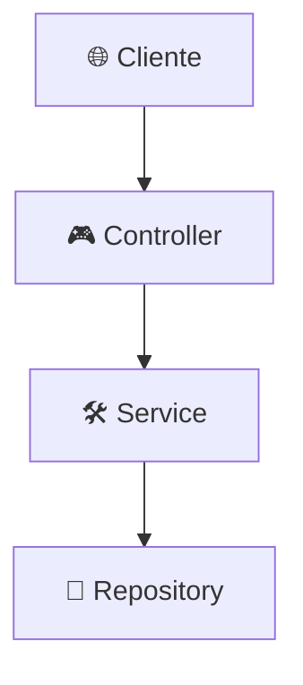

Nesta fase crucial, vamos construir o "cérebro" da nossa aplicação. Deixaremos de apenas armazenar dados para começar a aplicar regras de negócio e a organizar nosso código de forma profissional, seguindo os princípios que definem um software de alta qualidade.

# 💎 Guia Didático Definitivo: Gestão de Estoques com Spring Boot

-----

## Módulo 2: 🧠 Lógica de Negócio e Arquitetura de Serviços

**Objetivo:** Isolar as regras de negócio do resto do código, aplicando princípios de design de software (SOLID). Ao final deste módulo, o aluno terá implementado toda a lógica central da aplicação em uma camada de serviço desacoplada e organizada.

-----

### \#\#\# Aula 2.1: A Importância da Camada de Serviço

Até agora, temos a camada de dados (`Repository`). Poderíamos ser tentados a usar os repositórios diretamente nos `Controllers` (que criaremos no próximo módulo). Por que não devemos fazer isso?

**Conceito-Chave: Princípio da Responsabilidade Única (SRP - Single Responsibility Principle)**
Este princípio do SOLID afirma que uma classe deve ter **um, e apenas um, motivo para mudar**.

  - A responsabilidade de um **Controller** é gerenciar requisições e respostas HTTP (o "o quê" e "de onde" da web).
  - A responsabilidade de um **Repository** é gerenciar a persistência com o banco de dados (ler e escrever dados).
  - A responsabilidade de um **Service** é orquestrar as operações e aplicar a lógica de negócio (o "como" e "porquê" das regras da aplicação).

Misturar essas responsabilidades cria um código frágil, difícil de testar e de dar manutenção. A **Camada de Serviço** é a solução para essa separação.

#### Arquitetura em Camadas



Neste módulo, nosso foco é construir a camada `🛠️ Service`.

-----

### \#\#\# Aula 2.2: Desacoplando as Camadas com DTOs (Data Transfer Objects) e Mappers

**Conceito-Chave:** Expor diretamente nossas entidades do banco de dados (`model`) para o mundo exterior é uma má prática. Isso acopla fortemente a interface do usuário à estrutura do banco e pode expor dados sensíveis. A solução é o padrão **DTO (Data Transfer Object)**.

  - **DTOs:** São classes simples, como "contratos", que definem exatamente quais dados entram e saem da nossa API.
  - **Mappers:** São classes utilitárias responsáveis por converter nossas Entidades em DTOs e vice-versa.

**Ação:** Crie os pacotes `dto` e `mapper` dentro de `br.com.aula.gestaodeestoques`. Em seguida, crie os arquivos abaixo. Faremos isso para todas as nossas entidades para manter a consistência.

#### Código: `dto/CategoriaDTO.java`

```java
package br.com.aula.gestaodeestoques.dto;
import jakarta.validation.constraints.NotBlank;
import jakarta.validation.constraints.Size;
public record CategoriaDTO(
    Integer id,
    @NotBlank(message = "Nome da categoria é obrigatório")
    @Size(min = 3, message = "Nome deve ter no mínimo 3 caracteres")
    String nome
) {}
```

#### Código: `dto/FornecedorDTO.java`

```java
package br.com.aula.gestaodeestoques.dto;
import jakarta.validation.constraints.NotBlank;
import jakarta.validation.constraints.Pattern;
public record FornecedorDTO(
    Integer id,
    @NotBlank(message = "Nome do fornecedor é obrigatório")
    String nome,
    @NotBlank(message = "CNPJ é obrigatório")
    @Pattern(regexp = "\\d{2}\\.\\d{3}\\.\\d{3}/\\d{4}-\\d{2}", message = "CNPJ inválido")
    String cnpj
) {}
```

#### Código: `dto/ProdutoDTO.java`

```java
package br.com.aula.gestaodeestoques.dto;
import java.math.BigDecimal;
// DTO para exibir dados de produto, enriquecido com nomes.
public record ProdutoDTO(
    Integer id,
    String nome,
    int quantidade,
    BigDecimal preco,
    String nomeCategoria,
    String nomeFornecedor
) {}
```

#### Código: `dto/ProdutoFormDTO.java`

```java
package br.com.aula.gestaodeestoques.dto;
import jakarta.validation.constraints.*;
import java.math.BigDecimal;
// DTO para receber dados de formulários de produto (criação/atualização).
public record ProdutoFormDTO(
    Integer id,
    @NotBlank(message = "O nome do produto não pode ser vazio.")
    @Size(min = 3, max = 100, message = "O nome deve ter entre 3 e 100 caracteres.")
    String nome,
    @NotNull(message = "A quantidade é obrigatória.")
    @PositiveOrZero(message = "A quantidade não pode ser negativa.")
    Integer quantidade,
    @NotNull(message = "O preço é obrigatório.")
    @DecimalMin(value = "0.01", message = "O preço deve ser maior que zero.")
    BigDecimal preco,
    @NotNull(message = "A categoria é obrigatória.")
    Integer categoria_id,
    @NotNull(message = "O fornecedor é obrigatório.")
    Integer fornecedor_id
) {}
```

#### Código: `mapper/CategoriaMapper.java`

```java
package br.com.aula.gestaodeestoques.mapper;
import br.com.aula.gestaodeestoques.dto.CategoriaDTO;
import br.com.aula.gestaodeestoques.model.Categoria;
import org.springframework.stereotype.Component;
@Component
public class CategoriaMapper {
    public CategoriaDTO toDTO(Categoria categoria) {
        return new CategoriaDTO(categoria.id(), categoria.nome());
    }
    public Categoria toEntity(CategoriaDTO categoriaDTO) {
        return new Categoria(categoriaDTO.id(), categoriaDTO.nome());
    }
}
```

*(Implemente `FornecedorMapper.java` e `ProdutoMapper.java` seguindo o mesmo padrão)*

-----

### \#\#\# Aula 2.3: Programando para Interfaces

**Conceito-Chave: Princípio da Inversão de Dependência (DIP - Dependency Inversion Principle)**
Este princípio do SOLID nos orienta a depender de **abstrações (interfaces)**, e não de **implementações (classes concretas)**. Isso torna nosso código flexível e muito mais fácil de testar.

**Ação:** Crie o pacote `br.com.aula.gestaodeestoques.service` e defina as interfaces que serão o "contrato" da nossa lógica de negócio.

#### Código: `service/CategoriaService.java`

```java
package br.com.aula.gestaodeestoques.service;
import br.com.aula.gestaodeestoques.dto.CategoriaDTO;
import java.util.List;
public interface CategoriaService {
    CategoriaDTO create(CategoriaDTO categoriaDTO);
    List<CategoriaDTO> findAll();
    CategoriaDTO findById(Integer id);
    CategoriaDTO update(Integer id, CategoriaDTO categoriaDTO);
    void delete(Integer id);
}
```

#### Código: `service/FornecedorService.java`

```java
package br.com.aula.gestaodeestoques.service;
import br.com.aula.gestaodeestoques.dto.FornecedorDTO;
import java.util.List;
public interface FornecedorService {
    FornecedorDTO create(FornecedorDTO fornecedorDTO);
    List<FornecedorDTO> findAll();
    // ... outros métodos ...
}
```

#### Código: `service/ProdutoService.java`

```java
package br.com.aula.gestaodeestoques.service;
import br.com.aula.gestaodeestoques.dto.ProdutoDTO;
import br.com.aula.gestaodeestoques.dto.ProdutoFormDTO;
import java.util.List;
public interface ProdutoService {
    ProdutoDTO create(ProdutoFormDTO produtoFormDTO);
    List<ProdutoDTO> findAll();
    ProdutoDTO findById(Integer id);
    ProdutoDTO update(Integer id, ProdutoFormDTO produtoFormDTO);
    void delete(Integer id);
}
```

-----

### \#\#\# Aula 2.4: Implementando a Lógica de Negócio

Agora que temos os contratos (interfaces), vamos criar as implementações concretas que contêm a lógica real.

**Ação:** Crie o subpacote `service.impl` e adicione as classes que implementam as interfaces de serviço.

#### Código: `service/impl/CategoriaServiceImpl.java`

```java
package br.com.aula.gestaodeestoques.service.impl;
import br.com.aula.gestaodeestoques.dto.CategoriaDTO;
import br.com.aula.gestaodeestoques.exception.ResourceNotFoundException;
import br.com.aula.gestaodeestoques.mapper.CategoriaMapper;
import br.com.aula.gestaodeestoques.model.Categoria;
import br.com.aula.gestaodeestoques.repository.CategoriaRepository;
import br.com.aula.gestaodeestoques.service.CategoriaService;
import org.springframework.beans.factory.annotation.Autowired;
import org.springframework.stereotype.Service;
import java.util.List;
import java.util.stream.Collectors;
import java.util.stream.StreamSupport;

@Service
public class CategoriaServiceImpl implements CategoriaService {

    @Autowired
    private CategoriaRepository repository;

    @Autowired
    private CategoriaMapper mapper;

    @Override
    public CategoriaDTO create(CategoriaDTO categoriaDTO) {
        Categoria categoria = mapper.toEntity(categoriaDTO);
        Categoria savedCategoria = repository.save(categoria);
        return mapper.toDTO(savedCategoria);
    }

    @Override
    public List<CategoriaDTO> findAll() {
        return StreamSupport.stream(repository.findAll().spliterator(), false)
                .map(mapper::toDTO)
                .collect(Collectors.toList());
    }

    @Override
    public CategoriaDTO findById(Integer id) {
        return repository.findById(id)
                .map(mapper::toDTO)
                .orElseThrow(() -> new ResourceNotFoundException("Categoria não encontrada com o ID: " + id));
    }
    // ... Implementação dos métodos update e delete ...
}
```

#### Código: `service/impl/ProdutoServiceImpl.java`

```java
package br.com.aula.gestaodeestoques.service.impl;

import br.com.aula.gestaodeestoques.dto.ProdutoDTO;
import br.com.aula.gestaodeestoques.dto.ProdutoFormDTO;
import br.com.aula.gestaodeestoques.exception.ResourceNotFoundException;
import br.com.aula.gestaodeestoques.mapper.ProdutoMapper;
import br.com.aula.gestaodeestoques.model.Categoria;
import br.com.aula.gestaodeestoques.model.Fornecedor;
import br.com.aula.gestaodeestoques.model.Produto;
import br.com.aula.gestaodeestoques.repository.CategoriaRepository;
import br.com.aula.gestaodeestoques.repository.FornecedorRepository;
import br.com.aula.gestaodeestoques.repository.ProdutoRepository;
import br.com.aula.gestaodeestoques.service.ProdutoService;
import org.springframework.stereotype.Service;
import org.springframework.transaction.annotation.Transactional;

import java.util.List;
import java.util.stream.Collectors;
import java.util.stream.StreamSupport;

@Service
public class ProdutoServiceImpl implements ProdutoService {

    private final ProdutoRepository produtoRepository;
    private final CategoriaRepository categoriaRepository;
    private final FornecedorRepository fornecedorRepository;
    private final ProdutoMapper produtoMapper;

    public ProdutoServiceImpl(ProdutoRepository produtoRepository, CategoriaRepository categoriaRepository, FornecedorRepository fornecedorRepository, ProdutoMapper produtoMapper) {
        this.produtoRepository = produtoRepository;
        this.categoriaRepository = categoriaRepository;
        this.fornecedorRepository = fornecedorRepository;
        this.produtoMapper = produtoMapper;
    }

    @Override
    @Transactional
    public ProdutoDTO create(ProdutoFormDTO produtoFormDTO) {
        // Valida se as entidades relacionadas existem
        findCategoriaOrThrow(produtoFormDTO.categoria_id());
        findFornecedorOrThrow(produtoFormDTO.fornecedor_id());

        Produto produto = produtoMapper.toEntity(produtoFormDTO);
        Produto savedProduto = produtoRepository.save(produto);
        return mapToProdutoDTO(savedProduto);
    }
    
    @Override
    @Transactional(readOnly = true)
    public List<ProdutoDTO> findAll() {
        return StreamSupport.stream(produtoRepository.findAll().spliterator(), false)
                .map(this::mapToProdutoDTO)
                .collect(Collectors.toList());
    }

    @Override
    @Transactional(readOnly = true)
    public ProdutoDTO findById(Integer id) {
        Produto produto = findProdutoOrThrow(id);
        return mapToProdutoDTO(produto);
    }

    @Override
    @Transactional
    public void delete(Integer id) {
        if (!produtoRepository.existsById(id)) {
            throw new ResourceNotFoundException("Produto não encontrado com o ID: " + id);
        }
        produtoRepository.deleteById(id);
    }

    // Métodos auxiliares privados para evitar duplicação
    private ProdutoDTO mapToProdutoDTO(Produto produto) {
        Categoria categoria = findCategoriaOrThrow(produto.categoria_id());
        Fornecedor fornecedor = findFornecedorOrThrow(produto.fornecedor_id());
        return produtoMapper.toDTO(produto, categoria, fornecedor);
    }

    private Produto findProdutoOrThrow(Integer id) {
        return produtoRepository.findById(id)
                .orElseThrow(() -> new ResourceNotFoundException("Produto não encontrado com o ID: " + id));
    }
    private Categoria findCategoriaOrThrow(Integer id) {
        return categoriaRepository.findById(id)
                .orElseThrow(() -> new ResourceNotFoundException("Categoria não encontrada com o ID: " + id));
    }
    private Fornecedor findFornecedorOrThrow(Integer id) {
        return fornecedorRepository.findById(id)
                .orElseThrow(() -> new ResourceNotFoundException("Fornecedor não encontrado com o ID: " + id));
    }
    // ... Implementação do método update ...
}
```

-----

### Conclusão do Módulo 2 e Próximos Passos

**Parabéns\!** O cérebro da nossa aplicação está construído. Neste ponto, temos:

  - Uma **camada de serviço** limpa e organizada.
  - Uma clara separação entre os dados da web (DTOs) e os dados do banco (Entidades).
  - Toda a lógica de negócio implementada e pronta para ser usada.

A aplicação ainda não tem uma "cara" ou uma "porta de entrada", mas sua inteligência central está completa.

No **próximo módulo**, vamos finalmente expor essa lógica para o mundo exterior, construindo os **endpoints da nossa API REST** na camada de Controller.

