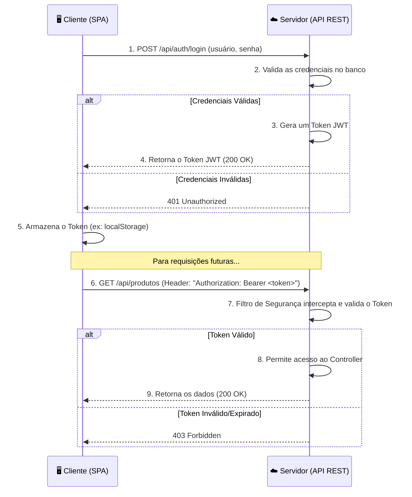

Este guia fornecerá toda a teoria e os códigos completos para que os alunos implementem um sistema de segurança robusto do zero.

# 💎 Guia Didático Definitivo: Gestão de Estoques com Spring Boot

-----

## Módulo 4: 🔒 Segurança de APIs com Spring Security e JWT

**Objetivo:** Proteger nossa API REST, garantindo que apenas usuários autenticados e autorizados possam acessar os recursos. Ao final deste módulo, o aluno terá implementado um fluxo de segurança stateless completo, utilizando o padrão JWT.

-----

### \#\#\# Aula 4.1: Teoria: Autenticação Stateless vs. Stateful e o Fluxo JWT

**Conceito-Chave: Stateful (Baseado em Sessão)**
É o modelo tradicional. Quando você faz login em um site, o servidor cria uma "sessão" para você, guarda essa informação em sua memória e te devolve um identificador (um `Session ID`, geralmente em um cookie). A cada nova requisição, você envia esse ID, e o servidor o usa para "lembrar" quem você é.

  - **Analogia:** O servidor é um clube, e ele te dá uma pulseirinha (Session ID) para entrar e sair. O clube precisa manter uma lista de todas as pulseirinhas válidas.
  - **Desvantagem:** Difícil de escalar. Se tivermos múltiplos servidores, eles precisam compartilhar o estado da sessão, o que é complexo.

**Conceito-Chave: Stateless (Baseado em Token)**
É o modelo moderno, ideal para APIs. Quando você faz login, o servidor não guarda nada. Em vez disso, ele te entrega um "passaporte" criptografado e autossuficiente: o **JWT**. Este token contém todas as informações necessárias para provar quem você é. A cada nova requisição, você apresenta esse passaporte.

  - **Analogia:** O servidor é um segurança de show. Ele não te conhece, mas ele sabe como verificar se o seu ingresso (JWT) é autêntico e não expirou. Qualquer segurança (qualquer servidor) pode validar o mesmo ingresso.
  - **Vantagem:** Altamente escalável e desacoplado.

**O que é um JWT (JSON Web Token)?**
É um padrão (RFC 7519) que define um formato compacto e seguro para transmitir informações entre partes como um objeto JSON. Ele consiste em três partes separadas por pontos (`.`):

1.  **Header:** Metadados sobre o token (ex: tipo de token e algoritmo de assinatura).
2.  **Payload:** As "claims" (informações), como o nome do usuário, seus papéis (roles) e a data de expiração.
3.  **Signature:** Uma assinatura digital que garante que o token não foi adulterado. É criada usando o Header, o Payload e uma chave secreta que só o servidor conhece.

#### Diagrama de Fluxo JWT



-----

### \#\#\# Aula 4.2: Implementando o `JwtTokenProvider` (O Gerador de Tokens)

**Conceito-Chave:** Esta classe será nosso canivete suíço para todas as operações relacionadas ao JWT. Ela será responsável por gerar, validar e extrair informações dos tokens.

**Ação:** Crie o subpacote `config.security` e adicione a classe `JwtTokenProvider`.

**Ação 2:** Adicione as configurações do JWT ao `application.properties`.

#### Código: `src/main/resources/application.properties` (Adições)

```properties
# Configurações do JWT
# IMPORTANTE: Em produção, use uma chave MUITO mais complexa e guarde-a de forma segura (ex: variáveis de ambiente).
jwt.secret=7d4a1b0b3e6c9d8a3f4b2e1c0a9f8b7c6d5e4a3b2c1d0f9e8a7b6c5d4e3f2a1b
jwt.expiration-in-ms=3600000 # 1 hora = 3.600.000 ms
```

#### Código: `config/security/JwtTokenProvider.java`

```java
package br.com.aula.gestaodeestoques.config.security;

import io.jsonwebtoken.Claims;
import io.jsonwebtoken.Jwts;
import io.jsonwebtoken.SignatureAlgorithm;
import io.jsonwebtoken.io.Decoders;
import io.jsonwebtoken.security.Keys;
import org.springframework.beans.factory.annotation.Value;
import org.springframework.security.core.userdetails.UserDetails;
import org.springframework.stereotype.Service;

import java.security.Key;
import java.util.Date;
import java.util.HashMap;
import java.util.Map;
import java.util.function.Function;

@Service
public class JwtTokenProvider {

    @Value("${jwt.secret}")
    private String secretKey;

    @Value("${jwt.expiration-in-ms}")
    private long jwtExpiration;

    // Extrai o nome de usuário (subject) do token
    public String extractUsername(String token) {
        return extractClaim(token, Claims::getSubject);
    }

    // Extrai um "claim" (informação) específico do token
    public <T> T extractClaim(String token, Function<Claims, T> claimsResolver) {
        final Claims claims = extractAllClaims(token);
        return claimsResolver.apply(claims);
    }

    // Gera um novo token JWT para o usuário
    public String generateToken(UserDetails userDetails) {
        return generateToken(new HashMap<>(), userDetails);
    }

    // Gera um token com "claims" extras
    public String generateToken(Map<String, Object> extraClaims, UserDetails userDetails) {
        return Jwts
                .builder()
                .setClaims(extraClaims)
                .setSubject(userDetails.getUsername())
                .setIssuedAt(new Date(System.currentTimeMillis()))
                .setExpiration(new Date(System.currentTimeMillis() + jwtExpiration))
                .signWith(getSignInKey(), SignatureAlgorithm.HS256)
                .compact();
    }

    // Valida se o token é válido para o usuário e se não está expirado
    public boolean isTokenValid(String token, UserDetails userDetails) {
        final String username = extractUsername(token);
        return (username.equals(userDetails.getUsername())) && !isTokenExpired(token);
    }

    // Verifica se o token expirou
    private boolean isTokenExpired(String token) {
        return extractExpiration(token).before(new Date());
    }

    // Extrai a data de expiração do token
    private Date extractExpiration(String token) {
        return extractClaim(token, Claims::getExpiration);
    }

    // Decodifica e extrai todas as informações do corpo (payload) do token
    private Claims extractAllClaims(String token) {
        return Jwts
                .parserBuilder()
                .setSigningKey(getSignInKey())
                .build()
                .parseClaimsJws(token)
                .getBody();
    }

    // Obtém a chave de assinatura a partir da nossa chave secreta
    private Key getSignInKey() {
        byte[] keyBytes = Decoders.BASE64.decode(secretKey);
        return Keys.hmacShaKeyFor(keyBytes);
    }
}
```

-----

### \#\#\# Aula 4.3: O Filtro de Autenticação (`JwtAuthenticationFilter`)

**Conceito-Chave:** Este filtro é o nosso "segurança na porta". Ele intercepta **toda** requisição que chega à API, verifica se ela tem um passaporte (JWT) válido e, em caso afirmativo, libera o acesso.

**Ação:** Crie a classe `JwtAuthenticationFilter` no pacote `config.security`.

#### Código: `config/security/JwtAuthenticationFilter.java`

```java
package br.com.aula.gestaodeestoques.config.security;

import jakarta.servlet.FilterChain;
import jakarta.servlet.ServletException;
import jakarta.servlet.http.HttpServletRequest;
import jakarta.servlet.http.HttpServletResponse;
import org.springframework.beans.factory.annotation.Autowired;
import org.springframework.lang.NonNull;
import org.springframework.security.authentication.UsernamePasswordAuthenticationToken;
import org.springframework.security.core.context.SecurityContextHolder;
import org.springframework.security.core.userdetails.UserDetails;
import org.springframework.security.core.userdetails.UserDetailsService;
import org.springframework.security.web.authentication.WebAuthenticationDetailsSource;
import org.springframework.stereotype.Component;
import org.springframework.web.filter.OncePerRequestFilter;

import java.io.IOException;

@Component
public class JwtAuthenticationFilter extends OncePerRequestFilter {

    @Autowired
    private JwtTokenProvider jwtTokenProvider;

    @Autowired
    private UserDetailsService userDetailsService;

    @Override
    protected void doFilterInternal(
            @NonNull HttpServletRequest request,
            @NonNull HttpServletResponse response,
            @NonNull FilterChain filterChain
    ) throws ServletException, IOException {

        final String authHeader = request.getHeader("Authorization");
        final String jwt;
        final String username;

        // 1. Verifica se o header de autorização existe e se começa com "Bearer "
        if (authHeader == null || !authHeader.startsWith("Bearer ")) {
            filterChain.doFilter(request, response); // Se não, passa para o próximo filtro
            return;
        }

        // 2. Extrai o token do header
        jwt = authHeader.substring(7);
        username = jwtTokenProvider.extractUsername(jwt);

        // 3. Se o token tem um usuário e o usuário ainda não está autenticado no contexto de segurança atual
        if (username != null && SecurityContextHolder.getContext().getAuthentication() == null) {
            UserDetails userDetails = this.userDetailsService.loadUserByUsername(username);

            // 4. Valida o token
            if (jwtTokenProvider.isTokenValid(jwt, userDetails)) {
                // Se o token for válido, cria um objeto de autenticação...
                UsernamePasswordAuthenticationToken authToken = new UsernamePasswordAuthenticationToken(
                        userDetails,
                        null,
                        userDetails.getAuthorities()
                );
                authToken.setDetails(new WebAuthenticationDetailsSource().buildDetails(request));
                // ...e o define no contexto de segurança. O usuário agora está autenticado para esta requisição.
                SecurityContextHolder.getContext().setAuthentication(authToken);
            }
        }
        // 5. Passa a requisição para o próximo filtro na cadeia
        filterChain.doFilter(request, response);
    }
}
```

-----

### \#\#\# Aula 4.4: Refatorando o `SecurityConfig` para uma API Stateless

**Ação:** Agora vamos reconfigurar o coração do Spring Security. Vamos remover a configuração de `formLogin`, desabilitar sessões e "encaixar" nosso `JwtAuthenticationFilter` no lugar certo.

#### Código: `config/SecurityConfig.java` (Arquivo Reescrito)

```java
package br.com.aula.gestaodeestoques.config;

import br.com.aula.gestaodeestoques.config.security.JwtAuthenticationFilter;
import org.springframework.beans.factory.annotation.Autowired;
import org.springframework.context.annotation.Bean;
import org.springframework.context.annotation.Configuration;
import org.springframework.security.authentication.AuthenticationManager;
import org.springframework.security.authentication.AuthenticationProvider;
import org.springframework.security.authentication.dao.DaoAuthenticationProvider;
import org.springframework.security.config.annotation.authentication.configuration.AuthenticationConfiguration;
import org.springframework.security.config.annotation.method.configuration.EnableMethodSecurity;
import org.springframework.security.config.annotation.web.builders.HttpSecurity;
import org.springframework.security.config.annotation.web.configuration.EnableWebSecurity;
import org.springframework.security.config.annotation.web.configurers.AbstractHttpConfigurer;
import org.springframework.security.config.http.SessionCreationPolicy;
import org.springframework.security.core.userdetails.UserDetailsService;
import org.springframework.security.crypto.bcrypt.BCryptPasswordEncoder;
import org.springframework.security.crypto.password.PasswordEncoder;
import org.springframework.security.web.SecurityFilterChain;
import org.springframework.security.web.authentication.UsernamePasswordAuthenticationFilter;

@Configuration
@EnableWebSecurity
@EnableMethodSecurity(prePostEnabled = true)
public class SecurityConfig {

    @Autowired
    private JwtAuthenticationFilter jwtAuthFilter;

    @Autowired
    private UserDetailsService userDetailsService;

    @Bean
    public SecurityFilterChain securityFilterChain(HttpSecurity http) throws Exception {
        http
                .csrf(AbstractHttpConfigurer::disable) // Desabilitar CSRF para APIs stateless
                .authorizeHttpRequests(req -> req
                        // Endpoints públicos não precisam de autenticação
                        .requestMatchers("/api/auth/**", "/swagger-ui/**", "/v3/api-docs/**").permitAll()
                        // Todas as outras requisições precisam de autenticação
                        .anyRequest().authenticated()
                )
                // Configura a gestão de sessão para ser STATELESS
                .sessionManagement(session -> session.sessionCreationPolicy(SessionCreationPolicy.STATELESS))
                // Define o provedor de autenticação que usaremos
                .authenticationProvider(authenticationProvider())
                // Adiciona nosso filtro JWT para ser executado ANTES do filtro padrão de usuário/senha
                .addFilterBefore(jwtAuthFilter, UsernamePasswordAuthenticationFilter.class);

        return http.build();
    }

    @Bean
    public AuthenticationProvider authenticationProvider() {
        DaoAuthenticationProvider authProvider = new DaoAuthenticationProvider();
        authProvider.setUserDetailsService(userDetailsService); // Nosso serviço que busca usuário no banco
        authProvider.setPasswordEncoder(passwordEncoder()); // Nosso codificador de senhas
        return authProvider;
    }

    @Bean
    public AuthenticationManager authenticationManager(AuthenticationConfiguration config) throws Exception {
        return config.getAuthenticationManager();
    }

    @Bean
    public PasswordEncoder passwordEncoder() {
        return new BCryptPasswordEncoder();
    }
}
```

-----

### \#\#\# Aula 4.5: Criando o Endpoint de Login (`AuthenticationController`)

**Ação:** Finalmente, criamos o endpoint `/api/auth/login` que o cliente usará para trocar suas credenciais por um token JWT.

#### Código: `dto/auth/LoginRequest.java`

```java
package br.com.aula.gestaodeestoques.dto.auth;
public record LoginRequest(String login, String password) {}
```

#### Código: `dto/auth/JwtAuthenticationResponse.java`

```java
package br.com.aula.gestaodeestoques.dto.auth;
public record JwtAuthenticationResponse(String token) {}
```

#### Código: `controller/AuthenticationController.java`

```java
package br.com.aula.gestaodeestoques.controller;

import br.com.aula.gestaodeestoques.config.security.JwtTokenProvider;
import br.com.aula.gestaodeestoques.dto.auth.JwtAuthenticationResponse;
import br.com.aula.gestaodeestoques.dto.auth.LoginRequest;
import org.springframework.beans.factory.annotation.Autowired;
import org.springframework.http.ResponseEntity;
import org.springframework.security.authentication.AuthenticationManager;
import org.springframework.security.authentication.UsernamePasswordAuthenticationToken;
import org.springframework.security.core.Authentication;
import org.springframework.security.core.userdetails.UserDetails;
import org.springframework.web.bind.annotation.PostMapping;
import org.springframework.web.bind.annotation.RequestBody;
import org.springframework.web.bind.annotation.RequestMapping;
import org.springframework.web.bind.annotation.RestController;

@RestController
@RequestMapping("/api/auth")
public class AuthenticationController {

    @Autowired
    private AuthenticationManager authenticationManager;

    @Autowired
    private JwtTokenProvider jwtTokenProvider;

    @PostMapping("/login")
    public ResponseEntity<JwtAuthenticationResponse> authenticate(@RequestBody LoginRequest request) {
        // 1. Tenta autenticar o usuário usando o mecanismo do Spring Security
        Authentication authentication = authenticationManager.authenticate(
                new UsernamePasswordAuthenticationToken(request.login(), request.password())
        );

        // 2. Se a autenticação for bem-sucedida, o objeto Authentication conterá os detalhes do usuário
        UserDetails userDetails = (UserDetails) authentication.getPrincipal();

        // 3. Gera o token JWT
        String token = jwtTokenProvider.generateToken(userDetails);

        // 4. Retorna o token na resposta
        return ResponseEntity.ok(new JwtAuthenticationResponse(token));
    }
}
```

-----

### Conclusão do Módulo 4 e Próximos Passos

**Parabéns\!** Você acaba de implementar um sistema de segurança de nível profissional. Neste ponto, nossa API está:

  - **Stateless:** Pronta para escalar horizontalmente.
  - **Segura:** Protegida por um padrão de mercado (JWT).
  - **Organizada:** Com responsabilidades de segurança bem definidas.

Agora, você pode usar uma ferramenta como o Postman para:

1.  Fazer um `POST` em `http://localhost:8080/api/auth/login` com o corpo `{"login": "admin", "password": "admin123"}`.
2.  Copiar o token recebido na resposta.
3.  Fazer um `GET` em `http://localhost:8080/api/produtos`, adicionando um Header `Authorization` com o valor `Bearer <seu_token_copiado>`.

No **próximo módulo**, vamos tornar nossa API fácil de ser explorada e consumida, implementando a **documentação interativa com OpenAPI/Swagger** e aprimorando nosso **tratamento de erros**.
