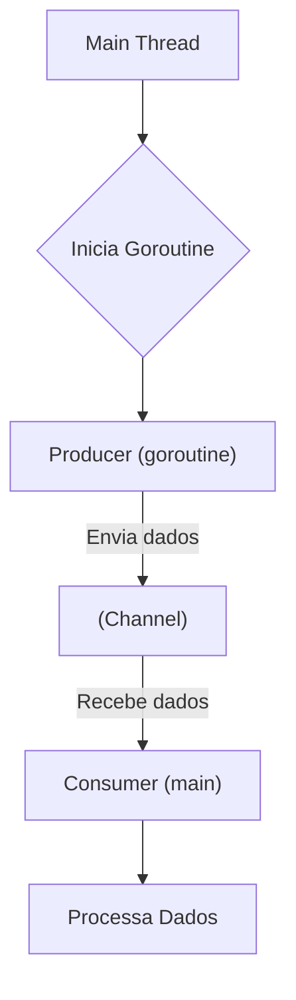

# 🐹 Go (Golang): Uma Visão Geral

Go, também conhecida como Golang, é uma linguagem de programação de código aberto criada pelo Google. Lançada em 2009, foi projetada para ser simples, eficiente, confiável e ideal para o desenvolvimento de software moderno, especialmente em sistemas distribuídos e de alta concorrência.

-----

## 🚀 Principais Características

Go foi construída com um conjunto específico de filosofias que a diferenciam de outras linguagens.

### Simplicidade e Legibilidade

A sintaxe de Go é minimalista e limpa, inspirada em C, mas com melhorias significativas para simplificar o código. A especificação da linguagem é pequena, tornando-a fácil de aprender e ler. Ferramentas como `gofmt` garantem um estilo de código padronizado em toda a comunidade.

```go
// main.go
package main

import "fmt"

// A função principal, ponto de entrada do programa.
func main() {
    mensagem := "Olá, mundo da simplicidade em Go!"
    fmt.Println(mensagem)
}
```

### Concorrência Nativa (Goroutines e Channels)

Este é um dos recursos mais poderosos de Go. Em vez de usar *threads* complexas, Go utiliza **Goroutines**, que são "threads leves" gerenciadas pelo *runtime* da linguagem. A comunicação entre goroutines é feita de forma segura através de **Channels**.

  - **Goroutines**: Funções que executam de forma concorrente com outras. Iniciar uma é tão simples quanto usar a palavra-chave `go`.
  - **Channels**: Um canal tipado que permite que goroutines se comuniquem e sincronizem sua execução de forma segura, evitando *race conditions*.

<!-- end list -->

```go
package main

import (
    "fmt"
    "time"
)

func enviarDados(ch chan string) {
    // Envia a mensagem para o channel
    ch <- "Dados recebidos!"
}

func main() {
    // Cria um channel de strings
    meuChannel := make(chan string)

    // Inicia a goroutine
    go enviarDados(meuChannel)

    // Espera e recebe a mensagem do channel
    mensagem := <-meuChannel
    fmt.Println(mensagem)

    // A goroutine finaliza junto com a função main
}
```

### Performance

Go é uma linguagem compilada, o que significa que o código-fonte é traduzido diretamente para código de máquina nativo. Isso resulta em um desempenho excelente, próximo ao de linguagens como C e C++. O tempo de compilação também é extremamente rápido.

### Tipagem Estática e Forte

As variáveis em Go devem ter um tipo definido em tempo de compilação. Isso ajuda a detectar muitos erros antes mesmo da execução do programa, tornando o código mais robusto e seguro.

```go
var idade int = 30       // Tipo explícito
nome := "Alice"          // Inferência de tipo (ainda é estático)

// O código abaixo causaria um erro de compilação:
// idade = "trinta"
```

### Biblioteca Padrão Robusta

Go vem com uma biblioteca padrão (`standard library`) rica e bem testada, que oferece pacotes para uma vasta gama de tarefas, como:

  - **`net/http`**: Criação de clientes e servidores HTTP/2.
  - **`encoding/json`**: Manipulação eficiente de dados JSON.
  - **`database/sql`**: Interface genérica para bancos de dados SQL.
  - **`testing`**: Suporte integrado para testes unitários e de performance.

### Coleta de Lixo (Garbage Collection)

A linguagem gerencia a alocação e liberação de memória automaticamente através de um coletor de lixo (*garbage collector*) eficiente e de baixa latência. Isso simplifica o desenvolvimento e evita uma classe comum de bugs relacionados ao gerenciamento manual de memória.

### Ferramentas Integradas (Tooling)

O ecossistema de Go inclui um conjunto poderoso de ferramentas de linha de comando:

  - `go build`: Compila os pacotes e suas dependências.
  - `go run`: Compila e executa o arquivo principal.
  - `go test`: Executa os testes do projeto.
  - `go fmt`: Formata o código-fonte de acordo com as convenções da linguagem.
  - `go get`: Baixa e instala pacotes de repositórios remotos.

-----

## 🏁 Começando com Go

### Instalação

A instalação é simples. Baixe o instalador apropriado para o seu sistema operacional no [site oficial do Go](https://go.dev/dl/).

### "Olá, Mundo\!"

1.  Crie um arquivo chamado `hello.go`.
2.  Adicione o seguinte conteúdo:

<!-- end list -->

```go
package main

import "fmt"

func main() {
    fmt.Println("Olá, Mundo!")
}
```

3.  Execute no terminal:

<!-- end list -->

```sh
go run hello.go
```

-----

## 🛠️ Exemplo Prático: Um Servidor Web Simples

Este exemplo demonstra como é fácil criar um servidor web funcional usando apenas a biblioteca padrão.

```go
// server.go
package main

import (
    "fmt"
    "net/http"
)

// handler é uma função que recebe um http.ResponseWriter e um http.Request.
func handler(w http.ResponseWriter, r *http.Request) {
    // Escreve uma resposta no corpo da requisição HTTP.
    fmt.Fprintf(w, "Olá, este é um servidor web em Go!")
}

func main() {
    // Registra a função `handler` para responder à rota "/".
    http.HandleFunc("/", handler)

    fmt.Println("Servidor rodando na porta 8080...")
    // Inicia o servidor na porta 8080.
    // O `nil` indica que estamos usando o multiplexador padrão que configuramos acima.
    err := http.ListenAndServe(":8080", nil)
    if err != nil {
        fmt.Println("Erro ao iniciar o servidor:", err)
    }
}
```

Para executar, salve o código como `server.go` e rode `go run server.go`. Acesse `http://localhost:8080` em seu navegador.

-----

## 🌀 Concorrência na Prática com Goroutines e Channels

O diagrama abaixo ilustra um padrão comum: um *producer* (produtor) que gera dados e os envia através de um *channel* para um *consumer* (consumidor) que os processa.



**Código correspondente:**

```go
package main

import (
    "fmt"
    "time"
)

// Producer: gera números de 1 a 4 e os envia para o channel.
func producer(ch chan int) {
    for i := 1; i <= 4; i++ {
        fmt.Printf("Produzindo e enviando: %d
", i)
        ch <- i // Envia o valor 'i' para o channel
        time.Sleep(500 * time.Millisecond)
    }
    close(ch) // Fecha o channel para indicar que não há mais dados
}

func main() {
    // Cria um channel de inteiros
    numeros := make(chan int)

    // Inicia o producer em uma nova goroutine
    go producer(numeros)

    // Consumer: recebe dados do channel até que ele seja fechado
    fmt.Println("Aguardando para consumir os dados...")
    for numero := range numeros {
        fmt.Printf("Consumindo: %d
", numero)
    }

    fmt.Println("Processo finalizado.")
}
```

-----

## 🎯 Casos de Uso Comuns

Go brilha em diversas áreas, incluindo:

  - **Serviços de Backend e APIs**: Alta performance e concorrência nativa a tornam perfeita para microserviços.
  - **Ferramentas de Linha de Comando (CLI)**: Compilação para um único binário estático facilita a distribuição.
  - **DevOps e Infraestrutura**: Ferramentas como Docker, Kubernetes e Terraform são escritas em Go.
  - **Sistemas de Rede**: A biblioteca padrão oferece suporte robusto para programação de rede.
  - **Processamento de Dados em Larga Escala**: A eficiência e o modelo de concorrência são ideais para pipelines de dados.

-----

## ✨ Por que Aprender Go?

  - **Simples e Produtiva**: Curva de aprendizado suave e foco em fazer o trabalho.
  - **Alto Desempenho**: Velocidade comparável a linguagens de baixo nível.
  - **Excelente para Concorrência**: O modelo de Goroutines e Channels é intuitivo e poderoso.
  - **Mercado em Alta**: A demanda por desenvolvedores Go cresce continuamente, especialmente em áreas de cloud e backend.
  - **Comunidade Forte**: Uma comunidade ativa e acolhedora e o forte respaldo do Google.

---


