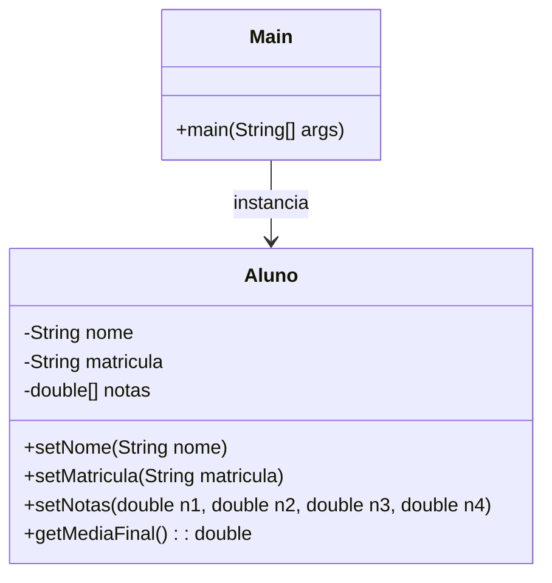
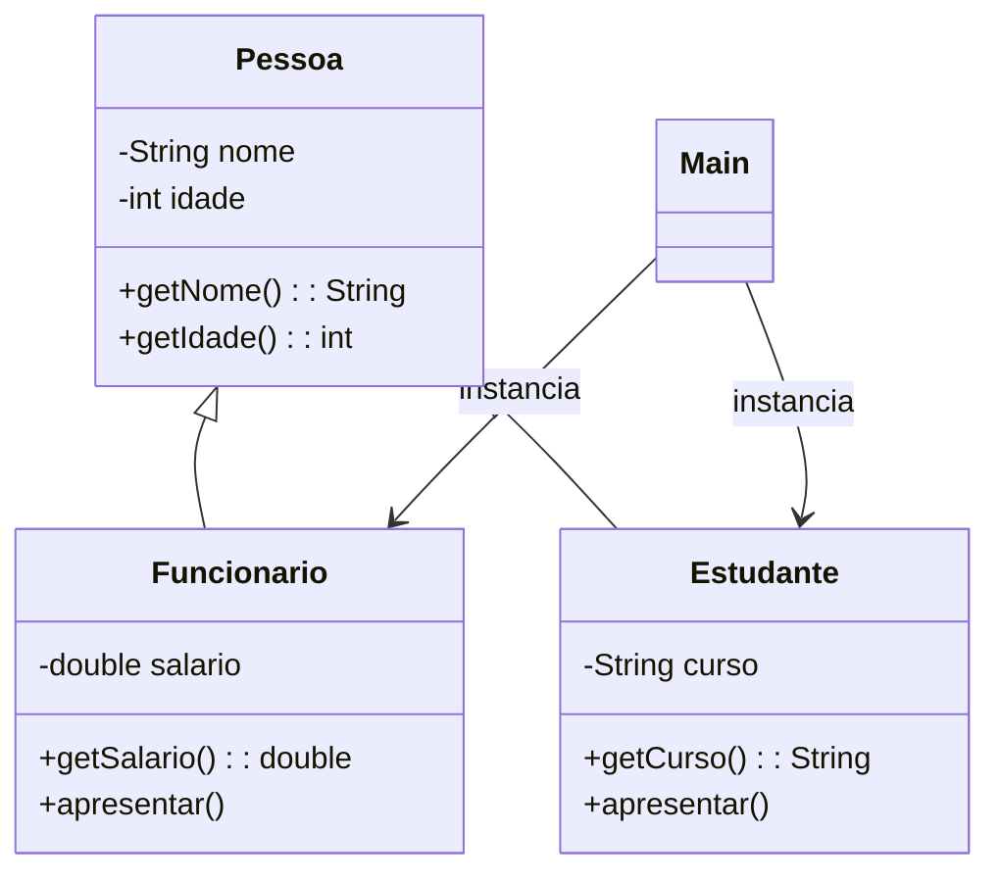
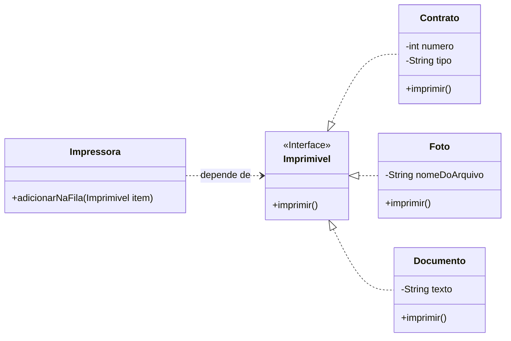
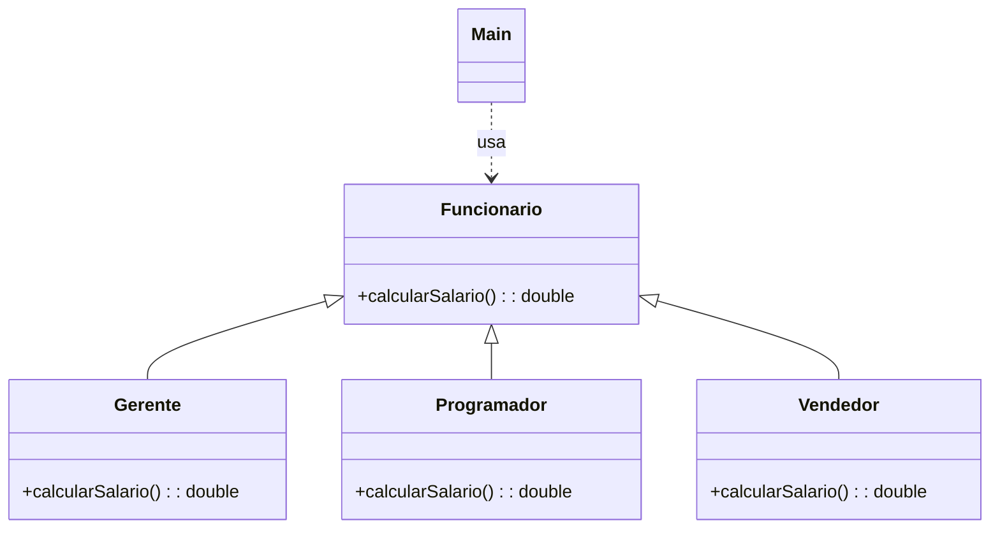

## 🎓 **Aula Completa: Os 4 Pilares da POO em Java para Iniciantes**

Esta aula foi pensada para guiar você, passo a passo, pelos conceitos que formam a base da programação moderna.

### ✅ **Objetivos da Aula:**

  * Entender o que é a Programação Orientada a Objetos (POO).
  * Dominar os 4 pilares da POO:
      * **Encapsulamento**: Proteger e organizar seus dados.
      * **Herança**: Reutilizar código e criar hierarquias lógicas.
      * **Abstração**: Focar no essencial, escondendo a complexidade.
      * **Polimorfismo**: Usar objetos de formas diferentes e flexíveis.
  * Aprender com exemplos práticos e progressivos em Java.

-----

### 🧱 **1. O que é Programação Orientada a Objetos?**

A Programação Orientada a Objetos (POO) é um **paradigma de programação** baseado no conceito de **"objetos"**. Pense em objetos do mundo real: um carro, uma pessoa, uma conta bancária. Todos eles têm **características (atributos)** e **comportamentos (métodos)**.

Com POO, nosso código se aproxima dessa forma de pensar, tornando-o mais intuitivo, organizado e reutilizável.

-----

### 🔒 **2. Pilar 1: Encapsulamento**

**🎯 Conceito:** Encapsular é como criar uma "cápsula" de proteção ao redor dos dados (atributos) de um objeto. Em vez de permitir acesso direto e descontrolado, você fornece métodos públicos para interagir com eles.

**🤔 Por que isso é tão importante?**

Vamos analisar três versões de uma classe `ContaBancaria` para entender o problema que o encapsulamento resolve.

#### **Versão 1: Sem Encapsulamento (Inseguro ⚠️)**

Aqui, o atributo `saldo` é `public`, ou seja, qualquer parte do código pode alterá-lo diretamente.

  * **ContaBancaria.java**
    ```java
    public class ContaBancaria {
        public double saldo; // Atributo público e desprotegido
    }
    ```
  * **Principal.java**
    ```java
    public class Principal {
        public static void main(String[] args) {
            ContaBancaria conta = new ContaBancaria();
            conta.saldo = 100.0;  // Acesso direto
            conta.saldo = -500.0; // Perigo! Saldo negativo permitido!
            conta.saldo += 30000; // Qualquer operação é permitida, sem regras.

            System.out.println("Saldo: R$" + conta.saldo); // Saída: Saldo: R$-500.0
        }
    }
    ```
    **Problema:** Não há controle. Podemos definir um saldo negativo ou realizar operações que quebram as regras de negócio de um banco. Isso é perigoso e leva a inconsistências.

#### **Versão 2: Com Encapsulamento (Seguro e Recomendado 🛡️)**

Agora, o atributo `saldo` é `private`, e só podemos interagir com ele através de métodos.

  * **ContaBancaria.java**
    ```java
    public class ContaBancaria {
        private double saldo; // Atributo privado e protegido

        // Método público para depositar com uma regra de negócio
        public void depositar(double valor) {
            if (valor > 0) { // Regra: só deposita valores positivos
                this.saldo += valor;
                System.out.println("Depósito de R$" + valor + " realizado com sucesso.");
            } else {
                System.out.println("Valor de depósito inválido.");
            }
        }

        // Método público para sacar com uma regra de negócio
        public void sacar(double valor) {
            if (valor > 0 && valor <= this.saldo) { // Regra: o valor deve ser positivo e haver saldo
                this.saldo -= valor;
                System.out.println("Saque de R$" + valor + " realizado com sucesso.");
            } else {
                System.out.println("Saque não permitido. Saldo insuficiente ou valor inválido.");
            }
        }

        // Método público para consultar o saldo (apenas leitura)
        public double getSaldo() {
            return this.saldo;
        }
    }
    ```
  * **Principal.java**
    ```java
    public class Principal {
        public static void main(String[] args) {
            ContaBancaria conta = new ContaBancaria();
            // conta.saldo = 100; // ERRO DE COMPILAÇÃO! Não é mais possível acessar diretamente.

            conta.depositar(100);
            conta.sacar(30);
            conta.depositar(-10); // A regra de negócio impedirá
            conta.sacar(500);     // A regra de negócio impedirá

            System.out.println("Saldo final: R$" + conta.getSaldo());
        }
    }
    ```

**Resultado:** Agora a classe `ContaBancaria` tem controle total sobre seus dados. Todas as operações são validadas, garantindo a integridade e a segurança do objeto.

✅ **Benefícios do Encapsulamento:**

  * **Segurança:** Protege os dados contra acessos indevidos.
  * **Controle:** A classe decide como seus dados podem (ou não) ser alterados.
  * **Organização:** Oculta a complexidade interna e expõe apenas o necessário.

-----

### 🧬 **3. Pilar 2: Herança**

**🎯 Conceito:** A herança permite que uma classe (filha) herde atributos e métodos de outra classe (mãe). Isso cria uma relação "é um" e promove o reaproveitamento de código.

**💡 Exemplo:** Um `Cachorro` **é um** `Animal`. Um `Carro` **é um** `Veiculo`.

  * **Animal.java (Classe Mãe / Superclasse)**
    ```java
    public class Animal {
        private String nome;

        public void comer() {
            System.out.println("O animal está comendo...");
        }

        public void fazerSom() {
            System.out.println("Animal fazendo som...");
        }

        // Getters e Setters para o nome
        public String getNome() { return nome; }
        public void setNome(String nome) { this.nome = nome; }
    }
    ```
  * **Cachorro.java (Classe Filha / Subclasse)**
    ```java
    // "Cachorro" herda tudo o que "Animal" tem usando a palavra "extends"
    public class Cachorro extends Animal {
        // Método específico da classe Cachorro
        public void abanarRabo() {
            System.out.println("Cachorro abanando o rabo!");
        }
    }
    ```
  * **Principal.java**
    ```java
    public class Main {
        public static void main(String[] args) {
            Cachorro dog = new Cachorro();
            dog.setNome("Rex");
            System.out.println("Nome: " + dog.getNome());

            dog.comer();      // Método herdado de Animal
            dog.fazerSom();   // Método herdado de Animal
            dog.abanarRabo(); // Método específico de Cachorro
        }
    }
    ```

✅ **Benefícios da Herança:**

  * **Reutilização de código:** Evita escrever o mesmo código várias vezes.
  * **Organização:** Cria hierarquias claras e lógicas entre as classes.

-----

### 🧼 **4. Pilar 3: Abstração**

**🎯 Conceito:** Abstração é focar no que um objeto **faz**, escondendo os detalhes de **como** ele faz. Ela define um "contrato" que outras classes devem seguir, sem se prender à implementação. Em Java, usamos `classes abstratas` e `interfaces`.

**💡 Exemplo:** Toda `Forma` geométrica deve ser capaz de `desenhar()`, mas a maneira de desenhar um `Círculo` é diferente de um `Retângulo`.

  * **Forma.java (Classe Abstrata)**
    ```java
    // Uma classe abstrata não pode ser instanciada diretamente. Ela serve de modelo.
    public abstract class Forma {
        // Um método abstrato é um contrato. Ele força as classes filhas a implementá-lo.
        public abstract void desenhar();

        // Classes abstratas também podem ter métodos concretos.
        public void saudacao() {
            System.out.println("Desenhando uma nova forma.");
        }
    }
    ```
  * **Circulo.java e Retangulo.java (Classes Concretas)**
    ```java
    public class Circulo extends Forma {
        @Override // Boa prática para indicar que o método está sendo sobrescrito
        public void desenhar() {
            System.out.println("Desenhando um círculo: O");
        }
    }
    ```
    ```java
    public class Retangulo extends Forma {
        @Override
        public void desenhar() {
            System.out.println("Desenhando um retângulo: []");
        }
    }
    ```

✅ **Benefícios da Abstração:**

  * **Reduz a complexidade:** Você interage com um contrato simples, não com a implementação complexa.
  * **Foco no essencial:** Permite pensar no "o quê" antes de se preocupar com o "como".

-----

### 🔄 **5. Pilar 4: Polimorfismo**

**🎯 Conceito:** Polimorfismo significa "muitas formas". É a capacidade de um objeto se comportar de maneiras diferentes dependendo do contexto, geralmente através da sobrescrita de métodos (`@Override`).

**💡 Exemplo:** Vamos usar as classes `Animal`, `Gato` e `Vaca`. Todas são `Animais`, mas cada uma faz um som diferente.

  * **Animal.java**
    ```java
    public class Animal {
        public void fazerSom() {
            System.out.println("Som genérico de animal");
        }
    }
    ```
  * **Gato.java e Vaca.java**
    ```java
    public class Gato extends Animal {
        @Override
        public void fazerSom() {
            System.out.println("Miau!");
        }
    }
    ```
    ```java
    public class Vaca extends Animal {
        @Override
        public void fazerSom() {
            System.out.println("Muuu!");
        }
    }
    ```
  * **Principal.java**
    ```java
    public class Main {
        public static void main(String[] args) {
            // "a1" é uma variável do tipo Animal, mas aponta para um objeto Gato.
            Animal a1 = new Gato();
            // "a2" é uma variável do tipo Animal, mas aponta para um objeto Vaca.
            Animal a2 = new Vaca();

            // Polimorfismo em ação!
            // O mesmo método fazerSom() tem comportamentos diferentes.
            a1.fazerSom(); // Saída: Miau!
            a2.fazerSom(); // Saída: Muuu!
        }
    }
    ```

✅ **Benefícios do Polimorfismo:**

  * **Flexibilidade:** Permite tratar objetos diferentes de maneira uniforme.
  * **Reutilização:** O código que manipula a classe mãe (`Animal`) também funcionará para todas as suas classes filhas (`Gato`, `Vaca`, etc.).

-----

### 🧠 **Resumo da Aula**

| Pilar | O que faz | Palavras-chave em Java |
| :--- | :--- | :--- |
| **Encapsulamento** | Protege os dados internos e controla o acesso. | `private`, `public`, métodos `get`/`set`. |
| **Herança** | Uma classe herda características de outra. | `extends`. |
| **Abstração** | Esconde detalhes complexos, define um contrato. | `abstract`, `interface`. |
| **Polimorfismo** | Um objeto se comporta de múltiplas formas. | Sobrescrita de método (`@Override`). |

-----

### 📝 **Exercício Final: Juntando Tudo**

**Desafio:** Crie um sistema simples para veículos, aplicando os quatro pilares.

1.  **Abstração:** Crie uma classe abstrata `Veiculo` com atributos `marca` e `modelo` (encapsulados) e um método abstrato `ligar()`.
2.  **Herança:** Crie as classes `Carro` e `Moto` que herdam de `Veiculo`.
3.  **Polimorfismo:** Implemente o método `ligar()` de forma diferente para `Carro` ("Carro ligado girando a chave.") e `Moto` ("Moto ligada pelo botão de ignição.").
4.  **Teste:** Crie uma classe `Main` que instancia um `Carro` e uma `Moto` em um array do tipo `Veiculo` e chame o método `ligar()` de cada um para ver o polimorfismo em ação.


  * **Veiculo.java (Abstrata)**

    ```java
    public abstract class Veiculo {
        private String marca;
        private String modelo;

        public abstract void ligar();

        // Getters e Setters (Encapsulamento)
        public String getMarca() { return marca; }
        public void setMarca(String marca) { this.marca = marca; }
        public String getModelo() { return modelo; }
        public void setModelo(String modelo) { this.modelo = modelo; }
    }
    ```

  * **Carro.java (Herança e Polimorfismo)**

    ```java
    public class Carro extends Veiculo {
        @Override
        public void ligar() {
            System.out.println("Carro ligado girando a chave.");
        }
    }
    ```

  * **Moto.java (Herança e Polimorfismo)**

    ```java
    public class Moto extends Veiculo {
        @Override
        public void ligar() {
            System.out.println("Moto ligada pelo botão de ignição.");
        }
    }
    ```

  * **Main.java (Teste)**

    ```java
    public class Main {
        public static void main(String[] args) {
            Veiculo[] meusVeiculos = new Veiculo[2];

            meusVeiculos[0] = new Carro();
            meusVeiculos[0].setMarca("Ford");
            meusVeiculos[0].setModelo("Fiesta");

            meusVeiculos[1] = new Moto();
            meusVeiculos[1].setMarca("Honda");
            meusVeiculos[1].setModelo("CB 500");

            for (Veiculo v : meusVeiculos) {
                System.out.println("Veículo: " + v.getMarca() + " " + v.getModelo());
                v.ligar(); // O polimorfismo decide qual método "ligar" chamar
                System.out.println("---");
            }
        }
    }
    ```


-----

### 🔐 **Exercício 1: Encapsulamento**

**🎯 Objetivo:** Praticar o encapsulamento para garantir a integridade dos dados de um objeto.

**Enunciado:** Crie uma classe `Aluno` que armazene o `nome`, a `matricula` e as `quatro notas` de um aluno. Os atributos devem ser privados. Crie métodos públicos para:

1.  Definir o nome e a matrícula.
2.  Adicionar as quatro notas (o método deve validar se a nota está entre 0 e 10).
3.  Calcular e retornar a média final do aluno. Se alguma nota ainda não foi adicionada, a média deve retornar 0.

Crie uma classe `Main` para testar, tentando adicionar uma nota inválida (ex: 11 ou -1) e exibindo a média final.

**Diagrama de Classes (Mermaid):**



---

  * **Aluno.java**

    ```java
    public class Aluno {
        private String nome;
        private String matricula;
        private double[] notas = new double[4];
        private int notasInseridas = 0;

        public void setNome(String nome) {
            this.nome = nome;
        }

        public void setMatricula(String matricula) {
            this.matricula = matricula;
        }

        // Método para adicionar as 4 notas de uma vez com validação
        public boolean setNotas(double n1, double n2, double n3, double n4) {
            if (validaNota(n1) && validaNota(n2) && validaNota(n3) && validaNota(n4)) {
                this.notas[0] = n1;
                this.notas[1] = n2;
                this.notas[2] = n3;
                this.notas[3] = n4;
                this.notasInseridas = 4;
                System.out.println("Notas inseridas com sucesso.");
                return true;
            } else {
                System.out.println("Erro: Uma ou mais notas são inválidas. As notas devem estar entre 0 e 10.");
                return false;
            }
        }

        // Função auxiliar privada para validar uma nota
        private boolean validaNota(double nota) {
            return nota >= 0 && nota <= 10;
        }

        public double getMediaFinal() {
            if (this.notasInseridas < 4) {
                System.out.println("Ainda não é possível calcular a média. Insira as 4 notas.");
                return 0.0;
            }
            double soma = 0;
            for (double nota : this.notas) {
                soma += nota;
            }
            return soma / 4.0;
        }

        public String getNome() {
            return nome;
        }
    }
    ```

  * **Main.java**

    ```java
    public class Main {
        public static void main(String[] args) {
            Aluno aluno1 = new Aluno();
            aluno1.setNome("Carlos Souza");
            aluno1.setMatricula("2024-001");

            System.out.println("Aluno: " + aluno1.getNome());

            System.out.println("\n--- Tentativa 1: Notas inválidas ---");
            aluno1.setNotas(8.5, 9.0, 11.0, 7.0); // Nota 11.0 é inválida
            System.out.printf("Média final: %.2f\n", aluno1.getMediaFinal());

            System.out.println("\n--- Tentativa 2: Notas válidas ---");
            aluno1.setNotas(8.5, 9.0, 7.5, 10.0);
            System.out.printf("Média final: %.2f\n", aluno1.getMediaFinal());
        }
    }
    ```


-----

### 🧬 **Exercício 2: Herança**

**🎯 Objetivo:** Praticar a criação de uma hierarquia de classes e o reaproveitamento de código.

**Enunciado:** Crie uma classe `Pessoa` com os atributos `nome` e `idade`. Em seguida, crie duas subclasses:

1.  `Funcionario`, que herda de `Pessoa` e adiciona o atributo `salario`.
2.  `Estudante`, que herda de `Pessoa` e adiciona o atributo `curso`.

Ambas as subclasses devem ter um método `apresentar()` que exibe todos os seus dados (os herdados e os próprios). Crie uma classe `Main` para instanciar e apresentar um `Funcionario` e um `Estudante`.

**Diagrama de Classes (Mermaid):**



---

  * **Pessoa.java**

    ```java
    public class Pessoa {
        private String nome;
        private int idade;

        public String getNome() { return nome; }
        public void setNome(String nome) { this.nome = nome; }
        public int getIdade() { return idade; }
        public void setIdade(int idade) { this.idade = idade; }
    }
    ```

  * **Funcionario.java**

    ```java
    public class Funcionario extends Pessoa {
        private double salario;

        public double getSalario() { return salario; }
        public void setSalario(double salario) { this.salario = salario; }

        public void apresentar() {
            System.out.println("--- Apresentação do Funcionário ---");
            System.out.println("Nome: " + getNome());
            System.out.println("Idade: " + getIdade() + " anos");
            System.out.println("Salário: R$" + this.salario);
        }
    }
    ```

  * **Estudante.java**

    ```java
    public class Estudante extends Pessoa {
        private String curso;

        public String getCurso() { return curso; }
        public void setCurso(String curso) { this.curso = curso; }

        public void apresentar() {
            System.out.println("--- Apresentação do Estudante ---");
            System.out.println("Nome: " + getNome());
            System.out.println("Idade: " + getIdade() + " anos");
            System.out.println("Curso: " + this.curso);
        }
    }
    ```

  * **Main.java**

    ```java
    public class Main {
        public static void main(String[] args) {
            Funcionario f1 = new Funcionario();
            f1.setNome("Ana Paula");
            f1.setIdade(32);
            f1.setSalario(4500.00);

            Estudante e1 = new Estudante();
            e1.setNome("Lucas Martins");
            e1.setIdade(20);
            e1.setCurso("Engenharia de Software");

            f1.apresentar();
            System.out.println(); // Linha em branco para separar
            e1.apresentar();
        }
    }
    ```


-----

### 🧼 **Exercício 3: Abstração**

**🎯 Objetivo:** Utilizar interfaces para definir um contrato que múltiplas classes não relacionadas podem implementar.

**Enunciado:** Crie uma interface `Imprimivel` que defina um único método: `imprimir()`. Crie três classes distintas que implementam essa interface:

1.  `Contrato`: Possui atributos como `numero` e `tipo`. O método `imprimir` deve exibir "Imprimindo Contrato: [tipo], Nº [numero]".
2.  `Foto`: Possui um atributo `nomeDoArquivo`. O método `imprimir` deve exibir "Imprimindo Foto: [nomeDoArquivo]".
3.  `Documento`: Possui um atributo `texto`. O método `imprimir` deve exibir "Imprimindo Documento: [texto]".

Crie uma classe `Impressora` com um método `adicionarNaFila(Imprimivel item)` que chama o método `imprimir()` do item passado como argumento. Teste na `Main`.

**Diagrama de Classes (Mermaid):**



---

  * **Imprimivel.java (Interface)**

    ```java
    public interface Imprimivel {
        void imprimir();
    }
    ```

  * **Contrato.java**

    ```java
    public class Contrato implements Imprimivel {
        private int numero;
        private String tipo;

        public Contrato(int numero, String tipo) {
            this.numero = numero;
            this.tipo = tipo;
        }

        @Override
        public void imprimir() {
            System.out.println("Imprimindo Contrato: " + this.tipo + ", Nº " + this.numero);
        }
    }
    ```

  * **Foto.java**

    ```java
    public class Foto implements Imprimivel {
        private String nomeDoArquivo;

        public Foto(String nomeDoArquivo) {
            this.nomeDoArquivo = nomeDoArquivo;
        }

        @Override
        public void imprimir() {
            System.out.println("Imprimindo Foto: " + this.nomeDoArquivo);
        }
    }
    ```

  * **Documento.java**

    ```java
    public class Documento implements Imprimivel {
        private String texto;

        public Documento(String texto) {
            this.texto = texto;
        }

        @Override
        public void imprimir() {
            System.out.println("Imprimindo Documento: " + this.texto);
        }
    }
    ```

  * **Impressora.java**

    ```java
    public class Impressora {
        public void adicionarNaFila(Imprimivel item) {
            System.out.print("Enviando para a impressora... ");
            item.imprimir(); // Chama o método da interface
        }
    }
    ```

  * **Main.java**

    ```java
    public class Main {
        public static void main(String[] args) {
            Impressora impressora = new Impressora();

            Contrato c = new Contrato(101, "Prestação de Serviços");
            Foto f = new Foto("ferias_2024.jpg");
            Documento d = new Documento("Relatório Anual");

            impressora.adicionarNaFila(c);
            impressora.adicionarNaFila(f);
            impressora.adicionarNaFila(d);
        }
    }
    ```


-----

### 🔄 **Exercício 4: Polimorfismo**

**🎯 Objetivo:** Demonstrar como o polimorfismo permite tratar diferentes objetos de forma uniforme, simplificando o código.

**Enunciado:** Crie uma classe base `Funcionario` com um método `calcularSalario()` que retorna um salário base de R$ 1500. Crie três subclasses:

1.  `Gerente`: Sobrescreve `calcularSalario()` para adicionar um bônus de 50% sobre o salário base.
2.  `Programador`: Sobrescreve `calcularSalario()` para adicionar um bônus fixo de R$ 800.
3.  `Vendedor`: Sobrescreve `calcularSalario()` para adicionar uma comissão de R$ 250.

Crie uma classe `Main` que tenha um array de `Funcionario`. Adicione instâncias de `Gerente`, `Programador` e `Vendedor` a este array. Percorra o array e imprima o salário de cada funcionário, mostrando o polimorfismo em ação.

**Diagrama de Classes (Mermaid):**



---

  * **Funcionario.java**

    ```java
    public class Funcionario {
        public double calcularSalario() {
            // Salário base para todos os funcionários
            return 1500.0;
        }
    }
    ```

  * **Gerente.java**

    ```java
    public class Gerente extends Funcionario {
        @Override
        public double calcularSalario() {
            double salarioBase = super.calcularSalario();
            double bonus = salarioBase * 0.50; // 50% de bônus
            return salarioBase + bonus;
        }
    }
    ```

  * **Programador.java**

    ```java
    public class Programador extends Funcionario {
        @Override
        public double calcularSalario() {
            return super.calcularSalario() + 800.0; // Bônus fixo
        }
    }
    ```

  * **Vendedor.java**

    ```java
    public class Vendedor extends Funcionario {
        @Override
        public double calcularSalario() {
            return super.calcularSalario() + 250.0; // Comissão
        }
    }
    ```

  * **Main.java**

    ```java
    public class Main {
        public static void main(String[] args) {
            Funcionario[] equipe = new Funcionario[3];

            equipe[0] = new Gerente();
            equipe[1] = new Programador();
            equipe[2] = new Vendedor();

            System.out.println("--- Folha de Pagamento ---");

            for (Funcionario f : equipe) {
                // Polimorfismo: O Java sabe qual método calcularSalario() chamar
                // com base no objeto real (Gerente, Programador ou Vendedor).
                String cargo = f.getClass().getSimpleName(); // Pega o nome da classe
                double salario = f.calcularSalario();
                System.out.printf("Cargo: %s - Salário: R$ %.2f\n", cargo, salario);
            }
        }
    }
    ```

---

### [ricardotecpro.github.io](https://ricardotecpro.github.io/)
