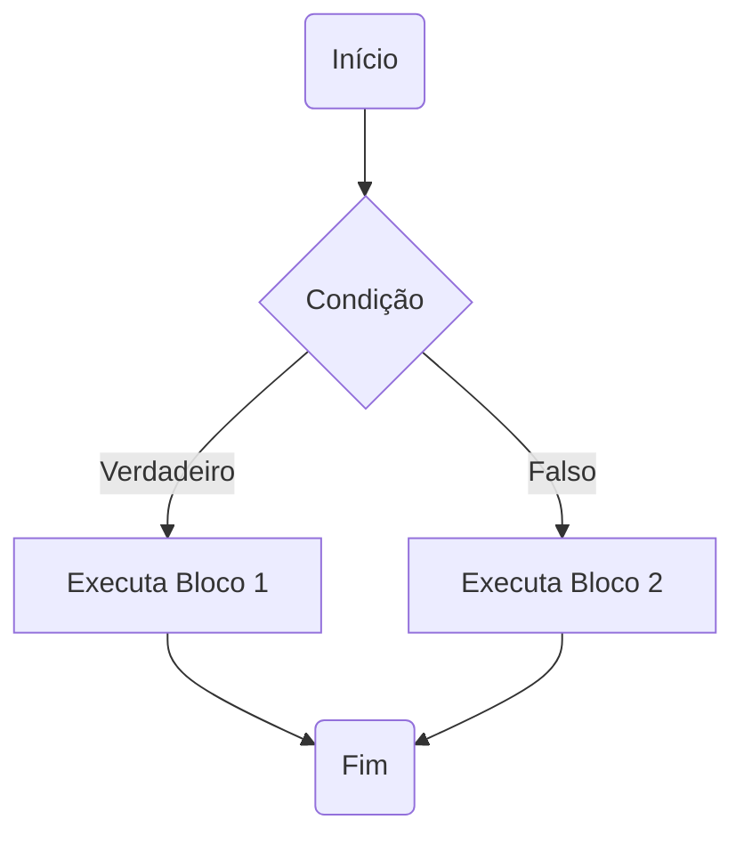

# ☕ Java: Estrutura Condicional

Este documento aborda as estruturas condicionais em Java, um conceito fundamental para controlar o fluxo de execução de um programa.

## 📊 Expressões Comparativas

Uma expressão comparativa é uma expressão que, ao ser avaliada, resulta em um valor verdade (verdadeiro ou falso).

**Exemplo:**
```
expressão   resultado   valor verdade
5 > 10      resultado   Falso
```

### Operadores Comparativos
Os operadores comparativos são utilizados para comparar dois valores. Eles são comuns em diversas linguagens de programação, incluindo C, C++, Java e C#.

| Operador | Significado      |
| :------- | :--------------- |
| `>`      | Maior            |
| `<`      | Menor            |
| `>=`     | Maior ou igual   |
| `<=`     | Menor ou igual   |
| `==`     | Igual            |
| `!=`     | Diferente        |

---

### Exemplos de Expressões Comparativas
(Suponha `x` igual a 5)

| Expressão | Resultado   |
| :-------- | :---------- |
| `x > 0`   | Verdadeiro  |
| `x == 3`  | Falso       |
| `10 <= 30`| Verdadeiro  |
| `x != 2`  | Verdadeiro  |

---

## 🧠 Expressões Lógicas

Uma expressão lógica é uma expressão que combina uma ou mais expressões comparativas usando operadores lógicos, resultando também em um valor verdade.

```
expressão   resultado   valor verdade
```

### Operadores Lógicos
Estes operadores são usados para criar condições mais complexas. São comuns em C, C++, Java e C#.

| Operador | Significado |
| :------- | :---------- |
| `&&`     | E           |
| `||`     | OU          |
| `!`      | NÃO         |

---

### Exemplos de Expressões Lógicas
(Suponha `x` igual a 5)

1.  **`x <= 20 && x == 10`**
    * `x <= 20` (5 <= 20) -> Verdadeiro (V)
    * `x == 10` (5 == 10) -> Falso (F)
    * Resultado: V && F -> **Falso**

2.  **`x > 0 && x != 3`**
    * `x > 0` (5 > 0) -> Verdadeiro (V)
    * `x != 3` (5 != 3) -> Verdadeiro (V)
    * Resultado: V && V -> **Verdadeiro**

3.  **`x <= 20 && x == 10 && x != 3`**
    * `x <= 20` (5 <= 20) -> Verdadeiro (V)
    * `x == 10` (5 == 10) -> Falso (F)
    * `x != 3` (5 != 3) -> Verdadeiro (V)
    * Resultado: V && F && V -> **Falso**

### Ideia por trás do Operador "E" (&&) 💡
Para que uma expressão com o operador "E" (`&&`) seja verdadeira, **todas** as condições individuais devem ser verdadeiras.

**Exemplo:** Você pode obter uma habilitação de motorista se:
* For aprovado no exame psicotécnico, **E**
* For aprovado no exame de legislação, **E**
* For aprovado no exame de direção.

#### Tabela Verdade do Operador "E" (`&&`)
| A     | B     | A && B |
| :---- | :---- | :----- |
| Falso | Falso | Falso  |
| Falso | Verd. | Falso  |
| Verd. | Falso | Falso  |
| Verd. | Verd. | Verd.  |

---

### Ideia por trás do Operador "OU" (||) 💡
Para que uma expressão com o operador "OU" (`||`) seja verdadeira, **pelo menos uma** das condições individuais deve ser verdadeira.

**Exemplo:** Você pode estacionar na vaga especial se:
* For idoso(a), **OU**
* For uma pessoa com deficiência, **OU**
* For uma gestante.

#### Exemplos de Expressões Lógicas com "OU"
(Suponha `x` igual a 5)

1.  **`x == 10 || x <= 20`**
    * `x == 10` (5 == 10) -> Falso (F)
    * `x <= 20` (5 <= 20) -> Verdadeiro (V)
    * Resultado: F || V -> **Verdadeiro**

2.  **`x > 0 || x != 3`**
    * `x > 0` (5 > 0) -> Verdadeiro (V)
    * `x != 3` (5 != 3) -> Verdadeiro (V)
    * Resultado: V || V -> **Verdadeiro**

3.  **`x <= 0 || x != 3 || x != 5`**
    * `x <= 0` (5 <= 0) -> Falso (F)
    * `x != 3` (5 != 3) -> Verdadeiro (V)
    * `x != 5` (5 != 5) -> Falso (F)
    * Resultado: F || V || F -> **Verdadeiro** (Basta um V)

#### Tabela Verdade do Operador "OU" (`||`)
| A     | B     | A \|\| B |
| :---- | :---- | :------- |
| Falso | Falso | Falso    |
| Falso | Verd. | Verd.    |
| Verd. | Falso | Verd.    |
| Verd. | Verd. | Verd.    |

---

### Ideia por trás do Operador "NÃO" (!) 💡
O operador "NÃO" (`!`) inverte o valor verdade de uma condição. Se a condição é verdadeira, `!` a torna falsa, e vice-versa.

**Exemplo:** Você tem direito a receber uma bolsa de estudos se você:
* **NÃO** possuir renda maior que R$ 3000,00.

#### Exemplos de Expressões Lógicas com "NÃO"
(Suponha `x` igual a 5)

1.  **`!(x == 10)`**
    * `x == 10` (5 == 10) -> Falso (F)
    * Resultado: `!F` -> **Verdadeiro**

2.  **`!(x >= 2)`**
    * `x >= 2` (5 >= 2) -> Verdadeiro (V)
    * Resultado: `!V` -> **Falso**

3.  **`!(x <= 20 && x == 10)`**
    * `x <= 20` (5 <= 20) -> Verdadeiro (V)
    * `x == 10` (5 == 10) -> Falso (F)
    * `V && F` -> Falso (F)
    * Resultado: `!F` -> **Verdadeiro**

#### Tabela Verdade do Operador "NÃO" (`!`)
| A     | !A    |
| :---- | :---- |
| Falso | Verd. |
| Verd. | Falso |

---

## ⚙️ Estrutura Condicional

### Conceito
A estrutura condicional é uma estrutura de controle que permite definir que um certo bloco de comandos somente será executado dependendo de uma condição (uma expressão lógica).



### Sintaxe da Estrutura Condicional 📝

#### Simples: `if`
Utilizada quando uma ação deve ser tomada apenas se a condição for verdadeira.

```java
if (condição) {
    // comando 1 a ser executado se a condição for verdadeira
    // comando 2 a ser executado se a condição for verdadeira
}
```
**Regra:**
* **Verdadeiro (V):** Executa o bloco de comandos dentro do `if`.
* **Falso (F):** Pula o bloco de comandos do `if`.

**Importante:** Repare na **indentação**! A indentação melhora a legibilidade do código, indicando quais comandos pertencem ao bloco condicional.

#### Composta: `if-else`
Utilizada quando existem duas ações alternativas: uma se a condição for verdadeira, e outra se for falsa.

```java
if (condição) {
    // comando 1 a ser executado se a condição for verdadeira
    // comando 2 a ser executado se a condição for verdadeira
} else {
    // comando 3 a ser executado se a condição for falsa
    // comando 4 a ser executado se a condição for falsa
}
```
**Regra:**
* **Verdadeiro (V):** Executa somente o bloco de comandos do `if`.
* **Falso (F):** Executa somente o bloco de comandos do `else`.

**Importante:** A indentação é crucial para a clareza.

### E se eu tiver mais de duas possibilidades? 🤔
Quando múltiplas condições precisam ser avaliadas, podemos encadear estruturas condicionais.

**Exemplo:**
* Se `horas < 12`: "Bom dia!"
* Senão, se `horas < 18`: "Boa tarde!"
* Senão: "Boa noite!"

### Encadeamento de Estruturas Condicionais: `else if`
Permite testar múltiplas condições em sequência.

**Forma 1 (Aninhamento explícito):**
```java
if (condição1) {
    // comando 1
    // comando 2
} else {
    if (condição2) {
        // comando 3
        // comando 4
    } else {
        // comando 5
        // comando 6
    }
}
```

**Forma 2 (Sintaxe `else if` mais comum e legível):**
```java
if (condição1) {
    // comando 1
    // comando 2
} else if (condição2) {
    // comando 3
    // comando 4
} else if (condição3) {
    // comando 5
    // comando 6
} else {
    // comando 7 (executado se nenhuma das condições anteriores for verdadeira)
    // comando 8
}
```
**Importante:** A indentação continua sendo fundamental para a organização do código. O `else if` torna o código mais limpo e fácil de seguir em comparação com múltiplos `if`s aninhados separadamente.

## 🛠️ Exemplos Práticos e Sintaxes Opcionais

Os exemplos de código a seguir podem ser compilados e executados em ambientes de desenvolvimento Java como **VS Code** (com o "Extension Pack for Java") ou **IntelliJ IDEA**.

### Problema Exemplo: Plano de Telefonia 📱
Uma operadora de telefonia cobra R$ 50.00 por um plano básico que dá direito a 100 minutos de telefone. Cada minuto que exceder a franquia de 100 minutos custa R$ 2.00. Fazer um programa para ler a quantidade de minutos que uma pessoa consumiu, daí mostrar o valor a ser pago.

**Exemplos de Entrada/Saída:**
* Entrada: `22` -> Saída: `Valor a pagar: R$ 50.00`
* Entrada: `103` -> Saída: `Valor a pagar: R$ 56.00`

#### Código Java para o Plano de Telefonia:
```java
import java.util.Locale;
import java.util.Scanner;

public class CalculadoraPlano {

    public static void main(String[] args) {
        Locale.setDefault(Locale.US); // Para usar . como separador decimal
        Scanner sc = new Scanner(System.in);

        System.out.print("Digite a quantidade de minutos consumidos: ");
        int minutos = sc.nextInt();

        double conta = 50.0;
        if (minutos > 100) {
            // conta = conta + (minutos - 100) * 2.0;
            conta += (minutos - 100) * 2.0; // Usando atribuição cumulativa
        }

        System.out.printf("Valor da conta R$ %.2f%n", conta);

        sc.close();
    }
}
```

### Sintaxe Opcional: Operadores de Atribuição Cumulativa ➕➖
São atalhos para operações onde uma variável é atualizada com base em seu próprio valor.

| Operador   | Exemplo    | Equivalente a |
| :--------- | :--------- | :------------ |
| `+=`       | `a += b;`  | `a = a + b;`  |
| `-=`       | `a -= b;`  | `a = a - b;`  |
| `*=`       | `a *= b;`  | `a = a * b;`  |
| `/=`       | `a /= b;`  | `a = a / b;`  |
| `%=`       | `a %= b;`  | `a = a % b;`  |

---

### Sintaxe Opcional: Estrutura `switch-case` 🔄
Quando se tem várias opções de fluxo a serem tratadas com base no valor de uma única variável (geralmente inteira, caractere ou String), ao invés de várias estruturas `if-else if` encadeadas, alguns preferem utilizar a estrutura `switch-case`. É útil para legibilidade quando há muitos casos discretos.

#### Problema Exemplo: Dia da Semana 📅
Fazer um programa para ler um valor inteiro de 1 a 7 representando um dia da semana (sendo 1 = domingo, 2 = segunda, e assim por diante). Escrever na tela o dia da semana correspondente.

**Exemplos de Entrada/Saída:**
* Entrada: `1` -> Saída: `Dia da semana: domingo`
* Entrada: `4` -> Saída: `Dia da semana: quarta`
* Entrada: `9` -> Saída: `Dia da semana: valor inválido`

#### Código Java com `if-else if` para Dia da Semana:
```java
import java.util.Scanner;

public class DiaDaSemanaIfElse {

    public static void main(String[] args) {
        Scanner sc = new Scanner(System.in);

        System.out.print("Digite um número para o dia da semana (1-7): ");
        int x = sc.nextInt();
        String dia;

        if (x == 1) {
            dia = "domingo";
        } else if (x == 2) {
            dia = "segunda";
        } else if (x == 3) {
            dia = "terça";
        } else if (x == 4) {
            dia = "quarta";
        } else if (x == 5) {
            dia = "quinta";
        } else if (x == 6) {
            dia = "sexta";
        } else if (x == 7) {
            dia = "sábado";
        } else {
            dia = "valor inválido";
        }

        System.out.println("Dia da semana: " + dia);
        sc.close();
    }
}
```

#### Código Java com `switch-case` para Dia da Semana:
```java
import java.util.Scanner;

public class DiaDaSemanaSwitch {

    public static void main(String[] args) {
        Scanner sc = new Scanner(System.in);

        System.out.print("Digite um número para o dia da semana (1-7): ");
        int x = sc.nextInt();
        String dia;

        switch (x) {
            case 1:
                dia = "domingo";
                break; // Importante: sem o break, a execução continua nos próximos cases
            case 2:
                dia = "segunda";
                break;
            case 3:
                dia = "terça";
                break;
            case 4:
                dia = "quarta";
                break;
            case 5:
                dia = "quinta";
                break;
            case 6:
                dia = "sexta";
                break;
            case 7:
                dia = "sábado";
                break;
            default: // Equivalente ao 'else' final
                dia = "valor inválido";
                // break; // Opcional no default se for o último bloco
        }
        System.out.println("Dia da semana: " + dia);
        sc.close();
    }
}
```
---

**Observação sobre `switch-case`:**
* A instrução `break` é crucial. Se omitida, o `switch` executa o bloco `case` correspondente e todos os blocos `case` subsequentes até encontrar um `break` ou o fim do `switch`. Isso é chamado de "fall-through".
* O bloco `default` é opcional e é executado se nenhum dos `case` corresponder ao valor da expressão.

### Expressão Condicional Ternária 🤔❓
É uma forma concisa de escrever uma instrução `if-else` simples, especialmente útil quando se deseja decidir um **valor** com base em uma condição.

**Sintaxe:**
```
(condição) ? valor_se_verdadeiro : valor_se_falso;
```

**Exemplos:**
* `(2 > 4) ? 50 : 80`  resultaria em `80`.
* `(10 != 3) ? "Maria" : "Alex"` resultaria em `"Maria"`.

#### Demonstração: Cálculo de Desconto 💻
Vamos comparar a atribuição de um valor de desconto usando `if-else` e a expressão ternária.

**Com `if-else`:**
```java
double preco = 34.5;
double desconto;

if (preco < 20.0) {
    desconto = preco * 0.1; // 10% de desconto
} else {
    desconto = preco * 0.05; // 5% de desconto
}
// System.out.println("Desconto: " + desconto);
```

**Com operador ternário:**
```java
double preco = 34.5;
double desconto = (preco < 20.0) ? preco * 0.1 : preco * 0.05;
// System.out.println("Desconto: " + desconto);
```
Ambos os trechos de código acima produzem o mesmo resultado para `desconto`, mas a versão ternária é mais compacta para atribuições condicionais simples.

## 🎯 Escopo e Inicialização de Variáveis

### Checklist ✅
* **Escopo de uma variável:** É a região do programa onde a variável é válida, ou seja, onde ela pode ser referenciada (usada).
    * Uma variável declarada dentro de um bloco (delimitado por `{}`) só é visível dentro daquele bloco e em blocos aninhados a ele, após sua declaração.
* **Inicialização:** Uma variável local (declarada dentro de um método) **não pode ser usada se não for inicializada** (ou seja, se não tiver um valor atribuído a ela antes do primeiro uso). O compilador Java geralmente aponta erro nesses casos.

### Demonstração: Problema de Escopo 💻
Considere o seguinte código:
```java
// import java.util.Scanner; // Supondo que sc já está definido

// double preco = sc.nextDouble(); // Exemplo de entrada de preço
double preco = 50.0; // Para fins de exemplo

if (preco > 100.0) {
    double taxaDesconto = 0.1; // 'taxaDesconto' está no escopo do if
    // System.out.println(taxaDesconto); // Válido aqui
}

// System.out.println(taxaDesconto); // ERRO DE COMPILAÇÃO!
// A variável 'taxaDesconto' não é visível/acessível aqui fora do bloco if.
```
No exemplo acima, `taxaDesconto` é declarada dentro do bloco `if`. Portanto, ela só existe e pode ser acessada dentro desse bloco. Tentar usá-la fora do bloco `if` resultará em um erro de compilação, pois ela está "fora de escopo".

**Para corrigir:**
Se `taxaDesconto` precisa ser usada fora do `if`, ela deve ser declarada em um escopo mais amplo:
```java
double preco = 150.0;
double taxaDesconto = 0.0; // Declarada aqui, inicializada com um valor padrão

if (preco > 100.0) {
    taxaDesconto = 0.1; // Atribuído novo valor se a condição for verdadeira
}

System.out.println("Taxa de desconto aplicável: " + taxaDesconto); // Agora é válido
```

Entender o escopo é crucial para evitar erros e escrever código Java correto e manutenível.

---

### [ricardotecpro.github.io](https://ricardotecpro.github.io/)

