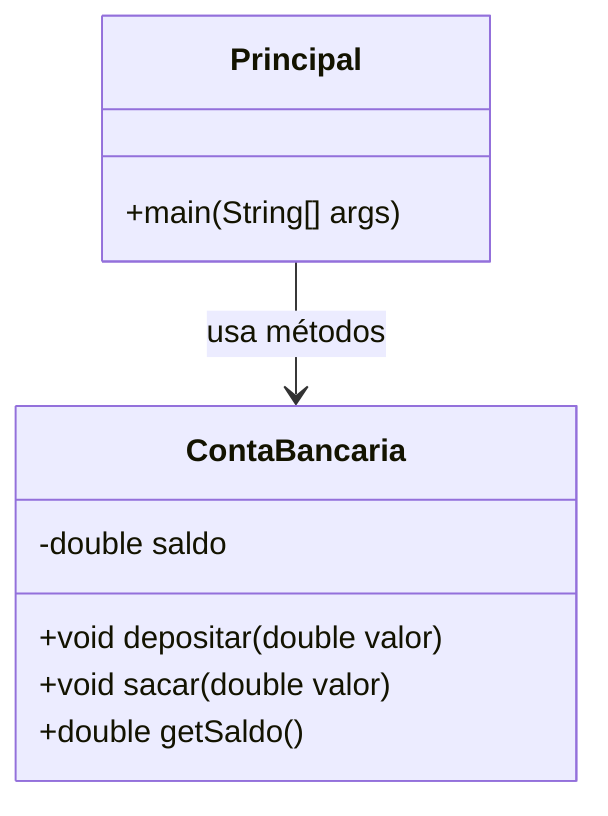
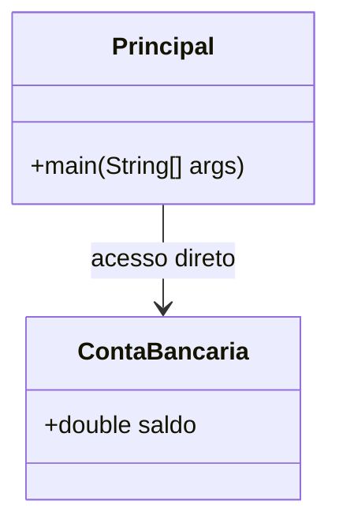
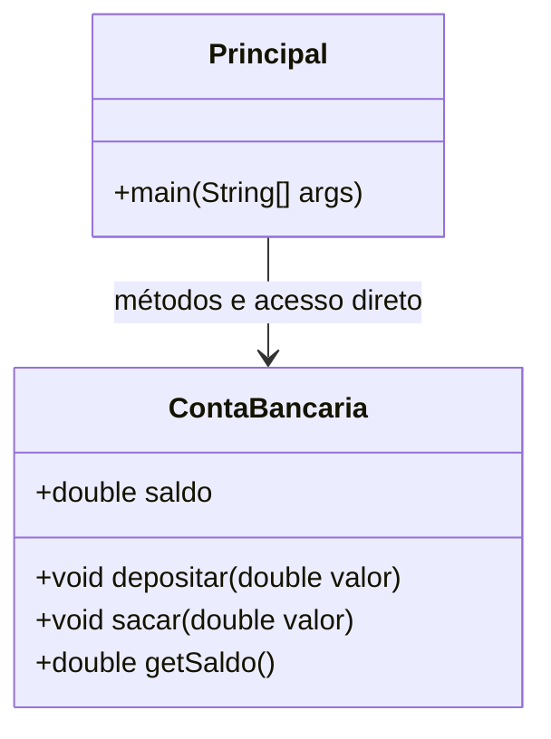
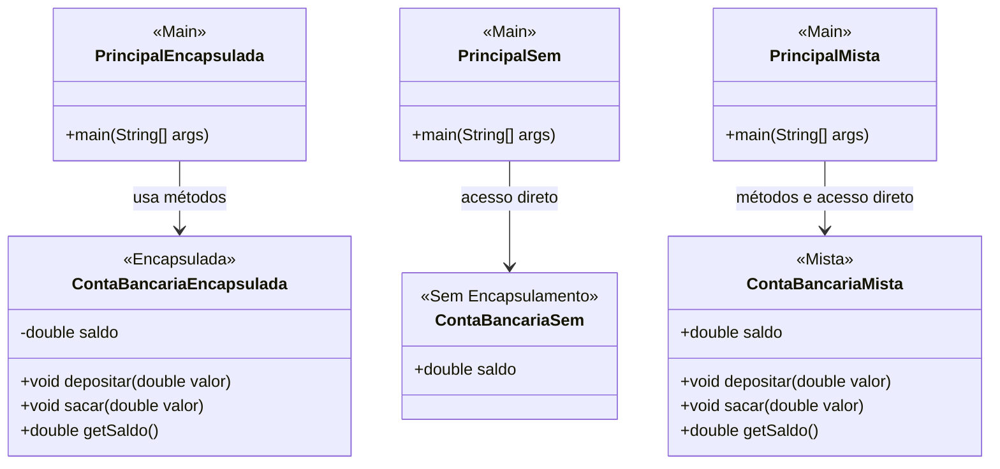

# Java: Construtores, Palavra `this`, Sobrecarga e Encapsulamento ☕

Este material aborda conceitos fundamentais da Programação Orientada a Objetos (POO) em Java, como construtores, o uso da palavra-chave `this`, sobrecarga de métodos e encapsulamento.

## Construtores 🏗️

Um **construtor** é uma operação especial da classe que é executada no momento da instanciação de um objeto. Ele tem o mesmo nome da classe.

**Usos comuns:**
* Iniciar os valores dos atributos de um objeto.
* Permitir ou obrigar que o objeto receba dados/dependências no momento de sua criação (um conceito relacionado à injeção de dependência).

Se um construtor customizado não for especificado na classe, o Java disponibiliza um **construtor padrão** (sem argumentos). Por exemplo:
```java
Produto p = new Produto();
```
É possível especificar mais de um construtor na mesma classe, desde que suas listas de parâmetros sejam diferentes. Isso é chamado de **sobrecarga de construtores**.

### Problema Exemplo

Vamos considerar um programa que gerencia produtos em estoque.

**Interação esperada com o usuário:**
```
Entre com os dados do produto:
Nome: TV
Preço: 900.00
Quantidade em estoque: 10

Dados do produto: TV, $ 900.00, 10 unidades, Total: $ 9000.00

Entre com o número de produtos a ser adicionado ao estoque: 5
Dados atualizados: TV, $ 900.00, 15 unidades, Total: $ 13500.00

Entre com o número de produtos a ser removido do estoque: 3
Dados atualizados: TV, $ 900.00, 12 unidades, Total: $ 10800.00
```

**Diagrama da Classe `Produto` (Conceitual):**

```
-------------------------
|        Produto        |
-------------------------
| - nome: String        |
| - preco: double       |
| - quantidade: int     |
-------------------------
| + valorTotalEmEstoque(): double |
| + adicionarProdutos(quantidade: int): void |
| + removerProdutos(quantidade: int): void |
-------------------------
```

**Código Inicial (sem construtor customizado):**

`Programa.java`
```java
package aplicacao;

import java.util.Locale;
import java.util.Scanner;
import entidades.Produto;

public class Programa {

    public static void main(String[] args) {
        Locale.setDefault(Locale.US);
        Scanner sc = new Scanner(System.in);

        // Instanciando Produto usando o construtor padrão
        Produto produto = new Produto();

        System.out.println("Entre com os dados do produto:");
        System.out.print("Nome: ");
        produto.nome = sc.nextLine(); // Acesso direto ao atributo (não ideal)
        System.out.print("Preço: ");
        produto.preco = sc.nextDouble(); // Acesso direto
        System.out.print("Quantidade em estoque: ");
        produto.quantidade = sc.nextInt(); // Acesso direto

        System.out.println();
        System.out.println("Dados do produto: " + produto);

        System.out.println();
        System.out.print("Entre com o número de produtos a ser adicionado ao estoque: ");
        int quantidadeAdicionar = sc.nextInt();
        produto.adicionarProdutos(quantidadeAdicionar);

        System.out.println();
        System.out.println("Dados atualizados: " + produto);

        System.out.println();
        System.out.print("Entre com o número de produtos a ser removido do estoque: ");
        int quantidadeRemover = sc.nextInt();
        produto.removerProdutos(quantidadeRemover);

        System.out.println();
        System.out.println("Dados atualizados: " + produto);

        sc.close();
    }
}
```

`Produto.java`
```java
package entidades;

public class Produto {

    public String nome;
    public double preco;
    public int quantidade;

    public double valorTotalEmEstoque() {
        return preco * quantidade;
    }

    public void adicionarProdutos(int quantidadeParaAdicionar) {
        // 'this.quantidade' refere-se ao atributo da instância
        // 'quantidadeParaAdicionar' é o parâmetro do método
        this.quantidade += quantidadeParaAdicionar;
    }

    public void removerProdutos(int quantidadeParaRemover) {
        this.quantidade -= quantidadeParaRemover;
    }

    public String toString() {
        return nome
                + ", $ "
                + String.format("%.2f", preco)
                + ", "
                + quantidade
                + " unidades, Total: $ "
                + String.format("%.2f", valorTotalEmEstoque());
    }
}
```

### Proposta de Melhoria: Obrigatoriedade de Dados Iniciais

Quando executamos `Produto produto = new Produto();`, o objeto `produto` é instanciado com seus atributos "vazios" (ou com valores padrão: `null` para `String`, `0.0` para `double`, `0` para `int`).

```
Memória:
produto --> [ null | 0.0 | 0 ]
            (nome) (preco) (quantidade)
```

Mas faz sentido um produto não ter nome? Faz sentido um produto não ter preço?
Para evitar a existência de produtos sem nome e sem preço, podemos tornar **obrigatória** a iniciação desses valores no momento da criação do objeto. Isso é feito definindo um construtor que recebe esses valores como parâmetros.

**Código com Construtor Customizado:**

`Produto.java` (trecho modificado)
```java
package entidades;

public class Produto {

    public String nome;
    public double preco;
    public int quantidade;

    // Construtor que obriga a fornecer nome, preço e quantidade
    public Produto(String nome, double preco, int quantidade) {
        this.nome = nome;
        this.preco = preco;
        this.quantidade = quantidade;
    }

    // ... demais métodos (valorTotalEmEstoque, adicionarProdutos, etc.)
     public double valorTotalEmEstoque() {
        return preco * quantidade;
    }

    public void adicionarProdutos(int quantidadeParaAdicionar) {
        this.quantidade += quantidadeParaAdicionar;
    }

    public void removerProdutos(int quantidadeParaRemover) {
        this.quantidade -= quantidadeParaRemover;
    }

    public String toString() {
        return nome
                + ", $ "
                + String.format("%.2f", preco)
                + ", "
                + quantidade
                + " unidades, Total: $ "
                + String.format("%.2f", valorTotalEmEstoque());
    }
}
```

`Programa.java` (trecho modificado para usar o novo construtor)
```java
// ... importações e início do método main

System.out.println("Entre com os dados do produto:");
System.out.print("Nome: ");
String nome = sc.nextLine();
System.out.print("Preço: ");
double preco = sc.nextDouble();
System.out.print("Quantidade em estoque: ");
int quantidadeInicial = sc.nextInt();

// Instanciando Produto usando o novo construtor
Produto produto = new Produto(nome, preco, quantidadeInicial);

// ... restante do programa (mostrar dados, adicionar, remover)
// ...
        System.out.println();
        System.out.println("Dados do produto: " + produto);

        System.out.println();
        System.out.print("Entre com o número de produtos a ser adicionado ao estoque: ");
        int quantidadeAdicionar = sc.nextInt();
        produto.adicionarProdutos(quantidadeAdicionar);

        System.out.println();
        System.out.println("Dados atualizados: " + produto);

        System.out.println();
        System.out.print("Entre com o número de produtos a ser removido do estoque: ");
        int quantidadeRemover = sc.nextInt();
        produto.removerProdutos(quantidadeRemover);

        System.out.println();
        System.out.println("Dados atualizados: " + produto);

        sc.close();
// ...
```
**Observação Importante:** Ao definir um construtor customizado (com parâmetros), a classe **perde** o construtor padrão (sem parâmetros) que o Java fornece automaticamente. Se você ainda precisar de um construtor sem parâmetros, deverá declará-lo explicitamente.

## Palavra `this` 🏷️

A palavra-chave `this` é uma referência para o próprio objeto (a instância atual da classe).

**Usos comuns:**
1.  **Diferenciar atributos de variáveis locais:** Especialmente útil em construtores e métodos `set` onde os nomes dos parâmetros são os mesmos que os nomes dos atributos da classe.
2.  Passar o próprio objeto como argumento na chamada de um método ou construtor.

### 1. Diferenciar Atributos de Variáveis Locais

Considere o construtor da classe `Produto`:
```java
public class Produto {
    public String nome;
    public double preco;
    public int quantidade;

    public Produto(String nome, double preco, int quantidade) {
        // 'this.nome' refere-se ao atributo da instância 'Produto'
        // 'nome' (à direita) refere-se ao parâmetro do construtor
        this.nome = nome;
        this.preco = preco;     // this.preco é o atributo, preco é o parâmetro
        this.quantidade = quantidade; // this.quantidade é o atributo, quantidade é o parâmetro
    }
    // ...
}
```
Sem o `this`, se os nomes fossem iguais (`nome = nome;`), o Java entenderia que você está atribuindo o parâmetro a ele mesmo, e o atributo da classe não seria modificado.

**Exemplo de Memória (escopo do construtor):**
Ao chamar `new Produto("TV", 1500.0, 0);`

Variáveis locais ao construtor:
* `nome`: "TV"
* `preco`: 1500.0
* `quantidade`: 0

Objeto `produto` sendo criado (referenciado por `this` dentro do construtor):
* `this.nome` (atributo `nome` do objeto) <- recebe "TV"
* `this.preco` (atributo `preco` do objeto) <- recebe 1500.0
* `this.quantidade` (atributo `quantidade` do objeto) <- recebe 0

### 2. Passar o Próprio Objeto como Argumento

Às vezes, um objeto precisa passar uma referência de si mesmo para outro método ou construtor.
```java
// Exemplo conceitual: Em uma classe JogoDeXadrez
public class JogoDeXadrez {
    private Tabuleiro tabuleiro;
    // ... outros atributos

    public void iniciarPartida() {
        // ...
        // Ao criar uma nova peça Rei, passamos uma referência
        // do próprio objeto JogoDeXadrez para o construtor do Rei.
        // Supondo que o construtor de Rei precise saber a qual partida ele pertence.
        Peca novoRei = new Rei(tabuleiro, Cor.BRANCO, this);
        tabuleiro.colocarPeca('e', 1, novoRei);
        // ...
    }
}

// Supondo uma classe Peca e Rei
class Tabuleiro { /* ... */ void colocarPeca(char c, int i, Peca p) { /* ... */ } }
enum Cor { BRANCO, PRETO }

class Peca {
    protected Tabuleiro tabuleiro;
    protected Cor cor;
    // ...
}

class Rei extends Peca {
    private JogoDeXadrez partida; // Rei conhece a partida à qual pertence

    public Rei(Tabuleiro tabuleiro, Cor cor, JogoDeXadrez partidaAtual) {
        super(); // Chama construtor de Peca
        this.tabuleiro = tabuleiro;
        this.cor = cor;
        this.partida = partidaAtual; // Armazena a referência da partida
        System.out.println("Rei criado para a partida: " + partida);
    }
}
```

## Sobrecarga (Overloading) 🔁

**Sobrecarga** é um recurso que uma classe possui de oferecer mais de uma operação (método ou construtor) com o **mesmo nome**, porém com **diferentes listas de parâmetros**. A diferença pode ser no número de parâmetros ou nos tipos dos parâmetros, ou em ambos.

O compilador Java decide qual versão do método/construtor chamar com base na assinatura da chamada (nome do método e os tipos dos argumentos passados).

### Proposta de Melhoria com Sobrecarga de Construtores

Vamos criar um construtor opcional para a classe `Produto`, o qual recebe apenas nome e preço. A quantidade em estoque deste novo produto, por padrão, deverá então ser iniciada com o valor zero.

É possível também manter o construtor que recebe todos os parâmetros e, se necessário, reintroduzir o construtor padrão (sem argumentos).

`Produto.java` (com construtores sobrecarregados)
```java
package entidades;

public class Produto {

    public String nome;
    public double preco;
    public int quantidade;

    // Construtor padrão (opcional, se necessário)
    // Se você define qualquer outro construtor, o padrão não é mais fornecido automaticamente.
    // Se quiser usá-lo, você deve declará-lo.
    public Produto() {
        // Atributos serão inicializados com valores padrão (null, 0.0, 0)
    }

    // Construtor que recebe nome, preço e quantidade
    public Produto(String nome, double preco, int quantidade) {
        this.nome = nome;
        this.preco = preco;
        this.quantidade = quantidade;
    }

    // Novo construtor sobrecarregado: recebe apenas nome e preço
    // A quantidade é iniciada com 0 por padrão.
    public Produto(String nome, double preco) {
        this.nome = nome;
        this.preco = preco;
        this.quantidade = 0; // ou simplesmente não atribuir, pois int já inicializa com 0
                              // this.quantidade = 0; é mais explícito.
        // Alternativamente, você poderia chamar outro construtor usando this():
        // this(nome, preco, 0); // Chama o construtor public Produto(String, double, int)
    }

    // ... demais métodos (valorTotalEmEstoque, adicionarProdutos, etc.)
    public double valorTotalEmEstoque() {
        return preco * quantidade;
    }

    public void adicionarProdutos(int quantidadeParaAdicionar) {
        this.quantidade += quantidadeParaAdicionar;
    }

    public void removerProdutos(int quantidadeParaRemover) {
        this.quantidade -= quantidadeParaRemover;
    }

    public String toString() {
        return nome
                + ", $ "
                + String.format("%.2f", preco)
                + ", "
                + quantidade
                + " unidades, Total: $ "
                + String.format("%.2f", valorTotalEmEstoque());
    }
}
```
**Exemplo de uso dos construtores sobrecarregados:**
```java
Produto p1 = new Produto(); // Usa o construtor padrão (se definido)
Produto p2 = new Produto("TV LED", 1200.00, 10); // Usa o construtor com 3 parâmetros
Produto p3 = new Produto("Mouse Sem Fio", 80.00); // Usa o construtor com 2 parâmetros (quantidade será 0)
```


---
Versão **sem encapsulamento**, ou seja, o atributo `saldo` será **público** e acessado diretamente, sem métodos `getSaldo()`, `depositar()` ou `sacar()`.

---

### 📁 `ContaBancaria.java`

```java
public class ContaBancaria {
    public double saldo; // atributo público
}
```

---

### 📁 `Principal.java`

```java
public class Principal {
    public static void main(String[] args) {
        ContaBancaria conta = new ContaBancaria();
        
        conta.saldo = 100; // depósito direto
        conta.saldo -= 30; // saque direto

        System.out.println("Saldo atual: R$" + conta.saldo);
    }
}
```

---

Aqui está a **versão intermediária**: o atributo `saldo` **não é mais `private` (é `public`)**, mas ainda existem os **métodos para depositar, sacar e consultar o saldo**.

---

### 📁 `ContaBancaria.java`

```java
public class ContaBancaria {
    public double saldo; // agora é público

    public void depositar(double valor) {
        if (valor > 0) {
            saldo += valor;
        }
    }

    public void sacar(double valor) {
        if (valor <= saldo) {
            saldo -= valor;
        }
    }

    public double getSaldo() {
        return saldo;
    }
}
```

---

### 📁 `Principal.java`

```java
public class Principal {
    public static void main(String[] args) {
        ContaBancaria conta = new ContaBancaria();
        
        conta.depositar(100);
        conta.sacar(30);

        System.out.println("Saldo atual: R$" + conta.getSaldo());
    }
}
```

---

Aqui está a **terceira versão**, onde você pode **usar tanto os métodos quanto acessar o atributo diretamente** — ou seja, `saldo` é público **e** os métodos continuam disponíveis:

---

### 📁 `ContaBancaria.java`

```java
public class ContaBancaria {
    public double saldo; // público

    public void depositar(double valor) {
        if (valor > 0) {
            saldo += valor;
        }
    }

    public void sacar(double valor) {
        if (valor <= saldo) {
            saldo -= valor;
        }
    }

    public double getSaldo() {
        return saldo;
    }
}
```

---

### 📁 `Principal.java`

```java
public class Principal {
    public static void main(String[] args) {
        ContaBancaria conta = new ContaBancaria();

        // usando os métodos
        conta.depositar(100);
        conta.sacar(30);

        System.out.println("Saldo via método: R$" + conta.getSaldo());

        // acessando diretamente o atributo
        conta.saldo += 50;  // depósito direto
        conta.saldo -= 20;  // saque direto

        System.out.println("Saldo via acesso direto: R$" + conta.saldo);
    }
}
```

---

Abaixo estão as **três versões lado a lado** com seus códigos e **explicações das diferenças principais** 👇

---

## 🛡️ 1. Versão com Encapsulamento (padrão recomendado)

**ContaBancaria.java**

```java
public class ContaBancaria {
    private double saldo; // privado

    public void depositar(double valor) {
        if (valor > 0) {
            saldo += valor;
        }
    }

    public void sacar(double valor) {
        if (valor <= saldo) {
            saldo -= valor;
        }
    }

    public double getSaldo() {
        return saldo;
    }
}
```

**Principal.java**

```java
public class Principal {
    public static void main(String[] args) {
        ContaBancaria conta = new ContaBancaria();

        conta.depositar(100);
        conta.sacar(30);

        System.out.println("Saldo atual: R$" + conta.getSaldo());
    }
}
```

🔒 **Características**

* `saldo` é `private` → não pode ser alterado diretamente.
* Só pode modificar o saldo usando os métodos `depositar()` e `sacar()`.
* Garante **segurança e controle** sobre os dados.
* É a **forma correta segundo o conceito de encapsulamento** da programação orientada a objetos.

---

## ⚙️ 2. Versão sem Encapsulamento (tudo público)

**ContaBancaria.java**

```java
public class ContaBancaria {
    public double saldo; // público
}
```

**Principal.java**

```java
public class Principal {
    public static void main(String[] args) {
        ContaBancaria conta = new ContaBancaria();

        conta.saldo = 100; // depósito direto
        conta.saldo -= 30; // saque direto

        System.out.println("Saldo atual: R$" + conta.saldo);
    }
}
```

⚠️ **Características**

* `saldo` é `public` → qualquer código pode mudar o valor direto.
* Não existem métodos de controle (qualquer valor pode ser atribuído, inclusive negativo).
* É **mais simples, mas inseguro**: pode causar inconsistências facilmente.

---

## ⚖️ 3. Versão Mista (público + métodos)

**ContaBancaria.java**

```java
public class ContaBancaria {
    public double saldo; // público

    public void depositar(double valor) {
        if (valor > 0) {
            saldo += valor;
        }
    }

    public void sacar(double valor) {
        if (valor <= saldo) {
            saldo -= valor;
        }
    }

    public double getSaldo() {
        return saldo;
    }
}
```

**Principal.java**

```java
public class Principal {
    public static void main(String[] args) {
        ContaBancaria conta = new ContaBancaria();

        // usando métodos
        conta.depositar(100);
        conta.sacar(30);

        System.out.println("Saldo via método: R$" + conta.getSaldo());

        // acessando diretamente
        conta.saldo += 50;  // depósito direto
        conta.saldo -= 20;  // saque direto

        System.out.println("Saldo via acesso direto: R$" + conta.saldo);
    }
}
```

⚖️ **Características**

* `saldo` é `public`, mas ainda existem métodos que impõem regras (como impedir depósitos negativos).
* Permite **duas formas de acesso**, mas isso pode **quebrar a segurança** se usarem o acesso direto.
* É uma **fase intermediária**, útil para aprendizado, mas **não recomendada em sistemas reais**.

---

## 📝 Resumo das Diferenças

| Versão                    | Atributo `saldo` | Métodos de controle | Segurança | Uso recomendado                |
| ------------------------- | ---------------- | ------------------- | --------- | ------------------------------ |
| Encapsulada               | `private`        | ✅ sim               | Alta      | Sistemas reais / profissionais |
| Sem encapsulamento        | `public`         | ❌ não               | Baixa     | Apenas para testes simples     |
| Mista (público + métodos) | `public`         | ✅ sim               | Média     | Estudos / transição            |

---

Aqui está um **diagrama conceitual simples** que mostra como o acesso ao atributo `saldo` muda em cada versão 👇

---

## 🛡️ Versão Encapsulada

```
Principal
   |
   | chama métodos
   v
ContaBancaria
   - saldo (private)
   + depositar()
   + sacar()
   + getSaldo()
```

* `saldo` é **privado** (`-`), só pode ser acessado indiretamente por métodos públicos (`+`).
* Garante segurança e controle das regras de negócio.

---

## ⚠️ Versão Sem Encapsulamento

```
Principal
   |
   | acessa diretamente
   v
ContaBancaria
   + saldo (public)
```

* `saldo` é **público** (`+`), qualquer parte do código pode mudar o valor livremente.
* Não há proteção contra valores inválidos.

---

## ⚖️ Versão Mista (público + métodos)

```
Principal
   |                \
   | métodos          \ acesso direto
   v                   v
ContaBancaria
   + saldo (public)
   + depositar()
   + sacar()
   + getSaldo()
```

* Existem **duas formas de acesso**: direta e via métodos.
* Pode causar **inconsistência** se os dois forem usados de forma misturada.


🧩 Aqui estão os três diagramas usando o padrão ****.

---

## 🛡️ Versão Encapsulada



---

## ⚠️ Versão Sem Encapsulamento



---

## ⚖️ Versão Mista (público + métodos)



---

Agora **unir os três diagramas em um só**, lado a lado, para facilitar a comparação visual.

---

classDiagram
    %% =========================
    %% Versão 1 - Encapsulada
    %% =========================
    class PrincipalEncapsulada {
        +main(String[] args)
    }

    class ContaBancariaEncapsulada {
        -double saldo
        +void depositar(double valor)
        +void sacar(double valor)
        +double getSaldo()
    }

    PrincipalEncapsulada --> ContaBancariaEncapsulada : usa métodos


    %% =========================
    %% Versão 2 - Sem Encapsulamento
    %% =========================
    class PrincipalSem {
        +main(String[] args)
    }

    class ContaBancariaSem {
        +double saldo
    }

    PrincipalSem --> ContaBancariaSem : acesso direto


    %% =========================
    %% Versão 3 - Mista
    %% =========================
    class PrincipalMista {
        +main(String[] args)
    }

    class ContaBancariaMista {
        +double saldo
        +void depositar(double valor)
        +void sacar(double valor)
        +double getSaldo()
    }

    PrincipalMista --> ContaBancariaMista : métodos e acesso direto


---

🖌️
Aqui está o **mesmo diagrama  com cores e estereótipos** :

---



---

📌 **Legenda das cores**

* 🟢 **Verde** = Encapsulada (segura e recomendada)
* 🔴 **Vermelho** = Sem encapsulamento (insegura)
* 🔵 **Azul** = Mista (intermediária)
* 🟡 **Amarelo** = Classe principal `main`

---

---

## Encapsulamento 🛡️

**Encapsulamento** é um dos pilares da Programação Orientada a Objetos. Consiste em **esconder detalhes de implementação** de uma classe, expondo apenas operações seguras e que mantenham os objetos em um estado consistente.

**Regra de ouro:** O objeto deve sempre estar em um estado consistente, e a própria classe deve garantir isso.

**Analogia:** Pense em um controle remoto de TV. Você usa os botões (interface pública) para mudar de canal ou ajustar o volume. Você não precisa saber (e não pode mexer diretamente) nos circuitos internos (implementação interna) para que ele funcione. O encapsulamento protege os detalhes internos e previne mau uso.

**Benefícios do Encapsulamento:**
* **Proteção de dados:** Impede que o estado interno de um objeto seja corrompido por acesso externo direto e descontrolado.
* **Consistência:** A classe pode garantir que seus dados internos sejam sempre válidos através de lógica nos métodos públicos (getters e setters).
* **Flexibilidade e Manutenção:** A implementação interna da classe pode ser alterada sem afetar o código que a utiliza, desde que a interface pública (assinatura dos métodos) permaneça a mesma.
* **Ocultação de Complexidade:** A classe expõe apenas o necessário, simplificando seu uso.

### Regra Geral Básica para Encapsulamento

* Um objeto **NÃO** deve expor nenhum atributo diretamente. Para isso, os atributos são declarados com o modificador de acesso `private`.
* Os atributos devem ser acessados (para leitura ou modificação) por meio de métodos públicos chamados **getters** e **setters**.
* Este é um padrão comum, conhecido como **JavaBeans Convention**.

**Padrão para implementação de getters e setters:**

```java
// Atributos privados
private String nome;
private double preco;
private int quantidade; // Adicionando getter para quantidade, mas não setter direto se quisermos controlar através de add/remove

// Getter para 'nome'
public String getNome() {
    return nome;
}

// Setter para 'nome'
public void setNome(String nome) {
    // Aqui poderíamos adicionar validações, ex: nome não pode ser nulo ou vazio
    if (nome != null && !nome.trim().isEmpty()) {
        this.nome = nome;
    } else {
        System.out.println("Erro: Nome não pode ser vazio.");
    }
}

// Getter para 'preco'
public double getPreco() {
    return preco;
}

// Setter para 'preco'
public void setPreco(double preco) {
    // Validação: preço não pode ser negativo
    if (preco >= 0) {
        this.preco = preco;
    } else {
        System.out.println("Erro: Preço não pode ser negativo.");
    }
}

// Getter para 'quantidade'
public int getQuantidade() {
    return quantidade;
}

// Nota: Geralmente, não teríamos um setQuantidade() público se a quantidade
// deve ser controlada apenas pelos métodos adicionarProdutos() e removerProdutos().
// Isso garante que a quantidade só mude de formas controladas.
// public void setQuantidade(int quantidade) {
//     if (quantidade >= 0) {
//         this.quantidade = quantidade;
//     } else {
//         System.out.println("Erro: Quantidade não pode ser negativa.");
//     }
// }
```

**Classe `Produto` com Encapsulamento:**
`Produto.java` (aplicando encapsulamento)
```java
package entidades;

public class Produto {
    private String nome; // Atributo privado
    private double preco; // Atributo privado
    private int quantidade; // Atributo privado

    // Construtores (podem permanecer os mesmos, usando 'this' para atribuir aos atributos privados)
    public Produto() {
    }

    public Produto(String nome, double preco, int quantidade) {
        this.nome = nome;
        this.preco = preco;
        // Poderíamos adicionar uma validação para quantidade inicial aqui também
        if (quantidade >= 0) {
            this.quantidade = quantidade;
        } else {
            this.quantidade = 0; // Ou lançar uma exceção
        }
    }

    public Produto(String nome, double preco) {
        this.nome = nome;
        this.preco = preco;
        this.quantidade = 0; // Padrão
    }

    // Getters e Setters
    public String getNome() {
        return nome;
    }

    public void setNome(String nome) {
        // Adicionando uma simples validação
        if (nome != null && !nome.trim().isEmpty()) {
            this.nome = nome;
        }
    }

    public double getPreco() {
        return preco;
    }

    public void setPreco(double preco) {
        if (preco >= 0) {
            this.preco = preco;
        }
    }

    public int getQuantidade() {
        return quantidade;
    }

    // Métodos públicos para manipular o estado de forma controlada
    public double valorTotalEmEstoque() {
        return preco * quantidade;
    }

    public void adicionarProdutos(int quantidadeParaAdicionar) {
        if (quantidadeParaAdicionar > 0) { // Só adiciona se for valor positivo
            this.quantidade += quantidadeParaAdicionar;
        }
    }

    public void removerProdutos(int quantidadeParaRemover) {
        if (quantidadeParaRemover > 0) { // Só remove se for valor positivo
            if (this.quantidade >= quantidadeParaRemover) {
                this.quantidade -= quantidadeParaRemover;
            } else {
                this.quantidade = 0; // Evita quantidade negativa, ou poderia lançar erro
            }
        }
    }

    // Método toString() usando os getters (boa prática se os getters tiverem alguma lógica)
    // ou acessando os atributos diretamente (comum se não houver lógica nos getters)
    public String toString() {
        return getNome() // ou this.nome
                + ", $ "
                + String.format("%.2f", getPreco()) // ou this.preco
                + ", "
                + getQuantidade() // ou this.quantidade
                + " unidades, Total: $ "
                + String.format("%.2f", valorTotalEmEstoque());
    }
}
```
Agora, na classe `Programa`, o acesso aos atributos `nome`, `preco` e `quantidade` deve ser feito através dos getters e setters. Por exemplo, `produto.nome = sc.nextLine();` se tornaria `produto.setNome(sc.nextLine());` e `System.out.println(produto.nome);` se tornaria `System.out.println(produto.getNome());`.

### Gerando Getters, Setters e Construtores Automaticamente em IDEs ⚙️

A maioria das IDEs Java modernas oferece ferramentas para gerar esse código repetitivo (boilerplate) automaticamente.

**No VS Code (com o "Extension Pack for Java" da Microsoft instalado):**
1.  Dentro da sua classe, clique com o botão direito no editor de código onde você quer adicionar os métodos.
2.  Selecione "Ação de Código..." (ou pressione `Ctrl+.` ou `Cmd+.`).
3.  Alternativamente, clique com o botão direito e procure por "Código-fonte..." ou "Gerar..." (as opções podem variar ligeiramente com atualizações da extensão).
4.  Você encontrará opções como:
    * "Generate Getters and Setters..." -> Selecione os campos para os quais deseja gerá-los.
    * "Generate Constructor using Fields..." -> Selecione os campos que o construtor deve inicializar.
    * "Generate toString()..."
    * "Generate hashCode() and equals()..."

**No IntelliJ IDEA (Community ou Ultimate):**
1.  Dentro da sua classe, clique com o botão direito no editor de código.
2.  Selecione "Generate..." (ou use o atalho `Alt+Insert` no Windows/Linux ou `Cmd+N` no macOS).
3.  Um menu pop-up aparecerá com opções como:
    * `Constructor` -> Para criar construtores.
    * `Getter` -> Para criar métodos getter.
    * `Setter` -> Para criar métodos setter.
    * `Getter and Setter` -> Para criar ambos.
    * `toString()`
    * `hashCode() and equals()`
4.  Selecione os campos desejados na caixa de diálogo seguinte e clique em "OK".

Essas ferramentas economizam tempo e reduzem a chance de erros de digitação ao criar esses métodos padrão.

## Modificadores de Acesso 🚦

Modificadores de acesso definem a visibilidade (onde pode ser acessado) de classes, atributos, construtores e métodos.

[https://docs.oracle.com/javase/tutorial/java/javaOO/accesscontrol.html](https://docs.oracle.com/javase/tutorial/java/javaOO/accesscontrol.html)

* **`private`**: O membro (atributo, método, construtor) só pode ser acessado **de dentro da própria classe** onde foi declarado. É o nível mais restritivo.
    * *Exemplo:* Atributos de dados em encapsulamento (`private String nome;`).

* **`(nada/padrão/package-private)`**: Se nenhum modificador de acesso é especificado (ex: `int idade;`), o membro só pode ser acessado por classes que estão **no mesmo pacote (package)**.
    * *Exemplo:* Classes auxiliares que só fazem sentido dentro de um pacote específico.

* **`protected`**: O membro pode ser acessado por classes no **mesmo pacote** E por **subclasses** (classes que herdam da classe com o membro protegido), mesmo que essas subclasses estejam em pacotes diferentes.
    * *Exemplo:* Métodos que devem ser usados ou sobrescritos por subclasses, mas não expostos publicamente.

* **`public`**: O membro pode ser acessado por **qualquer classe, de qualquer pacote**. É o nível menos restritivo.
    * *Exemplo:* A interface pública de uma classe (construtores, métodos principais, getters/setters).

[https://stackoverflow.com/questions/215497/in-java-difference-between-package-private-public-protected-and-private]{https://stackoverflow.com/questions/215497/in-java-difference-between-package-private-public-protected-and-private}

**Resumo da Acessibilidade:**

| Modificador        | Mesma Classe | Mesmo Pacote (sem ser subclasse) | Subclasse (mesmo pacote) | Subclasse (pacote diferente) | Outra Classe (pacote diferente, não subclasse) |
| :----------------- | :----------: | :------------------------------: | :----------------------: | :--------------------------: | :--------------------------------------------: |
| `public`           |      ✅      |                ✅                |            ✅            |              ✅              |                       ✅                       |
| `protected`        |      ✅      |                ✅                |            ✅            |              ✅              |                       ❌                       |
| `(padrão/package)` |      ✅      |                ✅                |            ✅            |              ❌              |                       ❌                       |
| `private`          |      ✅      |                ❌                |            ❌            |              ❌              |                       ❌                       |

## Exercício de Fixação: Conta Bancária 🏦

Em um banco, para se cadastrar uma conta bancária, é necessário informar o número da conta, o nome do titular da conta, e opcionalmente um valor de depósito inicial. Se o titular não tiver dinheiro para depositar no momento de abrir a conta, o depósito inicial não será feito e o saldo inicial da conta será zero.

**Regras Importantes:**
1.  Uma vez que uma conta bancária foi aberta, o **número da conta nunca poderá ser alterado**.
2.  O **nome do titular pode ser alterado** (pois uma pessoa pode mudar de nome por ocasião de casamento, por exemplo).
3.  O **saldo da conta não pode ser alterado livremente**. Ele só aumenta por meio de depósitos e só diminui por meio de saques.
4.  Para cada **saque** realizado, o banco cobra uma **taxa de $ 5.00**.
5.  A conta pode ficar com **saldo negativo** se o saldo não for suficiente para realizar o saque e/ou pagar a taxa.

Você deve fazer um programa que realize o cadastro de uma conta, dando opção para que seja ou não informado o valor de depósito inicial. Em seguida, o programa deve permitir realizar um depósito e depois um saque, sempre mostrando os dados da conta após cada operação.

**Exemplo 1:**
```
Entre com o número da conta: 8532
Entre com o titular da conta: Alex Green
Haverá depósito inicial (s/n)? s
Entre o valor de depósito inicial: 500.00

Dados da conta:
Conta 8532, Titular: Alex Green, Saldo: $ 500.00

Entre um valor para depósito: 200.00
Dados da conta atualizados:
Conta 8532, Titular: Alex Green, Saldo: $ 700.00

Entre um valor para saque: 300.00
Dados da conta atualizados:
Conta 8532, Titular: Alex Green, Saldo: $ 395.00
```

**Exemplo 2:**
```
Entre com o número da conta: 7801
Entre com o titular da conta: Maria Brown
Haverá depósito inicial (s/n)? n

Dados da conta:
Conta 7801, Titular: Maria Brown, Saldo: $ 0.00

Entre um valor para depósito: 200.00
Dados da conta atualizados:
Conta 7801, Titular: Maria Brown, Saldo: $ 200.00

Entre um valor para saque: 198.00
Dados da conta atualizados:
Conta 7801, Titular: Maria Brown, Saldo: $ -3.00
```

### Correção do Exercício de Fixação (Estrutura da Classe e Programa Principal) 📝

**Diagrama da Classe `Conta` (Conceitual):**
```
-------------------------
|         Conta         |
-------------------------
| - numeroConta: int    |  // Imutável após criação
| - titular: String     |
| - saldo: double       |  // Controlado por depósitos e saques
-------------------------
| + Conta(numeroConta: int, titular: String)
| + Conta(numeroConta: int, titular: String, depositoInicial: double)
| + getNumeroConta(): int
| + getTitular(): String
| + setTitular(novoTitular: String): void
| + getSaldo(): double
| + depositar(valor: double): void
| + sacar(valor: double): void
| + toString(): String
-------------------------
```

**`Conta.java`**
```java
package entidades;

public class Conta {
    private final int numeroConta; // final: garante imutabilidade após a instanciação
    private String titular;
    private double saldo;

    private static final double TAXA_SAQUE = 5.00;

    // Construtor para conta com depósito inicial
    public Conta(int numeroConta, String titular, double depositoInicial) {
        this.numeroConta = numeroConta;
        this.titular = titular;
        depositar(depositoInicial); // Reutiliza o método depositar para garantir consistência (se houver regras)
                                    // Embora aqui seja uma simples atribuição, é uma boa prática.
                                    // Alternativamente: this.saldo = depositoInicial; (se não houver lógica no depositar relevante aqui)
    }

    // Construtor para conta sem depósito inicial (saldo inicia com 0)
    public Conta(int numeroConta, String titular) {
        this.numeroConta = numeroConta;
        this.titular = titular;
        this.saldo = 0; // Saldo é explicitamente 0, ou pode ser omitido pois double já inicializa com 0.0
    }

    // Getter para numeroConta (não há setter, pois é imutável)
    public int getNumeroConta() {
        return numeroConta;
    }

    // Getter e Setter para titular
    public String getTitular() {
        return titular;
    }

    public void setTitular(String titular) {
        this.titular = titular;
    }

    // Getter para saldo (não há setter público, saldo é controlado por depositar/sacar)
    public double getSaldo() {
        return saldo;
    }

    // Método para realizar depósitos
    public void depositar(double valor) {
        if (valor > 0) {
            saldo += valor;
        } else {
            System.out.println("Valor de depósito deve ser positivo.");
        }
    }

    // Método para realizar saques
    public void sacar(double valor) {
        if (valor > 0) {
            saldo -= valor;
            saldo -= TAXA_SAQUE; // Aplica a taxa de saque
        } else {
            System.out.println("Valor de saque deve ser positivo.");
        }
    }

    // Método toString para exibir os dados da conta
    @Override
    public String toString() {
        return "Conta "
                + numeroConta
                + ", Titular: "
                + titular
                + ", Saldo: $ "
                + String.format("%.2f", saldo);
    }
}
```

**`ProgramaPrincipal.java`**
```java
package aplicacao;

import java.util.Locale;
import java.util.Scanner;
import entidades.Conta;

public class ProgramaPrincipal {

    public static void main(String[] args) {
        Locale.setDefault(Locale.US);
        Scanner sc = new Scanner(System.in);
        Conta conta; // Declara a variável conta

        System.out.print("Entre com o número da conta: ");
        int numero = sc.nextInt();
        sc.nextLine(); // Consumir a quebra de linha pendente

        System.out.print("Entre com o titular da conta: ");
        String titular = sc.nextLine();

        System.out.print("Haverá depósito inicial (s/n)? ");
        char resposta = sc.next().charAt(0);

        if (resposta == 's' || resposta == 'S') {
            System.out.print("Entre o valor de depósito inicial: ");
            double depositoInicial = sc.nextDouble();
            conta = new Conta(numero, titular, depositoInicial);
        } else {
            conta = new Conta(numero, titular);
        }

        System.out.println();
        System.out.println("Dados da conta:");
        System.out.println(conta);

        System.out.println();
        System.out.print("Entre um valor para depósito: ");
        double valorDeposito = sc.nextDouble();
        conta.depositar(valorDeposito);
        System.out.println("Dados da conta atualizados:");
        System.out.println(conta);

        System.out.println();
        System.out.print("Entre um valor para saque: ");
        double valorSaque = sc.nextDouble();
        conta.sacar(valorSaque);
        System.out.println("Dados da conta atualizados:");
        System.out.println(conta);

        sc.close();
    }
}

```

---
## 📚

---

### [ricardotecpro.github.io](https://ricardotecpro.github.io/)
