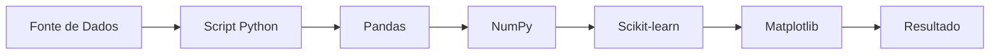

# 🐍 Python: A Linguagem Versátil e Poderosa

Python é uma linguagem de programação de alto nível, interpretada e de propósito geral, criada por Guido van Rossum e lançada pela primeira vez em 1991. Sua filosofia de design enfatiza a legibilidade do código com uma sintaxe que permite aos desenvolvedores expressar conceitos em menos linhas de código do que seria possível em linguagens como C++ ou Java.

Devido à sua simplicidade, vasta gama de bibliotecas e comunidade ativa, Python se tornou uma das linguagens mais populares do mundo, dominando áreas que vão do desenvolvimento web à inteligência artificial.

-----

## 📜 Filosofia e Características Principais

O design do Python é guiado por um conjunto de princípios conhecido como "O Zen de Python" (digite `import this` em um interpretador Python para ler). Suas características refletem essa filosofia.

### Simplicidade e Legibilidade

A sintaxe do Python é limpa, minimalista e se assemelha à linguagem humana, tornando o código fácil de ler e escrever. A indentação (uso de espaços em branco) para definir blocos de código, em vez de chaves ou palavras-chave, é uma característica marcante que força um código visualmente organizado. O guia de estilo oficial, **PEP 8**, ajuda a manter a consistência em toda a comunidade.

### Linguagem Interpretada

Python é uma linguagem interpretada, o que significa que o código-fonte é executado linha por linha diretamente por um interpretador, sem a necessidade de uma etapa de compilação separada. Isso agiliza o ciclo de desenvolvimento e depuração.

### Tipagem Dinâmica e Forte

  - **Dinâmica**: Você não precisa declarar o tipo de uma variável. O tipo é inferido em tempo de execução.
  - **Forte**: O interpretador impõe os tipos de dados. Operações entre tipos incompatíveis (como somar um número e um texto) não são permitidas implicitamente, evitando erros comuns.

<!-- end list -->

```python
# Tipagem dinâmica: 'idade' se torna um inteiro, 'nome' se torna uma string.
idade = 30
nome = "Carlos"

# O código abaixo causaria um erro (TypeError), pois a tipagem é forte.
# print(idade + nome) 
```

### "Baterias Inclusas" (Batteries Included)

Python vem com uma biblioteca padrão vasta e robusta, que inclui módulos para lidar com uma infinidade de tarefas comuns, como manipulação de texto, acesso a redes, operações com o sistema de arquivos, e muito mais, sem a necessidade de instalar pacotes externos.

-----

## 📦 O Ecossistema e Gerenciamento de Pacotes


A maior força do Python reside em seu ecossistema, gerenciado principalmente pelo **pip** e pelo **PyPI**.

### Pip e PyPI

  - **pip**: É o gerenciador de pacotes padrão para Python. Ele permite instalar e gerenciar bibliotecas e dependências de software de forma simples e direta a partir da linha de comando.
  - **PyPI (Python Package Index)**: É o repositório de software oficial para a comunidade Python. Abriga centenas de milhares de pacotes de código aberto que estendem as funcionalidades do Python para praticamente qualquer finalidade imaginável.

**Comandos essenciais do pip:**

```sh
# Instala um pacote (ex: a popular biblioteca para requisições HTTP)
pip install requests

# Salva todas as dependências do projeto em um arquivo
pip freeze > requirements.txt

# Instala todas as dependências listadas em um arquivo
pip install -r requirements.txt
```

-----

## 🌐 Principais Áreas de Aplicação

A versatilidade do Python permite que ele seja usado em uma variedade impressionante de domínios.

### Desenvolvimento Web (Backend)

Python é frequentemente usado como uma "linguagem de cola" para automatizar tarefas repetitivas, como renomear arquivos, extrair dados de sites (*web scraping*) e gerenciar sistemas.

-----

## 📊 Visualizando uma Aplicação de Dados

O diagrama abaixo mostra um fluxo de trabalho comum em um projeto de ciência de dados usando o ecossistema Python.



-----

## 🚀 Começando com Python
Iniciar com Python é um processo direto.

1.  **Instale o Python**: Baixe o instalador mais recente para o seu sistema operacional a partir do [site oficial python.org](https://www.python.org/).
2.  **Abra um terminal ou editor de código**.
3.  **Escreva seu primeiro código**:

<!-- end list -->

```python
# hello.py

# Uma função para saudar alguém.
def saudar(nome):
    """Esta função imprime uma saudação personalizada."""
    # f-strings são uma forma moderna e legível de formatar strings.
    print(f"Olá, {nome}! Bem-vindo ao mundo do Python.")

# Pede ao usuário para inserir um nome.
nome_do_usuario = input("Qual é o seu nome? ")

# Chama a função com a entrada do usuário.
saudar(nome_do_usuario)
```

4.  **Execute o arquivo** no terminal:
    ```sh
    python hello.py
    ```

-----

## 🎯 Por que Aprender Python?

  - **Curva de Aprendizagem Suave**: É amplamente considerada uma das linguagens mais fáceis para iniciantes devido à sua sintaxe simples e legível.
  - **Extremamente Versátil**: Uma única linguagem pode ser usada para construir um site, analisar dados, treinar um modelo de IA ou automatizar sua casa.
  - **Comunidade Gigante e Ativa**: Há uma abundância de tutoriais, fóruns e conferências. Quase qualquer dúvida que você tiver já foi respondida online.
  - **Alta Demanda no Mercado**: Profissionais de Python são altamente requisitados, especialmente em campos de rápido crescimento como Data Science, Machine Learning e desenvolvimento backend.
  - **Ecossistema de Bibliotecas Imbatível**: O PyPI oferece uma solução pronta para quase qualquer problema, acelerando drasticamente o desenvolvimento.

---

## 🎯 Teste Seus Conhecimentos

Agora que você aprendeu os fundamentos do Python, que tal testar seus conhecimentos?

!!! abstract "🧠 Quiz de Fixação"
    Teste seus conhecimentos sobre Python Básico com questões interativas!

    [Fazer Quiz Agora](../../quiz/python_basico.md){ .md-button .md-button--primary }

---

## 📚 Próximos Passos

Parabéns por completar a aula de Python Básico! Continue sua jornada:

- 🚀 **Avançar**: [Python Avançado](python_avancado.md)
- 💪 **Praticar**: [Exercícios](../exercicios/index.md)
- 🎯 **Aplicar**: [Projetos](../projetos/index.md)

