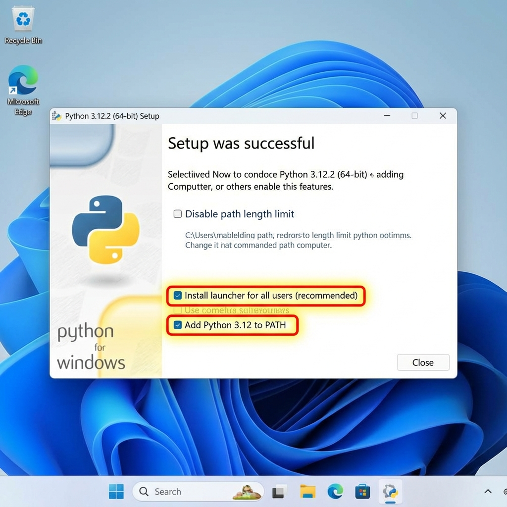
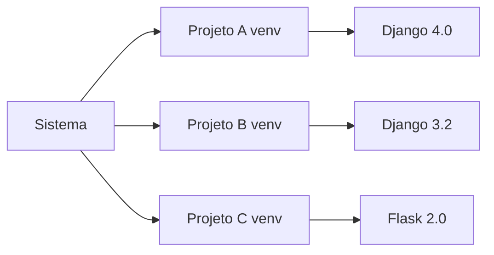

# 🚀 Instalação do Python no Windows

Guia completo para instalar e configurar o Python no Windows, incluindo o Visual Studio Code como ambiente de desenvolvimento.

---

## 📋 Requisitos do Sistema

Antes de começar, verifique se seu sistema atende aos requisitos:

- **Sistema Operacional**: Windows 10 ou Windows 11
- **Espaço em Disco**: Mínimo de 500 MB livres
- **Permissões**: Acesso de administrador (recomendado)
- **Conexão**: Internet para download dos instaladores

---

## 🐍 Passo 1: Instalação do Python

### 1.1 Download do Python

1. Acesse o site oficial: [python.org/downloads](https://www.python.org/downloads/)
2. Clique no botão **"Download Python 3.x.x"** (versão mais recente)
3. Aguarde o download do instalador (aproximadamente 25-30 MB)

### 1.2 Executando o Instalador



!!! important "Atenção"
    **Atenção**: Marque a opção **"Add Python to PATH"** antes de continuar! Isso é essencial para usar o Python no terminal.

**Passos da instalação:**

1. Execute o arquivo baixado (`python-3.x.x-amd64.exe`)
2. ✅ **Marque** a opção **"Add Python to PATH"**
3. ✅ **Marque** a opção **"Install for all users"** (opcional, mas recomendado)
4. Clique em **"Install Now"** para instalação padrão
5. Aguarde a conclusão (2-5 minutos)
6. Clique em **"Close"** quando finalizar

### 1.3 Verificando a Instalação

Abra o **Prompt de Comando** ou **PowerShell** e execute:

```powershell
python --version
```

**Saída esperada:**
```
Python 3.12.0
```

Também verifique o pip (gerenciador de pacotes):

```powershell
pip --version
```

**Saída esperada:**
```
pip 23.3.1 from C:\Users\...\Python312\lib\site-packages\pip (python 3.12)
```

!!! tip "Dica"
    Se os comandos não forem reconhecidos, reinicie o terminal ou o computador e tente novamente.

---

## 💻 Passo 2: Instalação do Visual Studio Code

### 2.1 Download do VSCode

1. Acesse: [code.visualstudio.com](https://code.visualstudio.com/)
2. Clique em **"Download for Windows"**
3. Aguarde o download (aproximadamente 90 MB)

### 2.2 Instalando o VSCode

1. Execute o instalador baixado (`VSCodeUserSetup-x64-x.xx.x.exe`)
2. Aceite os termos de licença
3. **Recomendado**: Marque todas as opções adicionais:
   - ✅ Adicionar ao PATH
   - ✅ Criar ícone na área de trabalho
   - ✅ Adicionar ação "Abrir com Code" ao menu de contexto
   - ✅ Registrar Code como editor para tipos de arquivo suportados
4. Clique em **"Instalar"**
5. Aguarde a conclusão (2-3 minutos)
6. Clique em **"Concluir"** e marque para iniciar o VSCode

---

## 🔧 Passo 3: Configurando o VSCode para Python

### 3.1 Instalando a Extensão Python


1. Abra o VSCode
2. Clique no ícone de **Extensões** na barra lateral (ou pressione `Ctrl+Shift+X`)
3. Digite **"Python"** na barra de pesquisa
4. Instale a extensão **"Python"** da **Microsoft** (a primeira da lista)
5. Aguarde a instalação (1-2 minutos)

### 3.2 Extensões Recomendadas

Instale também estas extensões úteis:

| Extensão | Descrição | Comando |
|----------|-----------|---------|
| **Pylance** | IntelliSense avançado para Python | Buscar "Pylance" |
| **Python Indent** | Indentação automática inteligente | Buscar "Python Indent" |
| **autoDocstring** | Gera docstrings automaticamente | Buscar "autoDocstring" |
| **Better Comments** | Destaca diferentes tipos de comentários | Buscar "Better Comments" |

### 3.3 Configurações Recomendadas

Abra as configurações (`Ctrl+,`) e ajuste:

```json
{
    "python.linting.enabled": true,
    "python.linting.pylintEnabled": true,
    "python.formatting.provider": "black",
    "editor.formatOnSave": true,
    "python.terminal.activateEnvironment": true,
    "files.autoSave": "afterDelay",
    "editor.fontSize": 14,
    "editor.tabSize": 4
}
```

---

## 🎯 Passo 4: Seu Primeiro Programa Python

### 4.1 Criando um Projeto

1. Crie uma pasta para seus projetos Python:
   ```powershell
   mkdir C:\MeusProjetos\Python
   cd C:\MeusProjetos\Python
   ```

2. Abra a pasta no VSCode:
   ```powershell
   code .
   ```

### 4.2 Criando o Arquivo Python


1. No VSCode, clique em **"Novo Arquivo"** ou pressione `Ctrl+N`
2. Salve como `hello.py` (`Ctrl+S`)
3. Digite o seguinte código:

```python
# Meu primeiro programa Python!

def saudar(nome):
    """Função que retorna uma saudação personalizada."""
    return f"Olá, {nome}! Bem-vindo ao mundo Python! 🐍"

# Programa principal
if __name__ == "__main__":
    nome = input("Digite seu nome: ")
    mensagem = saudar(nome)
    print(mensagem)
    print(f"\nVocê está usando Python para programar!")
```

### 4.3 Executando o Programa

**Método 1: Botão Play**
- Clique no botão ▶️ (Play) no canto superior direito

**Método 2: Terminal Integrado**
1. Abra o terminal integrado (`Ctrl+'` ou View > Terminal)
2. Execute:
   ```powershell
   python hello.py
   ```

**Método 3: Atalho de Teclado**
- Pressione `F5` para executar em modo debug

**Saída esperada:**
```
Digite seu nome: João
Olá, João! Bem-vindo ao mundo Python! 🐍

Você está usando Python para programar!
```

---

## 🌐 Passo 5: Ambientes Virtuais (venv)

### 5.1 Por que usar ambientes virtuais?

Ambientes virtuais isolam as dependências de cada projeto, evitando conflitos entre versões de bibliotecas.



### 5.2 Criando um Ambiente Virtual

No terminal do VSCode, dentro da pasta do projeto:

```powershell
# Criar ambiente virtual
python -m venv venv

# Ativar o ambiente (Windows PowerShell)
.\venv\Scripts\Activate.ps1

# Ativar o ambiente (Windows CMD)
venv\Scripts\activate.bat
```

**Após ativar, você verá** `(venv)` no início da linha do terminal:
```
(venv) PS C:\MeusProjetos\Python>
```

### 5.3 Instalando Pacotes no Ambiente Virtual

Com o ambiente ativado:

```powershell
# Instalar um pacote
pip install requests

# Instalar múltiplos pacotes
pip install pandas numpy matplotlib

# Salvar dependências em arquivo
pip freeze > requirements.txt

# Instalar de arquivo de dependências
pip install -r requirements.txt
```

### 5.4 Desativando o Ambiente Virtual

```powershell
deactivate
```

!!! note "Nota"
    O VSCode detecta automaticamente ambientes virtuais e oferece selecioná-los como interpretador Python.

---

## 🔍 Passo 6: Testando Tudo Junto

Vamos criar um projeto completo para testar:

### 6.1 Estrutura do Projeto

```
meu_projeto/
├── venv/                 # Ambiente virtual
├── src/                  # Código fonte
│   ├── __init__.py
│   └── calculadora.py
├── tests/                # Testes
│   └── test_calculadora.py
├── requirements.txt      # Dependências
└── README.md            # Documentação
```

### 6.2 Código de Exemplo

**src/calculadora.py:**
```python
"""Módulo de calculadora simples."""

def somar(a, b):
    """Retorna a soma de dois números."""
    return a + b

def subtrair(a, b):
    """Retorna a subtração de dois números."""
    return a - b

def multiplicar(a, b):
    """Retorna a multiplicação de dois números."""
    return a * b

def dividir(a, b):
    """Retorna a divisão de dois números."""
    if b == 0:
        raise ValueError("Não é possível dividir por zero!")
    return a / b

if __name__ == "__main__":
    print("Calculadora Python")
    print(f"5 + 3 = {somar(5, 3)}")
    print(f"10 - 4 = {subtrair(10, 4)}")
    print(f"6 * 7 = {multiplicar(6, 7)}")
    print(f"15 / 3 = {dividir(15, 3)}")
```

Execute:
```powershell
python src/calculadora.py
```

---

## ⚠️ Troubleshooting - Problemas Comuns

### Problema 1: "python não é reconhecido"

**Causa**: Python não está no PATH do sistema.

**Solução**:
1. Desinstale o Python
2. Reinstale marcando **"Add Python to PATH"**
3. OU adicione manualmente ao PATH:
   - Abra "Variáveis de Ambiente"
   - Edite a variável `Path`
   - Adicione: `C:\Users\SeuUsuario\AppData\Local\Programs\Python\Python3xx`

### Problema 2: Erro ao ativar venv no PowerShell

**Erro**: `cannot be loaded because running scripts is disabled`

**Solução**:
```powershell
# Execute como Administrador
Set-ExecutionPolicy -ExecutionPolicy RemoteSigned -Scope CurrentUser
```

### Problema 3: VSCode não encontra o Python

**Solução**:
1. Pressione `Ctrl+Shift+P`
2. Digite "Python: Select Interpreter"
3. Selecione a versão instalada do Python

### Problema 4: Extensão Python não funciona

**Solução**:
1. Desinstale a extensão Python
2. Reinicie o VSCode
3. Reinstale a extensão
4. Recarregue a janela (`Ctrl+Shift+P` > "Reload Window")

### Problema 5: pip install falha

**Solução**:
```powershell
# Atualize o pip
python -m pip install --upgrade pip

# Use --user se tiver problemas de permissão
pip install --user nome-do-pacote
```

---

## 📚 Próximos Passos

Agora que você tem tudo configurado:

1. ✅ **Explore a documentação**: [docs.python.org](https://docs.python.org/pt-br/3/)
2. ✅ **Faça os exercícios**: Acesse a seção [Exercícios](../exercicios/index.md)
3. ✅ **Pratique projetos**: Veja nossos [Projetos](../projetos/index.md)
4. ✅ **Aprenda sobre bibliotecas**: Explore [PyPI](https://pypi.org/)

---

## 🎓 Recursos Adicionais

### Documentação Oficial
- [Python.org - Tutorial](https://docs.python.org/pt-br/3/tutorial/)
- [VSCode - Python](https://code.visualstudio.com/docs/python/python-tutorial)

### Comunidades
- [Python Brasil](https://python.org.br/)
- [Stack Overflow em Português](https://pt.stackoverflow.com/questions/tagged/python)

### Cursos Gratuitos
- [Python para Zumbis](https://www.pycursos.com/python-para-zumbis/)
- [Curso em Vídeo - Python](https://www.cursoemvideo.com/curso/python-3-mundo-1/)

---

!!! tip "Dica Final"
    **Dica Final**: Pratique todos os dias! Mesmo que seja apenas 15 minutos, a consistência é a chave para dominar Python. 🚀

**Pronto para começar?** Volte para as [Aulas](../modulos/python_basico.md) e comece sua jornada! 🐍
