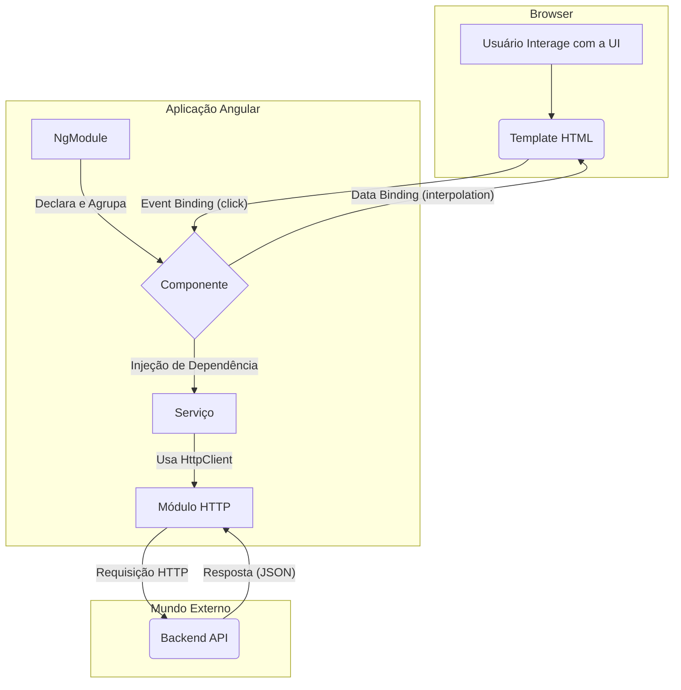

# 🅰️ Angular: O Framework Completo para Aplicações Web

Angular é um framework de desenvolvimento de código aberto, mantido pelo Google, para a criação de aplicações web complexas e escaláveis, especialmente *Single-Page Applications* (SPAs). Diferente de bibliotecas como o React, Angular é um *framework* completo e opinativo, fornecendo uma estrutura robusta e um conjunto de ferramentas integradas para todo o ciclo de desenvolvimento. Ele utiliza **TypeScript** como sua linguagem principal, adicionando segurança de tipos ao JavaScript.

-----

## 🏗️ Arquitetura e Conceitos Essenciais

A arquitetura do Angular é baseada em um conjunto de blocos de construção fundamentais que trabalham juntos.

### Módulos (NgModules)

Um `NgModule` é um contêiner que agrupa componentes, diretivas, pipes e serviços relacionados, formando blocos de funcionalidade coesos. Toda aplicação Angular tem pelo menos um módulo raiz, o `AppModule`, que inicializa a aplicação.

```typescript
// app.module.ts
import { NgModule } from '@angular/core';
import { BrowserModule } from '@angular/platform-browser';
import { AppComponent } from './app.component';

@NgModule({
  declarations: [
    AppComponent // Componentes que pertencem a este módulo
  ],
  imports: [
    BrowserModule // Módulos que este módulo precisa importar
  ],
  providers: [], // Serviços disponíveis para o módulo
  bootstrap: [AppComponent] // O componente raiz da aplicação
})
export class AppModule { }
```

### Componentes (Components)

Componentes são os principais blocos de construção da UI em uma aplicação Angular. Cada componente consiste em três partes principais:

1.  **Uma classe TypeScript (`.ts`):** Contém a lógica de negócios e os dados do componente.
2.  **Um template HTML (`.html`):** Define a estrutura e a aparência do componente.
3.  **Estilos CSS (`.css` ou `.scss`):** Define os estilos específicos para o template do componente.

<!-- end list -->

```typescript
// user-profile.component.ts
import { Component } from '@angular/core';

@Component({
  selector: 'app-user-profile', // Como usar este componente no HTML (<app-user-profile></app-user-profile>)
  templateUrl: './user-profile.component.html',
  styleUrls: ['./user-profile.component.css']
})
export class UserProfileComponent {
  userName: string = 'Joana Silva';
  userEmail: string = 'joana.silva@email.com';

  onEdit(): void {
    console.log('Botão de editar clicado!');
  }
}
```

### Templates e Data Binding

*Data Binding* é a sincronização automática de dados entre a classe do componente e seu template. Angular oferece quatro formas principais de *binding*:

  - **Interpolation `{{ }}`**: Exibe dados da classe no template.
    ```html
    <p>Nome: {{ userName }}</p>
    ```
  - **Property Binding `[ ]`**: Passa dados da classe para uma propriedade de um elemento HTML.
    ```html
    
    ```
  - **Event Binding `( )`**: Executa um método da classe em resposta a um evento do DOM (como um clique).
    ```html
    <button (click)="onEdit()">Editar Perfil</button>
    ```
  - **Two-Way Binding `[( )]`**: Combina *Property* e *Event Binding*, geralmente usado em formulários com a diretiva `ngModel`.
    ```html
    <input [(ngModel)]="userName">
    ```

### Injeção de Dependência (Dependency Injection - DI)

A Injeção de Dependência é um padrão de projeto central no Angular. Em vez de um componente criar suas próprias dependências (como um serviço para buscar dados), ele as declara em seu construtor, e o *framework* Angular se encarrega de "injetá-las". Isso torna o código mais modular, desacoplado e fácil de testar.

### Serviços (Services)

Serviços são classes TypeScript com um propósito bem definido, como buscar dados de um servidor, registrar logs ou compartilhar informações entre componentes. Eles são o principal candidato para serem gerenciados via Injeção de Dependência.

```typescript
// user.service.ts
import { Injectable } from '@angular/core';

@Injectable({
  providedIn: 'root' // Torna o serviço disponível em toda a aplicação
})
export class UserService {
  getUsers() {
    // Lógica para buscar usuários de uma API
    return [{ id: 1, name: 'Alice' }, { id: 2, name: 'Beto' }];
  }
}
```

**Injetando o serviço em um componente:**

```typescript
// user-list.component.ts
import { Component } from '@angular/core';
import { UserService } from '../user.service';

@Component({ /* ... */ })
export class UserListComponent {
  users: any[];

  // O Angular injeta a instância de UserService aqui
  constructor(private userService: UserService) {
    this.users = this.userService.getUsers();
  }
}
```

-----

## 🚀 Recursos Avançados e Integrados

Como um framework completo, Angular oferece soluções robustas para desafios comuns do desenvolvimento web:

  - **Roteamento (`@angular/router`)**: Um módulo poderoso para criar navegação entre diferentes views em uma SPA.
  - **Formulários (`@angular/forms`)**: Oferece duas abordagens para manipulação de formulários: *Template-Driven* (simples) e *Reactive Forms* (mais escalável e robusto).
  - **Cliente HTTP (`@angular/common/http`)**: Um serviço otimizado (`HttpClient`) para realizar requisições a APIs externas de forma eficiente.
  - **RxJS e Programação Reativa**: Angular utiliza a biblioteca RxJS extensivamente para gerenciar operações assíncronas através de **Observables**. Isso é usado em eventos, requisições HTTP e no gerenciamento de estado.

-----

## diagram Diagrama da Arquitetura Angular

Este diagrama ilustra como os principais blocos de construção de uma aplicação Angular interagem.



-----

## 🛠️ Começando com Angular

A maneira mais eficiente de iniciar um projeto Angular é usando a **Angular CLI** (Command Line Interface).

1.  **Instale a Angular CLI globalmente** (é necessário ter o Node.js instalado):
    ```sh
    npm install -g @angular/cli
    ```
2.  **Crie um novo projeto (workspace):**
    ```sh
    ng new meu-app-angular
    ```
3.  **Navegue até a pasta do projeto:**
    ```sh
    cd meu-app-angular
    ```
4.  **Inicie o servidor de desenvolvimento:**
    ```sh
    ng serve --open
    ```

Isso compilará a aplicação e a abrirá em seu navegador, geralmente em `http://localhost:4200/`.

-----

## 🎯 Por que Usar Angular?

  - **Framework Completo e Opinativo**: Oferece uma estrutura clara e soluções integradas para roteamento, gerenciamento de estado e chamadas HTTP, reduzindo a "fadiga de decisão".
  - **TypeScript por Padrão**: A tipagem estática aumenta a manutenibilidade do código e ajuda a prevenir bugs em tempo de desenvolvimento.
  - **Escalabilidade**: Sua arquitetura modular e o sistema de injeção de dependência são ideais para aplicações grandes e de nível empresarial.
  - **Ecossistema Robusto e Mantido pelo Google**: Garante um ciclo de lançamentos previsível, suporte de longo prazo (LTS) e um ecossistema de ferramentas maduro.
  - **CLI Poderosa**: A Angular CLI automatiza tarefas como criação de componentes, serviços, builds de produção e atualizações.

---


