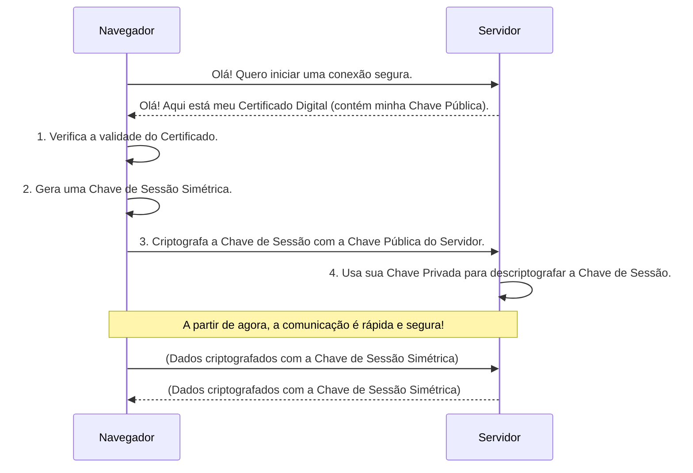

# 🔐 Segurança Avançada e Criptografia

A **Criptografia** é a ciência e a arte de escrever mensagens em código para proteger a informação, garantindo que apenas as partes autorizadas possam lê-la e processá-la. É a base matemática sobre a qual a segurança da informação moderna é construída, transformando dados legíveis (texto plano) em um formato ilegível (texto cifrado) e vice-versa.

Longe de ser apenas uma ferramenta para espiões, a criptografia está presente em quase todas as nossas interações digitais: ao enviar uma mensagem no WhatsApp, fazer uma compra online, acessar o internet banking ou simplesmente navegar em um site com "cadeado" (HTTPS).

-----

## 🏛️ Os Pilares Fundamentais da Criptografia

Existem três tipos principais de algoritmos criptográficos, cada um com uma função específica.

### Criptografia Simétrica

Usa uma **única chave secreta** tanto para criptografar (cifrar) quanto para descriptografar (decifrar) a informação.

  - **Analogia**: Um cofre com uma única chave. A mesma chave que tranca o cofre é a que o abre.
  - **Prós**: Extremamente rápida e eficiente, ideal para grandes volumes de dados.
  - **Contras**: O grande desafio é a **distribuição da chave**. Como compartilhar a chave secreta com o destinatário de forma segura sem que ela seja interceptada?
  - **Algoritmos Comuns**: **AES (Advanced Encryption Standard)**, o padrão-ouro global, e os mais antigos DES e 3DES.
  - **Uso**: Criptografar dados em repouso (arquivos em disco) e em trânsito (após um canal seguro ser estabelecido).

### Criptografia Assimétrica (ou de Chave Pública)

Usa um par de chaves matematicamente relacionadas: uma **chave pública** e uma **chave privada**.

  - A **Chave Pública**: Pode ser compartilhada abertamente com qualquer pessoa. Sua função é **criptografar** os dados.
  - A **Chave Privada**: Deve ser mantida em segredo absoluto pelo seu dono. É a única chave capaz de **descriptografar** os dados.
  - **Analogia**: Uma caixa de correio. A fenda para depositar cartas é a "chave pública" – qualquer um pode usá-la. A chave que abre a caixa para ler as cartas é a "chave privada", que só o dono possui.
  - **Prós**: Resolve o problema da distribuição de chaves. Permite a comunicação segura entre partes que nunca se encontraram.
  - **Contras**: É computacionalmente muito mais lenta que a criptografia simétrica.
  - **Algoritmos Comuns**: **RSA** e **ECC (Elliptic Curve Cryptography)**.
  - **Uso**: Estabelecimento de canais seguros (TLS/SSL), assinaturas digitais e troca segura de chaves simétricas.

### Funções de Hash (Hashing)

Não é um método de criptografia (pois não há descriptografia), mas sim uma ferramenta para garantir a **integridade**. Uma função de hash pega uma entrada de qualquer tamanho e produz uma saída de tamanho fixo chamada **hash**.

  - **Características Principais**:
    1.  **Unidirecional**: É computacionalmente inviável reverter o hash para obter a entrada original.
    2.  **Determinística**: A mesma entrada sempre gera o mesmo hash.
    3.  **Resistente a Colisões**: É extremamente difícil encontrar duas entradas diferentes que gerem o mesmo hash.
  - **Analogia**: Uma impressão digital. É única para cada pessoa, mas você não pode recriar a pessoa a partir da impressão digital dela.
  - **Algoritmos Comuns**: Família **SHA-2 (SHA-256)** e **SHA-3**. (MD5 é considerado obsoleto e inseguro).
  - **Uso**: Armazenamento seguro de senhas (guarda-se o hash da senha, não a senha), verificação de integridade de arquivos.

-----

## 🤝 A Magia do HTTPS: Juntando Tudo

O "cadeado de segurança" no seu navegador (HTTPS) é um exemplo perfeito de como os três pilares trabalham juntos em um processo chamado **TLS/SSL Handshake**:

1.  **Assimétrica**: O navegador usa a **chave pública** do servidor para enviar de forma segura uma nova **chave simétrica** que ele acabou de criar.
2.  **Simétrica**: Ambos agora possuem a mesma chave simétrica secreta. Eles a usam para criptografar toda a comunicação dali em diante, pois é muito mais rápido.
3.  **Hash**: É usado em todo o processo para assinar as mensagens e garantir que elas não foram alteradas no caminho.

-----

## 📜 Assinaturas Digitais e Certificados

  - **Assinatura Digital**: Garante **autenticidade**, **integridade** e **não repúdio** (o autor não pode negar a autoria). Funciona usando a criptografia assimétrica ao contrário:
    1.  Um hash do documento é criado.
    2.  O autor criptografa esse hash com sua **chave privada**. O resultado é a assinatura.
    3.  Qualquer pessoa pode usar a **chave pública** do autor para descriptografar a assinatura, recalcular o hash do documento e verificar se os dois coincidem.
  - **Certificado Digital (SSL/TLS)**: É o "documento de identidade" de um site na internet. É um arquivo emitido por uma **Autoridade Certificadora (CA)** (como Let's Encrypt ou GoDaddy) que vincula um nome de domínio (ex: `www.google.com`) a uma chave pública, atestando a identidade do proprietário do site.

-----

## 🚀 O Futuro da Criptografia

  - **A Ameaça Quântica**: Acredita-se que futuros computadores quânticos poderão quebrar os algoritmos de criptografia assimétrica (como o RSA) que usamos hoje.
  - **Criptografia Pós-Quântica (PQC)**: Um novo campo focado no desenvolvimento de algoritmos criptográficos que sejam seguros contra ataques de computadores tanto clássicos quanto quânticos.
  - **Distribuição de Chave Quântica (QKD)**: Usa as leis da física quântica para permitir a troca de chaves de uma forma que qualquer tentativa de espionagem é imediatamente detectada.

### Tópicos Avançados

  - **Criptografia Homomórfica**: Permite realizar cálculos em dados **ainda criptografados**, sem a necessidade de descriptografá-los. Revolucionário para a privacidade em nuvem.
  - **Provas de Conhecimento Zero (Zero-Knowledge Proofs - ZKP)**: Permitem que uma parte prove a outra que sabe algo, sem revelar a informação em si. Essencial para privacidade em blockchains e criptomoedas.

---

### 🔗 [ricardotecpro.github.io](https://ricardotecpro.github.io/)

