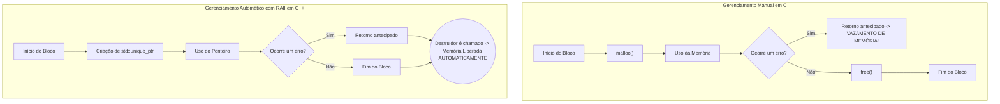

# ➕ C++: O Poder do C com Abstrações Modernas

Criado por Bjarne Stroustrup nos Bell Labs como uma extensão da linguagem C, o C++ (pronuncia-se "Cê mais mais") é uma das linguagens de programação mais poderosas e versáteis do mundo. Ele mantém a performance, a eficiência e o controle de baixo nível do C, mas adiciona um rico conjunto de recursos de alto nível, com destaque para a **Programação Orientada a Objetos (POO)**.

C++ é uma linguagem multi-paradigma, o que significa que o desenvolvedor pode escolher o estilo de programação mais adequado para o problema: procedural, orientado a objetos, funcional, entre outros. É a linguagem por trás de sistemas operacionais, navegadores de internet, motores de jogos e aplicações de alto desempenho.

-----

## 🏛️ Programação Orientada a Objetos (POO)

A principal contribuição do C++ sobre o C foi a introdução do paradigma de orientação a objetos, que permite organizar softwares complexos em unidades lógicas e reutilizáveis chamadas **objetos**. Isso é feito através do conceito de `class`.

Os quatro pilares da POO em C++ são:

  - **Encapsulamento**: Agrupar dados (atributos) e os métodos (funções) que operam nesses dados dentro de uma classe. O acesso aos dados pode ser controlado com especificadores como `public`, `private` e `protected`.
  - **Abstração**: Ocultar os detalhes complexos de implementação, expondo apenas a interface necessária para interagir com o objeto.
  - **Herança**: Criar novas classes (classes derivadas) a partir de classes existentes (classes base), permitindo a reutilização de código e a criação de hierarquias.
  - **Polimorfismo**: Permitir que objetos de diferentes classes respondam à mesma mensagem (chamada de função) de maneiras específicas, geralmente implementado através de funções virtuais (`virtual`).

**Exemplo de uma classe simples:**

```cpp
#include <iostream>
#include <string>

// Definição da classe Veiculo
class Veiculo {
// Atributos privados: só podem ser acessados por métodos da própria classe
private:
    std::string marca;
    int ano;

// Métodos públicos: formam a interface da classe
public:
    // Construtor: método especial para inicializar o objeto
    Veiculo(std::string m, int a) {
        marca = m;
        ano = a;
    }

    // Método para exibir informações
    void exibirInfo() {
        std::cout << "Marca: " << marca << ", Ano: " << ano << std::endl;
    }
};

int main() {
    // Cria um objeto (instância) da classe Veiculo
    Veiculo meuCarro("Ford", 2025);
    meuCarro.exibirInfo(); // Saída: Marca: Ford, Ano: 2025

    return 0;
}
```

-----

## ✨ O C++ Moderno (C++11 e além)

O C++ evoluiu drasticamente desde sua criação. A partir da atualização C++11, a linguagem recebeu uma série de melhorias que a tornaram mais segura, expressiva e fácil de usar.

### A Biblioteca Padrão (STL - Standard Template Library)

A STL é uma parte fundamental do C++ moderno. É uma biblioteca extremamente otimizada que fornece:

  - **Contêineres**: Estruturas de dados genéricas como `std::vector` (array dinâmico), `std::map` (dicionário), `std::string` e `std::list`.
  - **Algoritmos**: Funções para operações comuns como ordenação (`std::sort`), busca (`std::find`) e transformações de dados.
  - **Iteradores**: Objetos que agem como ponteiros para percorrer os elementos dos contêineres.

### Gerenciamento de Memória Inteligente (RAII e Smart Pointers)

Para resolver os perigos do gerenciamento manual de memória do C (`malloc`/`free`), o C++ introduziu o padrão **RAII (Resource Acquisition Is Initialization)**.

  - **RAII**: A ideia é que um recurso (como memória, um arquivo ou uma trava de rede) seja encapsulado em um objeto. O recurso é adquirido no construtor do objeto e liberado automaticamente no destrutor, quando o objeto sai de escopo. Isso garante que os recursos sejam sempre liberados, mesmo em caso de erros.
  - **Ponteiros Inteligentes (Smart Pointers)**: São a implementação prática do RAII para memória dinâmica.
      - `std::unique_ptr`: Garante que apenas um ponteiro possua o objeto de memória. A memória é liberada quando o `unique_ptr` é destruído.
      - `std::shared_ptr`: Permite múltiplos ponteiros compartilharem a posse do mesmo objeto, mantendo uma contagem de referências. A memória só é liberada quando o último `shared_ptr` é destruído.

### Funcionalidades Modernas

  - **Inferência de tipo `auto`**: Permite que o compilador deduza o tipo de uma variável automaticamente.
  - **Expressões Lambda**: Permitem a criação de funções anônimas no local.
  - **Move Semantics**: Otimiza a transferência de recursos entre objetos sem cópias desnecessárias.

-----

## 🧠 Visualizando o Padrão RAII

O diagrama abaixo contrasta o gerenciamento de memória manual em C com a abordagem automática e segura do RAII em C++.



-----

## 🎯 Onde o C++ se Destaca?

C++ é a escolha ideal para aplicações onde a performance e o controle sobre os recursos do sistema são críticos.

  - **Desenvolvimento de Jogos**: É a linguagem padrão da indústria para motores de jogos de alta performance, como Unreal Engine e Unity (cujo núcleo é em C++).
  - **Sistemas de Alto Desempenho (HPC)**: Usado em computação científica, simulações físicas e no mercado financeiro (sistemas de *high-frequency trading*).
  - **Aplicações Desktop com GUI**: Frameworks poderosos como Qt permitem a criação de aplicações multiplataforma ricas em interface gráfica.
  - **Navegadores de Internet**: Os motores de renderização de navegadores como Chrome (V8) e Firefox são complexos sistemas escritos em C++.
  - **Sistemas Operacionais e Compiladores**: Componentes críticos de sistemas operacionais e o desenvolvimento de compiladores para outras linguagens.
  - **Sistemas Embarcados e de Tempo Real**: Onde o controle preciso sobre o hardware e a eficiência são essenciais, como em sistemas automotivos e aeroespaciais.

-----

## 🚀 Começando com C++

1.  **Instale um Compilador**: Você precisará de um compilador C++. Os mais comuns são o **G++** (parte do GCC) e o **Clang**. Eles já vêm instalados na maioria dos sistemas Linux e podem ser facilmente obtidos no macOS (com as ferramentas de linha de comando do Xcode) e no Windows (com MinGW-w64 ou Visual Studio).
2.  **Escreva um programa simples**: Crie um arquivo chamado `main.cpp`.
    ```cpp
    // main.cpp
    #include <iostream> // Inclui a biblioteca para entrada e saída de dados

    int main() {
        // std::cout é o objeto para imprimir no console (saída padrão)
        // std::endl insere uma nova linha e limpa o buffer
        std::cout << "Olá, Mundo Moderno com C++!" << std::endl;
        
        return 0; // Indica que o programa terminou com sucesso
    }
    ```
3.  **Compile e Execute** no terminal:
    ```sh
    # Compila o arquivo main.cpp usando o g++ e cria um executável chamado 'main'
    # O padrão -std=c++17 garante o uso de funcionalidades modernas
    g++ -std=c++17 main.cpp -o main

    # Executa o programa
    ./main
    ```
    
---

### 🔗 [ricardotecpro.github.io](https://ricardotecpro.github.io/)

