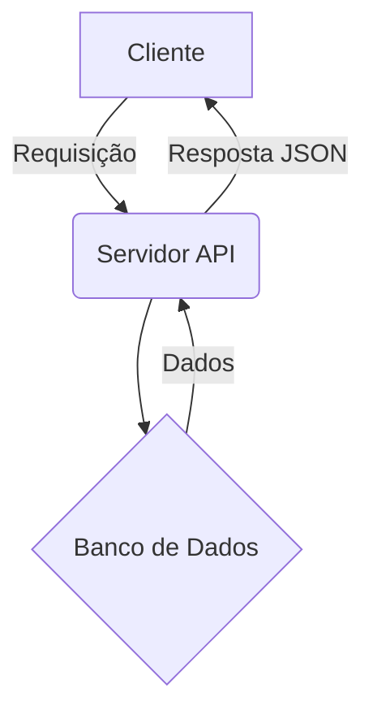

# 🚀 Testes de Recursos (Mermaid & Math)

Esta página serve para verificar se o suporte a diagramas Mermaid e fórmulas matemáticas (MathJax) está funcionando em todos os arquivos `.md`.

---

## 📊 1. Mermaid (Diagramas)

Se o suporte estiver ativo, você verá um gráfico abaixo (não apenas um bloco de código):

---

## 🔢 2. Math (Fórmulas Matemáticas)

As fórmulas abaixo devem ser renderizadas com notação matemática profissional:

### Equação de Einstein (Inline)
A famosa equação é: $E = mc^2$

### Identidade de Euler (Bloco)
$$ e^{i\pi} + 1 = 0 $$

### Matriz de Exemplo
$$
\begin{bmatrix}
1 & 0 & 0 \\
0 & 1 & 0 \\
0 & 0 & 1
\end{bmatrix}
$$

---

## ✅ Conclusão
Se os elementos acima aparecerem corretamente, o suporte está configurado globalmente para todos os arquivos `.md` do seu portal.
